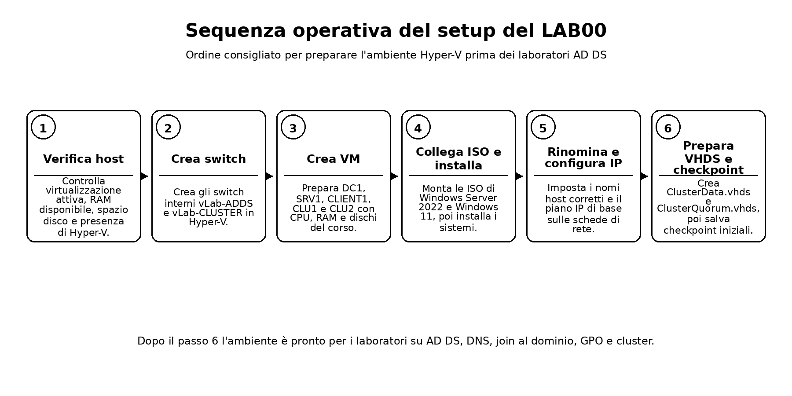
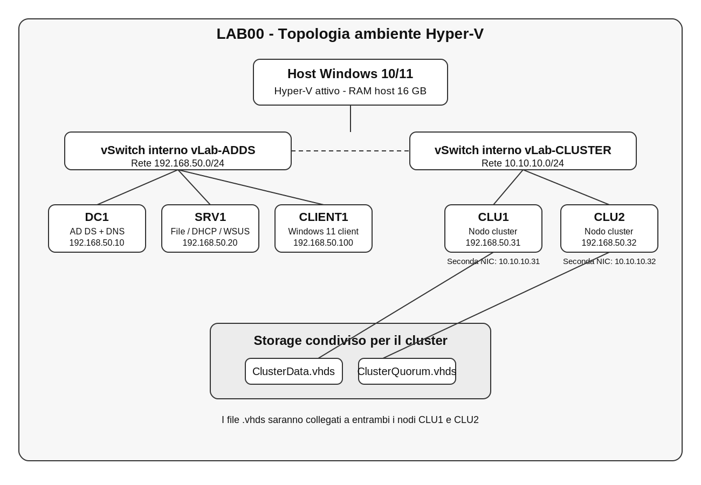
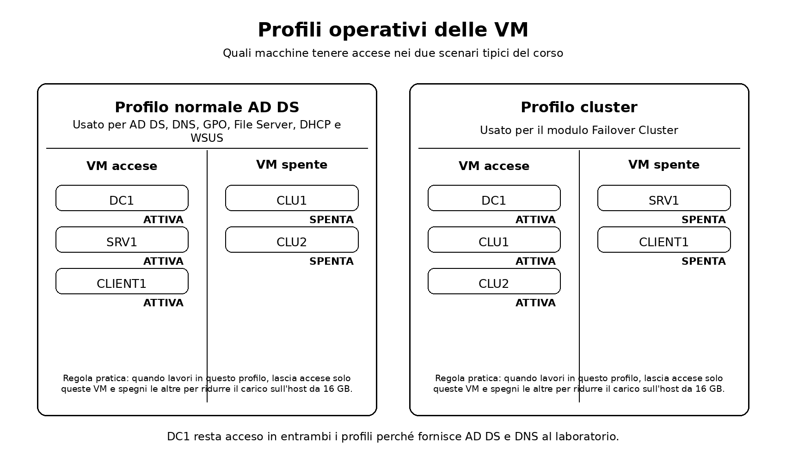
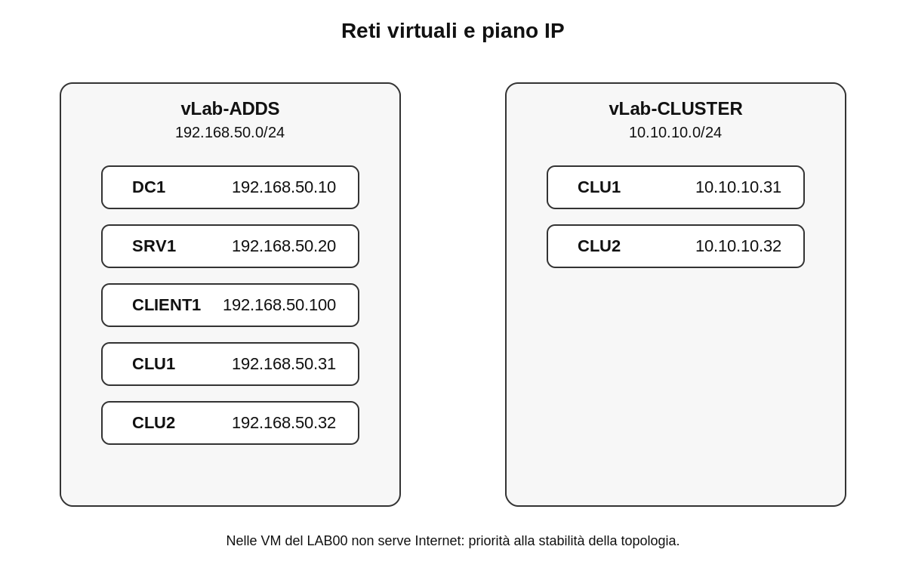
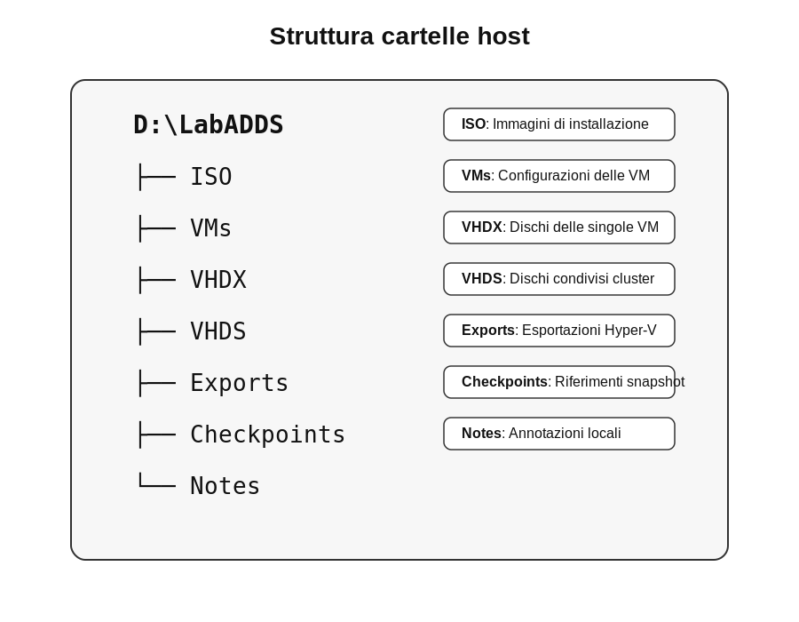

# ADDS_LAB00 - Setup ambiente Hyper-V per corso AD DS e Windows Server 2022

## Preparazione del laboratorio di base per Active Directory, servizi di dominio e Failover Cluster

---

# 1. Obiettivo del laboratorio



*Figura 1 - Sequenza logica delle attività del LAB00.*

In questo laboratorio preparerai l’ambiente tecnico che verrà utilizzato in tutte le sessioni del corso.

Alla fine del laboratorio dovrai essere in grado di:

- verificare che il tuo PC supporti Hyper-V
- attivare Hyper-V sul sistema host
- creare gli switch virtuali necessari
- scaricare e organizzare le ISO di valutazione
- creare le macchine virtuali standard del corso
- installare Windows Server 2022 Evaluation e Windows 11 Evaluation
- assegnare nomi corretti alle VM
- configurare la rete di base
- preparare i dischi condivisi che useremo più avanti per il cluster
- creare snapshot/checkpoint utili per recuperare rapidamente il laboratorio

---

# 2. Scopo di questo laboratorio

Questo laboratorio è il **prework tecnico obbligatorio** del corso.

Il cronoprogramma del corso parte subito con contenuti tecnici su architettura AD DS, installazione del Domain Controller, join al dominio, GPO, DNS, File Server, DHCP/WSUS e infine Failover Cluster. 

---

# 3. Architettura finale dell’ambiente



*Figura 2 - Topologia complessiva dell'ambiente di laboratorio.*

L’ambiente completo del corso sarà questo:

```text
Host Windows 10/11 con Hyper-V
|
+-- vSwitch interno: vLab-ADDS (192.168.50.0/24)
|   |
|   +-- DC1      (AD DS + DNS)
|   +-- SRV1     (member server: file server, DHCP, WSUS, test servizi)
|   +-- CLIENT1  (client Windows 11 joinato al dominio)
|   +-- CLU1     (nodo cluster)
|   +-- CLU2     (nodo cluster)
|
+-- vSwitch interno: vLab-CLUSTER (10.10.10.0/24)
    |
    +-- CLU1 seconda scheda
    +-- CLU2 seconda scheda

Storage condiviso per cluster:
- ClusterData.vhds
- ClusterQuorum.vhds
```

## 3.1 Filosofia dell’ambiente

L’host dei partecipanti ha **16 GB di RAM**. Questo significa che l’ambiente deve essere progettato con criterio:

- non tutte le VM devono stare accese sempre
- usiamo **Dynamic Memory**
- teniamo poche VM accese per volta
- usiamo checkpoint per tornare rapidamente a uno stato noto
- prepariamo il cluster senza trasformare il PC in un esperimento termico

## 3.2 Regola operativa sulle VM accese



*Figura 3 - Profili di accensione consigliati per ridurre il carico sull'host.*

Durante il corso useremo questi profili:

### Profilo normale AD DS
VM accese:
- DC1
- SRV1
- CLIENT1

### Profilo cluster
VM accese:
- DC1
- CLU1
- CLU2

In pratica:
- quando lavoriamo su AD, DNS, GPO, File Server, DHCP, WSUS: **spegni CLU1 e CLU2**
- quando lavoriamo su Failover Cluster: **spegni SRV1 e CLIENT1**, lascia acceso DC1

---

# 4. Risorse standard da usare



*Figura 4 - Switch virtuali e piano IP suggerito per il laboratorio.*

## 4.1 Macchine virtuali

| VM | Ruolo | vCPU | RAM avvio | RAM dinamica max | Disco | Note |
|---|---|---:|---:|---:|---:|---|
| DC1 | Domain Controller + DNS | 2 | 4096 MB | 6144 MB | 60 GB | macchina centrale del corso |
| SRV1 | Member server | 2 | 3072 MB | 5120 MB | 50 GB | file server, DHCP, WSUS |
| CLIENT1 | Client Windows 11 | 2 | 3072 MB | 4096 MB | 64 GB | join dominio, GPO, test accessi |
| CLU1 | Nodo cluster | 2 | 2560 MB | 4096 MB | 50 GB | usato nel modulo cluster |
| CLU2 | Nodo cluster | 2 | 2560 MB | 4096 MB | 50 GB | usato nel modulo cluster |

## 4.2 Reti virtuali

| Switch | Tipo | Rete | Scopo |
|---|---|---|---|
| vLab-ADDS | Internal | 192.168.50.0/24 | rete principale del corso |
| vLab-CLUSTER | Internal | 10.10.10.0/24 | rete cluster heartbeat / test |

## 4.3 Indirizzi IP suggeriti

| VM | NIC | IP | Mask | Gateway | DNS |
|---|---|---|---|---|---|
| DC1 | vLab-ADDS | 192.168.50.10 | /24 | vuoto | 127.0.0.1 poi 192.168.50.10 |
| SRV1 | vLab-ADDS | 192.168.50.20 | /24 | vuoto | 192.168.50.10 |
| CLIENT1 | vLab-ADDS | DHCP o 192.168.50.100 | /24 | vuoto | 192.168.50.10 |
| CLU1 | vLab-ADDS | 192.168.50.31 | /24 | vuoto | 192.168.50.10 |
| CLU1 | vLab-CLUSTER | 10.10.10.31 | /24 | vuoto | vuoto |
| CLU2 | vLab-ADDS | 192.168.50.32 | /24 | vuoto | 192.168.50.10 |
| CLU2 | vLab-CLUSTER | 10.10.10.32 | /24 | vuoto | vuoto |

### Nota importante
In questo laboratorio **non serve Internet dentro le VM**. La priorità è la stabilità del lab, non la navigazione web dalle macchine virtuali.

---

# 5. Convenzioni di naming

Usa sempre nomi coerenti. Evitiamo varianti creative del tipo `serverprova`, `nuovo-server`, `clusteronefinaledefinitivo`, che sono la vendetta del caos.

## 5.1 Nomi host

- `DC1`
- `SRV1`
- `CLIENT1`
- `CLU1`
- `CLU2`

## 5.2 Dominio previsto per il corso

Useremo:

- **FQDN dominio**: `lab.local`
- **NetBIOS**: `LAB`

## 5.3 Password locale iniziale consigliata

Per il laboratorio puoi usare una password coerente e memorizzabile, per esempio:

`P@ssw0rd!Lab2026`

Usa questa password solo in ambito didattico. Non riutilizzarla altrove. Sarebbe un gesto di fiducia eccessivo verso il genere umano.

---

# 6. Materiale da scaricare

## 6.1 ISO richieste

Scarica e conserva:

- **Windows Server 2022 Evaluation ISO**
- **Windows 11 Enterprise Evaluation ISO**

### Sorgente
Scaricale dal portale ufficiale Microsoft dedicato alle versioni di valutazione.

## 6.2 Dove salvare le ISO

Sul PC host crea una cartella dedicata, per esempio:

```text
D:\LabADDS\ISO
```

Se il tuo PC non ha unità `D:`, usa:

```text
C:\LabADDS\ISO
```

---

# 7. Struttura cartelle consigliata sull’host



*Figura 5 - Struttura cartelle consigliata sull'host Windows.*

Crea questa struttura:

```text
D:\LabADDS
├── ISO
├── VMs
├── VHDX
├── VHDS
├── Exports
├── Checkpoints
└── Notes
```

Scopo delle cartelle:

- `ISO`: immagini di installazione
- `VMs`: configurazioni VM
- `VHDX`: dischi delle singole VM
- `VHDS`: dischi condivisi per il cluster
- `Exports`: eventuali esportazioni Hyper-V
- `Checkpoints`: note e riferimenti sugli snapshot creati
- `Notes`: annotazioni locali

---

# 8. Prerequisiti hardware e software sull’host

Prima di creare le VM verifica:

- Windows 10/11 Pro, Enterprise o Education
- virtualizzazione hardware attiva nel BIOS/UEFI
- almeno 16 GB RAM
- almeno 180 GB liberi su disco, meglio SSD
- account con privilegi amministrativi
- Hyper-V disponibile come funzionalità di Windows

## 8.1 Verifica virtualizzazione dal Task Manager

Apri:

- `Ctrl + Shift + Esc`
- scheda **Prestazioni**
- sezione **CPU**

Controlla che compaia:

- `Virtualizzazione: Abilitata`

## 8.2 Verifica Hyper-V via PowerShell

Apri PowerShell come amministratore:

```powershell
Get-ComputerInfo -Property "HyperV*"
```

---

# 9. Attivazione di Hyper-V

## 9.1 Metodo grafico

1. Apri **Attiva o disattiva funzionalità di Windows**
2. Seleziona:
   - Hyper-V
   - Hyper-V Management Tools
   - Hyper-V Platform
3. Conferma
4. Riavvia il PC

## 9.2 Metodo PowerShell

Esegui come amministratore:

```powershell
Enable-WindowsOptionalFeature -Online -FeatureName Microsoft-Hyper-V -All
```

Riavvia il sistema:

```powershell
Restart-Computer
```

## 9.3 Verifica dopo il riavvio

Apri **Hyper-V Manager** e verifica che il ruolo sia disponibile.

---

# 10. Creazione degli switch virtuali

## 10.1 Metodo grafico

Apri **Virtual Switch Manager** in Hyper-V e crea:

### Switch 1
- Nome: `vLab-ADDS`
- Tipo: `Internal`

### Switch 2
- Nome: `vLab-CLUSTER`
- Tipo: `Internal`

## 10.2 Metodo PowerShell

```powershell
New-VMSwitch -Name "vLab-ADDS" -SwitchType Internal
New-VMSwitch -Name "vLab-CLUSTER" -SwitchType Internal
```

## 10.3 Verifica switch

```powershell
Get-VMSwitch
```

Risultato atteso:
- `vLab-ADDS`
- `vLab-CLUSTER`

---

# 11. Creazione delle VM

Puoi creare le VM con GUI o PowerShell. Qui mostriamo entrambi gli approcci.

## 11.1 Parametri da usare

### DC1
- Generazione: 2
- RAM iniziale: 4096 MB
- vCPU: 2
- Disco: 60 GB
- Switch: `vLab-ADDS`

### SRV1
- Generazione: 2
- RAM iniziale: 3072 MB
- vCPU: 2
- Disco: 50 GB
- Switch: `vLab-ADDS`

### CLIENT1
- Generazione: 2
- RAM iniziale: 3072 MB
- vCPU: 2
- Disco: 64 GB
- Switch: `vLab-ADDS`

### CLU1
- Generazione: 2
- RAM iniziale: 2560 MB
- vCPU: 2
- Disco: 50 GB
- Switch: `vLab-ADDS`
- seconda scheda su `vLab-CLUSTER`

### CLU2
- Generazione: 2
- RAM iniziale: 2560 MB
- vCPU: 2
- Disco: 50 GB
- Switch: `vLab-ADDS`
- seconda scheda su `vLab-CLUSTER`

## 11.2 Esempio PowerShell per creare DC1

```powershell
New-VM -Name "DC1" `
  -Generation 2 `
  -MemoryStartupBytes 4GB `
  -NewVHDPath "D:\LabADDS\VHDX\DC1.vhdx" `
  -NewVHDSizeBytes 60GB `
  -Path "D:\LabADDS\VMs" `
  -SwitchName "vLab-ADDS"
```

Assegna le CPU:

```powershell
Set-VMProcessor -VMName "DC1" -Count 2
```

Attiva Dynamic Memory:

```powershell
Set-VMMemory -VMName "DC1" `
  -DynamicMemoryEnabled $true `
  -MinimumBytes 2GB `
  -StartupBytes 4GB `
  -MaximumBytes 6GB
```

## 11.3 Esempi sintetici per le altre VM

```powershell
New-VM -Name "SRV1" -Generation 2 -MemoryStartupBytes 3GB -NewVHDPath "D:\LabADDS\VHDX\SRV1.vhdx" -NewVHDSizeBytes 50GB -Path "D:\LabADDS\VMs" -SwitchName "vLab-ADDS"
Set-VMProcessor -VMName "SRV1" -Count 2
Set-VMMemory -VMName "SRV1" -DynamicMemoryEnabled $true -MinimumBytes 2GB -StartupBytes 3GB -MaximumBytes 5GB

New-VM -Name "CLIENT1" -Generation 2 -MemoryStartupBytes 3GB -NewVHDPath "D:\LabADDS\VHDX\CLIENT1.vhdx" -NewVHDSizeBytes 64GB -Path "D:\LabADDS\VMs" -SwitchName "vLab-ADDS"
Set-VMProcessor -VMName "CLIENT1" -Count 2
Set-VMMemory -VMName "CLIENT1" -DynamicMemoryEnabled $true -MinimumBytes 2GB -StartupBytes 3GB -MaximumBytes 4GB

New-VM -Name "CLU1" -Generation 2 -MemoryStartupBytes 2560MB -NewVHDPath "D:\LabADDS\VHDX\CLU1.vhdx" -NewVHDSizeBytes 50GB -Path "D:\LabADDS\VMs" -SwitchName "vLab-ADDS"
Set-VMProcessor -VMName "CLU1" -Count 2
Set-VMMemory -VMName "CLU1" -DynamicMemoryEnabled $true -MinimumBytes 2GB -StartupBytes 2560MB -MaximumBytes 4GB

New-VM -Name "CLU2" -Generation 2 -MemoryStartupBytes 2560MB -NewVHDPath "D:\LabADDS\VHDX\CLU2.vhdx" -NewVHDSizeBytes 50GB -Path "D:\LabADDS\VMs" -SwitchName "vLab-ADDS"
Set-VMProcessor -VMName "CLU2" -Count 2
Set-VMMemory -VMName "CLU2" -DynamicMemoryEnabled $true -MinimumBytes 2GB -StartupBytes 2560MB -MaximumBytes 4GB
```

Aggiungi la seconda scheda di rete ai nodi cluster:

```powershell
Add-VMNetworkAdapter -VMName "CLU1" -SwitchName "vLab-CLUSTER" -Name "ClusterNIC"
Add-VMNetworkAdapter -VMName "CLU2" -SwitchName "vLab-CLUSTER" -Name "ClusterNIC"
```

---

# 12. Collegamento delle ISO

Per ogni VM collega la ISO corretta.

## 12.1 Server
Per:
- DC1
- SRV1
- CLU1
- CLU2

collega la ISO di **Windows Server 2022 Evaluation**

## 12.2 Client
Per:
- CLIENT1

collega la ISO di **Windows 11 Enterprise Evaluation**

## 12.3 Esempio PowerShell

```powershell
Add-VMDvdDrive -VMName "DC1" -Path "D:\LabADDS\ISO\WindowsServer2022Eval.iso"
Add-VMDvdDrive -VMName "SRV1" -Path "D:\LabADDS\ISO\WindowsServer2022Eval.iso"
Add-VMDvdDrive -VMName "CLU1" -Path "D:\LabADDS\ISO\WindowsServer2022Eval.iso"
Add-VMDvdDrive -VMName "CLU2" -Path "D:\LabADDS\ISO\WindowsServer2022Eval.iso"
Add-VMDvdDrive -VMName "CLIENT1" -Path "D:\LabADDS\ISO\Windows11Eval.iso"
```

---

# 13. Installazione dei sistemi operativi

## 13.1 Avvio delle VM una alla volta

Accendi e installa **una VM per volta**, non tutte insieme.

Ordine consigliato:
1. DC1
2. SRV1
3. CLIENT1
4. CLU1
5. CLU2

## 13.2 Edizione da selezionare

Per i server scegli:

- **Windows Server 2022 Standard Evaluation (Desktop Experience)**

Per il client scegli l’edizione Windows 11 disponibile nella ISO di valutazione.

## 13.3 Partizionamento

Per il lab basta la configurazione standard proposta dal setup.

## 13.4 Password Administrator

Usa la password di laboratorio scelta al punto 5.3.

---

# 14. Prime configurazioni dentro le VM

Dopo l’installazione esegui queste attività minime.

## 14.1 Rinomina computer

### DC1
```powershell
Rename-Computer -NewName "DC1" -Restart
```

### SRV1
```powershell
Rename-Computer -NewName "SRV1" -Restart
```

### CLU1
```powershell
Rename-Computer -NewName "CLU1" -Restart
```

### CLU2
```powershell
Rename-Computer -NewName "CLU2" -Restart
```

Sul client rinomina da interfaccia grafica o con PowerShell.

## 14.2 Configurazione IP di base

### Esempio per DC1

```powershell
Get-NetAdapter
New-NetIPAddress -InterfaceAlias "Ethernet" -IPAddress 192.168.50.10 -PrefixLength 24
Set-DnsClientServerAddress -InterfaceAlias "Ethernet" -ServerAddresses 127.0.0.1
```

### Esempio per SRV1

```powershell
New-NetIPAddress -InterfaceAlias "Ethernet" -IPAddress 192.168.50.20 -PrefixLength 24
Set-DnsClientServerAddress -InterfaceAlias "Ethernet" -ServerAddresses 192.168.50.10
```

### Esempio per CLU1

```powershell
New-NetIPAddress -InterfaceAlias "Ethernet" -IPAddress 192.168.50.31 -PrefixLength 24
Set-DnsClientServerAddress -InterfaceAlias "Ethernet" -ServerAddresses 192.168.50.10
```

Configura poi la seconda interfaccia:

```powershell
New-NetIPAddress -InterfaceAlias "ClusterNIC" -IPAddress 10.10.10.31 -PrefixLength 24
```

### Esempio per CLU2

```powershell
New-NetIPAddress -InterfaceAlias "Ethernet" -IPAddress 192.168.50.32 -PrefixLength 24
Set-DnsClientServerAddress -InterfaceAlias "Ethernet" -ServerAddresses 192.168.50.10
New-NetIPAddress -InterfaceAlias "ClusterNIC" -IPAddress 10.10.10.32 -PrefixLength 24
```

### CLIENT1
Puoi:
- lasciare momentaneamente DHCP se presente
- oppure impostare manualmente `192.168.50.100/24` e DNS `192.168.50.10`

---

# 15. Test di connettività di base

## 15.1 Dal server DC1

```powershell
ping 192.168.50.20
ping 192.168.50.31
ping 192.168.50.32
```

## 15.2 Dai nodi cluster

```powershell
ping 10.10.10.32
```

e da CLU2:

```powershell
ping 10.10.10.31
```

## 15.3 Risultato atteso

- tutte le VM sulla rete `192.168.50.0/24` devono vedersi
- CLU1 e CLU2 devono vedersi anche sulla rete `10.10.10.0/24`

Se qualche ping fallisce, il problema va corretto adesso. Dopo sarà solo più fastidioso.

---

# 16. Preparazione dei dischi condivisi per il cluster


*Figura 6 - Relazione tra nodi cluster e dischi condivisi `.vhds`.*

Questa parte serve **anche se il cluster verrà usato solo nell’ultima sessione**. Li prepariamo ora perché così l’ambiente resta completo e non dobbiamo tornare a fare meccanica alla fine del corso.

## 16.1 Crea i file VHDS sull’host

```powershell
New-VHD -Path "D:\LabADDS\VHDS\ClusterData.vhds" -SizeBytes 20GB -Dynamic
New-VHD -Path "D:\LabADDS\VHDS\ClusterQuorum.vhds" -SizeBytes 2GB -Dynamic
```

## 16.2 Collega i dischi ai nodi cluster

### A CLU1
```powershell
Add-VMHardDiskDrive -VMName "CLU1" -ControllerType SCSI -Path "D:\LabADDS\VHDS\ClusterData.vhds" -SupportPersistentReservations
Add-VMHardDiskDrive -VMName "CLU1" -ControllerType SCSI -Path "D:\LabADDS\VHDS\ClusterQuorum.vhds" -SupportPersistentReservations
```

### A CLU2
```powershell
Add-VMHardDiskDrive -VMName "CLU2" -ControllerType SCSI -Path "D:\LabADDS\VHDS\ClusterData.vhds" -SupportPersistentReservations
Add-VMHardDiskDrive -VMName "CLU2" -ControllerType SCSI -Path "D:\LabADDS\VHDS\ClusterQuorum.vhds" -SupportPersistentReservations
```

## 16.3 Nota operativa
Non inizializzare ancora questi dischi da entrambe le VM in modo casuale. La loro configurazione verrà fatta nel laboratorio cluster.

---

# 17. Checkpoint consigliati

I checkpoint sono la rete di salvataggio del laboratorio.

## 17.1 Checkpoint dopo installazione OS

Crea un checkpoint per ogni VM quando:
- OS installato
- nome computer corretto
- rete impostata

Esempio:

```powershell
Checkpoint-VM -Name "DC1" -SnapshotName "BaseOS_ReteOK"
Checkpoint-VM -Name "SRV1" -SnapshotName "BaseOS_ReteOK"
Checkpoint-VM -Name "CLIENT1" -SnapshotName "BaseOS_ReteOK"
Checkpoint-VM -Name "CLU1" -SnapshotName "BaseOS_ReteOK"
Checkpoint-VM -Name "CLU2" -SnapshotName "BaseOS_ReteOK"
```

## 17.2 Checkpoint prima di ogni modulo importante

Più avanti useremo checkpoint come:
- `PreADDS`
- `PreJoinDomain`
- `PreGPO`
- `PreDHCP_WSUS`
- `PreCluster`

---

# 18. Verifiche finali del setup

Alla fine del LAB00 devi poter dimostrare che:

- Hyper-V è attivo
- esistono gli switch `vLab-ADDS` e `vLab-CLUSTER`
- esistono le 5 VM
- le VM hanno il nome corretto
- i server hanno IP coerenti
- DC1 risponde sulla rete principale
- CLU1 e CLU2 si vedono anche sulla rete cluster
- esistono i file `ClusterData.vhds` e `ClusterQuorum.vhds`
- hai creato almeno un checkpoint base

## 18.1 Comandi utili di verifica

```powershell
Get-VM
Get-VMSwitch
Get-VMNetworkAdapter -VMName CLU1
Get-VMNetworkAdapter -VMName CLU2
Get-ChildItem D:\LabADDS\VHDS
```

---

# 19. Troubleshooting minimo

## 19.1 Hyper-V non parte o non si installa

Possibili cause:
- edizione Windows host non compatibile
- virtualizzazione disabilitata nel BIOS/UEFI
- conflitto con impostazioni firmware

Verifica:
- edizione Windows
- Virtualization = Enabled
- reboot completo dell’host

## 19.2 La VM non si avvia da ISO

Possibili cause:
- ISO non collegata correttamente
- boot order errato
- file ISO corrotto

Verifica in Hyper-V:
- DVD drive presente
- ISO montata
- firmware con boot da DVD

## 19.3 Rete virtuale errata

Sintomi:
- i ping non rispondono
- la VM è collegata allo switch sbagliato
- CLU1 e CLU2 non comunicano sulla rete cluster

Verifica:

```powershell
Get-VMNetworkAdapter -VMName CLU1
Get-VMNetworkAdapter -VMName CLU2
```

## 19.4 RAM insufficiente sull’host

Sintomi:
- VM lente
- avvio che fallisce
- host che swapppa pesantemente

Soluzioni:
- avvia meno VM contemporaneamente
- riduci la RAM di startup delle VM meno critiche
- chiudi applicazioni pesanti sull’host
- non tenere aperti browser con 97 tab. Nessuno ne ha davvero bisogno.

## 19.5 Nome interfaccia diverso da `Ethernet`

In alcune installazioni l’interfaccia può avere un nome diverso.

Verifica:

```powershell
Get-NetAdapter
```

Poi sostituisci l’alias corretto nei comandi.

---

# 20. Evidenze richieste

Crea il file:

```text
docs\evidence_lab00.md
```

Inserisci almeno queste sezioni:

```md
# Evidence LAB00

## 1. Host
- versione Windows host
- Hyper-V attivato
- virtualizzazione abilitata

## 2. Cartelle create
- elenco delle cartelle D:\LabADDS o C:\LabADDS

## 3. ISO scaricate
- Windows Server 2022 Evaluation
- Windows 11 Evaluation

## 4. Switch virtuali
- vLab-ADDS
- vLab-CLUSTER

## 5. VM create
- DC1
- SRV1
- CLIENT1
- CLU1
- CLU2

## 6. Indirizzi IP assegnati
- tabella IP effettivamente usata

## 7. Dischi condivisi cluster
- ClusterData.vhds
- ClusterQuorum.vhds

## 8. Verifiche di connettività
- screenshot o output dei ping principali

## 9. Checkpoint creati
- elenco checkpoint

## 10. Problemi incontrati
- errori e soluzione adottata
```

---

# 21. Consegna

Al termine del laboratorio devi avere:

- ambiente Hyper-V pronto
- 5 VM installate e nominate
- rete di base funzionante
- dischi cluster preparati
- file `docs\evidence_lab00.md`

Se stai lavorando in un repository locale per il corso, salva il materiale:

```powershell
git add .
git commit -m "LAB00 completato - setup ambiente Hyper-V WS2022"
git push
```

---

# 22. Conclusione del laboratorio

Con questo laboratorio hai costruito l’infrastruttura base del corso.

Non hai ancora configurato AD DS, ma hai eliminato il 70% delle cause banali di fallimento dei laboratori successivi:

- VM create male
- nomi host casuali
- rete incoerente
- DNS non pianificato
- cluster improvvisato all’ultimo momento

Nel prossimo laboratorio userai questo ambiente per entrare finalmente nell’architettura di Active Directory e progettare il dominio di laboratorio in modo coerente con il resto del corso.
