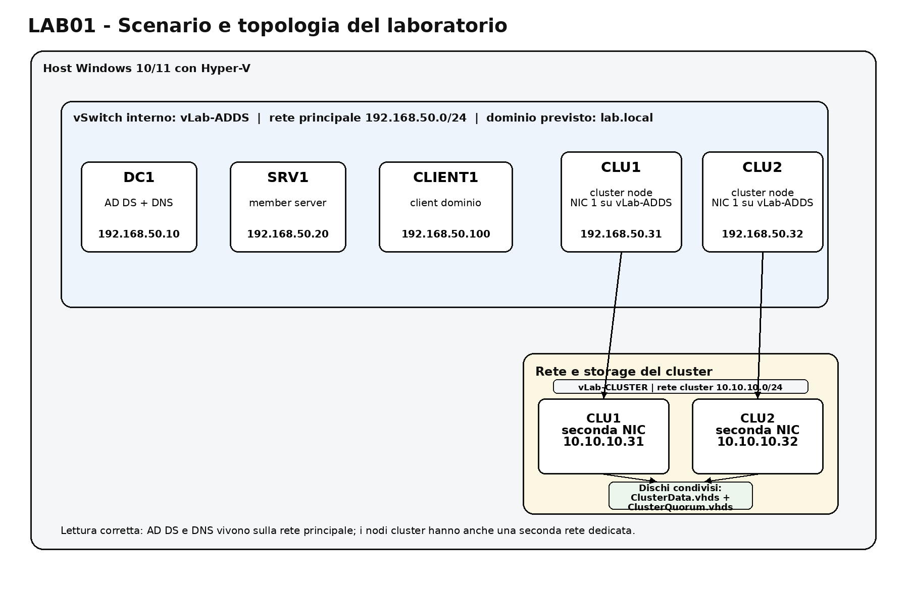
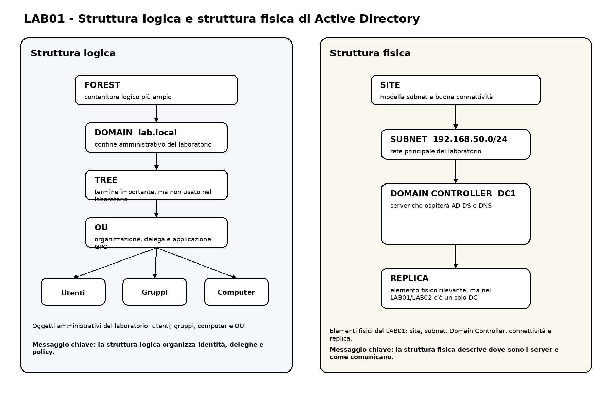
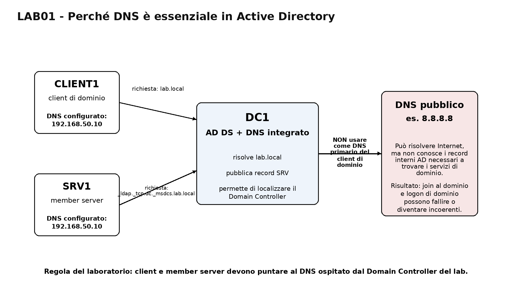
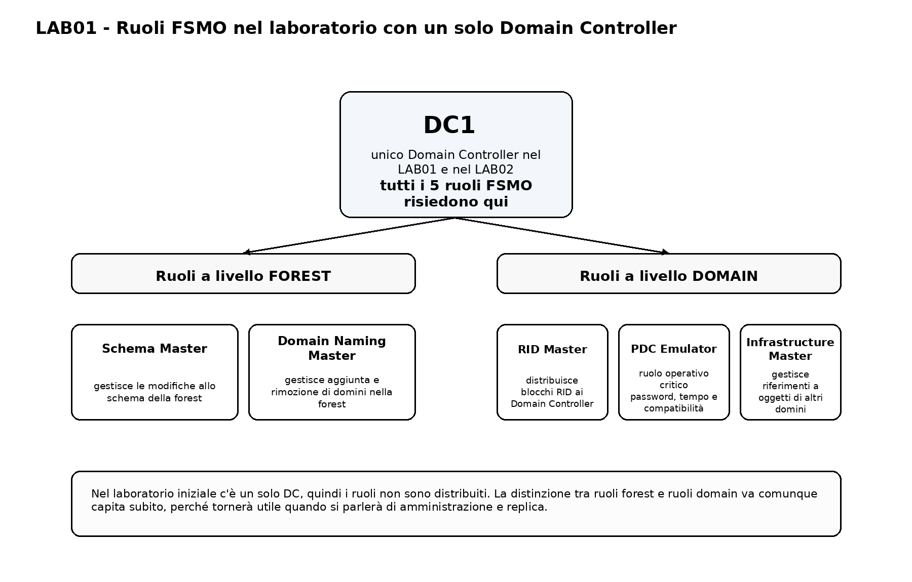
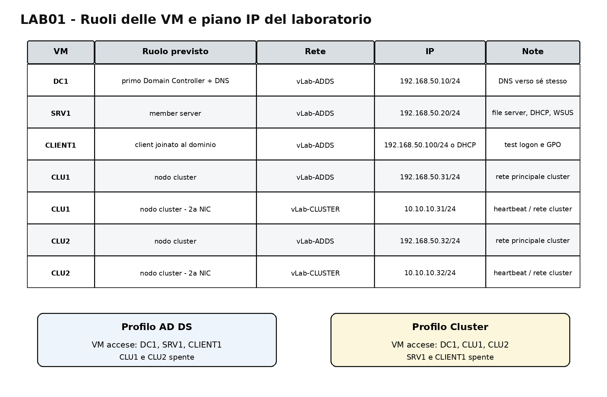

# ADDS_LAB01 - Architettura Active Directory e progettazione ambiente

## Dalla comprensione della struttura AD DS alla definizione del laboratorio operativo

---

# 1. Obiettivo del laboratorio

In questo laboratorio non installerai ancora Active Directory Domain Services.

Farai però una cosa che nei contesti reali viene spesso trattata con una superficialità: **progettare l’ambiente prima di costruirlo**.

L’obiettivo è capire:

- che cosa rappresenta davvero Active Directory
- quali sono le sue strutture logiche e fisiche
- quale ruolo hanno Domain Controller e DNS
- quali componenti interni entrano in gioco
- perché i ruoli FSMO esistono
- come progettare naming, ruoli macchina e piano IP del laboratorio
- come verificare che l’ambiente predisposto nel LAB00 sia coerente con il progetto

Alla fine del laboratorio dovrai essere in grado di:

- descrivere con parole corrette domain, forest, tree, OU, site e Domain Controller
- distinguere struttura logica e struttura fisica di AD DS
- spiegare perché DNS è un servizio essenziale per AD
- associare le VM del laboratorio ai ruoli futuri del corso
- definire il dominio di laboratorio, il naming delle macchine e il piano IP
- produrre una piccola documentazione tecnica di progetto

---

# 2. Scopo di questo laboratorio

Se si salta questa fase e si passa direttamente al wizard di installazione, è possibile anche arrivare a un controller di dominio funzionante. Il problema è che potrebbe non essere compreso:

- perché al dominio venga attribuito un determinato nome
- perché il DNS va configurato in un certo modo
- perché le macchine hanno ruoli diversi
- perché alcune scelte sono buone per fare delle prove ma pessime in produzione

Qui fissiamo l’architettura del laboratorio, le definizioni corrette e le scelte da mantenere per tutte le sessioni successive.

---

# 3. Scenario del laboratorio

Immagina di dover progettare l’infrastruttura di base per una organizzazione che vuole:

- autenticare utenti e computer in modo centralizzato
- applicare policy di sicurezza e configurazione
- gestire gruppi, permessi e deleghe
- integrare servizi di rete e servizi server Windows
- arrivare, cio che andremo a fare nel modulo finale, ad uno semplice scenario di alta disponibilità

L’ambiente del corso è volutamente ridotto ma coerente. Non andremo a simulare un data center completo. Serve a costruire una base didattica realistica.

Le macchine del laboratorio sono:

- `DC1`
- `SRV1`
- `CLIENT1`
- `CLU1`
- `CLU2`

Il dominio che useremo è:

- `lab.local`

La rete principale del corso è:

- `192.168.50.0/24`



*Figura 1 - Vista d’insieme del laboratorio: dominio previsto, rete principale AD DS, seconda rete cluster e storage condiviso preparato nel LAB00.*

---

# Parte 1 - Concetti e architettura

# 4. Che cos’è Active Directory

Active Directory Domain Services è il servizio di directory di Microsoft per ambienti Windows di dominio.

In termini semplici, AD DS permette di:

- conservare identità digitali in modo centralizzato
- autenticare utenti e computer
- autorizzare accessi a risorse e servizi
- organizzare oggetti amministrativi
- applicare policy centralizzate
- delegare compiti amministrativi

## 4.1 Active Directory non è solo “login centralizzato”

Ridurre AD DS a “serve per fare il login al dominio” è tecnicamente povero.

AD DS è una piattaforma di identità e amministrazione che tiene insieme:

- utenti
- gruppi
- computer
- organizzazione logica
- relazioni di fiducia
- servizi di supporto, in particolare DNS
- replica tra controller di dominio

## 4.2 Autenticazione e autorizzazione

Distinzione essenziale:

- **autenticazione**: chi sei
- **autorizzazione**: che cosa puoi fare

Esempio:

- un utente inserisce credenziali valide e viene autenticato dal dominio
- successivamente ottiene o non ottiene accesso a una share in base ai gruppi e ai permessi

Nel corso lavoreremo più avanti su entrambe le dimensioni.

---

# 5. Struttura logica di Active Directory

La struttura logica serve a organizzare identità e confini amministrativi.

## 5.1 Domain

Il **domain** è un confine logico e amministrativo.

Nel nostro corso il dominio sarà:

- `lab.local`

Il dominio contiene oggetti come:

- utenti
- gruppi
- computer
- unità organizzative
- policy

## 5.2 Forest

La **forest** è l’insieme più ampio. È il contenitore di uno o più domini che condividono:

- schema
- configurazione comune
- Global Catalog
- relazioni di trust transitive interne

Nel nostro laboratorio la forest coinciderà con un singolo dominio.

## 5.3 Tree

Un **tree** è un insieme di domini collegati da una continuità di naming DNS.

Esempio teorico:

- `azienda.local`
- `filiale.azienda.local`

Nel nostro laboratorio non costruiremo un tree multi-dominio, ma è importante conoscere il termine.

## 5.4 Organizational Unit (OU)

Le **OU** servono a:

- organizzare gli oggetti
- semplificare l’amministrazione
- applicare GPO in modo mirato
- delegare attività su sottoinsiemi del dominio

Non sono contenitori estetici. Una OU ben progettata ha impatto diretto su deleghe e policy.

## 5.5 Oggetti tipici del dominio

Oggetti che incontreremo nel corso:

- user
- group
- computer
- organizationalUnit
- groupPolicyContainer

---

# 6. Struttura fisica di Active Directory

La struttura fisica riguarda dove vivono i servizi e come comunicano.

## 6.1 Domain Controller

Il **Domain Controller** è il server che ospita AD DS.

Un DC:

- conserva il database di directory
- risponde alle richieste di autenticazione
- partecipa alla replica
- pubblica e usa informazioni DNS
- ospita SYSVOL e NETLOGON

Nel nostro laboratorio il primo DC sarà:

- `DC1`

## 6.2 Sites

I **site** rappresentano insiemi di subnet con buona connettività reciproca.

Servono soprattutto a:

- ottimizzare autenticazione e referral
- controllare la replica tra sedi
- modellare la topologia fisica della rete


## 6.3 Replica

In ambienti con più Domain Controller, Active Directory replica:

- dati di directory
- partizioni applicative rilevanti
- contenuto SYSVOL

Nel LAB02 avremo un solo DC, quindi il tema replica verrà toccato solo concettualmente.



*Figura 2 - Separazione tra struttura logica e struttura fisica: forest, domain e OU da un lato; site, subnet e Domain Controller dall’altro.*

---

# 7. Componenti interni fondamentali

## 7.1 NTDS.dit

`NTDS.dit` è il database della directory.

Contiene le informazioni strutturali e gli oggetti di Active Directory. Nel corso lo citeremo spesso, anche se non lo andremo a manipolare direttamente.

## 7.2 SYSVOL

`SYSVOL` è una cartella condivisa critica che contiene, tra le altre cose:

- file delle Group Policy
- script di logon e startup
- contenuti replicati tra Domain Controller

## 7.3 NETLOGON

`NETLOGON` è una condivisione utilizzata nel contesto del logon di dominio e della distribuzione di script.

## 7.4 DNS integrato ad AD

Senza DNS, Active Directory smette rapidamente di sembrare “semplice”.

I client devono poter risolvere correttamente:

- il nome del dominio
- il nome del Domain Controller
- i record SRV usati per localizzare i servizi di dominio

Questo è uno dei punti che genera più errori nei laboratori: il problema sembra “AD non funziona”, ma in realtà è quasi sempre “DNS è configurato male”.



*Figura 3 - Nel laboratorio i client e i member server devono usare il DNS del Domain Controller, non un DNS pubblico, per poter localizzare correttamente i servizi AD.*

---

# 8. Ruoli FSMO in panoramica

I ruoli FSMO sono ruoli operativi speciali assegnati a specifici Domain Controller.

Nel nostro laboratorio iniziale avremo un solo DC, quindi tutti i ruoli saranno su `DC1`. Però devi sapere fin da subito a cosa servono.

## 8.1 Schema Master

Gestisce modifiche allo schema della forest.

## 8.2 Domain Naming Master

Gestisce aggiunta e rimozione di domini nella forest.

## 8.3 RID Master

Assegna blocchi di RID ai Domain Controller per la creazione di SID univoci.

## 8.4 PDC Emulator

Ruolo molto importante in pratica:

- riferimento temporale
- compatibilità con vecchi meccanismi
- coordinamento di alcune operazioni critiche su password e account

## 8.5 Infrastructure Master

Gestisce riferimenti a oggetti provenienti da altri domini.

Nel LAB02 verificheremo dove si trovano i ruoli FSMO con i comandi di amministrazione.



*Figura 4 - Nel laboratorio iniziale esiste un solo Domain Controller, quindi tutti i ruoli FSMO risiedono su DC1.*

---

# 9. Strumenti amministrativi che useremo nel corso

In questa fase li presentiamo, anche se alcuni diventeranno realmente utili solo dopo l’installazione del ruolo AD DS.

## 9.1 ADUC

**Active Directory Users and Computers**

Serve per gestire:

- utenti
- gruppi
- computer
- OU

## 9.2 ADAC

**Active Directory Administrative Center**

Interfaccia più moderna per varie operazioni amministrative.

## 9.3 DNS Manager

Gestisce:

- zone
- record
- diagnostica di base DNS

## 9.4 GPMC

**Group Policy Management Console**

Sarà centrale nei moduli GPO.

## 9.5 PowerShell

Useremo anche PowerShell per:

- verifiche di rete
- diagnostica
- interrogazione di ruoli e servizi
- gestione di funzionalità Windows

---

# 10. Progetto del laboratorio: scelte architetturali fissate

Questa sezione trasforma i concetti in un progetto tecnico da seguire nelle lezioni successive.

## 10.1 Dominio del laboratorio

Scelta standard del corso:

- FQDN: `lab.local`
- NetBIOS: `LAB`

## 10.2 Ruolo delle VM

| VM | Ruolo previsto nel corso | Note |
|---|---|---|
| `DC1` | primo Domain Controller + DNS | macchina centrale del corso |
| `SRV1` | member server | file server, DHCP, WSUS, test ruoli server |
| `CLIENT1` | client joinato al dominio | logon, GPO, test accessi |
| `CLU1` | nodo cluster | usato nel modulo cluster |
| `CLU2` | nodo cluster | usato nel modulo cluster |

## 10.3 Piano IP del laboratorio

| Nodo | Rete | IP | Note |
|---|---|---|---|
| `DC1` | vLab-ADDS | `192.168.50.10/24` | DNS verso sé stesso |
| `SRV1` | vLab-ADDS | `192.168.50.20/24` | DNS verso `192.168.50.10` |
| `CLIENT1` | vLab-ADDS | `192.168.50.100/24` oppure DHCP | DNS verso `192.168.50.10` |
| `CLU1` | vLab-ADDS | `192.168.50.31/24` | cluster |
| `CLU1` | vLab-CLUSTER | `10.10.10.31/24` | seconda rete cluster |
| `CLU2` | vLab-ADDS | `192.168.50.32/24` | cluster |
| `CLU2` | vLab-CLUSTER | `10.10.10.32/24` | seconda rete cluster |

## 10.4 Profilo VM accese per modulo

### Profilo AD DS

- `DC1`
- `SRV1`
- `CLIENT1`

### Profilo Cluster

- `DC1`
- `CLU1`
- `CLU2`



*Figura 5 - Mappa sintetica delle VM del laboratorio, del loro ruolo previsto e degli indirizzi IP associati alle reti vLab-ADDS e vLab-CLUSTER.*

---

# Parte 2 - Laboratorio guidato step-by-step

# 11. Prerequisiti

Prima di iniziare verifica di aver completato il LAB00:

- Hyper-V attivo
- switch `vLab-ADDS` e `vLab-CLUSTER` creati
- VM create
- almeno `DC1`, `SRV1` e `CLIENT1` installate
- rete di base configurata
- checkpoint disponibili

---

# 12. Avvio del profilo corretto di VM

Per questa sessione non servono i nodi cluster.

Accendi solo:

- `DC1`
- `SRV1`
- `CLIENT1`

Lascia spente:

- `CLU1`
- `CLU2`

## 12.1 Verifica rapida da host PowerShell

Apri PowerShell come amministratore sull’host e lancia:

```powershell
Get-VM | Select-Object Name, State, CPUUsage, MemoryAssigned | Format-Table -AutoSize
```

### Evidenza richiesta

Annota quali VM sono accese e perché.

---

# 13. Verifica naming e rete sulle VM

Accedi a ciascuna macchina accesa e verifica:

- nome host
- indirizzo IP
- DNS configurato
- connettività verso `DC1`

## 13.1 Comandi su Windows Server / Windows 11

Apri PowerShell nelle VM e usa:

```powershell
hostname
ipconfig /all
Test-Connection 192.168.50.10 -Count 2
```

## 13.2 Risultati attesi

- `DC1` deve rispondere al ping dagli altri nodi della rete principale
- `SRV1` e `CLIENT1` devono usare come DNS `192.168.50.10` se già configurato
- i nomi host devono coincidere con il naming standard del corso

### Evidenza richiesta

Nel report inserisci per ogni macchina:

- hostname
- IPv4
- DNS configurato
- esito del ping verso `DC1`

---

# 14. Crea il documento di progetto del laboratorio

In questa fase non basta “capire più o meno”. Devi produrre un piccolo documento tecnico.

Su `DC1` oppure sul PC host crea la cartella:

```text
D:\LabADDS\Notes
```

Oppure, se usi `C:`:

```text
C:\LabADDS\Notes
```

Crea il file:

```text
lab01_progetto_architettura.md
```

## 14.1 Struttura consigliata del file

Inserisci queste sezioni:

```md
# Progetto architettura AD DS laboratorio

## Dominio previsto
- FQDN:
- NetBIOS:

## Ruolo delle macchine
- DC1:
- SRV1:
- CLIENT1:
- CLU1:
- CLU2:

## Reti virtuali
- vLab-ADDS:
- vLab-CLUSTER:

## Piano IP
- DC1:
- SRV1:
- CLIENT1:
- CLU1:
- CLU2:

## Motivazioni progettuali
- perché serve un DNS corretto
- perché i cluster node hanno due reti
- perché non teniamo tutte le VM sempre accese
```

### Evidenza richiesta

Salva il file e riportane il contenuto nel documento finale di evidenza.

---

# 15. Classifica gli elementi della struttura logica e fisica

Questa attività serve a fissare i concetti invece di lasciarli galleggiare in testa per dieci minuti.

Crea una tabella con due colonne:

- **struttura logica**
- **struttura fisica**

Inserisci correttamente i seguenti elementi:

- domain
- forest
- tree
- OU
- site
- Domain Controller
- subnet
- replica
- utenti
- gruppi

## 15.1 Modello atteso

| Elemento | Categoria | Motivo |
|---|---|---|
| domain | logica | confine amministrativo |
| forest | logica | contenitore logico più ampio |
| OU | logica | organizzazione e delega |
| site | fisica | rappresenta subnet e connettività |
| Domain Controller | fisica | server che ospita il ruolo |

### Evidenza richiesta

Inserisci la tabella compilata nel report.

---

# 16. Analizza il ruolo del DNS nel laboratorio

Questa è una delle attività più importanti della sessione.

Rispondi nel tuo file di progetto alle domande seguenti:

1. Perché un client di dominio non deve usare un DNS pubblico come DNS primario?
2. Che cosa succederebbe se `CLIENT1` usasse `8.8.8.8` invece di `192.168.50.10`?
3. Quale server del nostro laboratorio ospiterà il DNS integrato con AD?
4. Quale relazione c’è tra DNS e localizzazione del Domain Controller?

### Evidenza richiesta

Scrivi almeno 5-8 righe complessive di risposta tecnica.

---

# 17. Mappa i ruoli FSMO a livello concettuale

In questa sessione non li verifichiamo ancora con cmdlet AD, ma fissiamo il concetto.

Crea una tabella come questa:

| Ruolo FSMO | Ambito | Descrizione sintetica | Nodo iniziale nel nostro lab |
|---|---|---|---|
| Schema Master | forest | gestisce modifiche schema | DC1 |
| Domain Naming Master | forest | gestisce domini nella forest | DC1 |
| RID Master | domain | distribuisce blocchi RID | DC1 |
| PDC Emulator | domain | ruolo operativo critico | DC1 |
| Infrastructure Master | domain | riferimenti tra oggetti | DC1 |

### Evidenza richiesta

Inserisci la tabella nel report e aggiungi due righe su quale ruolo, secondo te, è il più “sensibile” in un laboratorio con un solo DC e perché.

---

# 18. Verifica funzionalità Windows disponibili sui server

Anche se il ruolo AD DS non verrà installato oggi, possiamo già verificare che l’ambiente sia in grado di ospitarlo.

Su `DC1` apri PowerShell come amministratore ed esegui:

```powershell
Get-WindowsFeature AD-Domain-Services
Get-WindowsFeature DNS
Get-WindowsFeature RSAT-AD-Tools
```

## 18.1 Scopo dell’attività

Questa attività serve a:

- verificare che la macchina sia davvero un server adatto a ospitare il ruolo
- familiarizzare con i nomi tecnici delle feature
- preparare la sessione successiva

### Evidenza richiesta

Copia nel report lo stato delle feature interrogate.

---

# 19. Disegna l’architettura del laboratorio in formato testuale

Non serve Visio per tutto. A volte basta saper rappresentare una topologia in modo chiaro.

Crea nel report uno schema testuale come questo e adattalo se necessario:

```text
Forest: lab.local
Domain: lab.local

Rete principale: 192.168.50.0/24
  DC1      192.168.50.10   AD DS + DNS
  SRV1     192.168.50.20   member server
  CLIENT1  192.168.50.100  client dominio
  CLU1     192.168.50.31   cluster node
  CLU2     192.168.50.32   cluster node

Rete cluster: 10.10.10.0/24
  CLU1     10.10.10.31
  CLU2     10.10.10.32
```

### Evidenza richiesta

Inserisci lo schema nel file finale.

---

# 20. Checklist di preparazione per LAB02

Compila questa checklist:

- [ ] `DC1` ha nome corretto
- [ ] `DC1` ha IP statico coerente
- [ ] `SRV1` ha nome corretto
- [ ] `CLIENT1` ha nome corretto
- [ ] il DNS previsto del lab è chiaro
- [ ] il dominio `lab.local` è confermato
- [ ] il file di progetto architetturale è stato creato
- [ ] so distinguere domain, forest, OU, site, DC
- [ ] so spiegare a cosa serve DNS in AD
- [ ] sono pronto per installare AD DS nella prossima sessione

---

# 21. Troubleshooting minimo della sessione

## 21.1 Le VM rispondono lente o sembrano bloccate

Possibili cause:

- hai acceso troppe VM
- l’host è sotto pressione
- Dynamic Memory sta recuperando lentamente

Azione:

- spegni `CLU1` e `CLU2`
- lascia accese solo `DC1`, `SRV1`, `CLIENT1`
- chiudi applicazioni pesanti sull’host

## 21.2 I ping verso `DC1` falliscono

Possibili cause:

- IP statico sbagliato
- switch virtuale errato
- firewall locale non coerente con il profilo rete

Azione:

- controlla `ipconfig /all`
- verifica lo switch associato alla NIC della VM in Hyper-V
- verifica che le VM siano sulla stessa rete virtuale

## 21.3 Il nome computer non è coerente con lo standard del corso

Azione:

- rinomina subito la macchina
- riavvia
- aggiorna il tuo file di progetto

## 21.4 Le feature AD DS o DNS non risultano trovate

Possibili cause:

- stai lanciando il comando sul client Windows 11 invece che su un server
- stai usando una sessione PowerShell con privilegi insufficienti

Azione:

- ripeti il comando su `DC1` o `SRV1`
- usa PowerShell come amministratore

---

# 22. Evidenze richieste

Crea il file:

```text
ADDS_evidence_lab01.md
```

## 22.1 Struttura del file

```md
# Evidence LAB01 - Architettura AD DS e progettazione ambiente

## 1. VM accese nella sessione
- elenco VM attive
- motivazione

## 2. Verifica naming e rete
- hostname, IP, DNS, ping verso DC1

## 3. Dominio progettato
- FQDN
- NetBIOS

## 4. Ruolo delle macchine
- DC1
- SRV1
- CLIENT1
- CLU1
- CLU2

## 5. Struttura logica vs fisica
- tabella classificata

## 6. DNS e AD
- spiegazione tecnica sintetica

## 7. Ruoli FSMO
- tabella e commento

## 8. Verifica feature Windows
- output o sintesi di Get-WindowsFeature

## 9. Schema architetturale testuale
- topologia del laboratorio

## 10. Checklist finale
- stato di preparazione per LAB02
```

---

# 23. Consegna

Alla fine del laboratorio devi consegnare:

- file `lab01_progetto_architettura.md`
- file `ADDS_evidence_lab01.md`
- eventuali screenshot o output richiesti dal docente

Salva tutto nella cartella del laboratorio o nella cartella `Notes` definita nel LAB00.

---

# 24. Conclusione del laboratorio

In questa sessione hai fatto una cosa più utile di quanto sembri:

- hai separato concetti logici e fisici di AD DS
- hai fissato il ruolo di DNS nel dominio
- hai collegato le VM a funzioni precise del corso
- hai trasformato l’ambiente virtuale in un progetto tecnico coerente

Nel laboratorio successivo userai questa base per installare **AD DS**, promuovere `DC1` a **Domain Controller** e creare la prima forest del laboratorio.
