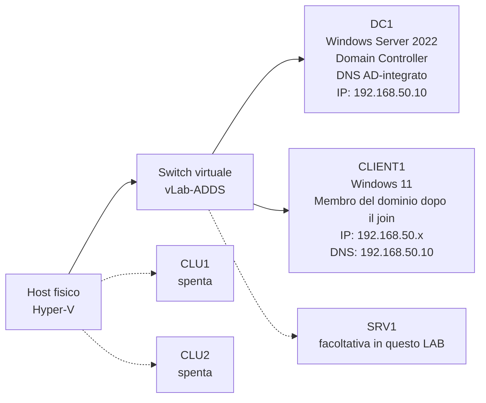
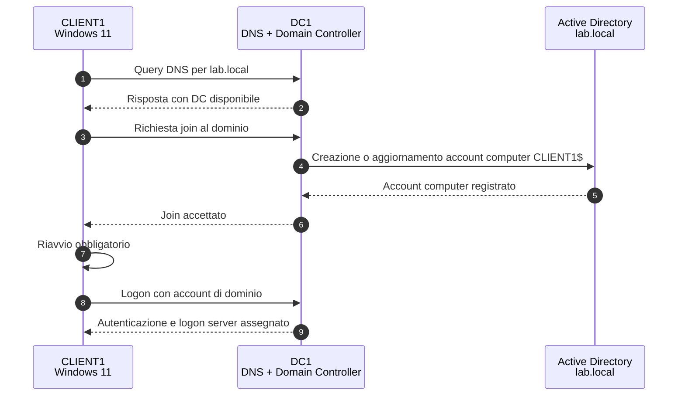
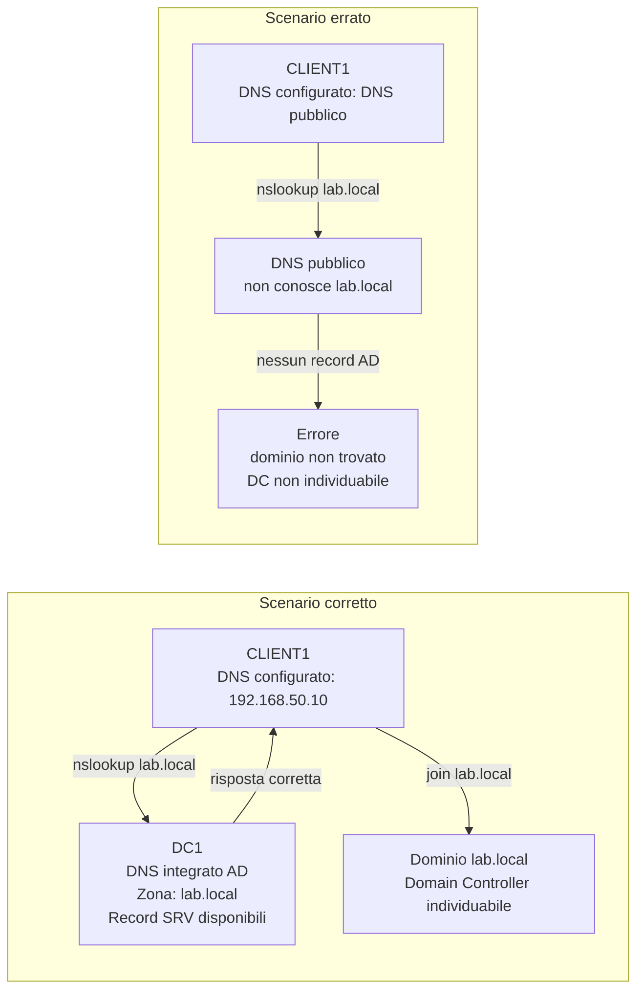
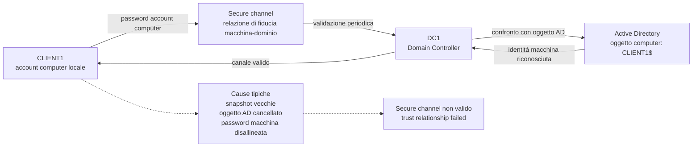

# ADDS_LAB03 - Join al dominio e autenticazione

> Versione con schemi Mermaid integrati, senza dipendenza da immagini esterne.

## Dal server standalone al primo client realmente integrato in Active Directory

---

# 1. Obiettivo del laboratorio

In questo laboratorio collegherai `CLIENT1` al dominio `lab.local` creato nel LAB02 e verificherai i meccanismi minimi che permettono a un computer di autenticarsi correttamente verso Active Directory.

Questa sessione è importante perché segna il primo momento in cui il dominio smette di essere “qualcosa che esiste solo su DC1” e diventa un servizio realmente usato da un altro sistema.

Alla fine del laboratorio dovrai essere in grado di:

- verificare i prerequisiti di rete necessari per il join al dominio
- spiegare perché il DNS del client deve puntare al Domain Controller
- eseguire correttamente il join di `CLIENT1` al dominio `lab.local`
- riconoscere la creazione dell’account computer in Active Directory
- accedere con un account di dominio
- verificare elementi base del logon di dominio
- usare strumenti minimi come `whoami`, `hostname`, `echo %logonserver%`, `nltest`, `ipconfig`, `nslookup`
- comprendere il ruolo operativo di Kerberos e la presenza di NTLM come fallback storico
- riconoscere i sintomi tipici di un problema DNS o secure channel

---

# 2. Scopo di questo laboratorio

Lo scopo non è soltanto “aggiungere un PC al dominio”.

Lo scopo reale è capire che il join funziona solo se alcuni elementi sono coerenti tra loro:

- risoluzione DNS verso il Domain Controller
- orario ragionevolmente corretto
- connettività IP
- credenziali adeguate
- esistenza e raggiungibilità del dominio

Questo laboratorio prepara direttamente le attività successive del corso:

- posizionamento e gestione degli account computer
- creazione utenti e gruppi
- accesso interattivo con account di dominio
- applicazione di Group Policy
- accesso a condivisioni e servizi di dominio

Se qui il partecipante capisce solo la procedura grafica ma non il ruolo del DNS e del secure channel, al primo errore reale resterà fermo a guardare la schermata come se fosse una profezia.

---

# 3. Architettura del laboratorio in questa sessione

In questa sessione devono essere accese queste VM:

- `DC1`
- `CLIENT1`
- `SRV1` facoltativa

VM da tenere spente:

- `CLU1`
- `CLU2`

## 3.1 Stato atteso di DC1

`DC1` deve essere già operativa come Domain Controller del LAB02 con:

- dominio `lab.local`
- IP statico `192.168.50.10/24`
- DNS installato e funzionante
- strumenti AD disponibili

## 3.2 Stato atteso di CLIENT1

`CLIENT1` deve essere già predisposta dal LAB00 con:

- Windows 11 installato
- hostname `CLIENT1`
- collegamento allo switch `vLab-ADDS`
- IP nella rete `192.168.50.0/24`
- DNS configurato verso `DC1`

## 3.3 Schema dell'architettura logica del laboratorio



*Figura A - In questa sessione la relazione essenziale è tra `CLIENT1` e `DC1`. `CLIENT1` deve stare sulla stessa rete virtuale e deve usare `DC1` come server DNS.*

---

# Parte 1 - Spiegazione dei termini e dei concetti operativi

# 4. Che cos’è il join al dominio

## Figura 1 - Flusso logico del join al dominio



*Figura 1 - Il join non è un singolo clic: il client deve prima trovare il dominio via DNS, poi instaurare la relazione con il Domain Controller, creare l'account computer e riavviarsi per usare correttamente l'identità di dominio.*

Il **join al dominio** è l’operazione con cui un computer Windows entra a far parte del dominio Active Directory e instaura una relazione di fiducia con esso.

Dopo il join:

- il computer viene registrato in Active Directory come **account computer**
- può autenticare utenti di dominio
- può ricevere Group Policy
- può usare servizi integrati del dominio in modo coerente

Il join non è quindi un semplice cambio di nome o un’etichetta amministrativa. È la creazione di una relazione reale tra macchina e dominio.

---

# 5. Perché il DNS è decisivo

## Figura 2 - DNS corretto e DNS errato nel join al dominio



*Figura 2 - In Active Directory il DNS non serve solo a tradurre nomi: permette al client di localizzare il dominio, il Domain Controller e i record SRV necessari ai servizi di autenticazione. Un DNS pubblico può conoscere Internet, ma di `lab.local` non sa nulla. Sorprendente, vero? Internet non indovina i domini del laboratorio.*

Nel laboratorio, il DNS del client deve puntare a `DC1`.

Perché?

Perché il client deve poter individuare:

- il dominio `lab.local`
- il Domain Controller
- i record di servizio necessari all’autenticazione

Se il client usa un DNS esterno o non coerente, il join spesso fallisce oppure si ottiene una situazione ancora più irritante: il join sembra riuscire, ma i logon e le policy non funzionano correttamente.

In Active Directory, il DNS non è un accessorio. È una parte del meccanismo di funzionamento.

---

# 6. Kerberos e NTLM: che cosa serve sapere qui

Nel contesto di questo laboratorio non serve una trattazione accademica completa, ma devi conoscere la differenza operativa:

- **Kerberos** è il protocollo di autenticazione predefinito in dominio
- **NTLM** è un meccanismo più vecchio, ancora presente come compatibilità in alcuni scenari

Per questo corso, la cosa importante è capire che:

- un ambiente di dominio moderno usa normalmente Kerberos
- problemi di DNS, tempo o raggiungibilità possono compromettere l’autenticazione corretta
- non tutte le autenticazioni fallite significano “password sbagliata”

---

# 7. Che cos’è l’account computer

Quando `CLIENT1` entra nel dominio, Active Directory crea un **account computer**.

Questo oggetto:

- identifica il computer nel dominio
- partecipa alla relazione di trust con il DC
- può essere spostato in OU specifiche
- può ricevere GPO
- può essere amministrato come oggetto AD vero e proprio

Nel primo join, l’account computer finirà di solito nel contenitore predefinito `Computers`, se non hai ancora predisposto OU specifiche.

---

# 8. Che cos’è il secure channel

Il **secure channel** è il canale di fiducia tra il computer membro del dominio e il Domain Controller.

Se questo canale si rompe, puoi vedere sintomi come:

- impossibilità di autenticare utenti di dominio
- errori apparentemente generici al logon
- messaggi che indicano che la relazione di trust è stata compromessa

In questa sessione non ripariamo scenari complessi di trust rotto, ma iniziamo a verificare il canale con strumenti semplici come `nltest`.

## 8.1 Schema del secure channel



*Figura B - Il secure channel collega l'identità locale del computer all'oggetto computer presente in Active Directory. Quando questo legame si rompe, il client può essere acceso e collegato alla rete, ma non essere più considerato affidabile dal dominio.*

---

# 9. Concetti chiave da ricordare prima della pratica

Prima di passare allo step-by-step, devi avere chiaro che:

- `DC1` è il riferimento DNS del laboratorio
- `CLIENT1` deve risolvere correttamente `lab.local`
- il join crea un oggetto computer in AD
- dopo il join serve un riavvio
- il logon di dominio non è lo stesso del logon locale
- gli strumenti di verifica servono più della memoria della procedura guidata

---

# Parte 2 - Step-by-step guidato

# 10. Prerequisiti del laboratorio

Devono essere già disponibili:

- `DC1` promossa a Domain Controller
- dominio `lab.local` funzionante
- DNS installato su `DC1`
- `CLIENT1` accesa e connessa alla stessa rete virtuale
- credenziali di dominio con autorizzazione al join

Nel laboratorio useremo, quando necessario:

- account `LAB\Administrator`

---

# 11. Avvio e controllo iniziale delle VM

Avvia `DC1` e `CLIENT1`.

Su `DC1` verifica rapidamente:

```powershell
hostname
ipconfig /all
Get-ADDomain
```

Su `CLIENT1` apri PowerShell come amministratore e verifica:

```powershell
hostname
ipconfig /all
Get-NetIPAddress -AddressFamily IPv4
```

## 11.1 Risultato atteso

- `DC1` deve risultare Domain Controller del dominio `lab.local`
- `CLIENT1` deve essere nella rete `192.168.50.0/24`
- il DNS di `CLIENT1` deve puntare a `192.168.50.10`

---

# 12. Verifica della connettività IP e DNS da CLIENT1

Da `CLIENT1` esegui:

```powershell
ping 192.168.50.10
nslookup lab.local
nslookup dc1.lab.local
nslookup -type=SRV _ldap._tcp.dc._msdcs.lab.local
```

## 12.1 Che cosa stai verificando

Con questi comandi controlli:

- raggiungibilità IP del DC
- risoluzione del nome del dominio
- risoluzione del nome del Domain Controller
- presenza di un record SRV utile a localizzare i servizi di dominio

## 12.2 Risultato atteso

- `ping` deve rispondere
- `nslookup lab.local` deve restituire una risposta coerente
- i record SRV devono essere risolti

Se qui non funziona, non passare oltre. Il join senza DNS coerente è uno dei modi più rapidi per perdere tempo con grande convinzione.

---

# 13. Verifica dell’orologio e del nome macchina

Da `CLIENT1`:

```powershell
time /t
hostname
systeminfo | findstr /B /C:"Host Name" /C:"Domain"
```

Controlla che il nome macchina sia davvero `CLIENT1` e che non ci siano configurazioni residue strane.

---

# 14. Join di CLIENT1 al dominio

Su `CLIENT1` apri:

- **Settings** oppure **System Properties**
- vai su cambio nome computer / dominio
- seleziona l’ingresso in un **Domain**
- inserisci: `lab.local`

Quando richiesto, fornisci credenziali di dominio autorizzate, ad esempio:

- utente: `LAB\Administrator`
- password: quella definita nel laboratorio

## 14.1 Esito atteso

Devi ottenere il messaggio che conferma l’ingresso di `CLIENT1` nel dominio `lab.local`.

Riavvia il computer quando richiesto.

---

# 15. Metodo alternativo PowerShell (facoltativo ma utile)

Se vuoi mostrare o usare un metodo scriptabile:

```powershell
Add-Computer -DomainName lab.local -Credential LAB\Administrator -Restart
```

Questo metodo è utile anche didatticamente perché esplicita il nome del dominio e le credenziali usate.

---

# 16. Verifica dell’account computer su DC1

Dopo il riavvio di `CLIENT1`, passa su `DC1` e apri:

- **Active Directory Users and Computers**

Controlla il contenitore:

- `Computers`

Dovresti vedere l’oggetto:

- `CLIENT1`

## 16.1 Verifica PowerShell su DC1

```powershell
Get-ADComputer -Identity CLIENT1
Get-ADComputer -Filter * | Select-Object Name
```

## 16.2 Che cosa stai verificando

Stai verificando che il join abbia prodotto un oggetto computer reale in Active Directory.

---

# 17. Primo logon con account di dominio

Dopo il riavvio di `CLIENT1`:

- nella schermata di accesso seleziona l’uso di un altro utente
- accedi con un account di dominio, ad esempio:

```text
LAB\Administrator
```

oppure nel formato UPN se disponibile.

## 17.1 Risultato atteso

Il logon deve avvenire sul dominio e non sull’account locale della macchina.

---

# 18. Verifiche post-logon su CLIENT1

## Figura 3 - Verifiche minime dopo il join

```mermaid
flowchart TD
    START["CLIENT1 riavviato dopo il join"]
    LOGIN["Accesso con account di dominio<br/>esempio: LAB&#92;Administrator"]
    WHOAMI["whoami<br/>verifica identità utente"]
    HOST["hostname<br/>verifica nome macchina"]
    LOGON["echo %logonserver%<br/>verifica DC usato per il logon"]
    FQDN["whoami /fqdn<br/>verifica nome distinto in AD"]
    GROUPS["whoami /groups<br/>verifica gruppi e token di accesso"]
    NLTEST1["nltest /dsgetdc:lab.local<br/>individua il Domain Controller"]
    NLTEST2["nltest /sc_query:lab.local<br/>verifica secure channel"]
    OK["Join validato<br/>CLIENT1 opera come membro del dominio"]

    START --> LOGIN
    LOGIN --> WHOAMI
    LOGIN --> HOST
    LOGIN --> LOGON
    LOGIN --> FQDN
    LOGIN --> GROUPS
    LOGON --> NLTEST1
    NLTEST1 --> NLTEST2
    NLTEST2 --> OK
```



*Figura 3 - I comandi post-logon non sono formalità: servono a dimostrare che l'accesso avviene nel contesto del dominio, che il Domain Controller è raggiungibile e che il secure channel è valido.*

Apri il prompt dei comandi o PowerShell e lancia:

```powershell
whoami
hostname
echo %logonserver%
whoami /fqdn
whoami /groups
```

## 18.1 Che cosa osservare

- `whoami` deve mostrare un account di dominio
- `hostname` deve restituire `CLIENT1`
- `%logonserver%` deve puntare a `DC1`
- i gruppi devono includere gruppi coerenti con il contesto del dominio

---

# 19. Verifica del dominio e del secure channel

Da `CLIENT1` esegui:

```powershell
systeminfo | findstr /B /C:"Domain"
nltest /dsgetdc:lab.local
nltest /sc_query:lab.local
```

## 19.1 Significato pratico

- `nltest /dsgetdc:lab.local` individua il DC del dominio
- `nltest /sc_query:lab.local` controlla lo stato del secure channel

Se questi test falliscono, il problema non va nascosto sotto il tappeto del “però prima entrava”. Va diagnosticato.

---

# 20. Verifica lato DC1 degli eventi principali

Su `DC1` puoi fare un controllo minimo con:

```powershell
Get-ADComputer -Identity CLIENT1 | Format-List Name,Enabled,DistinguishedName
```

Se vuoi, puoi anche controllare gli strumenti grafici:

- ADUC
- DNS Manager

Verifica che il client sia stato effettivamente inglobato nell’ambiente di dominio.

---

# 21. Simulazione controllata di errore DNS

Per capire quanto il DNS condizioni il join e il logon, fai una prova controllata su `CLIENT1`.

## 21.1 Modifica temporaneamente il DNS del client

Imposta temporaneamente un DNS non coerente, ad esempio un DNS pubblico.

Poi prova:

```powershell
nslookup lab.local
nltest /dsgetdc:lab.local
```

## 21.2 Osservazione attesa

Dovresti vedere che il client non localizza correttamente il dominio o il DC.

## 21.3 Ripristino obbligatorio

Riporta subito il DNS di `CLIENT1` a:

```text
192.168.50.10
```

Ripeti i test finché la situazione torna coerente.

---

# 22. Verifica finale guidata

Su `CLIENT1` raccogli in sequenza:

```powershell
whoami
echo %logonserver%
nslookup lab.local
nltest /dsgetdc:lab.local
nltest /sc_query:lab.local
```

Su `DC1` raccogli:

```powershell
Get-ADComputer -Identity CLIENT1
```

Questi controlli costituiscono la base minima per dichiarare riuscita la sessione.

---

# Parte 3 - Troubleshooting minimo

## Schema decisionale di troubleshooting

```mermaid
flowchart TD
    P["Problema durante join o logon di dominio"]
    IP{"CLIENT1 raggiunge<br/>192.168.50.10?"}
    DNSCFG{"Il DNS di CLIENT1<br/>è 192.168.50.10?"}
    NS{"nslookup lab.local<br/>risponde correttamente?"}
    SRV{"Record SRV<br/>_ldap._tcp.dc._msdcs.lab.local<br/>risolto?"}
    TIME{"Ora di CLIENT1 e DC1<br/>ragionevolmente allineata?"}
    CREDS{"Credenziali corrette<br/>e autorizzate al join?"}
    JOIN["Procedere o ripetere il join"]
    LOGON["Verificare logon<br/>whoami, logonserver, nltest"]
    FIXNET["Correggere rete virtuale<br/>IP, switch, firewall, stato VM"]
    FIXDNS["Correggere DNS client<br/>usare DC1 come DNS"]
    FIXZONE["Verificare DNS su DC1<br/>zona lab.local e record SRV"]
    FIXTIME["Correggere orario"]
    FIXCREDS["Usare formato corretto<br/>LAB&#92;Administrator"]

    P --> IP
    IP -- "No" --> FIXNET
    IP -- "Sì" --> DNSCFG
    DNSCFG -- "No" --> FIXDNS
    DNSCFG -- "Sì" --> NS
    NS -- "No" --> FIXZONE
    NS -- "Sì" --> SRV
    SRV -- "No" --> FIXZONE
    SRV -- "Sì" --> TIME
    TIME -- "No" --> FIXTIME
    TIME -- "Sì" --> CREDS
    CREDS -- "No" --> FIXCREDS
    CREDS -- "Sì" --> JOIN
    JOIN --> LOGON
```



*Figura C - Prima si verifica la rete, poi il DNS, poi i record SRV, poi orario e credenziali. Saltare questi passaggi e cliccare di nuovo “Join” è una liturgia, non troubleshooting.*

# 23. Problema: il client non trova il dominio

Possibili cause:

- DNS del client errato
- DC non raggiungibile
- dominio non creato correttamente

Verifiche:

```powershell
ipconfig /all
nslookup lab.local
ping 192.168.50.10
```

---

# 24. Problema: il join restituisce errore di credenziali

Possibili cause:

- credenziali scritte nel formato sbagliato
- password errata
- account non autorizzato

Prova a usare esplicitamente:

```text
LAB\Administrator
```

---

# 25. Problema: il logon di dominio non funziona dopo il join

Possibili cause:

- riavvio non eseguito
- DNS non coerente
- DC temporaneamente non raggiungibile

Verifiche:

```powershell
systeminfo | findstr /B /C:"Domain"
echo %logonserver%
nltest /dsgetdc:lab.local
```

---

# 26. Problema: secure channel non valido

Possibili cause:

- problemi di trust
- snapshot usate male
- disallineamento tra stato del client e stato dell’oggetto computer in AD

In questo laboratorio limitati a:

- annotare il problema
- non improvvisare correzioni distruttive
- segnalarlo al docente per la sessione di troubleshooting

---

# Parte 4 - Evidenze richieste

# 27. Crea il file di evidenza

Su `CLIENT1` o in una cartella condivisa del laboratorio, crea:

```text
docs/evidence_lab03.md
```

Inserisci la seguente struttura.

```md
# Evidence LAB03

## 1. Configurazione iniziale di CLIENT1
Riporto hostname, IPv4 e DNS configurato.

## 2. Verifica DNS pre-join
Riporto l’esito di:
- nslookup lab.local
- nslookup dc1.lab.local
- nslookup -type=SRV _ldap._tcp.dc._msdcs.lab.local

## 3. Join al dominio
Descrivo il metodo usato:
- GUI oppure PowerShell
Indico le credenziali usate in forma descrittiva, senza scrivere la password.

## 4. Verifica dell’account computer
Riporto dove compare `CLIENT1` in Active Directory.

## 5. Primo logon di dominio
Descrivo con quale account ho effettuato l’accesso.

## 6. Verifiche post-logon
Incollo l’output di:
- whoami
- echo %logonserver%
- nltest /dsgetdc:lab.local
- nltest /sc_query:lab.local

## 7. Simulazione errore DNS
Descrivo che cosa è successo quando ho configurato temporaneamente un DNS non coerente.

## 8. Problemi incontrati
Descrivo eventuali errori e come li ho risolti.
```

---

# 28. Consegna

Al termine del laboratorio devi consegnare:

- `evidence_lab03.md`
- eventuali screenshot tecnici richiesti dal docente
- eventuali note sugli errori incontrati

---

# 29. Conclusione del laboratorio

In questo laboratorio hai completato il primo vero uso del dominio:

- hai verificato che `DC1` risponda come riferimento DNS e Domain Controller
- hai joinato `CLIENT1` al dominio `lab.local`
- hai osservato la creazione dell’account computer
- hai effettuato un logon di dominio
- hai verificato i primi indicatori tecnici di autenticazione e relazione di trust

Da qui in avanti il dominio non sarà più solo una configurazione sul server, ma l’infrastruttura viva su cui costruire utenti, gruppi, OU e policy.
