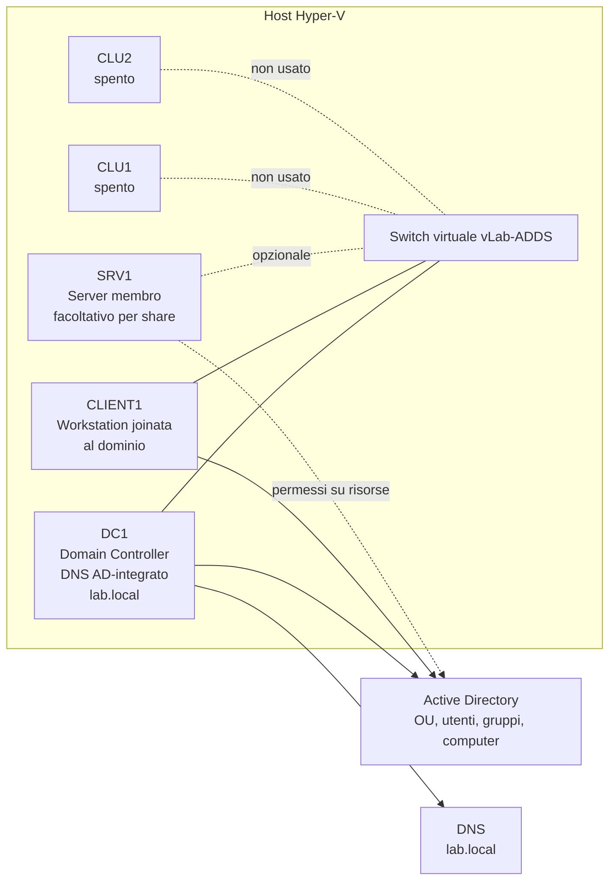
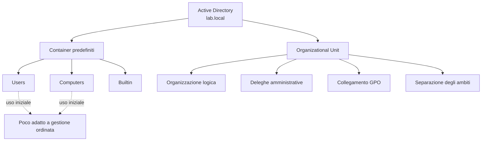
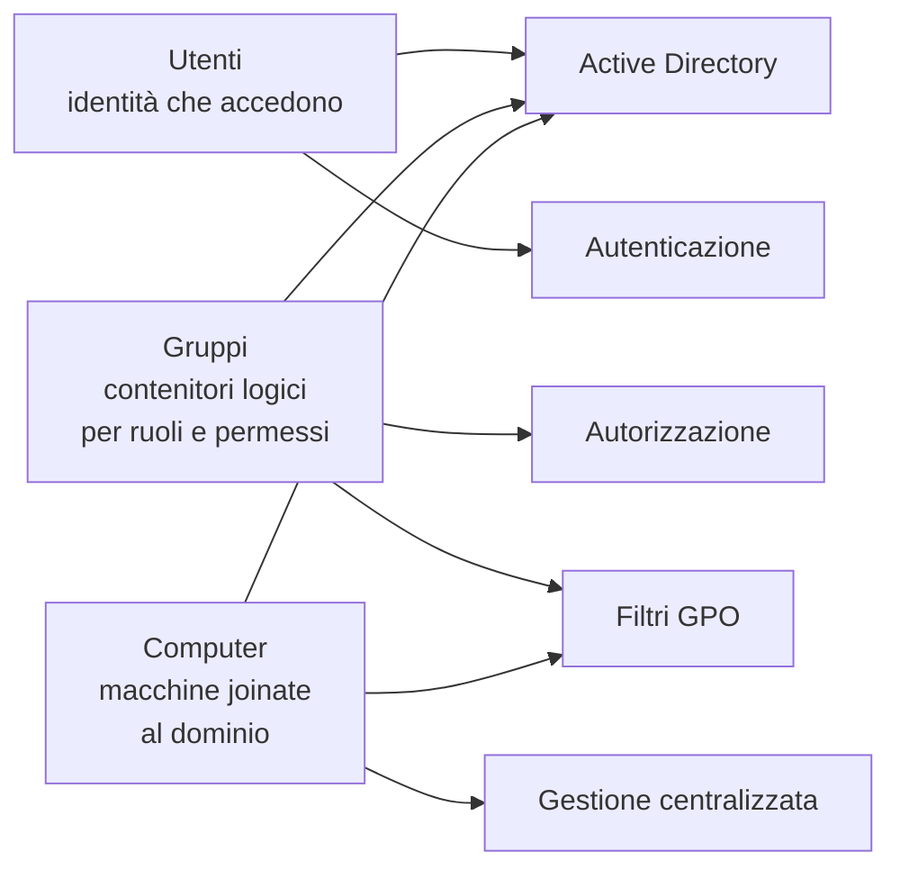
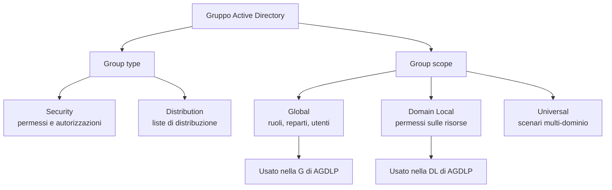
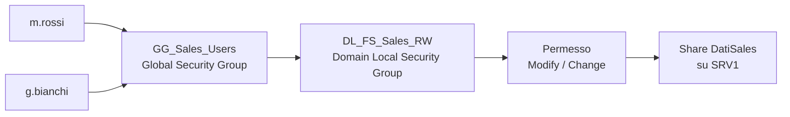
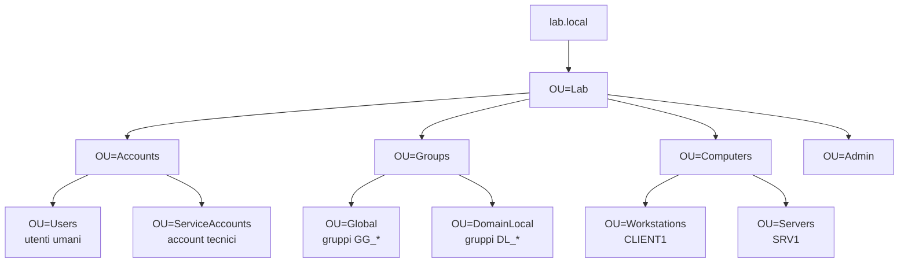
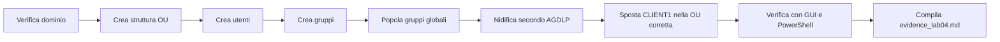
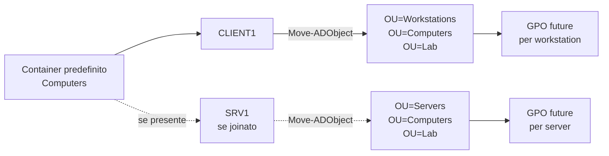
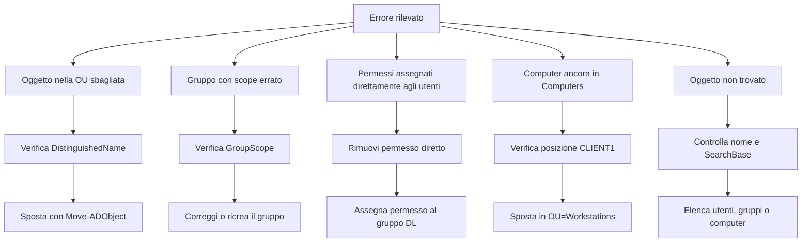

# ADDS_LAB04 - OU, utenti e gruppi

## Dalla directory funzionante a una directory amministrabile: progettare struttura OU, identità e gruppi in modo coerente

---

# 1. Obiettivo del laboratorio

In questo laboratorio costruirai la prima vera struttura amministrabile del dominio `lab.local`.

Non ti limiterai a creare qualche utente di prova: progetterai una gerarchia di **Organizational Unit**, creerai utenti e gruppi con convenzioni di naming coerenti, userai **group scope** e **group type** in modo corretto e applicherai il modello **AGDLP** in un caso concreto.

Al termine del laboratorio dovrai essere in grado di:

- spiegare la differenza tra **container predefiniti** e **OU**
- progettare una struttura OU semplice ma sostenibile
- creare utenti e gruppi seguendo una convenzione di naming
- distinguere **Security group** da **Distribution group**
- distinguere **Global**, **Domain Local** e **Universal**
- applicare il modello **AGDLP**
- spostare correttamente oggetti computer e utenti nelle OU previste
- verificare il risultato sia da GUI sia da PowerShell

---

# 2. Scopo del laboratorio

Lo scopo reale della sessione è preparare il dominio per i laboratori successivi.

Se in Active Directory lasci tutto nei contenitori predefiniti:

- la delega amministrativa diventa confusa
- il collegamento delle GPO diventa poco governabile
- la gestione di utenti, gruppi e computer diventa fragile
- i permessi sulle risorse finiscono facilmente assegnati direttamente agli utenti

Questo laboratorio quindi serve a costruire un **modello ordinato** che sarà riutilizzato in:

- deleghe amministrative
- Group Policy
- file server e permessi
- troubleshooting delle policy
- gestione delle identità

---

# 3. Architettura del laboratorio

## 3.1 VM da tenere accese

- `DC1`
- `CLIENT1`
- `SRV1` facoltativa ma consigliata se vuoi fare anche la parte di verifica AGDLP su una risorsa

## 3.2 VM da tenere spente

- `CLU1`
- `CLU2`

## 3.3 Prerequisiti

Si assume che siano già completati:

- **LAB00** setup ambiente Hyper-V
- **LAB01** architettura e progettazione
- **LAB02** installazione AD DS e promozione di `DC1`
- **LAB03** join di `CLIENT1` al dominio `lab.local`

## 3.4 Account da usare

Per la configurazione iniziale usa un account con privilegi amministrativi di dominio, ad esempio:

- `LAB\Administrator`

Per i test finali, se già disponibili, usa anche account non amministrativi creati in questo laboratorio.

## 3.5 Schema logico dell'ambiente LAB04



*Figura 1 - Ambiente logico del LAB04: `DC1` governa dominio e DNS; `CLIENT1` viene amministrato come computer di dominio; `SRV1` è utile solo se si vuole provare AGDLP su una risorsa reale.*

---

# Parte 1 - Concetti operativi

# 4. OU e container: non sono la stessa cosa

In Active Directory non tutto ciò che appare come “cartella” ha lo stesso significato.



*Figura 2 - I container predefiniti esistono già nel dominio, ma le OU sono lo strumento corretto per governare identità, computer, deleghe e GPO.*


## 4.1 Container predefiniti

Esempi comuni:

- `Users`
- `Computers`
- `Builtin`

Questi contenitori esistono per motivi storici e di compatibilità. Sono utili per un dominio appena creato, ma non rappresentano una struttura amministrativa ben progettata.

## 4.2 Organizational Unit

Una **OU** è un contenitore logico pensato per:

- organizzare gli oggetti
- delegare attività amministrative
- collegare Group Policy
- separare responsabilità e ambiti

In sintesi:

- il container predefinito è spesso un punto di partenza
- la OU è uno strumento di governo

## 4.3 Perché non lasciare tutto in `Users` e `Computers`

Perché in quel caso:

- non hai una modellazione chiara dell’organizzazione
- le GPO risultano più difficili da applicare in modo mirato
- le deleghe diventano grossolane
- il troubleshooting si complica

---

# 5. Utenti, gruppi e computer: tre famiglie di oggetti centrali




*Figura 3 - Utenti, gruppi e computer sono oggetti diversi, ma devono essere organizzati in modo coerente nello stesso dominio.*

## 5.1 Utenti

Un oggetto utente rappresenta un’identità che può autenticarsi e ricevere autorizzazioni.

Nel laboratorio useremo utenti per:

- accesso al dominio
- test GPO
- test deleghe
- simulazione di reparti aziendali

## 5.2 Gruppi

I gruppi servono per evitare di assegnare permessi utente per utente.

Con i gruppi puoi:

- rappresentare ruoli
- rappresentare appartenenze a reparti
- assegnare diritti o accessi a più persone insieme
- preparare una gestione più pulita dei permessi

## 5.3 Computer

Un computer joinato al dominio diventa un oggetto AD a tutti gli effetti.

Non è solo “un PC collegato”, ma un’entità su cui puoi:

- applicare GPO
- controllare collocazione in OU
- amministrare configurazioni in modo centralizzato

---

# 6. Group type e group scope




*Figura 4 - Il tipo stabilisce l'uso del gruppo; lo scope stabilisce dove il gruppo può essere usato e che cosa dovrebbe rappresentare.*

# 6.1 Group type

Nel laboratorio ci interessano soprattutto due tipi:

- **Security**
- **Distribution**

### Security group
Serve per:

- permessi NTFS e share
- filtraggio GPO
- autorizzazioni operative

### Distribution group
Serve principalmente in scenari di posta e distribuzione messaggi.

Nel nostro corso ADDS quasi tutti i gruppi creati saranno **Security group**.

# 6.2 Group scope

## Global

Un gruppo **Global** contiene tipicamente utenti dello stesso dominio ed è ideale per rappresentare ruoli o reparti.

Esempio:

- `GG_Sales_Users`
- `GG_HR_Users`

## Domain Local

Un gruppo **Domain Local** è ideale per ricevere permessi su una risorsa del dominio.

Esempio:

- `DL_FS_Progetti_RW`
- `DL_FS_HR_R`

## Universal

È utile in scenari multi-dominio o multi-forest più articolati. In questo corso lo citiamo per completezza, ma il focus operativo è su **Global** e **Domain Local**.

---

# 7. Modello AGDLP

AGDLP significa:

- **A**ccounts
- in **G**lobal groups
- inseriti in **D**omain **L**ocal groups
- ai quali assegni **P**ermissions

## 7.1 Traduzione pratica

- l’utente entra in un gruppo globale
- il gruppo globale entra in un gruppo domain local
- il gruppo domain local riceve i permessi sulla risorsa

## 7.2 Perché è utile

Perché separa:

- identità e appartenenza logica
- autorizzazione tecnica sulla risorsa

Questo rende più semplice:

- aggiungere o rimuovere persone
- leggere la configurazione
- evitare errori di permessi assegnati direttamente agli utenti

## 7.3 Esempio



*Figura 5 - Modello AGDLP applicato al laboratorio: gli utenti entrano nel gruppo globale; il gruppo globale entra nel gruppo domain local; il gruppo domain local riceve il permesso sulla risorsa.*


Utente:

- `m.rossi`

Gruppo globale:

- `GG_Sales_Users`

Gruppo domain local:

- `DL_FS_Sales_RW`

Permesso:

- Modify sulla cartella `\\SRV1\DatiSales`

---

# 8. Convenzioni di naming

Nel laboratorio adotta una convenzione semplice e leggibile.

## 8.1 OU

Esempio:

- `OU=Lab`
- `OU=Accounts`
- `OU=Groups`
- `OU=Workstations`
- `OU=Servers`
- `OU=ServiceAccounts`

## 8.2 Utenti

Formato consigliato:

- `nome.cognome`

Esempi:

- `m.rossi`
- `l.verdi`
- `g.bianchi`

## 8.3 Gruppi

Formato consigliato:

- `GG_<area>_<funzione>`
- `DL_<risorsa>_<livello_accesso>`

Esempi:

- `GG_HelpDesk_Operators`
- `GG_Sales_Users`
- `DL_FS_Sales_RW`
- `DL_FS_HR_R`

---

# Parte 2 - Laboratorio guidato step-by-step

# 9. Verifica preliminare ambiente

Su `DC1`, apri PowerShell e verifica lo stato minimo del dominio.

```powershell
hostname
ipconfig /all
whoami
Get-ADDomain
Get-ADForest
```

Controlli attesi:

- il server deve essere `DC1`
- l’utente deve appartenere al dominio `lab.local`
- il modulo AD deve rispondere correttamente

Se `CLIENT1` è acceso, da `CLIENT1` verifica:

```powershell
whoami
echo $env:LOGONSERVER
nslookup dc1.lab.local
```

---

# 10. Esplorazione della struttura esistente

Apri **Active Directory Users and Computers**.

Osserva e annota:

- `Builtin`
- `Computers`
- `Users`
- eventuali OU già create nei laboratori precedenti

Apri anche **PowerShell** ed esegui:

```powershell
Get-ADOrganizationalUnit -Filter * | Select-Object Name, DistinguishedName | Sort-Object Name
Get-ADUser -Filter * | Select-Object SamAccountName, DistinguishedName | Sort-Object SamAccountName
Get-ADGroup -Filter * | Select-Object Name, GroupScope, GroupCategory | Sort-Object Name
```

Obiettivo didattico:
capire che il dominio è funzionante, ma non ancora ben organizzato dal punto di vista gestionale.

---

# 11. Progettazione della struttura OU

Prima di creare, disegna la struttura su carta o in un file di appunti.

Struttura proposta per il corso:

```text
lab.local
└── OU=Lab
    ├── OU=Accounts
    │   ├── OU=Users
    │   └── OU=ServiceAccounts
    ├── OU=Groups
    │   ├── OU=Global
    │   └── OU=DomainLocal
    ├── OU=Computers
    │   ├── OU=Workstations
    │   └── OU=Servers
    └── OU=Admin
```

## 11.1 Perché questa struttura



*Figura 6 - Struttura OU proposta per il laboratorio: separa identità, gruppi, computer e amministrazione, preparando il dominio a GPO, deleghe e gestione dei permessi.*


- separa identità da gruppi
- separa workstation da server
- prepara il terreno a GPO e deleghe
- è abbastanza semplice per un corso base ma abbastanza realistica da avere senso

## 11.2 Flusso operativo del laboratorio



*Figura 7 - Sequenza consigliata: prima si costruisce la struttura, poi si popolano gli oggetti, infine si verifica e si documenta.*

---

# 12. Creazione delle OU da interfaccia grafica

In **Active Directory Users and Computers**:

1. clic destro sul dominio `lab.local`
2. scegli **New > Organizational Unit**
3. crea `Lab`
4. dentro `Lab` crea:
   - `Accounts`
   - `Groups`
   - `Computers`
   - `Admin`
5. dentro `Accounts` crea:
   - `Users`
   - `ServiceAccounts`
6. dentro `Groups` crea:
   - `Global`
   - `DomainLocal`
7. dentro `Computers` crea:
   - `Workstations`
   - `Servers`

### Nota
Mantieni attiva l’opzione di protezione da eliminazione accidentale, a meno che il docente non chieda diversamente per una demo specifica.

---

# 13. Creazione delle OU via PowerShell

Per consolidare il concetto, ricrea o verifica la struttura anche via PowerShell.

```powershell
$base = "OU=Lab,DC=lab,DC=local"

New-ADOrganizationalUnit -Name "Lab" -Path "DC=lab,DC=local" -ErrorAction SilentlyContinue
New-ADOrganizationalUnit -Name "Accounts" -Path $base -ErrorAction SilentlyContinue
New-ADOrganizationalUnit -Name "Groups" -Path $base -ErrorAction SilentlyContinue
New-ADOrganizationalUnit -Name "Computers" -Path $base -ErrorAction SilentlyContinue
New-ADOrganizationalUnit -Name "Admin" -Path $base -ErrorAction SilentlyContinue

New-ADOrganizationalUnit -Name "Users" -Path "OU=Accounts,$base" -ErrorAction SilentlyContinue
New-ADOrganizationalUnit -Name "ServiceAccounts" -Path "OU=Accounts,$base" -ErrorAction SilentlyContinue

New-ADOrganizationalUnit -Name "Global" -Path "OU=Groups,$base" -ErrorAction SilentlyContinue
New-ADOrganizationalUnit -Name "DomainLocal" -Path "OU=Groups,$base" -ErrorAction SilentlyContinue

New-ADOrganizationalUnit -Name "Workstations" -Path "OU=Computers,$base" -ErrorAction SilentlyContinue
New-ADOrganizationalUnit -Name "Servers" -Path "OU=Computers,$base" -ErrorAction SilentlyContinue
```

Verifica:

```powershell
Get-ADOrganizationalUnit -Filter * | Select Name, DistinguishedName | Sort Name
```

---

# 14. Creazione degli utenti

## 14.1 Utenti da creare

Crea almeno questi utenti:

- `m.rossi`
- `l.verdi`
- `g.bianchi`
- `helpdesk1`
- `svc_backup` (account tecnico, senza logon interattivo nei laboratori successivi se vorrai raffinare il percorso)

Collocazione:

- utenti umani in `OU=Users,OU=Accounts,OU=Lab,DC=lab,DC=local`
- account tecnico in `OU=ServiceAccounts,OU=Accounts,OU=Lab,DC=lab,DC=local`

## 14.2 Creazione da GUI

Da **Active Directory Users and Computers**:

1. apri la OU corretta
2. **New > User**
3. compila nome, logon name e password
4. scegli se obbligare o meno il cambio password al primo accesso in base alla traccia del corso

## 14.3 Creazione via PowerShell

```powershell
$pwd = ConvertTo-SecureString "P@ssw0rd!" -AsPlainText -Force

New-ADUser -Name "Mario Rossi" `
-SamAccountName "m.rossi" `
-UserPrincipalName "m.rossi@lab.local" `
-Path "OU=Users,OU=Accounts,OU=Lab,DC=lab,DC=local" `
-AccountPassword $pwd -Enabled $true

New-ADUser -Name "Luca Verdi" `
-SamAccountName "l.verdi" `
-UserPrincipalName "l.verdi@lab.local" `
-Path "OU=Users,OU=Accounts,OU=Lab,DC=lab,DC=local" `
-AccountPassword $pwd -Enabled $true

New-ADUser -Name "Giulia Bianchi" `
-SamAccountName "g.bianchi" `
-UserPrincipalName "g.bianchi@lab.local" `
-Path "OU=Users,OU=Accounts,OU=Lab,DC=lab,DC=local" `
-AccountPassword $pwd -Enabled $true

New-ADUser -Name "Help Desk 1" `
-SamAccountName "helpdesk1" `
-UserPrincipalName "helpdesk1@lab.local" `
-Path "OU=Users,OU=Accounts,OU=Lab,DC=lab,DC=local" `
-AccountPassword $pwd -Enabled $true

New-ADUser -Name "Service Backup" `
-SamAccountName "svc_backup" `
-UserPrincipalName "svc_backup@lab.local" `
-Path "OU=ServiceAccounts,OU=Accounts,OU=Lab,DC=lab,DC=local" `
-AccountPassword $pwd -Enabled $true
```

Verifica:

```powershell
Get-ADUser -Filter * -SearchBase "OU=Accounts,OU=Lab,DC=lab,DC=local" `
| Select Name, SamAccountName, DistinguishedName `
| Sort SamAccountName
```

---

# 15. Creazione dei gruppi

## 15.1 Gruppi globali

Crea:

- `GG_Sales_Users`
- `GG_HR_Users`
- `GG_HelpDesk_Operators`

## 15.2 Gruppi domain local

Crea:

- `DL_FS_Sales_RW`
- `DL_FS_HR_R`

## 15.3 Creazione via PowerShell

```powershell
New-ADGroup -Name "GG_Sales_Users" `
-GroupScope Global -GroupCategory Security `
-Path "OU=Global,OU=Groups,OU=Lab,DC=lab,DC=local"

New-ADGroup -Name "GG_HR_Users" `
-GroupScope Global -GroupCategory Security `
-Path "OU=Global,OU=Groups,OU=Lab,DC=lab,DC=local"

New-ADGroup -Name "GG_HelpDesk_Operators" `
-GroupScope Global -GroupCategory Security `
-Path "OU=Global,OU=Groups,OU=Lab,DC=lab,DC=local"

New-ADGroup -Name "DL_FS_Sales_RW" `
-GroupScope DomainLocal -GroupCategory Security `
-Path "OU=DomainLocal,OU=Groups,OU=Lab,DC=lab,DC=local"

New-ADGroup -Name "DL_FS_HR_R" `
-GroupScope DomainLocal -GroupCategory Security `
-Path "OU=DomainLocal,OU=Groups,OU=Lab,DC=lab,DC=local"
```

Verifica:

```powershell
Get-ADGroup -Filter * -SearchBase "OU=Groups,OU=Lab,DC=lab,DC=local" `
| Select Name, GroupScope, GroupCategory, DistinguishedName `
| Sort Name
```

---

# 16. Popolamento dei gruppi globali

Esegui le appartenenze seguenti:

- `m.rossi` -> `GG_Sales_Users`
- `l.verdi` -> `GG_HR_Users`
- `g.bianchi` -> `GG_Sales_Users`
- `helpdesk1` -> `GG_HelpDesk_Operators`

PowerShell:

```powershell
Add-ADGroupMember -Identity "GG_Sales_Users" -Members "m.rossi","g.bianchi"
Add-ADGroupMember -Identity "GG_HR_Users" -Members "l.verdi"
Add-ADGroupMember -Identity "GG_HelpDesk_Operators" -Members "helpdesk1"
```

Verifica:

```powershell
Get-ADGroupMember "GG_Sales_Users"
Get-ADGroupMember "GG_HR_Users"
Get-ADGroupMember "GG_HelpDesk_Operators"
```

---

# 17. Applicazione del modello AGDLP

## 17.1 Nidificazione gruppi

Esegui:

- `GG_Sales_Users` dentro `DL_FS_Sales_RW`
- `GG_HR_Users` dentro `DL_FS_HR_R`

```powershell
Add-ADGroupMember -Identity "DL_FS_Sales_RW" -Members "GG_Sales_Users"
Add-ADGroupMember -Identity "DL_FS_HR_R" -Members "GG_HR_Users"
```

Verifica:

```powershell
Get-ADGroupMember "DL_FS_Sales_RW"
Get-ADGroupMember "DL_FS_HR_R"
```

## 17.2 Interpretazione

A questo punto:

- gli utenti sono collegati al ruolo tramite i **Global group**
- i **Domain Local group** sono pronti a ricevere permessi sulle risorse

---

# 18. Verifica AGDLP su una risorsa reale

## 18.1 Scenario consigliato con `SRV1`

Se `SRV1` è disponibile e joinato al dominio:

1. crea una cartella `C:\DatiSales`
2. condividila come `DatiSales`
3. assegna i permessi NTFS o di share a `DL_FS_Sales_RW`

### Esempio di share via PowerShell su `SRV1`

```powershell
New-Item -Path "C:\DatiSales" -ItemType Directory -Force
New-SmbShare -Name "DatiSales" -Path "C:\DatiSales" -FullAccess "LAB\Administrator"
Grant-SmbShareAccess -Name "DatiSales" -AccountName "LAB\DL_FS_Sales_RW" -AccessRight Change -Force
```

### Esempio di permessi NTFS

```powershell
icacls C:\DatiSales /grant "LAB\DL_FS_Sales_RW:(OI)(CI)M"
```

## 18.2 Scenario minimo se `SRV1` non è pronto

Se `SRV1` non è ancora disponibile, la sessione resta comunque valida se completi bene:

- creazione utenti
- creazione gruppi
- nidificazione AGDLP
- spiegazione di come il Domain Local group sarà usato nel laboratorio file server

---

# 19. Spostamento dell’oggetto computer `CLIENT1`



*Figura 8 - Gli account computer creati nel container predefinito devono essere spostati nelle OU corrette per poter applicare in seguito GPO mirate e deleghe più ordinate.*


In Active Directory, individua `CLIENT1`.

Se si trova ancora nel container predefinito `Computers`, spostalo in:

```text
OU=Workstations,OU=Computers,OU=Lab,DC=lab,DC=local
```

Da GUI:
- tasto destro sull’oggetto
- **Move**
- scegli la OU corretta

Da PowerShell:

```powershell
Get-ADComputer CLIENT1 | Select Name, DistinguishedName

Move-ADObject `
-Identity (Get-ADComputer CLIENT1).DistinguishedName `
-TargetPath "OU=Workstations,OU=Computers,OU=Lab,DC=lab,DC=local"
```

Verifica:

```powershell
Get-ADComputer CLIENT1 | Select Name, DistinguishedName
```

Se `SRV1` è già joinato al dominio, spostalo in:

```text
OU=Servers,OU=Computers,OU=Lab,DC=lab,DC=local
```

---

# 20. Verifiche finali

Esegui queste verifiche minime.

## 20.1 Verifica OU

```powershell
Get-ADOrganizationalUnit -Filter * -SearchBase "OU=Lab,DC=lab,DC=local" `
| Select Name, DistinguishedName | Sort Name
```

## 20.2 Verifica utenti

```powershell
Get-ADUser -Filter * -SearchBase "OU=Accounts,OU=Lab,DC=lab,DC=local" `
| Select Name, SamAccountName, Enabled | Sort SamAccountName
```

## 20.3 Verifica gruppi

```powershell
Get-ADGroup -Filter * -SearchBase "OU=Groups,OU=Lab,DC=lab,DC=local" `
| Select Name, GroupScope, GroupCategory | Sort Name
```

## 20.4 Verifica membership

```powershell
Get-ADPrincipalGroupMembership m.rossi | Select Name | Sort Name
Get-ADPrincipalGroupMembership l.verdi | Select Name | Sort Name
Get-ADPrincipalGroupMembership helpdesk1 | Select Name | Sort Name
```

## 20.5 Verifica posizione computer

```powershell
Get-ADComputer CLIENT1 | Select Name, DistinguishedName
```

---

# 21. Comandi utili di riepilogo

```powershell
Get-ADUser -Filter * | Measure-Object
Get-ADGroup -Filter * | Measure-Object
Get-ADComputer -Filter * | Measure-Object
Get-ADUser -Identity "m.rossi" -Properties MemberOf
Get-ADGroup -Identity "DL_FS_Sales_RW" -Properties Members
```

---

# 22. Errori tipici e troubleshooting




*Figura 9 - Mappa di troubleshooting del LAB04: prima si identifica la categoria dell'errore, poi si applica la verifica più mirata.*

## 22.1 Utente creato nella OU sbagliata

Sintomo:
- l’utente esiste ma non compare nella struttura prevista

Verifica:
```powershell
Get-ADUser m.rossi | Select DistinguishedName
```

Correzione:
- spostare l’oggetto nella OU corretta da GUI o con `Move-ADObject`

## 22.2 Gruppo creato con scope errato

Sintomo:
- il gruppo esiste ma la logica AGDLP non è coerente

Verifica:
```powershell
Get-ADGroup "GG_Sales_Users" | Select Name, GroupScope
```

Correzione:
- ricreare il gruppo correttamente se necessario

## 22.3 Permessi assegnati direttamente agli utenti

Sintomo:
- la risorsa funziona, ma il modello è sbagliato

Correzione:
- rimuovere il permesso diretto
- assegnare il permesso al gruppo domain local

## 22.4 `CLIENT1` resta nel container `Computers`

Sintomo:
- GPO future non si applicheranno come previsto alla OU `Workstations`

Correzione:
- spostare `CLIENT1` nella OU corretta

## 22.5 Errore “Cannot find an object with identity”

Possibili cause:
- nome oggetto errato
- path OU sbagliato
- oggetto non ancora replicato o non creato

Controlla sempre i nomi con:

```powershell
Get-ADUser -Filter *
Get-ADGroup -Filter *
Get-ADComputer -Filter *
```

---

# 23. Evidenze richieste

Crea il file:

```text
docs/evidence_lab04.md
```

Inserisci almeno le seguenti sezioni.

```md
# Evidence LAB04

## 1. Struttura OU progettata
Descrivo la struttura OU scelta e il motivo.

## 2. OU create
Riporto l’elenco delle OU create con Distinguished Name.

## 3. Utenti creati
Elenco utenti, OU di appartenenza e naming scelto.

## 4. Gruppi creati
Elenco gruppi, tipo, scope e funzione.

## 5. Applicazione AGDLP
Spiego come ho collegato utenti, gruppi globali, gruppi domain local e risorsa.

## 6. Computer spostati
Riporto la posizione finale di CLIENT1 e, se disponibile, di SRV1.

## 7. Verifiche PowerShell
Incollo almeno quattro output significativi.

## 8. Problemi incontrati
Descrivo eventuali errori e correzioni.

## 9. Commento finale
Spiego perché OU e gruppi sono fondamentali per i moduli successivi.
```

---

# 24. Consegna

Salva il lavoro se stai usando un repository di corso:

```powershell
mkdir docs -ErrorAction SilentlyContinue
notepad docs\evidence_lab04.md
```

Consegna minima richiesta:

- struttura OU completata
- utenti e gruppi creati
- AGDLP documentato
- `CLIENT1` spostato nella OU corretta
- file `docs/evidence_lab04.md`

---

# 25. Conclusione

Hai trasformato un dominio appena nato in una directory che inizia a essere governabile.

Da questo momento:

- le **deleghe** possono essere applicate a OU sensate
- le **GPO** possono essere collegate in modo mirato
- i **permessi** possono essere gestiti tramite gruppi
- il troubleshooting diventa più leggibile

In altre parole, il dominio smette di essere una demo e comincia a somigliare a un ambiente amministrabile.
