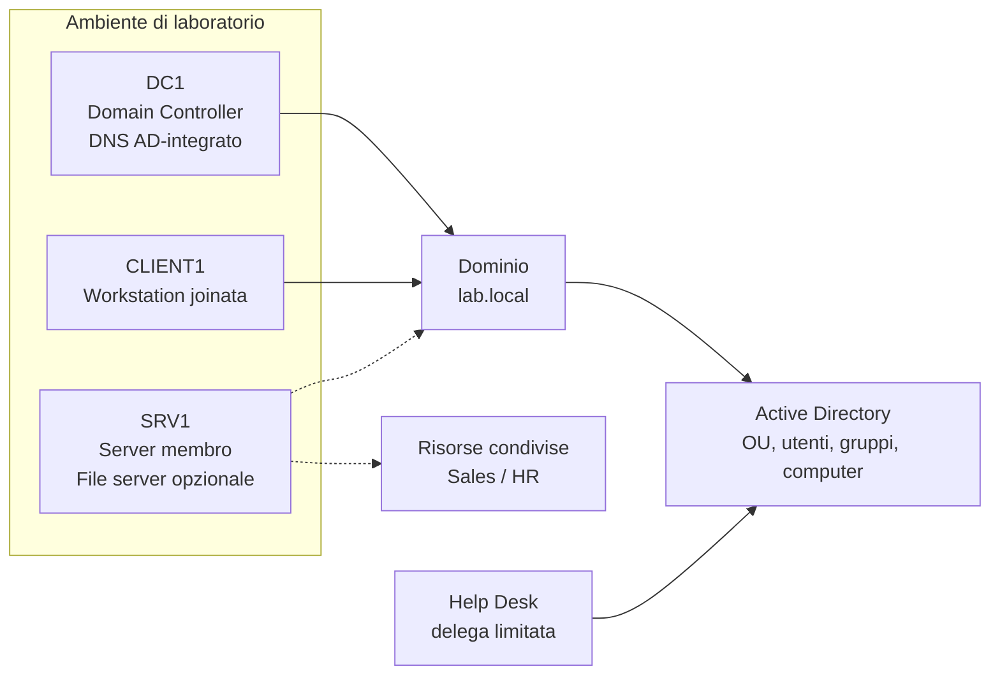
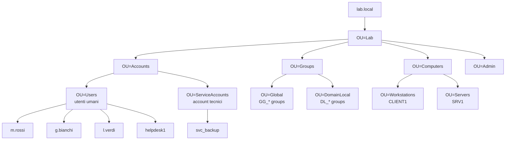
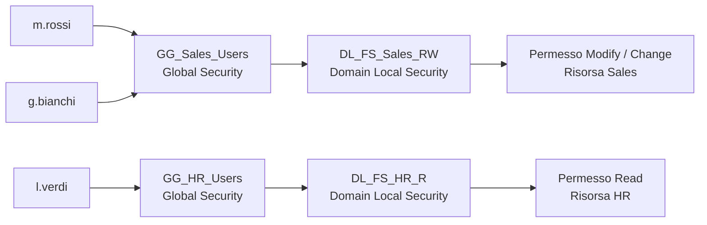
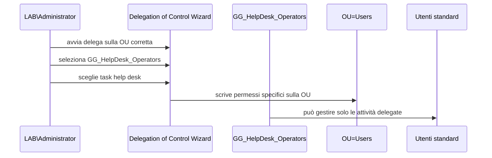
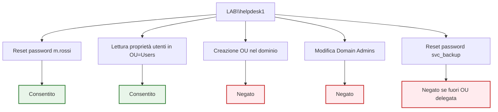

# Esercitazione AD DS - 4 ore - Versione non invasiva

## Caso d'uso realistico: riorganizzazione controllata di identità, gruppi e deleghe Help Desk nel dominio `lab.local`

---

# 1. Scenario aziendale

L'azienda **Northwind Services Italia** ha appena completato l'introduzione di Active Directory Domain Services per centralizzare la gestione di utenti, computer e accessi.

Il dominio `lab.local` è funzionante, ma la struttura attuale è ancora poco governata:

- alcuni utenti sono stati creati nel contenitore predefinito `Users`;
- alcuni computer sono rimasti nel contenitore predefinito `Computers`;
- i gruppi non seguono una convenzione chiara;
- l'help desk usa ancora credenziali amministrative troppo elevate per attività ordinarie;
- i permessi alle risorse rischiano di essere assegnati direttamente agli utenti.

La direzione IT vuole trasformare il dominio in una struttura più gestibile, sicura e adatta ai moduli successivi su **Group Policy**, **file server**, **permessi** e **troubleshooting**.

Il tuo compito è progettare e configurare una struttura ordinata basata su:

- Organizational Unit coerenti;
- utenti e account tecnici separati;
- gruppi globali e domain local;
- modello AGDLP;
- delega amministrativa limitata per l'help desk;
- verifiche positive e negative documentate.

Questa esercitazione non consiste nel creare oggetti a caso dentro Active Directory. Quello lo sa fare anche un wizard con troppa autostima. L'obiettivo è costruire un modello leggibile, verificabile e difendibile dal punto di vista amministrativo.

---

# 2. Durata e organizzazione delle 4 ore

| Fase | Durata indicativa | Attività principale |
|---|---:|---|
| 1 | 30 min | Analisi scenario, verifica ambiente e struttura esistente |
| 2 | 45 min | Creazione o correzione della struttura OU |
| 3 | 45 min | Creazione utenti, gruppi e membership |
| 4 | 40 min | Applicazione del modello AGDLP |
| 5 | 45 min | Delega amministrativa Help Desk |
| 6 | 25 min | Test positivi, test negativi e troubleshooting |
| 7 | 30 min | Raccolta evidenze e consegna finale |

Totale: **4 ore**.

---

# 3. Obiettivi operativi

Al termine dell'esercitazione dovrai essere in grado di:

- distinguere contenitori predefiniti e OU;
- progettare una struttura OU minima ma sostenibile;
- creare utenti e gruppi rispettando convenzioni di naming;
- usare correttamente gruppi **Global** e **Domain Local**;
- applicare il modello **AGDLP** a una risorsa simulata o reale;
- delegare attività help desk senza assegnare privilegi eccessivi;
- verificare con GUI e PowerShell il risultato ottenuto;
- documentare errori, correzioni e prove effettuate.

---

# 4. Prerequisiti

## 4.1 Macchine virtuali

Devono essere disponibili almeno:

- `DC1`: Domain Controller del dominio `lab.local`;
- `CLIENT1`: client Windows joinato al dominio;
- `SRV1`: server membro, consigliato per la prova sui permessi di condivisione.

Le VM `CLU1` e `CLU2`, se presenti, non sono necessarie.

## 4.2 Account

Per la configurazione iniziale usa:

```text
LAB\Administrator
```

Per i test userai anche:

```text
LAB\helpdesk1
LAB\m.rossi
LAB\l.verdi
LAB\g.bianchi
```

Se alcuni account non esistono ancora, dovrai crearli durante l'esercitazione.

## 4.3 Strumenti

Su `DC1` userai:

- Active Directory Users and Computers;
- PowerShell con modulo Active Directory;
- eventualmente Server Manager;
- eventualmente console di gestione con **Run as different user**.


## 4.4 Regole di sicurezza per non compromettere i laboratori successivi

Questa esercitazione deve essere eseguita in modalità **non distruttiva**.

Durante il laboratorio non devi:

- eliminare OU esistenti;
- rinominare OU esistenti;
- spostare oggetti già usati da altri laboratori senza verifica preventiva;
- modificare membership amministrative reali;
- assegnare deleghe sull'intero dominio;
- resettare password di account usati dai laboratori successivi, salvo indicazione esplicita del docente.

La regola operativa è semplice: **crea ciò che manca, verifica ciò che esiste, modifica solo ciò che è previsto dalla traccia**.

Prima di ogni spostamento di utenti o computer, raccogli l'evidenza dello stato iniziale:

```powershell
Get-ADUser -Filter * | Select-Object SamAccountName, DistinguishedName | Sort-Object SamAccountName
Get-ADComputer -Filter * | Select-Object Name, DistinguishedName | Sort-Object Name
```

Se l'ambiente è condiviso con altri laboratori, è consigliato eseguire uno snapshot/checkpoint delle VM prima dell'esercitazione. Non perché Active Directory sia fragile come cristallo, ma perché gli esseri umani con privilegi amministrativi sono una categoria a rischio.

---

# 5. Vista logica del laboratorio



*Figura 1 - Il dominio `lab.local` viene riorganizzato per separare identità, gruppi, computer, risorse e deleghe operative.*

---

# 6. Requisiti aziendali

Northwind Services Italia richiede la seguente organizzazione.

## 6.1 Struttura OU richiesta

```text
lab.local
└── OU=Lab
    ├── OU=Accounts
    │   ├── OU=Users
    │   └── OU=ServiceAccounts
    ├── OU=Groups
    │   ├── OU=Global
    │   └── OU=DomainLocal
    ├── OU=Computers
    │   ├── OU=Workstations
    │   └── OU=Servers
    └── OU=Admin
```

## 6.2 Utenti richiesti

| Utente | Nome completo | Reparto | OU |
|---|---|---|---|
| `m.rossi` | Mario Rossi | Sales | `OU=Users` |
| `g.bianchi` | Giulia Bianchi | Sales | `OU=Users` |
| `l.verdi` | Luca Verdi | HR | `OU=Users` |
| `helpdesk1` | Help Desk 1 | IT Support | `OU=Users` |
| `svc_backup` | Service Backup | Account tecnico | `OU=ServiceAccounts` |

## 6.3 Gruppi richiesti

| Gruppo | Scope | Type | Funzione |
|---|---|---|---|
| `GG_Sales_Users` | Global | Security | Utenti del reparto Sales |
| `GG_HR_Users` | Global | Security | Utenti del reparto HR |
| `GG_HelpDesk_Operators` | Global | Security | Operatori Help Desk |
| `DL_FS_Sales_RW` | Domain Local | Security | Permesso modifica su risorsa Sales |
| `DL_FS_HR_R` | Domain Local | Security | Permesso lettura su risorsa HR |

## 6.4 Membership richieste

| Membro | Gruppo di destinazione |
|---|---|
| `m.rossi` | `GG_Sales_Users` |
| `g.bianchi` | `GG_Sales_Users` |
| `l.verdi` | `GG_HR_Users` |
| `helpdesk1` | `GG_HelpDesk_Operators` |
| `GG_Sales_Users` | `DL_FS_Sales_RW` |
| `GG_HR_Users` | `DL_FS_HR_R` |

---

# 7. Schema della soluzione attesa



*Figura 2 - Struttura OU richiesta. La separazione tra utenti, account tecnici, gruppi e computer prepara il dominio a GPO, deleghe e permessi più ordinati.*

---

# 8. Fase 1 - Verifica iniziale dell'ambiente

Durata indicativa: **30 minuti**.

Accedi a `DC1` con `LAB\Administrator`.

Apri PowerShell come amministratore ed esegui:

```powershell
hostname
whoami
Get-ADDomain
Get-ADForest
```

Verifica che:

- il server sia `DC1`;
- l'utente sia un amministratore del dominio;
- il dominio sia `lab.local`;
- il modulo Active Directory risponda correttamente.

Verifica gli oggetti già presenti:

```powershell
Get-ADOrganizationalUnit -Filter * | Select-Object Name, DistinguishedName | Sort-Object Name
Get-ADUser -Filter * | Select-Object SamAccountName, DistinguishedName | Sort-Object SamAccountName
Get-ADGroup -Filter * | Select-Object Name, GroupScope, GroupCategory | Sort-Object Name
Get-ADComputer -Filter * | Select-Object Name, DistinguishedName | Sort-Object Name
```

Da `CLIENT1`, se acceso, verifica il collegamento al dominio:

```powershell
whoami
echo $env:LOGONSERVER
nslookup dc1.lab.local
```

## Evidenza richiesta

Nel report finale inserisci almeno:

- output di `Get-ADDomain`;
- output di `Get-ADUser` o `Get-ADComputer`;
- breve descrizione dello stato iniziale.

---

# 9. Fase 2 - Verifica e creazione non distruttiva della struttura OU

Durata indicativa: **45 minuti**.

## 9.1 Creazione solo delle OU mancanti con PowerShell

Su `DC1`, esegui. I comandi creano le OU solo se mancano e non eliminano né rinominano strutture già presenti:

```powershell
$baseDomain = "DC=lab,DC=local"
$baseLab = "OU=Lab,$baseDomain"

New-ADOrganizationalUnit -Name "Lab" -Path $baseDomain -ProtectedFromAccidentalDeletion $true -ErrorAction SilentlyContinue
New-ADOrganizationalUnit -Name "Accounts" -Path $baseLab -ProtectedFromAccidentalDeletion $true -ErrorAction SilentlyContinue
New-ADOrganizationalUnit -Name "Groups" -Path $baseLab -ProtectedFromAccidentalDeletion $true -ErrorAction SilentlyContinue
New-ADOrganizationalUnit -Name "Computers" -Path $baseLab -ProtectedFromAccidentalDeletion $true -ErrorAction SilentlyContinue
New-ADOrganizationalUnit -Name "Admin" -Path $baseLab -ProtectedFromAccidentalDeletion $true -ErrorAction SilentlyContinue

New-ADOrganizationalUnit -Name "Users" -Path "OU=Accounts,$baseLab" -ProtectedFromAccidentalDeletion $true -ErrorAction SilentlyContinue
New-ADOrganizationalUnit -Name "ServiceAccounts" -Path "OU=Accounts,$baseLab" -ProtectedFromAccidentalDeletion $true -ErrorAction SilentlyContinue

New-ADOrganizationalUnit -Name "Global" -Path "OU=Groups,$baseLab" -ProtectedFromAccidentalDeletion $true -ErrorAction SilentlyContinue
New-ADOrganizationalUnit -Name "DomainLocal" -Path "OU=Groups,$baseLab" -ProtectedFromAccidentalDeletion $true -ErrorAction SilentlyContinue

New-ADOrganizationalUnit -Name "Workstations" -Path "OU=Computers,$baseLab" -ProtectedFromAccidentalDeletion $true -ErrorAction SilentlyContinue
New-ADOrganizationalUnit -Name "Servers" -Path "OU=Computers,$baseLab" -ProtectedFromAccidentalDeletion $true -ErrorAction SilentlyContinue
```

Verifica:

```powershell
Get-ADOrganizationalUnit -Filter * -SearchBase "OU=Lab,DC=lab,DC=local" |
Select-Object Name, DistinguishedName |
Sort-Object DistinguishedName
```

## 9.2 Controllo da interfaccia grafica

Apri **Active Directory Users and Computers** e verifica graficamente la struttura.

Controlla che la struttura non sia stata creata accidentalmente due volte in punti diversi. Active Directory perdona molto meno di quanto faccia un docente paziente.

## Evidenza richiesta

Nel report finale inserisci:

- elenco OU presenti dopo la verifica;
- screenshot o output PowerShell della struttura;
- eventuali oggetti non conformi trovati;
- eventuali modifiche effettuate, specificando perché erano necessarie.

---

# 10. Fase 3 - Creazione o verifica utenti e gruppi

Durata indicativa: **45 minuti**.

## 10.1 Creazione utenti, solo se mancanti

Prima verifica se gli utenti esistono già:

```powershell
Get-ADUser -Filter * | Select-Object SamAccountName, DistinguishedName | Sort-Object SamAccountName
```

Se gli utenti esistono già, non ricrearli. Verifica soltanto posizione, stato e funzione.

Imposta una password iniziale comune solo per eventuali utenti da creare durante questa esercitazione:

```powershell
$pwd = ConvertTo-SecureString "P@ssw0rd!23" -AsPlainText -Force
```

Crea gli utenti standard:

```powershell
New-ADUser -Name "Mario Rossi" `
-SamAccountName "m.rossi" `
-UserPrincipalName "m.rossi@lab.local" `
-GivenName "Mario" `
-Surname "Rossi" `
-Path "OU=Users,OU=Accounts,OU=Lab,DC=lab,DC=local" `
-AccountPassword $pwd `
-Enabled $true `
-ChangePasswordAtLogon $false `
-ErrorAction SilentlyContinue

New-ADUser -Name "Giulia Bianchi" `
-SamAccountName "g.bianchi" `
-UserPrincipalName "g.bianchi@lab.local" `
-GivenName "Giulia" `
-Surname "Bianchi" `
-Path "OU=Users,OU=Accounts,OU=Lab,DC=lab,DC=local" `
-AccountPassword $pwd `
-Enabled $true `
-ChangePasswordAtLogon $false `
-ErrorAction SilentlyContinue

New-ADUser -Name "Luca Verdi" `
-SamAccountName "l.verdi" `
-UserPrincipalName "l.verdi@lab.local" `
-GivenName "Luca" `
-Surname "Verdi" `
-Path "OU=Users,OU=Accounts,OU=Lab,DC=lab,DC=local" `
-AccountPassword $pwd `
-Enabled $true `
-ChangePasswordAtLogon $false `
-ErrorAction SilentlyContinue

New-ADUser -Name "Help Desk 1" `
-SamAccountName "helpdesk1" `
-UserPrincipalName "helpdesk1@lab.local" `
-GivenName "Help" `
-Surname "Desk1" `
-Path "OU=Users,OU=Accounts,OU=Lab,DC=lab,DC=local" `
-AccountPassword $pwd `
-Enabled $true `
-ChangePasswordAtLogon $false `
-ErrorAction SilentlyContinue
```

Crea l'account tecnico:

```powershell
New-ADUser -Name "Service Backup" `
-SamAccountName "svc_backup" `
-UserPrincipalName "svc_backup@lab.local" `
-Path "OU=ServiceAccounts,OU=Accounts,OU=Lab,DC=lab,DC=local" `
-AccountPassword $pwd `
-Enabled $true `
-ChangePasswordAtLogon $false `
-ErrorAction SilentlyContinue
```

Verifica:

```powershell
Get-ADUser -Filter * -SearchBase "OU=Accounts,OU=Lab,DC=lab,DC=local" |
Select-Object Name, SamAccountName, Enabled, DistinguishedName |
Sort-Object SamAccountName
```

## 10.2 Creazione gruppi, solo se mancanti

Prima verifica se i gruppi esistono già:

```powershell
Get-ADGroup -Filter * | Select-Object Name, GroupScope, GroupCategory, DistinguishedName | Sort-Object Name
```

Se i gruppi esistono già con scope e type corretti, non ricrearli.

Crea i gruppi globali solo se mancanti:

```powershell
New-ADGroup -Name "GG_Sales_Users" `
-SamAccountName "GG_Sales_Users" `
-GroupScope Global `
-GroupCategory Security `
-Path "OU=Global,OU=Groups,OU=Lab,DC=lab,DC=local" `
-ErrorAction SilentlyContinue

New-ADGroup -Name "GG_HR_Users" `
-SamAccountName "GG_HR_Users" `
-GroupScope Global `
-GroupCategory Security `
-Path "OU=Global,OU=Groups,OU=Lab,DC=lab,DC=local" `
-ErrorAction SilentlyContinue

New-ADGroup -Name "GG_HelpDesk_Operators" `
-SamAccountName "GG_HelpDesk_Operators" `
-GroupScope Global `
-GroupCategory Security `
-Path "OU=Global,OU=Groups,OU=Lab,DC=lab,DC=local" `
-ErrorAction SilentlyContinue
```

Crea i gruppi domain local:

```powershell
New-ADGroup -Name "DL_FS_Sales_RW" `
-SamAccountName "DL_FS_Sales_RW" `
-GroupScope DomainLocal `
-GroupCategory Security `
-Path "OU=DomainLocal,OU=Groups,OU=Lab,DC=lab,DC=local" `
-ErrorAction SilentlyContinue

New-ADGroup -Name "DL_FS_HR_R" `
-SamAccountName "DL_FS_HR_R" `
-GroupScope DomainLocal `
-GroupCategory Security `
-Path "OU=DomainLocal,OU=Groups,OU=Lab,DC=lab,DC=local" `
-ErrorAction SilentlyContinue
```

Verifica:

```powershell
Get-ADGroup -Filter * -SearchBase "OU=Groups,OU=Lab,DC=lab,DC=local" |
Select-Object Name, GroupScope, GroupCategory, DistinguishedName |
Sort-Object Name
```

## Evidenza richiesta

Nel report finale inserisci:

- elenco utenti creati;
- elenco gruppi creati;
- indicazione di scope e type dei gruppi.

---

# 11. Fase 4 - Membership e modello AGDLP

Durata indicativa: **40 minuti**.

## 11.1 Schema AGDLP richiesto



*Figura 3 - Gli utenti entrano nei gruppi globali; i gruppi globali entrano nei gruppi domain local; i permessi si assegnano ai gruppi domain local.*

## 11.2 Aggiunta utenti ai gruppi globali

```powershell
Add-ADGroupMember -Identity "GG_Sales_Users" -Members "m.rossi","g.bianchi" -ErrorAction SilentlyContinue
Add-ADGroupMember -Identity "GG_HR_Users" -Members "l.verdi" -ErrorAction SilentlyContinue
Add-ADGroupMember -Identity "GG_HelpDesk_Operators" -Members "helpdesk1" -ErrorAction SilentlyContinue
```

Verifica:

```powershell
Get-ADGroupMember "GG_Sales_Users" | Select-Object Name, SamAccountName, objectClass
Get-ADGroupMember "GG_HR_Users" | Select-Object Name, SamAccountName, objectClass
Get-ADGroupMember "GG_HelpDesk_Operators" | Select-Object Name, SamAccountName, objectClass
```

## 11.3 Nidificazione AGDLP

```powershell
Add-ADGroupMember -Identity "DL_FS_Sales_RW" -Members "GG_Sales_Users" -ErrorAction SilentlyContinue
Add-ADGroupMember -Identity "DL_FS_HR_R" -Members "GG_HR_Users" -ErrorAction SilentlyContinue
```

Verifica:

```powershell
Get-ADGroupMember "DL_FS_Sales_RW" | Select-Object Name, objectClass
Get-ADGroupMember "DL_FS_HR_R" | Select-Object Name, objectClass
```

## 11.4 Verifica della posizione dei computer

Verifica la posizione di `CLIENT1`:

```powershell
Get-ADComputer CLIENT1 | Select-Object Name, DistinguishedName
```

Lo spostamento di `CLIENT1` nella OU `Workstations` è coerente con i laboratori successivi su GPO, perché le policy si collegano normalmente alle OU e non al container predefinito `Computers`. Tuttavia, prima di spostarlo devi verificare che nessuna traccia successiva richieda esplicitamente `CLIENT1` in `CN=Computers`.

Se la classe sta seguendo il percorso standard AD DS del corso e il docente conferma che `CLIENT1` deve essere amministrato tramite OU, spostalo:

```powershell
Move-ADObject `
-Identity (Get-ADComputer CLIENT1).DistinguishedName `
-TargetPath "OU=Workstations,OU=Computers,OU=Lab,DC=lab,DC=local"
```

Se `SRV1` è già joinato al dominio, verifica prima la posizione:

```powershell
Get-ADComputer SRV1 | Select-Object Name, DistinguishedName
```

Spostalo nella OU dei server solo se la traccia del corso usa la struttura standard:

```powershell
Move-ADObject `
-Identity (Get-ADComputer SRV1).DistinguishedName `
-TargetPath "OU=Servers,OU=Computers,OU=Lab,DC=lab,DC=local"
```

Se non hai certezza sullo stato dei laboratori successivi, non spostare i computer: documenta la posizione corrente e spiega quale sarebbe la posizione consigliata.

Verifica finale:

```powershell
Get-ADComputer -Filter * |
Select-Object Name, DistinguishedName |
Sort-Object Name
```

---

# 12. Fase 4B - Prova opzionale su risorsa file server

Questa fase è consigliata se `SRV1` è disponibile e joinato al dominio.

## 12.1 Creazione cartelle su `SRV1`

Su `SRV1`, apri PowerShell come amministratore:

```powershell
New-Item -Path "C:\Dati\Sales" -ItemType Directory -Force
New-Item -Path "C:\Dati\HR" -ItemType Directory -Force
```

## 12.2 Creazione condivisioni

```powershell
New-SmbShare -Name "ES4H_Sales" -Path "C:\Dati\Sales" -FullAccess "LAB\Administrator" -ErrorAction SilentlyContinue
New-SmbShare -Name "ES4H_HR" -Path "C:\Dati\HR" -FullAccess "LAB\Administrator" -ErrorAction SilentlyContinue
```

## 12.3 Assegnazione permessi share

```powershell
Grant-SmbShareAccess -Name "ES4H_Sales" -AccountName "LAB\DL_FS_Sales_RW" -AccessRight Change -Force
Grant-SmbShareAccess -Name "ES4H_HR" -AccountName "LAB\DL_FS_HR_R" -AccessRight Read -Force
```

## 12.4 Assegnazione permessi NTFS

```powershell
icacls "C:\Dati\Sales" /grant "LAB\DL_FS_Sales_RW:(OI)(CI)M"
icacls "C:\Dati\HR" /grant "LAB\DL_FS_HR_R:(OI)(CI)RX"
```

## 12.5 Test da `CLIENT1`

Accedi come `LAB\m.rossi` e prova:

```powershell
New-Item -Path "\\SRV1\ES4H_Sales\test_mrossi.txt" -ItemType File
```

Accedi come `LAB\l.verdi` e prova:

```powershell
Get-ChildItem "\\SRV1\ES4H_HR"
New-Item -Path "\\SRV1\ES4H_HR\test_lverdi.txt" -ItemType File
```

Risultato atteso:

- `m.rossi` deve poter scrivere nella risorsa Sales;
- `l.verdi` deve leggere la risorsa HR;
- `l.verdi` non dovrebbe poter scrivere nella risorsa HR se è stato assegnato solo il permesso Read.

---

# 13. Fase 5 - Delega amministrativa Help Desk

Durata indicativa: **45 minuti**.

## 13.1 Perimetro della delega

La delega deve essere applicata solo a:

```text
OU=Users,OU=Accounts,OU=Lab,DC=lab,DC=local
```

Non devi delegare sull'intero dominio.
Non devi delegare su `OU=Admin`.
Non devi delegare su `OU=ServiceAccounts`.

Qui la precisione conta. Delegare troppo in alto è il modo professionale di trasformare un piccolo errore in un futuro incidente.

## 13.2 Schema della delega



*Figura 4 - La delega viene assegnata al gruppo help desk sulla sola OU utenti. Il gruppo non diventa amministratore del dominio.*

## 13.3 Attività da delegare

Usando **Active Directory Users and Computers**:

1. fai clic destro sulla OU `Users`;
2. seleziona **Delegate Control...**;
3. aggiungi il gruppo `GG_HelpDesk_Operators`;
4. seleziona almeno:
   - **Reset user passwords and force password change at next logon**;
   - **Read all user information**.

Se il docente lo richiede, aggiungi anche una delega personalizzata limitata per aggiornare alcune proprietà descrittive degli utenti, ad esempio ufficio o numero telefonico. Non assegnare permessi generici eccessivi.

---

# 14. Fase 6 - Test positivi e negativi

Durata indicativa: **25 minuti**.

## 14.1 Riapertura della sessione Help Desk

Dopo aver aggiunto `helpdesk1` al gruppo, chiudi eventuali sessioni già aperte con quell'utente.

Accedi come `LAB\helpdesk1` oppure apri ADUC con credenziali differenti:

```powershell
runas /user:LAB\helpdesk1 "mmc %SystemRoot%\system32\dsa.msc"
```

## 14.2 Test positivo: reset password

Con `helpdesk1`, prova a resettare la password di un utente standard della OU delegata. Per non alterare account eventualmente usati dai laboratori successivi, usa preferibilmente un account di test dedicato. Se il corso usa `m.rossi` come utente standard di prova, annota la password precedente attesa dalla traccia e ripristinala al termine del test.

Utente consigliato per il test:

```text
m.rossi
```

Imposta una password temporanea, ad esempio:

```text
P@ssw0rd!24
```

Seleziona anche l'opzione di cambio password al prossimo accesso, se richiesta.

Risultato atteso:

- l'operazione deve riuscire;
- `m.rossi` deve poter accedere con la nuova password;
- se il flag è stato impostato, deve comparire la richiesta di cambio password.

## 14.3 Test negativo: creazione OU

Sempre come `helpdesk1`, prova a creare una nuova OU sotto il dominio `lab.local`.

Risultato atteso:

- l'operazione deve fallire;
- `helpdesk1` non deve avere privilegi amministrativi sul dominio.

## 14.4 Test negativo: modifica gruppi privilegiati

Sempre come `helpdesk1`, prova ad aggiungere `m.rossi` al gruppo:

```text
Domain Admins
```

Risultato atteso:

- l'operazione deve fallire;
- il gruppo Help Desk non deve poter modificare gruppi privilegiati.

## 14.5 Test negativo: account fuori perimetro

Se `svc_backup` si trova in `OU=ServiceAccounts`, prova a modificare la password di `svc_backup` con `helpdesk1`. Non rendere permanente alcuna modifica su questo account tecnico: serve solo a dimostrare il limite della delega.

Risultato atteso:

- l'operazione non deve riuscire se la delega è stata applicata solo alla OU `Users`;
- questo dimostra che la delega è circoscritta al perimetro corretto.

## 14.6 Matrice di verifica



*Figura 5 - Una delega corretta deve consentire le attività previste e bloccare quelle fuori perimetro.*

---

# 15. Troubleshooting guidato

## 15.1 La password non può essere resettata da `helpdesk1`

Controlla:

```powershell
Get-ADGroupMember "GG_HelpDesk_Operators"
Get-ADPrincipalGroupMembership "helpdesk1" | Select-Object Name
Get-ADUser "m.rossi" | Select-Object DistinguishedName
```

Cause probabili:

- `helpdesk1` non è nel gruppo corretto;
- il wizard è stato applicato alla OU sbagliata;
- `m.rossi` non si trova nella OU delegata;
- la console è rimasta aperta prima dell'aggiornamento del token di sicurezza.

Correzione:

- correggi membership o posizione dell'utente;
- chiudi e riapri la sessione di `helpdesk1`;
- ripeti il test.

## 15.2 `helpdesk1` riesce a fare troppo

Controlla:

```powershell
Get-ADPrincipalGroupMembership "helpdesk1" | Select-Object Name | Sort-Object Name
```

Cause probabili:

- `helpdesk1` è membro di gruppi amministrativi non previsti;
- stai usando una console aperta con `LAB\Administrator`;
- hai delegato su un contenitore troppo alto.

Correzione:

- rimuovi membership eccessive;
- usa una sessione pulita;
- riprogetta la delega sulla OU corretta.

## 15.3 Gli utenti sono nella OU sbagliata

Verifica:

```powershell
Get-ADUser -Filter * |
Select-Object SamAccountName, DistinguishedName |
Sort-Object SamAccountName
```

Se un utente si trova in `CN=Users`, spostalo nella OU corretta:

```powershell
Move-ADObject `
-Identity (Get-ADUser m.rossi).DistinguishedName `
-TargetPath "OU=Users,OU=Accounts,OU=Lab,DC=lab,DC=local"
```

---

# 16. Evidenze richieste

Durata indicativa: **30 minuti**.

Crea il file:

```text
docs/evidence_esercitazione_ad_deleghe_4h.md
```

Se la cartella non esiste:

```powershell
mkdir docs -ErrorAction SilentlyContinue
notepad docs\evidence_esercitazione_ad_deleghe_4h.md
```

Il file deve contenere le seguenti sezioni.

```md
# Evidence - Esercitazione AD DS 4h

## 1. Stato iniziale del dominio
Descrivo come si presentava il dominio prima dell'intervento.

## 2. Struttura OU finale
Incollo output o screenshot della struttura OU.

## 3. Utenti creati o corretti
Indico utenti, OU di appartenenza e funzione.

## 4. Gruppi creati
Indico nome gruppo, scope, type e scopo operativo.

## 5. Membership configurate
Descrivo utenti nei gruppi globali e gruppi globali nei domain local.

## 6. Applicazione AGDLP
Spiego come è stato applicato il modello Accounts -> Global -> Domain Local -> Permissions.

## 7. Delega Help Desk
Indico gruppo delegato, OU delegata e attività concesse.

## 8. Test positivi
Descrivo almeno due operazioni riuscite.

## 9. Test negativi
Descrivo almeno due operazioni correttamente negate.

## 10. Troubleshooting
Descrivo eventuali errori incontrati e correzioni applicate.

## 11. Conclusione tecnica
Spiego perché questa configurazione è più sicura e amministrabile rispetto all'uso diretto di Administrator o Domain Admins.
```

---

# 17. Checklist finale

Prima della consegna verifica che siano vere tutte le condizioni seguenti.

## 17.1 Struttura AD

- `OU=Lab` esiste sotto `lab.local`;
- `OU=Accounts`, `OU=Groups`, `OU=Computers`, `OU=Admin` esistono sotto `OU=Lab`;
- `OU=Users` e `OU=ServiceAccounts` sono sotto `OU=Accounts`;
- `OU=Global` e `OU=DomainLocal` sono sotto `OU=Groups`;
- `OU=Workstations` e `OU=Servers` sono sotto `OU=Computers`.

## 17.2 Utenti

- `m.rossi` esiste ed è abilitato;
- `g.bianchi` esiste ed è abilitato;
- `l.verdi` esiste ed è abilitato;
- `helpdesk1` esiste ed è abilitato;
- `svc_backup` è separato dagli utenti standard.

## 17.3 Gruppi

- `GG_Sales_Users` è Global Security;
- `GG_HR_Users` è Global Security;
- `GG_HelpDesk_Operators` è Global Security;
- `DL_FS_Sales_RW` è Domain Local Security;
- `DL_FS_HR_R` è Domain Local Security.

## 17.4 Deleghe

- la delega è assegnata a `GG_HelpDesk_Operators`;
- la delega è applicata alla sola OU `Users`;
- `helpdesk1` può resettare password degli utenti standard;
- `helpdesk1` non può modificare `Domain Admins`;
- `helpdesk1` non può amministrare tutto il dominio.

---

# 18. Comandi di verifica finale

Esegui questi comandi e usa gli output nel report.

```powershell
Get-ADOrganizationalUnit -Filter * -SearchBase "OU=Lab,DC=lab,DC=local" |
Select-Object Name, DistinguishedName |
Sort-Object DistinguishedName
```

```powershell
Get-ADUser -Filter * -SearchBase "OU=Accounts,OU=Lab,DC=lab,DC=local" |
Select-Object Name, SamAccountName, Enabled, DistinguishedName |
Sort-Object SamAccountName
```

```powershell
Get-ADGroup -Filter * -SearchBase "OU=Groups,OU=Lab,DC=lab,DC=local" |
Select-Object Name, GroupScope, GroupCategory |
Sort-Object Name
```

```powershell
Get-ADGroupMember "GG_Sales_Users" | Select-Object Name, SamAccountName, objectClass
Get-ADGroupMember "DL_FS_Sales_RW" | Select-Object Name, objectClass
```

```powershell
Get-ADPrincipalGroupMembership "helpdesk1" |
Select-Object Name |
Sort-Object Name
```

```powershell
Get-ADComputer -Filter * |
Select-Object Name, DistinguishedName |
Sort-Object Name
```

---

# 19. Domande finali

Rispondi nel report.

1. Perché non è corretto assegnare permessi direttamente agli utenti sulle risorse?
2. Quale vantaggio offre il modello AGDLP rispetto a una gestione diretta dei permessi?
3. Perché `GG_Sales_Users` è un gruppo globale mentre `DL_FS_Sales_RW` è domain local?
4. Perché la delega Help Desk è stata applicata alla OU `Users` e non al dominio?
5. Quali rischi si avrebbero aggiungendo `helpdesk1` a `Domain Admins`?
6. Che cosa succede se un utente da gestire non si trova nella OU delegata?
7. Quale test dimostra meglio che la delega è corretta anche nei suoi limiti?

---


# 20. Ripristino consigliato al termine dell'esercitazione

Se hai modificato password o spostato oggetti per esigenze di test, documenta l'intervento e ripristina lo stato atteso dal corso.

Controlli minimi:

```powershell
Get-ADUser -Filter * | Select-Object SamAccountName, DistinguishedName | Sort-Object SamAccountName
Get-ADComputer -Filter * | Select-Object Name, DistinguishedName | Sort-Object Name
Get-ADPrincipalGroupMembership "helpdesk1" | Select-Object Name | Sort-Object Name
```

Se hai creato condivisioni opzionali su `SRV1`, usa nomi dedicati all'esercitazione, ad esempio `ES4H_Sales` ed `ES4H_HR`, per non interferire con eventuali laboratori successivi sul file server.

---

# 21. Consegna finale


Al termine dell'esercitazione devi consegnare:

- struttura OU configurata;
- utenti e gruppi creati o verificati;
- membership configurate e documentate;
- modello AGDLP applicato;
- delega Help Desk configurata;
- almeno due test positivi documentati;
- almeno due test negativi documentati;
- file `docs/evidence_esercitazione_ad_deleghe_4h.md` completo.

Se stai usando un repository Git:

```bash
git add .
git commit -m "Esercitazione AD DS 4h - OU gruppi AGDLP e deleghe"
git push
```

---

# 21. Criteri di valutazione

| Area | Peso | Criterio |
|---|---:|---|
| Struttura OU | 20% | Coerenza, posizione corretta degli oggetti, assenza di duplicazioni inutili |
| Utenti e gruppi | 20% | Naming, scope, type, membership corrette |
| AGDLP | 20% | Separazione tra account, gruppi globali, gruppi domain local e permessi |
| Delega Help Desk | 20% | Perimetro corretto, principio del privilegio minimo, test con account non amministrativo |
| Evidenze | 20% | Output tecnici, test positivi e negativi, spiegazioni chiare |

---

# 22. Conclusione

Con questa esercitazione hai simulato una situazione molto comune: un dominio tecnicamente funzionante ma ancora poco governato.

Il risultato atteso non è solo avere più oggetti in Active Directory. Quello sarebbe collezionismo digitale, e purtroppo non dà punti in sicurezza.

Il risultato corretto è un dominio in cui:

- gli oggetti sono collocati in OU coerenti;
- i gruppi rappresentano ruoli e accessi;
- i permessi non vengono assegnati direttamente agli utenti;
- l'help desk lavora con privilegi limitati;
- i test dimostrano sia ciò che è consentito sia ciò che è negato.

Da qui in avanti il dominio è pronto per attività più avanzate su Group Policy, file server, hardening e troubleshooting.
