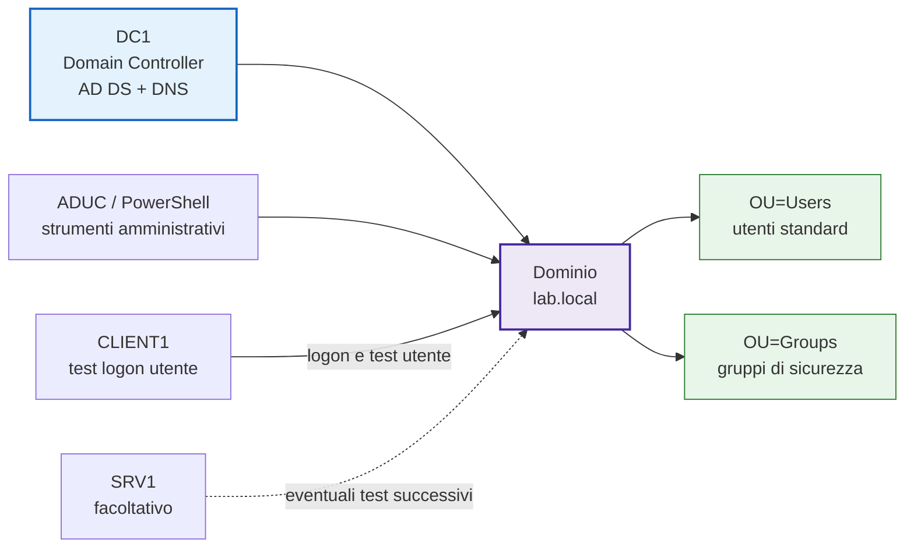
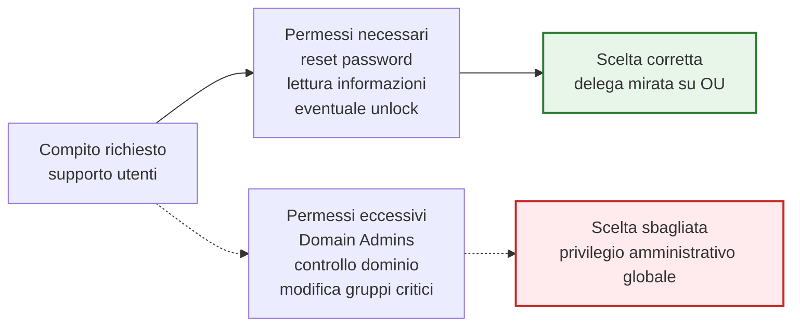
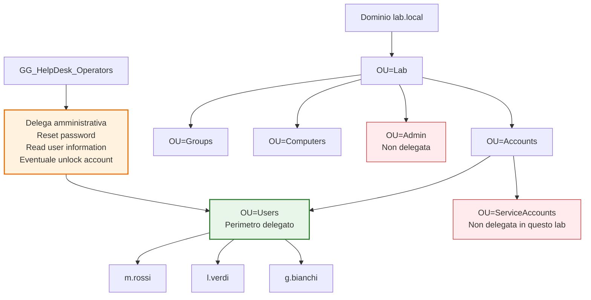
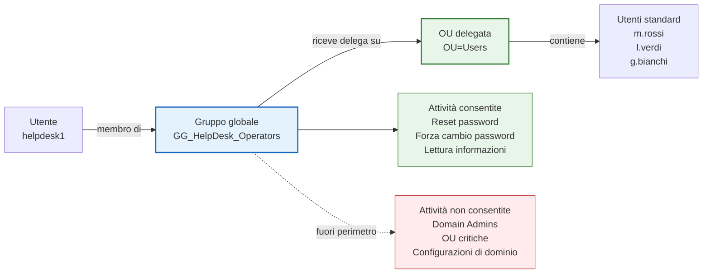
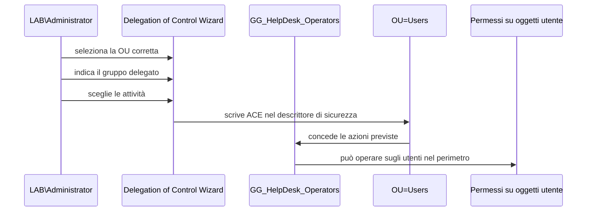
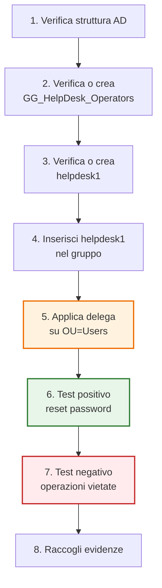
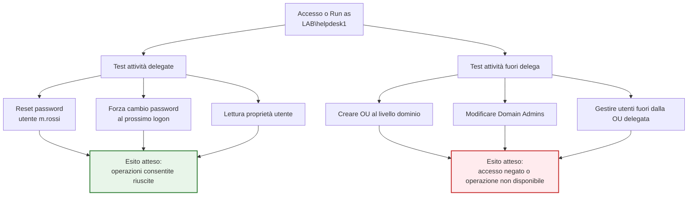
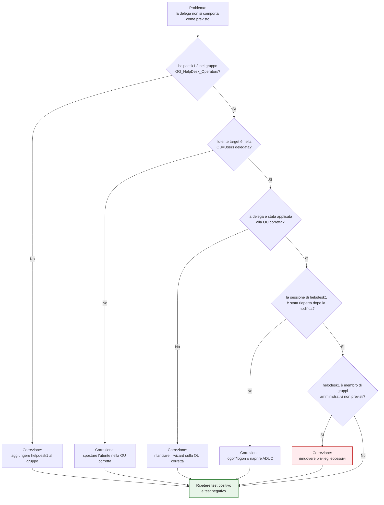

# ADDS_LAB05 - Deleghe amministrative

## Dal dominio amministrato tutto da Administrator a un modello operativo con privilegio minimo

---

# 1. Obiettivo del laboratorio

In questo laboratorio configurerai una delega amministrativa realistica in Active Directory, partendo da uno scenario tipico di help desk di primo livello.

L'obiettivo non è dare “un po' di privilegi” a un utente tecnico, ma capire come delegare **solo** le attività necessarie senza trasformare ogni operatore in un amministratore di dominio.

Al termine del laboratorio dovrai essere in grado di:

- spiegare il principio del **privilegio minimo**
- distinguere tra amministrazione completa del dominio e **deleghe mirate** su una OU
- creare un gruppo di delega per operatori help desk
- usare il **Delegation of Control Wizard** in modo consapevole
- delegare attività tipiche come:
  - reset password
  - sblocco account
  - lettura e scrittura di alcune proprietà utente
- verificare il comportamento della delega con un account non amministrativo
- descrivere i limiti di una delega e i casi in cui **non** sostituisce privilegi più elevati

---

# 2. Scopo del laboratorio

Nelle aziende reali, quasi mai è corretto usare sempre l'account `Administrator` o aggiungere tecnici al gruppo `Domain Admins` per ogni attività.

Se fai così:

- allarghi inutilmente la superficie di rischio
- perdi tracciabilità delle responsabilità
- rendi la sicurezza fragile
- abitui le persone a lavorare con privilegi eccessivi

Questo laboratorio serve quindi a introdurre un modello più credibile:

- gli amministratori di dominio restano pochi
- l'help desk riceve solo i permessi necessari
- le OU diventano il perimetro naturale su cui applicare la delega
- le attività ricorrenti vengono separate da quelle ad alta criticità

Questo modulo prepara direttamente i successivi:

- **GPO**: perché una buona struttura OU è il presupposto per amministrare bene
- **file server e permessi**: perché separa identità, deleghe e autorizzazioni
- **troubleshooting**: perché aiuta a capire se un problema deriva da mancanza di privilegi, OU sbagliata o gruppo errato

---

# 3. Architettura del laboratorio

## 3.1 VM da tenere accese

- `DC1`
- `CLIENT1`
- `SRV1` facoltativa

## 3.2 VM da tenere spente

- `CLU1`
- `CLU2`

## 3.3 Prerequisiti

Si assume che siano già completati:

- **LAB00** setup ambiente
- **LAB01** architettura AD DS
- **LAB02** installazione AD DS
- **LAB03** join del client al dominio
- **LAB04** progettazione OU, utenti e gruppi

## 3.4 Struttura AD attesa in partenza

Idealmente il dominio `lab.local` dovrebbe già contenere almeno una struttura simile:

```text
OU=Lab
  OU=Accounts
    OU=Users
    OU=ServiceAccounts
  OU=Groups
    OU=Global
    OU=DomainLocal
  OU=Computers
    OU=Workstations
    OU=Servers
  OU=Admin
```

E alcuni utenti come:

- `m.rossi`
- `l.verdi`
- `g.bianchi`
- `helpdesk1`

Se i nomi sono diversi, adatta i passaggi mantenendo la stessa logica.

## 3.5 Schema logico del laboratorio



*Figura 0 - Vista logica del LAB05: la delega viene progettata su AD DS e verificata con un account non amministrativo.*

---

# Parte 1 - Concetti operativi

# 4. Perché la delega amministrativa è necessaria

In un piccolo lab è comodo fare tutto con `Administrator`.
Nel mondo reale è spesso una pessima idea.

## 4.1 Problemi dell'uso indiscriminato di privilegi elevati

Se ogni tecnico ha privilegi di dominio:

- può modificare troppo
- può cancellare o alterare oggetti critici
- può introdurre errori non necessari
- può operare fuori dal suo perimetro
- rende difficile stabilire chi doveva fare cosa

## 4.2 Vantaggi di una delega corretta

Una delega ben progettata:

- riduce i privilegi al minimo necessario
- separa compiti operativi da compiti architetturali
- aiuta il controllo degli accessi
- riduce il danno di errori accidentali
- rende più leggibile il modello amministrativo

---

# 5. Che cos'è il principio del privilegio minimo

Il **privilegio minimo** significa assegnare a un utente o gruppo soltanto i permessi necessari per svolgere il proprio compito, e non di più.

## 5.1 Esempio corretto

L'help desk deve:

- reimpostare password
- sbloccare account
- aggiornare alcuni dati utente

In questo caso è sensato delegare **solo** queste attività sulla OU degli utenti.

## 5.2 Esempio scorretto

L'help desk viene aggiunto a:

- `Domain Admins`
- `Account Operators`

solo per comodità.

Questo approccio è comodo per cinque minuti e dannoso per anni.

## 5.3 Schema del privilegio minimo



*Schema - Il privilegio deve seguire il compito. Se il compito è limitato, anche il permesso deve essere limitato.*

---

# 6. Dove si applica la delega in Active Directory

La delega non si applica genericamente “al dominio” come idea astratta.

Di solito si applica a:

- una **OU specifica**
- una porzione controllata della directory
- un gruppo di oggetti omogenei

Nel nostro laboratorio useremo come perimetro principale la OU degli utenti, ad esempio:

```text
OU=Users,OU=Accounts,OU=Lab,DC=lab,DC=local
```

Questo è importante perché:

- evita di delegare troppo in alto
- rende chiaro dove l'help desk può operare
- impedisce di toccare aree che non competono al supporto di primo livello



*Figura 1 - La delega viene applicata alla sola `OU=Users`: l'help desk opera sugli utenti standard, non sull'intero dominio né sulle OU amministrative.*


---

# 7. Delega a utenti o a gruppi?

La regola sana è: **delega ai gruppi, non ai singoli utenti**.

## 7.1 Perché usare un gruppo di delega

Se deleghi direttamente a un utente:

- il modello è meno leggibile
- il ricambio del personale è più scomodo
- il troubleshooting è meno immediato

Se invece deleghi a un gruppo, ad esempio:

- `GG_HelpDesk_Operators`

puoi poi aggiungere o rimuovere persone dal gruppo senza dover ridisegnare la delega.

## 7.2 Strategia usata nel laboratorio

Nel lab useremo:

- un gruppo globale per rappresentare gli operatori help desk
- un account utente membro del gruppo
- una delega applicata alla OU utenti



*Figura 2 - La delega non viene assegnata direttamente a `helpdesk1`, ma al gruppo `GG_HelpDesk_Operators`. L'utente eredita le capacità operative tramite appartenenza al gruppo.*


---

# 8. Il Delegation of Control Wizard

Active Directory Users and Computers include un wizard che consente di delegare alcune attività comuni.

## 8.1 Cosa fa bene

Il wizard è utile per:

- operazioni standard e ricorrenti
- scenari didattici comprensibili
- configurazioni iniziali semplici

## 8.2 Cosa non sostituisce

Il wizard non sostituisce la comprensione del modello di autorizzazione.

Devi sempre sapere:

- **a chi** stai delegando
- **su quale contenitore** stai delegando
- **quali attività** stai concedendo
- **quali attività restano escluse**

## 8.3 Cosa produce il wizard



*Schema - Il wizard non “rende amministratore” il gruppo: scrive permessi specifici sulla OU selezionata. Piccolo dettaglio, enorme differenza.*

---

# 9. Scenario del laboratorio

Useremo uno scenario realistico e limitato.

## 9.1 Reparto Help Desk di primo livello

Il gruppo help desk deve poter:

- resettare la password agli utenti standard
- forzare il cambio password al prossimo accesso
- sbloccare un account bloccato
- aggiornare alcuni dati di contatto se richiesto

## 9.2 Cosa non deve poter fare

Il gruppo help desk **non** deve poter:

- promuovere server a DC
- modificare deleghe di dominio
- creare o eliminare OU critiche
- amministrare gruppi ad alto privilegio
- aggiungere utenti a `Domain Admins`
- gestire l'intera foresta

---

# 10. Limiti della delega

Questa parte va capita bene, altrimenti il laboratorio sembra magia invece di essere amministrazione.

Una delega su OU:

- non rende l'utente un amministratore di dominio
- non consente attività fuori dal perimetro della OU
- non sostituisce i privilegi richiesti da ruoli sensibili
- non elimina il bisogno di progettare bene la struttura OU

In altre parole: la delega è potente, ma è **circoscritta**.

## 10.1 Sequenza operativa del laboratorio



*Schema - Il laboratorio non termina quando il wizard finisce: termina quando hai dimostrato sia ciò che la delega consente sia ciò che blocca.*

---

# Parte 2 - Step-by-step guidato

# 11. Verifica iniziale della struttura AD

Accedi a `DC1` con:

- `LAB\Administrator`

Apri **Active Directory Users and Computers**.

Verifica che esistano:

- la OU utenti
- la OU gruppi
- almeno un account help desk
- almeno un paio di utenti standard su cui fare i test

Se vuoi verificare via PowerShell:

```powershell
Get-ADOrganizationalUnit -Filter * | Select Name, DistinguishedName
Get-ADUser -Filter * | Select Name, SamAccountName
Get-ADGroup -Filter * | Select Name, GroupScope
```

---

# 12. Creazione o verifica del gruppo di delega

Se non esiste già, crea un gruppo globale per gli operatori help desk.

## 12.1 Da GUI

Percorso consigliato:

- `OU=Global,OU=Groups,OU=Lab,DC=lab,DC=local`

Crea il gruppo:

- **Name**: `GG_HelpDesk_Operators`
- **Group scope**: `Global`
- **Group type**: `Security`

## 12.2 Da PowerShell

```powershell
New-ADGroup `
  -Name "GG_HelpDesk_Operators" `
  -SamAccountName "GG_HelpDesk_Operators" `
  -GroupScope Global `
  -GroupCategory Security `
  -Path "OU=Global,OU=Groups,OU=Lab,DC=lab,DC=local"
```

---

# 13. Creazione o verifica dell'utente help desk

Se non esiste già, crea un utente dedicato, ad esempio:

- `helpdesk1`

## 13.1 Da GUI

Posizione consigliata:

- `OU=Users,OU=Accounts,OU=Lab,DC=lab,DC=local`

Dati esempio:

- First name: `Help`
- Last name: `Desk1`
- User logon name: `helpdesk1`

## 13.2 Da PowerShell

```powershell
$pwd = ConvertTo-SecureString "P@ssw0rd!23" -AsPlainText -Force

New-ADUser `
  -Name "Help Desk1" `
  -GivenName "Help" `
  -Surname "Desk1" `
  -SamAccountName "helpdesk1" `
  -UserPrincipalName "helpdesk1@lab.local" `
  -AccountPassword $pwd `
  -Enabled $true `
  -ChangePasswordAtLogon $false `
  -Path "OU=Users,OU=Accounts,OU=Lab,DC=lab,DC=local"
```

> Se l'utente esiste già, non ricrearlo: verifica soltanto posizione e appartenenze.

---

# 14. Inserimento dell'utente nel gruppo di delega

Aggiungi `helpdesk1` al gruppo `GG_HelpDesk_Operators`.

## 14.1 Da GUI

Apri il gruppo e aggiungi il membro.

## 14.2 Da PowerShell

```powershell
Add-ADGroupMember -Identity "GG_HelpDesk_Operators" -Members "helpdesk1"
```

Verifica:

```powershell
Get-ADGroupMember "GG_HelpDesk_Operators"
Get-ADPrincipalGroupMembership "helpdesk1"
```

---

# 15. Preparazione dell'OU su cui delegare

Per questo lab delega sui soli utenti standard.

OU consigliata:

```text
OU=Users,OU=Accounts,OU=Lab,DC=lab,DC=local
```

Verifica che contenga alcuni utenti di test, ad esempio:

- `m.rossi`
- `l.verdi`
- `g.bianchi`

Se hai utenti distribuiti male, spostali nella OU corretta prima di delegare.

Puoi verificare così:

```powershell
Get-ADUser -Filter * -SearchBase "OU=Users,OU=Accounts,OU=Lab,DC=lab,DC=local" | Select Name, SamAccountName
```

---

# 16. Delega con il Delegation of Control Wizard

## 16.1 Apertura del wizard

In **Active Directory Users and Computers**:

1. fai clic destro sulla OU degli utenti
2. seleziona **Delegate Control...**
3. avvia il wizard

## 16.2 Selezione del gruppo delegato

Aggiungi:

- `GG_HelpDesk_Operators`

## 16.3 Attività da delegare

Nel laboratorio userai almeno queste attività standard:

- **Reset user passwords and force password change at next logon**
- **Read all user information**

Se disponibile nel tuo percorso operativo, aggiungi anche una delega personalizzata su proprietà utente limitate.

> Nota: in alcune versioni e combinazioni di wizard, lo sblocco account può non apparire come voce esplicita semplice. In tal caso verrà trattato come verifica pratica e discussione sui permessi effettivi applicati.

---

# 17. Verifica della delega dall'interfaccia amministrativa

Dopo il wizard, resta connesso come amministratore e controlla:

- che il gruppo selezionato sia corretto
- che la OU interessata sia solo quella prevista
- che non siano stati scelti oggetti o task sbagliati

A questo punto non basta fidarsi del wizard: serve la prova pratica.

---

# 18. Preparazione di un account utente di test

Per verificare la delega, usa un utente standard, ad esempio:

- `m.rossi`

Se vuoi simulare un problema di login, puoi anche:

- impostare una password nota
- eseguire tentativi errati da `CLIENT1`
- generare il blocco account se hai già una policy di lockout attiva

Se la policy di lockout non è ancora configurata nei moduli successivi, puoi comunque testare almeno il reset password e il flag di cambio password.

---

# 19. Test del reset password con account help desk

## 19.1 Accesso come help desk

Su `DC1` o su una console con strumenti RSAT, esegui accesso come:

- `LAB\helpdesk1`

Oppure usa **Run as different user** per aprire ADUC con quell'identità.

## 19.2 Operazione attesa

L'operatore help desk deve poter:

- aprire le proprietà dell'utente `m.rossi`
- scegliere **Reset Password**
- impostare una password nuova
- forzare il cambio password al prossimo accesso

## 19.3 Verifica funzionale

Poi su `CLIENT1` prova ad accedere con l'utente interessato.

Output atteso:

- login possibile con la nuova password
- richiesta di cambio password se il flag è attivo

---

# 20. Test dello sblocco account

Questa parte dipende da come è stato configurato il tuo ambiente.

## 20.1 Se hai già una lockout policy attiva

1. da `CLIENT1` inserisci più volte una password errata per l'utente di test
2. genera il blocco account
3. apri ADUC con `helpdesk1`
4. verifica se puoi eseguire lo sblocco account

## 20.2 Se non hai ancora la lockout policy

Simula comunque il ragionamento:

- identifica dove comparirebbe il blocco account
- mostra le proprietà dell'utente
- discuti quali operazioni il tecnico può o non può fare

## 20.3 Obiettivo didattico

L'importante qui non è forzare il caso in modo artificiale, ma capire che:

- il reset password è una delega comune
- lo sblocco account è un'operazione tipica dell'help desk
- va verificata nel perimetro giusto e con account non amministrativo

---

# 21. Test delle limitazioni della delega

Adesso arriva la parte importante: verificare che la delega **non** permetta tutto.

Con l'account `helpdesk1` prova, ad esempio, a:

- creare una nuova OU sotto il dominio
- modificare gruppi privilegiati
- creare o eliminare utenti fuori dalla OU delegata
- aggiungere un utente a `Domain Admins`
- modificare configurazioni di dominio

Risultato atteso:

- l'operazione deve fallire o risultare non consentita

Questa parte è essenziale, perché una delega è corretta anche per ciò che **nega**, non solo per ciò che consente.



*Figura 3 - La delega va verificata in entrambe le direzioni: deve permettere le attività previste e deve impedire quelle fuori perimetro.*


---

# 22. Verifica con PowerShell e osservazione dei gruppi

Puoi raccogliere verifiche con:

```powershell
Get-ADGroupMember "GG_HelpDesk_Operators"
Get-ADPrincipalGroupMembership "helpdesk1"
Get-ADUser -Identity "m.rossi" -Properties LockedOut, PasswordExpired, PasswordLastSet
```

Per osservare la posizione dell'utente e l'ambito:

```powershell
Get-ADUser -Filter * -SearchBase "OU=Users,OU=Accounts,OU=Lab,DC=lab,DC=local" | Select Name, DistinguishedName
```

---

# 23. Discussione guidata: delega, sicurezza e responsabilità

Rispondi nel report alle seguenti domande:

1. Perché non abbiamo aggiunto `helpdesk1` a `Domain Admins`?
2. Perché la delega è stata applicata a una OU e non all'intero dominio?
3. Quali attività help desk risultano realistiche da delegare?
4. Quali attività restano correttamente escluse?
5. Che cosa succede se gli utenti sono distribuiti in OU sbagliate?

---

# 24. Troubleshooting



*Schema - Quando una delega non funziona, quasi sempre il problema è gruppo, OU, perimetro o sessione. La fantasia umana riesce comunque ad aggiungere varianti, naturalmente.*

## 24.1 L'utente help desk non riesce a fare reset password

Controlla:

- che l'utente sia davvero membro di `GG_HelpDesk_Operators`
- che il wizard sia stato lanciato sulla OU corretta
- che l'utente di test si trovi nella OU delegata
- che tu non stia testando fuori perimetro

Verifiche utili:

```powershell
Get-ADGroupMember "GG_HelpDesk_Operators"
Get-ADUser m.rossi | Select DistinguishedName
```

## 24.2 L'utente help desk riesce a fare troppo

Controlla:

- se è membro di gruppi amministrativi più ampi
- se stai testando con una sessione già aperta come admin
- se hai usato l'account sbagliato durante la verifica

Verifica gruppi:

```powershell
Get-ADPrincipalGroupMembership "helpdesk1" | Select Name
```

## 24.3 La delega sembra corretta ma non funziona subito

Possibili cause:

- console aperta prima della modifica del gruppo
- token di sicurezza non aggiornato
- sessione non riaperta

Soluzione pratica:

- esegui logoff/logon dell'utente help desk
- riapri ADUC con l'account corretto

## 24.4 Gli utenti di test sono nel container sbagliato

Se gli utenti sono ancora in `CN=Users`, la delega su una OU non si applicherà come previsto.

Correzione:

- sposta gli utenti nella OU utenti corretta
- ripeti il test

---

# 25. Evidenze richieste

Crea il file:

```text
docs/evidence_lab05.md
```

Usa questa struttura:

```md
# Evidence LAB05

## 1. Principio del privilegio minimo
Spiego con parole mie perché questo principio è importante in AD DS.

## 2. Gruppo delegato
Indico nome, scope, tipo e membri del gruppo usato per la delega.

## 3. OU di delega
Indico su quale OU ho applicato la delega e perché.

## 4. Attività delegate
Descrivo quali attività sono state delegate con il wizard.

## 5. Test reset password
Descrivo il test eseguito e l'esito.

## 6. Test unlock account
Descrivo il test eseguito o la simulazione ragionata.

## 7. Verifica delle limitazioni
Descrivo almeno due operazioni che l'help desk non può eseguire.

## 8. Output tecnici
Incollo l'output di almeno 4 comandi PowerShell usati nel laboratorio.

## 9. Errori incontrati
Descrivo eventuali problemi e correzioni.

## 10. Conclusioni
Spiego che cosa ho capito sulla differenza tra delega e amministrazione completa.
```

---

# 26. Consegna

Al termine del laboratorio devi avere:

- OU utenti coerente
- gruppo `GG_HelpDesk_Operators`
- utente `helpdesk1` o equivalente
- delega configurata sulla OU corretta
- almeno un test positivo di reset password
- almeno un test negativo che dimostri i limiti della delega
- file `docs/evidence_lab05.md`

Salva il lavoro se stai mantenendo una cartella corso versionata:

```bash
git add .
git commit -m "LAB05 completato - deleghe amministrative in AD DS"
git push
```

---

# 27. Conclusione del laboratorio

In questo laboratorio hai trasformato la struttura AD da semplice contenitore di oggetti a ambiente amministrabile con responsabilità separate.

Hai visto che:

- la delega si progetta sul perimetro giusto
- il gruppo delegato è preferibile al singolo utente
- il privilegio minimo è un criterio operativo, non uno slogan
- un help desk ben delegato può lavorare bene senza diventare amministratore del dominio

Questo prepara il terreno ideale per il modulo successivo: **Group Policy base**, dove la qualità della struttura OU inizierà a mostrare il suo vero valore.
