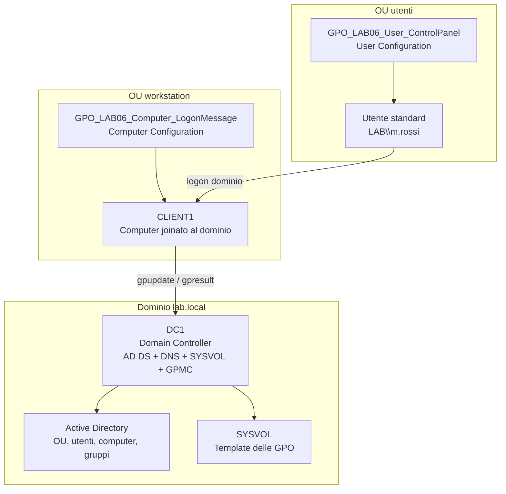
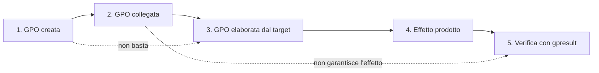
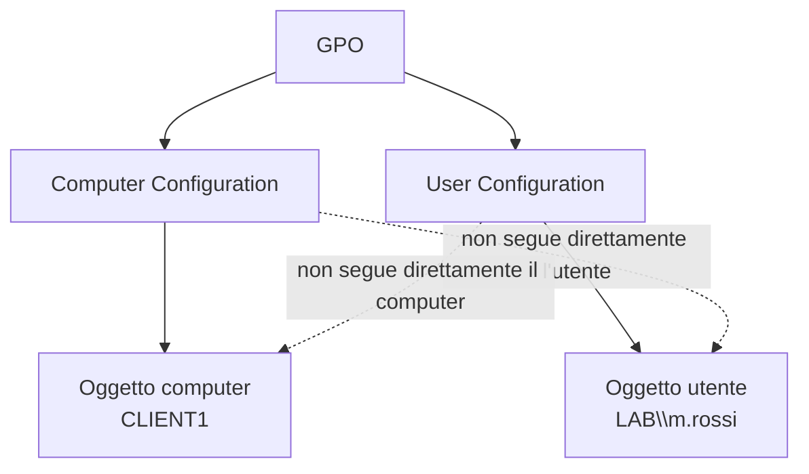
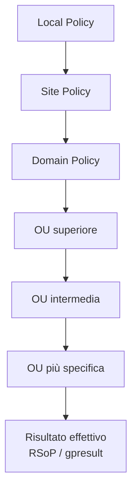
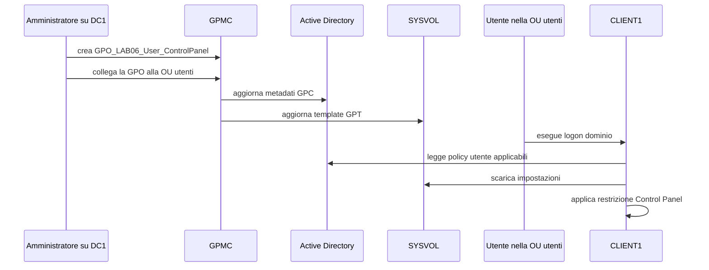
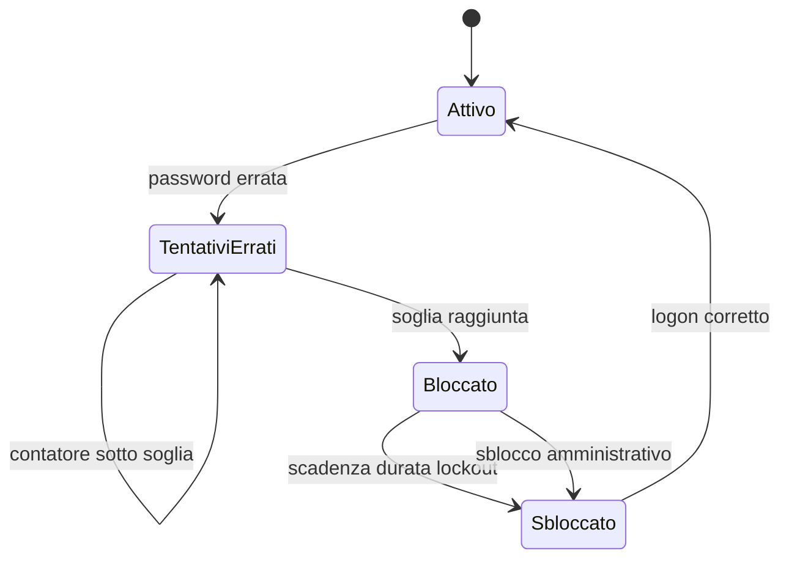
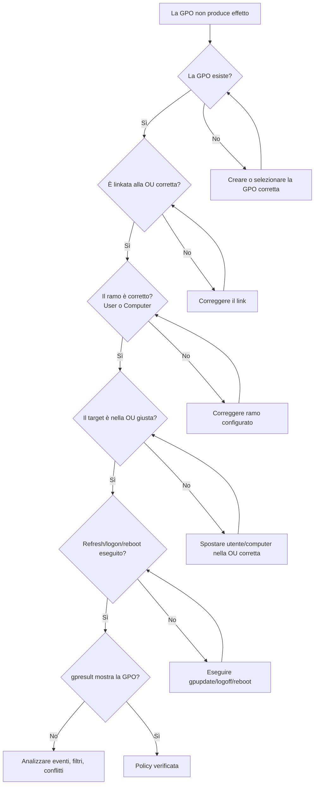

# ADDS LAB06 - Group Policy base e criteri account

## Laboratorio step-by-step: prima GUI, poi PowerShell con esempi aggiuntivi

---

# 1. Obiettivo del laboratorio

In questo laboratorio si introduce l'uso operativo delle **Group Policy** in un dominio Active Directory già funzionante.

Il laboratorio non ha lo scopo di “provare una GPO a caso”. L'obiettivo è costruire un metodo chiaro per:

- capire dove una GPO deve essere collegata;
- distinguere configurazioni per utenti e configurazioni per computer;
- applicare una policy a un perimetro corretto;
- verificare tecnicamente se la policy è stata realmente applicata;
- configurare i primi criteri di account del dominio;
- diagnosticare gli errori più comuni.

Al termine del laboratorio il partecipante dovrà essere in grado di:

- spiegare che cos'è una GPO;
- distinguere **Computer Configuration** e **User Configuration**;
- spiegare l'ordine generale di elaborazione **LSDOU**;
- creare una GPO da console grafica;
- collegare una GPO alla OU corretta;
- configurare una GPO utente;
- configurare una GPO computer;
- configurare password policy e account lockout policy di dominio;
- forzare l'aggiornamento delle policy;
- usare `gpresult` e `gpupdate`;
- produrre evidenze tecniche ordinate.

---

# 2. Durata e organizzazione didattica

Durata prevista: **4 ore**

| Blocco | Durata | Attività |
|---|---:|---|
| Introduzione operativa alle GPO | 35 min | Concetti, perimetro, LSDOU, errori tipici |
| Verifiche iniziali ambiente | 20 min | Dominio, OU, utenti, computer |
| Percorso GUI - GPO utente | 45 min | Creazione, link, configurazione, test |
| Percorso GUI - GPO computer | 35 min | Creazione, link, configurazione, test |
| Password policy e lockout policy | 35 min | Configurazione e verifica |
| Percorso PowerShell con esempi aggiuntivi | 45 min | Nuove GPO e nuove impostazioni rispetto alla GUI |
| Troubleshooting guidato | 25 min | Casi tipici e diagnosi |
| Evidenze e debrief | 20 min | Report finale |

---

# 3. Prerequisiti

Sono considerati già completati:

- LAB00 - setup ambiente Hyper-V;
- LAB01 - architettura introduttiva Active Directory;
- LAB02 - installazione AD DS e promozione Domain Controller;
- LAB03 - join di `CLIENT1` al dominio;
- LAB04 - struttura OU, utenti e gruppi;
- LAB05 - deleghe amministrative.

Il laboratorio utilizza questi oggetti già presenti:

- dominio `lab.local`;
- Domain Controller `DC1`;
- client dominio `CLIENT1`;
- utenti standard creati nei lab precedenti;
- OU degli utenti;
- OU delle workstation.

---

# 4. VM da usare

| VM | Stato | Uso |
|---|---|---|
| `DC1` | Accesa | Gestione AD DS, GPMC, PowerShell |
| `CLIENT1` | Accesa | Test applicazione GPO |
| `SRV1` | Facoltativa | Non necessaria per il LAB06 |
| `CLU1`, `CLU2` | Spente | Non usate in questo laboratorio |

---

# 5. Account da usare

Per le operazioni amministrative su `DC1`:

```text
LAB\Administrator
```

Per i test su `CLIENT1`, usare almeno un utente standard creato nei laboratori precedenti, ad esempio:

```text
LAB\m.rossi
LAB\l.verdi
```

Se i nomi degli utenti sono diversi, usare utenti equivalenti realmente presenti nel dominio.

---

# 6. Architettura logica del laboratorio



In questo laboratorio si useranno **due GPO distinte**:

| GPO | Tipo impostazioni | Collegamento corretto | Perché |
|---|---|---|---|
| `GPO_LAB06_User_ControlPanel` | User Configuration | OU che contiene gli utenti | Le impostazioni utente seguono l'utente |
| `GPO_LAB06_Computer_LogonMessage` | Computer Configuration | OU che contiene `CLIENT1` | Le impostazioni computer seguono il computer |

Questa separazione è importante. Una GPO con impostazioni utente collegata solo alla OU dei computer, nel modello base, non è il modo corretto per introdurre il concetto. Il loopback processing esiste, ma appartiene al laboratorio successivo sulle GPO avanzate.

---

# 7. Concetti minimi prima di iniziare

## 7.1 Che cos'è una Group Policy

Una **Group Policy** è un insieme di configurazioni centralizzate che Active Directory può applicare a utenti o computer del dominio.

Una GPO permette di amministrare molte macchine e molti utenti senza configurare manualmente ogni singolo sistema.

Esempi:

- bloccare l'accesso a certe funzioni di Windows;
- impostare criteri di sicurezza;
- configurare script di logon o startup;
- applicare regole coerenti su gruppi di computer;
- configurare parametri di dominio come password policy e lockout policy.

## 7.2 GPO creata, collegata, applicata, verificata

Quattro passaggi diversi:

| Fase | Significato |
|---|---|
| GPO creata | L'oggetto esiste in Group Policy Management |
| GPO collegata | La GPO è linkata a dominio, sito o OU |
| GPO applicata | Utente o computer l'ha elaborata |
| GPO verificata | Uno strumento tecnico conferma il risultato |



## 7.3 Computer Configuration e User Configuration

Una GPO contiene due grandi rami:

```text
Computer Configuration
User Configuration
```

La differenza è fondamentale.

| Ramo | Si applica a | Esempio |
|---|---|---|
| Computer Configuration | Oggetti computer | Messaggio legale al logon, impostazioni sicurezza macchina |
| User Configuration | Oggetti utente | Blocco pannello di controllo, impostazioni desktop |



## 7.4 Ordine LSDOU

L'acronimo **LSDOU** indica l'ordine generale di elaborazione delle policy:

1. Local;
2. Site;
3. Domain;
4. OU;
5. OU figlie, dalla più generale alla più specifica.



Nel LAB06 non si usano ancora:

- enforced;
- block inheritance;
- security filtering avanzato;
- WMI filter;
- loopback processing.

Questi argomenti saranno trattati nel LAB07.

---

# 8. Verifiche iniziali dell'ambiente

## 8.1 Verifica su DC1 tramite GUI

Accedere a `DC1` come amministratore di dominio.

Aprire:

```text
Server Manager > Tools > Active Directory Users and Computers
```

Verificare:

- presenza del dominio `lab.local`;
- presenza della OU principale del laboratorio;
- presenza della OU utenti;
- presenza della OU computer/workstation;
- presenza di `CLIENT1` nella OU corretta;
- presenza degli utenti standard.

## 8.2 Verifica su DC1 tramite PowerShell

Aprire **Windows PowerShell** come amministratore.

Eseguire:

```powershell
hostname
Get-ADDomain
Get-ADOrganizationalUnit -Filter * | Select-Object Name,DistinguishedName
Get-ADComputer -Filter * | Select-Object Name,DistinguishedName
Get-ADUser -Filter * | Select-Object Name,SamAccountName,DistinguishedName
```

## 8.3 Individuare i Distinguished Name corretti

Servono due percorsi:

- il DN della OU che contiene gli utenti;
- il DN della OU che contiene `CLIENT1`.

Esempio possibile:

```text
OU=Users,OU=Lab,DC=lab,DC=local
OU=Workstations,OU=Computers,OU=Lab,DC=lab,DC=local
```

Non copiare questi percorsi se nel proprio ambiente sono diversi. Prima si verifica, poi si usa il valore corretto.

Comando utile:

```powershell
Get-ADUser "m.rossi" -Properties DistinguishedName | Select-Object Name,DistinguishedName
Get-ADComputer "CLIENT1" -Properties DistinguishedName | Select-Object Name,DistinguishedName
```

## 8.4 Verifica su CLIENT1

Accedere a `CLIENT1` con un account di dominio.

Aprire `cmd` ed eseguire:

```cmd
whoami
echo %logonserver%
ipconfig /all
```

Controllare che:

- `whoami` mostri un account del dominio;
- `%logonserver%` punti a `DC1`;
- il DNS configurato sul client punti al Domain Controller.

---

# 9. Percorso GUI - Apertura Group Policy Management

Su `DC1` aprire:

```text
Server Manager > Tools > Group Policy Management
```

In alternativa:

```text
gpmc.msc
```

Espandere:

```text
Forest: lab.local
  Domains
    lab.local
      Group Policy Objects
```

Osservare la presenza di:

- `Default Domain Policy`;
- `Default Domain Controllers Policy`.

In questo laboratorio si creeranno nuove GPO dedicate. Le policy di default vanno toccate solo quando serve realmente e con consapevolezza.

---

# 10. Percorso GUI - GPO utente

## 10.1 Scopo della GPO utente

Creare una GPO che impedisca agli utenti di aprire il Pannello di controllo e le impostazioni di Windows.

Nome GPO:

```text
GPO_LAB06_User_ControlPanel
```

Tipo:

```text
User Configuration
```

Collegamento corretto:

```text
OU che contiene gli utenti standard
```

## 10.2 Creare la GPO

In **Group Policy Management**:

1. espandere `Forest: lab.local`;
2. espandere `Domains`;
3. espandere `lab.local`;
4. selezionare `Group Policy Objects`;
5. tasto destro su `Group Policy Objects`;
6. scegliere **New**;
7. inserire il nome:

```text
GPO_LAB06_User_ControlPanel
```

8. premere **OK**.

## 10.3 Collegare la GPO alla OU utenti

Individuare la OU che contiene gli utenti standard.

Esempio:

```text
OU=Users,OU=Lab,DC=lab,DC=local
```

Procedura:

1. tasto destro sulla OU utenti;
2. scegliere **Link an Existing GPO**;
3. selezionare `GPO_LAB06_User_ControlPanel`;
4. premere **OK**.

## 10.4 Perché non va collegata alla OU dei computer

Questa policy modifica il ramo **User Configuration**.

Quindi, in un laboratorio base, deve stare nel percorso degli utenti.

Se fosse collegata solo alla OU di `CLIENT1`, si introdurrebbe implicitamente il tema del loopback processing, che non è il tema di questo laboratorio.

## 10.5 Modificare la GPO

Tasto destro su `GPO_LAB06_User_ControlPanel` e scegliere:

```text
Edit
```

Navigare in:

```text
User Configuration
  Policies
    Administrative Templates
      Control Panel
        Prohibit access to Control Panel and PC settings
```

Aprire la policy e impostare:

```text
Enabled
```

Premere:

```text
Apply > OK
```

## 10.6 Cosa dovrebbe accadere

Quando un utente appartenente alla OU utenti effettua logon su `CLIENT1`, Windows dovrebbe impedire l'apertura del Pannello di controllo e delle impostazioni.

La GPO segue l'utente, non il computer.



---

# 11. Test GUI della GPO utente

## 11.1 Aggiornare le policy su CLIENT1

Accedere a `CLIENT1` con l'utente standard, per esempio:

```text
LAB\m.rossi
```

Aprire `cmd` ed eseguire:

```cmd
gpupdate /force
```

Eseguire logoff e poi nuovo logon con lo stesso utente.

## 11.2 Verificare il comportamento

Provare ad aprire:

```text
Control Panel
Settings
```

Esito atteso:

- accesso bloccato;
- messaggio di restrizione;
- impossibilità di aprire l'interfaccia richiesta.

## 11.3 Verificare con gpresult

Da `CLIENT1`, con l'utente standard loggato:

```cmd
gpresult /r
```

Controllare nella sezione utente che compaia:

```text
GPO_LAB06_User_ControlPanel
```

Generare anche un report HTML:

```cmd
mkdir C:\Temp
gpresult /h C:\Temp\gpresult_lab06_user.html
```

Aprire il file HTML e cercare la GPO applicata.

---

# 12. Percorso GUI - GPO computer

## 12.1 Scopo della GPO computer

Creare una GPO che mostri un messaggio informativo prima del logon.

Nome GPO:

```text
GPO_LAB06_Computer_LogonMessage
```

Tipo:

```text
Computer Configuration
```

Collegamento corretto:

```text
OU che contiene CLIENT1
```

## 12.2 Creare la GPO

In **Group Policy Management**:

1. selezionare `Group Policy Objects`;
2. tasto destro;
3. **New**;
4. nome:

```text
GPO_LAB06_Computer_LogonMessage
```

5. premere **OK**.

## 12.3 Collegare la GPO alla OU di CLIENT1

Individuare la OU che contiene `CLIENT1`.

Esempio:

```text
OU=Workstations,OU=Computers,OU=Lab,DC=lab,DC=local
```

Procedura:

1. tasto destro sulla OU workstation;
2. scegliere **Link an Existing GPO**;
3. selezionare `GPO_LAB06_Computer_LogonMessage`;
4. premere **OK**.

## 12.4 Modificare la GPO

Tasto destro sulla GPO e scegliere:

```text
Edit
```

Navigare in:

```text
Computer Configuration
  Policies
    Windows Settings
      Security Settings
        Local Policies
          Security Options
```

Configurare le seguenti voci:

```text
Interactive logon: Message title for users attempting to log on
```

Valore:

```text
LAB06 - Accesso al dominio lab.local
```

Configurare anche:

```text
Interactive logon: Message text for users attempting to log on
```

Valore:

```text
Accesso consentito solo per attività didattiche autorizzate nel laboratorio AD DS.
```

## 12.5 Perché questa policy è adatta al LAB06

Questa impostazione è utile perché:

- è chiaramente una configurazione computer;
- è visibile al logon;
- è reversibile;
- dimostra la differenza rispetto alla GPO utente;
- non richiede servizi aggiuntivi.

---

# 13. Test GUI della GPO computer

## 13.1 Aggiornare policy su CLIENT1

Accedere a `CLIENT1` con un account amministrativo o standard di dominio.

Aprire `cmd` come amministratore ed eseguire:

```cmd
gpupdate /force
```

Se richiesto, riavviare il computer.

In ogni caso, per rendere osservabile l'effetto:

```cmd
shutdown /r /t 0
```

## 13.2 Verificare il messaggio di logon

Dopo il riavvio, prima del logon, verificare la presenza del messaggio configurato.

Esito atteso:

- Windows mostra il titolo configurato;
- Windows mostra il testo configurato;
- l'utente deve confermare prima di proseguire con il logon.

## 13.3 Verificare con gpresult

Dopo il logon su `CLIENT1`, aprire `cmd` come amministratore ed eseguire:

```cmd
gpresult /r /scope computer
```

Cercare:

```text
GPO_LAB06_Computer_LogonMessage
```

Generare report HTML:

```cmd
gpresult /h C:\Temp\gpresult_lab06_computer.html /scope computer
```

---

# 14. Percorso GUI - Password policy del dominio

## 14.1 Punto concettuale fondamentale

La password policy di base del dominio non è una normale policy “per una OU”.

Nel modello base di Active Directory, le impostazioni principali di password e lockout per gli account di dominio appartengono al perimetro del dominio.

Per questo laboratorio si osserverà e configurerà la policy nel contesto corretto.

## 14.2 Aprire la Default Domain Policy

In **Group Policy Management**:

1. espandere `Domains`;
2. espandere `lab.local`;
3. selezionare `Default Domain Policy`;
4. tasto destro;
5. **Edit**.

Navigare in:

```text
Computer Configuration
  Policies
    Windows Settings
      Security Settings
        Account Policies
          Password Policy
```

## 14.3 Valori didattici consigliati

Impostare o verificare:

| Impostazione | Valore didattico |
|---|---:|
| Enforce password history | 5 passwords remembered |
| Maximum password age | 42 days |
| Minimum password age | 0 days |
| Minimum password length | 8 characters |
| Password must meet complexity requirements | Enabled |

## 14.4 Nota operativa

In ambienti reali non si modifica la `Default Domain Policy` con leggerezza. In questo laboratorio l'ambiente è isolato e lo scopo è didattico.

La modifica deve comunque essere documentata nelle evidenze.

---

# 15. Percorso GUI - Account lockout policy

Sempre nella `Default Domain Policy`, navigare in:

```text
Computer Configuration
  Policies
    Windows Settings
      Security Settings
        Account Policies
          Account Lockout Policy
```

Configurare:

| Impostazione | Valore didattico |
|---|---:|
| Account lockout threshold | 3 invalid logon attempts |
| Account lockout duration | 15 minutes |
| Reset account lockout counter after | 15 minutes |



---

# 16. Test lockout account

## 16.1 Preparazione

Scegliere un utente standard, ad esempio:

```text
LAB\m.rossi
```

Non usare l'account Administrator.

## 16.2 Test da CLIENT1

Da schermata di logon di `CLIENT1`:

1. selezionare l'utente standard;
2. inserire una password errata;
3. ripetere fino al superamento della soglia configurata;
4. osservare il messaggio di blocco.

## 16.3 Verifica da DC1

Su `DC1`, aprire PowerShell:

```powershell
Get-ADUser "m.rossi" -Properties LockedOut,BadLogonCount | Select-Object Name,SamAccountName,LockedOut,BadLogonCount
```

Esito atteso:

```text
LockedOut = True
```

## 16.4 Sblocco dell'account

Da `Active Directory Users and Computers`:

1. cercare l'utente;
2. aprire le proprietà;
3. scheda **Account**;
4. selezionare l'opzione di sblocco, se disponibile;
5. confermare.

Oppure da PowerShell:

```powershell
Unlock-ADAccount -Identity "m.rossi"
Get-ADUser "m.rossi" -Properties LockedOut | Select-Object Name,LockedOut
```

Questo passaggio collega il LAB06 al LAB05: le deleghe amministrative diventano utili quando un help desk deve sbloccare account senza essere Domain Admin.

---

# 17. Percorso PowerShell: estensione operativa

La parte PowerShell non ripete gli stessi esempi realizzati con la GUI.

Nel percorso grafico sono state configurate GPO di base per osservare il rapporto tra:

- impostazioni utente;
- impostazioni computer;
- link alla OU corretta;
- verifica con `gpresult`.

In questa sezione PowerShell viene usata per mostrare **altri esempi di impostazioni**, mantenendo lo stesso metodo operativo:

1. creare una GPO;
2. collegarla alla OU corretta;
3. configurare valori controllati;
4. forzare l'aggiornamento;
5. verificare l'effetto;
6. produrre evidenze.

Le impostazioni PowerShell introdotte sono volutamente semplici ma diverse da quelle configurate nella GUI:

| Area | GPO | Impostazioni introdotte |
|---|---|---|
| Utente | `GPO_LAB06_PS_User_StartMenu` | rimozione comando Esegui, rimozione documenti recenti |
| Utente | `GPO_LAB06_PS_User_TaskMgr` | blocco Task Manager per utenti standard di laboratorio |
| Computer | `GPO_LAB06_PS_Computer_LogonSecurity` | non mostrare ultimo utente, impedire spegnimento senza logon |
| Computer | `GPO_LAB06_PS_Computer_Inactivity` | blocco sessione dopo inattività |
| Dominio | Default Domain Policy / policy dominio | lettura e modifica controllata di password e lockout policy |

> Nota operativa: alcune impostazioni modificano il comportamento dell'interfaccia utente. Applicarle solo agli account e ai computer del laboratorio, non a utenti amministrativi reali.

---

# 18. PowerShell - Preparazione ambiente e variabili

Su `DC1`, aprire **Windows PowerShell** come amministratore.

Importare i moduli necessari:

```powershell
Import-Module ActiveDirectory
Import-Module GroupPolicy
```

Creare una cartella per report ed evidenze:

```powershell
New-Item -ItemType Directory -Path "C:\Temp\LAB06" -Force
```

Recuperare le informazioni del dominio:

```powershell
$Domain = Get-ADDomain
$DomainDN = $Domain.DistinguishedName
$DomainDNS = $Domain.DNSRoot

$Domain | Select-Object DNSRoot,NetBIOSName,DistinguishedName
```

Elencare le OU disponibili:

```powershell
Get-ADOrganizationalUnit -Filter * |
  Select-Object Name,DistinguishedName |
  Sort-Object DistinguishedName
```

Impostare le variabili in base alla struttura realmente presente nel dominio.

Esempio coerente con i laboratori precedenti:

```powershell
$UsersOU = "OU=Users,OU=Lab,$DomainDN"
$WorkstationsOU = "OU=Workstations,OU=Computers,OU=Lab,$DomainDN"
```

Se nel proprio ambiente le OU hanno nomi diversi, adattare i due valori.

Verificare che le OU esistano:

```powershell
Get-ADOrganizationalUnit -Identity $UsersOU
Get-ADOrganizationalUnit -Identity $WorkstationsOU
```

Verificare la posizione dell'utente e del computer di test:

```powershell
Get-ADUser "m.rossi" -Properties DistinguishedName |
  Select-Object Name,SamAccountName,DistinguishedName

Get-ADComputer "CLIENT1" -Properties DistinguishedName |
  Select-Object Name,DNSHostName,DistinguishedName
```

Se l'utente o il computer non sono nelle OU attese, non procedere alla cieca. Prima correggere la collocazione, altrimenti la GPO sarà configurata correttamente ma applicata al target sbagliato. La tecnologia, purtroppo, non sa perdonare la fantasia amministrativa.

---

# 19. PowerShell - Esempio utente 1: rimuovere il comando Esegui e i documenti recenti

## 19.1 Obiettivo dell'esempio

Questo esempio crea una GPO utente diversa da quella realizzata nella GUI.

La GPO limita alcune funzioni del menu Start per gli utenti standard del laboratorio:

- rimuove il comando **Esegui**;
- nasconde il menu dei documenti recenti.

Lo scopo non è blindare Windows, ma osservare come una configurazione **User Configuration** venga applicata agli utenti contenuti nella OU corretta.

## 19.2 Creare la GPO

```powershell
$GpoUserStart = "GPO_LAB06_PS_User_StartMenu"

New-GPO `
  -Name $GpoUserStart `
  -Comment "LAB06 PowerShell - Restrizioni base menu Start per utenti standard"
```

Verificare:

```powershell
Get-GPO -Name $GpoUserStart | Select-Object DisplayName,Owner,CreationTime,ModificationTime
```

## 19.3 Collegare la GPO alla OU utenti

```powershell
New-GPLink `
  -Name $GpoUserStart `
  -Target $UsersOU `
  -LinkEnabled Yes
```

Verificare l'ereditarietà della OU:

```powershell
Get-GPInheritance -Target $UsersOU
```

## 19.4 Configurare la rimozione del comando Esegui

Valore di policy:

```text
HKCU\Software\Microsoft\Windows\CurrentVersion\Policies\Explorer\NoRun = 1
```

Comando:

```powershell
Set-GPRegistryValue `
  -Name $GpoUserStart `
  -Key "HKCU\Software\Microsoft\Windows\CurrentVersion\Policies\Explorer" `
  -ValueName "NoRun" `
  -Type DWord `
  -Value 1
```

Effetto atteso: l'utente non dovrebbe visualizzare o utilizzare normalmente il comando **Esegui** dal menu Start.

## 19.5 Configurare la rimozione dei documenti recenti

Valore di policy:

```text
HKCU\Software\Microsoft\Windows\CurrentVersion\Policies\Explorer\NoRecentDocsMenu = 1
```

Comando:

```powershell
Set-GPRegistryValue `
  -Name $GpoUserStart `
  -Key "HKCU\Software\Microsoft\Windows\CurrentVersion\Policies\Explorer" `
  -ValueName "NoRecentDocsMenu" `
  -Type DWord `
  -Value 1
```

## 19.6 Generare report della GPO

```powershell
Get-GPOReport `
  -Name $GpoUserStart `
  -ReportType Html `
  -Path "C:\Temp\LAB06\GPO_LAB06_PS_User_StartMenu.html"
```

Aprire il report HTML e verificare i valori configurati.

---

# 20. PowerShell - Esempio utente 2: bloccare Task Manager per utenti standard

## 20.1 Obiettivo dell'esempio

Questo secondo esempio utente mostra che PowerShell può essere usata per creare rapidamente una GPO distinta e più mirata.

La GPO blocca Task Manager per gli utenti standard della OU di laboratorio.

Questa impostazione è utile come esempio didattico perché l'effetto è facile da verificare, ma deve essere applicata solo ad account non amministrativi.

## 20.2 Creare la GPO

```powershell
$GpoUserTaskMgr = "GPO_LAB06_PS_User_TaskMgr"

New-GPO `
  -Name $GpoUserTaskMgr `
  -Comment "LAB06 PowerShell - Blocco Task Manager per utenti standard"
```

## 20.3 Collegare la GPO alla OU utenti

```powershell
New-GPLink `
  -Name $GpoUserTaskMgr `
  -Target $UsersOU `
  -LinkEnabled Yes
```

## 20.4 Configurare il blocco di Task Manager

Valore di policy:

```text
HKCU\Software\Microsoft\Windows\CurrentVersion\Policies\System\DisableTaskMgr = 1
```

Comando:

```powershell
Set-GPRegistryValue `
  -Name $GpoUserTaskMgr `
  -Key "HKCU\Software\Microsoft\Windows\CurrentVersion\Policies\System" `
  -ValueName "DisableTaskMgr" `
  -Type DWord `
  -Value 1
```

## 20.5 Verifica su CLIENT1

Accedere a `CLIENT1` con l'utente standard di test.

Eseguire:

```cmd
gpupdate /force
logoff
```

Rientrare con lo stesso utente e provare ad aprire Task Manager.

Verifica tecnica:

```cmd
gpresult /r /scope user
```

La GPO `GPO_LAB06_PS_User_TaskMgr` deve comparire tra le GPO applicate all'utente.

---

# 21. PowerShell - Esempio computer 1: sicurezza base della schermata di logon

## 21.1 Obiettivo dell'esempio

Questo esempio crea una GPO computer diversa dal messaggio legale configurato nella GUI.

La GPO modifica impostazioni di sicurezza della schermata di logon:

- non mostrare l'ultimo nome utente;
- non consentire lo spegnimento del sistema senza autenticazione.

Sono impostazioni semplici, ma aiutano a distinguere una policy applicata al **computer** da una policy applicata all'utente.

## 21.2 Creare la GPO

```powershell
$GpoComputerLogonSecurity = "GPO_LAB06_PS_Computer_LogonSecurity"

New-GPO `
  -Name $GpoComputerLogonSecurity `
  -Comment "LAB06 PowerShell - Sicurezza base schermata di logon"
```

## 21.3 Collegare la GPO alla OU workstation

```powershell
New-GPLink `
  -Name $GpoComputerLogonSecurity `
  -Target $WorkstationsOU `
  -LinkEnabled Yes
```

## 21.4 Non mostrare l'ultimo utente autenticato

Valore di policy:

```text
HKLM\Software\Microsoft\Windows\CurrentVersion\Policies\System\dontdisplaylastusername = 1
```

Comando:

```powershell
Set-GPRegistryValue `
  -Name $GpoComputerLogonSecurity `
  -Key "HKLM\Software\Microsoft\Windows\CurrentVersion\Policies\System" `
  -ValueName "dontdisplaylastusername" `
  -Type DWord `
  -Value 1
```

## 21.5 Impedire lo spegnimento senza logon

Valore di policy:

```text
HKLM\Software\Microsoft\Windows\CurrentVersion\Policies\System\shutdownwithoutlogon = 0
```

Comando:

```powershell
Set-GPRegistryValue `
  -Name $GpoComputerLogonSecurity `
  -Key "HKLM\Software\Microsoft\Windows\CurrentVersion\Policies\System" `
  -ValueName "shutdownwithoutlogon" `
  -Type DWord `
  -Value 0
```

## 21.6 Verifica su CLIENT1

Su `CLIENT1`:

```cmd
gpupdate /force
shutdown /r /t 0
```

Dopo il riavvio, verificare:

- la schermata di logon non deve proporre automaticamente l'ultimo nome utente;
- l'opzione di spegnimento prima del logon deve essere coerente con la policy applicata;
- `gpresult /r /scope computer` deve mostrare la GPO applicata.

Comando di verifica:

```cmd
gpresult /r /scope computer
```

---

# 22. PowerShell - Esempio computer 2: blocco sessione dopo inattività

## 22.1 Obiettivo dell'esempio

Questo esempio aggiunge una seconda GPO computer.

La policy imposta un timeout di inattività della macchina, utile per introdurre il concetto di configurazione di sicurezza applicata al sistema e non al singolo utente.

## 22.2 Creare la GPO

```powershell
$GpoComputerInactivity = "GPO_LAB06_PS_Computer_Inactivity"

New-GPO `
  -Name $GpoComputerInactivity `
  -Comment "LAB06 PowerShell - Timeout inattività computer"
```

## 22.3 Collegare la GPO alla OU workstation

```powershell
New-GPLink `
  -Name $GpoComputerInactivity `
  -Target $WorkstationsOU `
  -LinkEnabled Yes
```

## 22.4 Configurare il timeout di inattività

Valore di policy:

```text
HKLM\Software\Microsoft\Windows\CurrentVersion\Policies\System\InactivityTimeoutSecs = 600
```

Comando:

```powershell
Set-GPRegistryValue `
  -Name $GpoComputerInactivity `
  -Key "HKLM\Software\Microsoft\Windows\CurrentVersion\Policies\System" `
  -ValueName "InactivityTimeoutSecs" `
  -Type DWord `
  -Value 600
```

Il valore `600` indica 600 secondi, cioè 10 minuti.

## 22.5 Generare report delle GPO computer

```powershell
Get-GPOReport `
  -Name $GpoComputerLogonSecurity `
  -ReportType Html `
  -Path "C:\Temp\LAB06\GPO_LAB06_PS_Computer_LogonSecurity.html"

Get-GPOReport `
  -Name $GpoComputerInactivity `
  -ReportType Html `
  -Path "C:\Temp\LAB06\GPO_LAB06_PS_Computer_Inactivity.html"
```

---

# 23. PowerShell - Lettura e modifica controllata della password policy di dominio

## 23.1 Perché questo esempio è diverso dalle GPO precedenti

Le impostazioni principali di password e lockout degli account di dominio non funzionano come una normale GPO linkata a una OU utenti.

Nel modello base di dominio, la password policy effettiva per gli account di dominio viene dal perimetro del dominio. Per questo motivo, in laboratorio si lavora sulla policy di dominio e non su una OU casuale, altrimenti si produce una configurazione elegante e inutile. L'informatica è già piena di entrambe le cose.

## 23.2 Salvare lo stato iniziale

```powershell
Get-ADDefaultDomainPasswordPolicy -Identity $DomainDNS |
  Format-List * > "C:\Temp\LAB06\password_policy_before.txt"
```

## 23.3 Leggere i valori principali

```powershell
Get-ADDefaultDomainPasswordPolicy -Identity $DomainDNS |
  Select-Object ComplexityEnabled,MinPasswordLength,PasswordHistoryCount,MaxPasswordAge,LockoutThreshold,LockoutDuration,LockoutObservationWindow
```

## 23.4 Applicare valori didattici controllati

```powershell
Set-ADDefaultDomainPasswordPolicy `
  -Identity $DomainDNS `
  -PasswordHistoryCount 5 `
  -MinPasswordLength 8 `
  -ComplexityEnabled $true `
  -MinPasswordAge (New-TimeSpan -Days 0) `
  -MaxPasswordAge (New-TimeSpan -Days 42) `
  -LockoutThreshold 3 `
  -LockoutDuration (New-TimeSpan -Minutes 15) `
  -LockoutObservationWindow (New-TimeSpan -Minutes 15)
```

## 23.5 Verificare i valori applicati

```powershell
Get-ADDefaultDomainPasswordPolicy -Identity $DomainDNS |
  Format-List PasswordHistoryCount,MinPasswordLength,ComplexityEnabled,MinPasswordAge,MaxPasswordAge,LockoutThreshold,LockoutDuration,LockoutObservationWindow
```

---

# 24. PowerShell - Verifica complessiva lato client

## 24.1 Aggiornamento policy

Su `CLIENT1`, aprire `cmd` o PowerShell.

Aggiornare le policy:

```cmd
gpupdate /force
```

Per le impostazioni computer può essere richiesto il riavvio:

```cmd
shutdown /r /t 0
```

Per le impostazioni utente può essere richiesto logoff/logon:

```cmd
logoff
```

## 24.2 Verifica lato utente

Accedere nuovamente con l'utente standard e lanciare:

```cmd
gpresult /r /scope user
```

Generare un report HTML:

```cmd
mkdir C:\Temp

gpresult /h C:\Temp\gpresult_lab06_user.html /scope user
```

Nel report verificare la presenza delle GPO:

```text
GPO_LAB06_PS_User_StartMenu
GPO_LAB06_PS_User_TaskMgr
```

## 24.3 Verifica lato computer

Su `CLIENT1`, aprire `cmd` come amministratore e lanciare:

```cmd
gpresult /r /scope computer
```

Generare il report HTML:

```cmd
gpresult /h C:\Temp\gpresult_lab06_computer.html /scope computer
```

Nel report verificare la presenza delle GPO:

```text
GPO_LAB06_PS_Computer_LogonSecurity
GPO_LAB06_PS_Computer_Inactivity
```

## 24.4 Verifica lato DC

Su `DC1`, controllare i link GPO:

```powershell
Get-GPInheritance -Target $UsersOU
Get-GPInheritance -Target $WorkstationsOU
```

Controllare che le GPO esistano:

```powershell
Get-GPO -All |
  Where-Object DisplayName -like "GPO_LAB06*" |
  Select-Object DisplayName,CreationTime,ModificationTime
```

Generare un riepilogo XML utile per analisi successive:

```powershell
Get-GPO -All |
  Where-Object DisplayName -like "GPO_LAB06*" |
  ForEach-Object {
    Get-GPOReport -Guid $_.Id -ReportType Xml -Path "C:\Temp\LAB06\$($_.DisplayName).xml"
  }
```

# 25. Troubleshooting guidato

## 25.1 La GPO utente non si applica

Controllare:

1. l'utente è realmente un account di dominio?
2. l'utente si trova nella OU collegata alla GPO?
3. la GPO è linkata alla OU utenti?
4. la configurazione è nel ramo User Configuration?
5. è stato fatto logoff/logon dopo `gpupdate`?
6. `gpresult /r /scope user` mostra la GPO?

Comandi utili:

```cmd
whoami
gpresult /r /scope user
```

Su `DC1`:

```powershell
Get-ADUser "m.rossi" -Properties DistinguishedName | Select-Object Name,DistinguishedName
Get-GPInheritance -Target $UsersOU
```

## 25.2 La GPO computer non si applica

Controllare:

1. `CLIENT1` è nella OU workstation?
2. la GPO è collegata alla OU workstation?
3. la configurazione è nel ramo Computer Configuration?
4. è stato fatto `gpupdate /force`?
5. è stato riavviato il client se necessario?
6. `gpresult /r /scope computer` mostra la GPO?

Comandi:

```powershell
Get-ADComputer "CLIENT1" -Properties DistinguishedName | Select-Object Name,DistinguishedName
Get-GPInheritance -Target $WorkstationsOU
```

Su `CLIENT1`:

```cmd
gpupdate /force
gpresult /r /scope computer
```

## 25.3 La password policy sembra non funzionare

Controllare:

1. si sta testando un account di dominio?
2. il valore è stato modificato nella policy di dominio?
3. il client comunica correttamente con il DC?
4. la password proposta viola davvero i criteri configurati?

Comando:

```powershell
Get-ADDefaultDomainPasswordPolicy -Identity "lab.local"
```

## 25.4 Il lockout non scatta

Controllare:

1. il test viene fatto sullo stesso account?
2. si stanno facendo tentativi errati sul dominio e non su un account locale?
3. la soglia è stata configurata?
4. il valore `LockoutThreshold` è diverso da zero?

Comando:

```powershell
Get-ADUser "m.rossi" -Properties LockedOut,BadLogonCount | Select-Object Name,LockedOut,BadLogonCount
```

## 25.5 Schema di diagnosi minima



---

# 26. Impatto sui laboratori successivi

## 26.1 Oggetti modificati

Durante questo laboratorio possono essere modificati:

```text
GPO_LAB06_User_ControlPanel
GPO_LAB06_Computer_LogonMessage
GPO_LAB06_PS_User_StartMenu
GPO_LAB06_PS_User_TaskMgr
GPO_LAB06_PS_Computer_LogonSecurity
GPO_LAB06_PS_Computer_Inactivity
Default Domain Policy, solo per Account Policies
OU utenti, solo tramite link GPO
OU workstation, solo tramite link GPO
Account utente di test, se viene bloccato durante la prova lockout
```

## 26.2 Oggetti che non devono essere modificati

Non modificare:

```text
Schema Active Directory
Domain Controllers OU
Default Domain Controllers Policy
Oggetti computer diversi da CLIENT1
Utenti amministrativi
Gruppi creati nei laboratori precedenti
Deleghe configurate nel LAB05
Configurazioni DNS
Configurazioni DHCP
Configurazioni File Server
Configurazioni WSUS
Configurazioni Cluster
```

## 26.3 Come ripristinare lo stato iniziale

### Rimuovere i link delle GPO

Da GUI:

1. aprire Group Policy Management;
2. andare sulla OU interessata;
3. selezionare il link GPO;
4. tasto destro;
5. **Delete**;
6. confermare la rimozione del link, non necessariamente dell'oggetto GPO.

Da PowerShell:

```powershell
Remove-GPLink -Name "GPO_LAB06_User_ControlPanel" -Target $UsersOU
Remove-GPLink -Name "GPO_LAB06_PS_User_StartMenu" -Target $UsersOU
Remove-GPLink -Name "GPO_LAB06_PS_User_TaskMgr" -Target $UsersOU

Remove-GPLink -Name "GPO_LAB06_Computer_LogonMessage" -Target $WorkstationsOU
Remove-GPLink -Name "GPO_LAB06_PS_Computer_LogonSecurity" -Target $WorkstationsOU
Remove-GPLink -Name "GPO_LAB06_PS_Computer_Inactivity" -Target $WorkstationsOU
```

### Eliminare le GPO di laboratorio, se richiesto

```powershell
Remove-GPO -Name "GPO_LAB06_User_ControlPanel"
Remove-GPO -Name "GPO_LAB06_PS_User_StartMenu"
Remove-GPO -Name "GPO_LAB06_PS_User_TaskMgr"
Remove-GPO -Name "GPO_LAB06_Computer_LogonMessage"
Remove-GPO -Name "GPO_LAB06_PS_Computer_LogonSecurity"
Remove-GPO -Name "GPO_LAB06_PS_Computer_Inactivity"
```

### Sbloccare eventuale utente bloccato

```powershell
Unlock-ADAccount -Identity "m.rossi"
```

### Ripristinare password policy

Usare il file salvato prima della modifica:

```text
C:\Temp\LAB06\password_policy_before.txt
```

Reinserire i valori precedenti con `Set-ADDefaultDomainPasswordPolicy`, se il docente richiede il ripristino.

## 26.4 Verifica di non regressione

Alla fine del laboratorio verificare:

```powershell
Get-ADDomain
Get-ADComputer "CLIENT1" -Properties DistinguishedName | Select-Object Name,DistinguishedName
Get-ADUser "m.rossi" -Properties LockedOut | Select-Object Name,LockedOut
Get-GPO -All | Where-Object DisplayName -like "GPO_LAB06*" | Select-Object DisplayName,GpoStatus
```

Su `CLIENT1`:

```cmd
gpupdate /force
gpresult /r
```

Il dominio deve restare utilizzabile per i laboratori successivi.

---

# 27. Evidenze richieste

Creare il file:

```text
docs/evidence_lab06.md
```

Struttura obbligatoria:

```md
# Evidence LAB06 - Group Policy base

## 1. Ambiente usato
- DC:
- Client:
- Dominio:
- Utente di test:

## 2. OU individuate
- OU utenti:
- OU workstation:

## 3. GPO utente
- Nome GPO:
- Dove è linkata:
- Impostazione configurata:
- Esito test Control Panel / Settings:

## 4. GPO computer
- Nome GPO:
- Dove è linkata:
- Impostazione configurata:
- Esito test messaggio di logon:

## 5. Password policy
- Valori iniziali salvati:
- Valori configurati:
- Comando o schermata di verifica:

## 6. Account lockout policy
- Threshold:
- Duration:
- Reset counter:
- Utente testato:
- Esito:

## 7. GPO PowerShell aggiuntive
- GPO PowerShell utente configurate:
- GPO PowerShell computer configurate:
- Report HTML/XML generati in `C:\Temp\LAB06`:

## 8. Output gpresult
- Report utente:
- Report computer:
- GPO applicate via GUI:
- GPO applicate via PowerShell:

## 9. Problemi incontrati
- Problema:
- Causa:
- Soluzione:

## 10. Conclusione tecnica
- Cosa è stato dimostrato:
- Cosa resta da approfondire nel LAB07:
```

---

# 28. Checklist finale partecipante

Il laboratorio è completato quando il partecipante può dimostrare di avere:

- individuato correttamente OU utenti e OU workstation;
- creato una GPO utente;
- collegato la GPO utente alla OU utenti;
- configurato il blocco del Pannello di controllo;
- verificato la policy con test pratico e `gpresult`;
- creato una GPO computer;
- collegato la GPO computer alla OU workstation;
- configurato il messaggio di logon;
- verificato la policy con test pratico e `gpresult`;
- creato e collegato GPO aggiuntive tramite PowerShell;
- verificato almeno una GPO utente e una GPO computer create tramite PowerShell;
- configurato password policy e lockout policy;
- simulato o almeno verificato il lockout account;
- raccolto evidenze nel file `docs/evidence_lab06.md`;
- spiegato perché una policy utente non deve essere trattata come una policy computer;
- spiegato perché password policy e lockout policy base sono di dominio.

---

# 29. Domande guidate con risposte

## Domanda 1

Una GPO è stata creata ma non produce effetti. È necessariamente rotta?

Risposta: no. Potrebbe non essere collegata, potrebbe essere collegata alla OU sbagliata, potrebbe contenere impostazioni nel ramo sbagliato oppure il target potrebbe non aver ancora aggiornato le policy.

## Domanda 2

Una configurazione in User Configuration si applica al computer?

Risposta: no. Si applica agli utenti. Per applicarla in base al computer serve un meccanismo avanzato come il loopback processing, che non appartiene al LAB06.

## Domanda 3

Una configurazione in Computer Configuration si applica all'utente?

Risposta: no. Si applica all'oggetto computer. L'utente può vedere l'effetto perché usa quel computer, ma il target tecnico della policy resta il computer.

## Domanda 4

Perché si usano due GPO distinte nel LAB06?

Risposta: per rendere chiara la differenza tra policy utente e policy computer. Una sola GPO mista è possibile, ma rende più difficile capire chi sta elaborando cosa.

## Domanda 5

La password policy base può essere impostata diversamente per ogni OU?

Risposta: nel modello base no. La password policy di dominio si applica agli account di dominio. Scenari più avanzati, come Fine-Grained Password Policies, saranno trattati solo dopo aver compreso il modello base.

## Domanda 6

Perché `gpresult` è più importante dell'impressione visiva?

Risposta: perché mostra quali GPO sono state effettivamente elaborate. Senza `gpresult`, si rischia di confondere effetto reale, cache, configurazione locale e aspettative sbagliate.

---

# 30. Conclusione

Questo laboratorio introduce le Group Policy come meccanismo operativo di governo del dominio.

I punti fondamentali sono:

- una GPO deve avere un perimetro preciso;
- il ramo User Configuration segue gli utenti;
- il ramo Computer Configuration segue i computer;
- il link della GPO deve essere coerente con il target;
- le password policy e lockout policy base appartengono al perimetro del dominio;
- ogni applicazione deve essere verificata con strumenti tecnici.

Nel LAB07 si passerà a scenari più complessi: filtri di sicurezza, ereditarietà, precedenza, loopback processing e troubleshooting avanzato.
