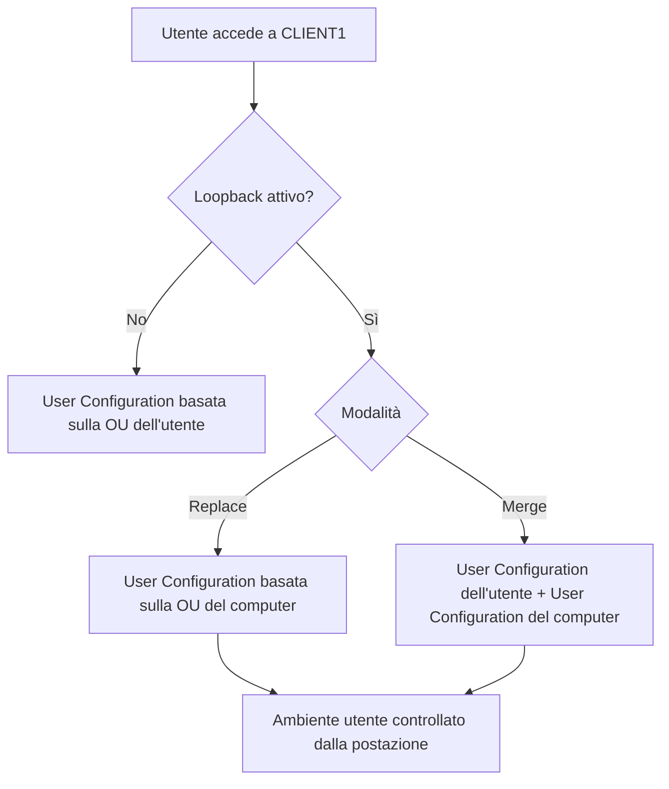

# LAB07 - Spiegazione del Loopback Processing nelle Group Policy

## 1. Obiettivo della spiegazione

Questa sezione chiarisce il significato della policy:

```text
Configure user Group Policy loopback processing mode
```

Questa impostazione viene usata quando si vuole che il comportamento dell'utente dipenda dal **computer su cui accede**, e non solo dalla posizione dell'utente in Active Directory.

È una configurazione molto usata in scenari come:

- aule informatiche;
- laboratori didattici;
- postazioni condivise;
- computer pubblici;
- chioschi informativi;
- postazioni controllate;
- ambienti Remote Desktop Services.

---

## 2. Comportamento normale delle Group Policy

In Active Directory, normalmente le Group Policy vengono elaborate distinguendo due parti:

| Parte della GPO | A chi si applica | Da cosa dipende |
|---|---|---|
| Computer Configuration | Computer | OU in cui si trova il computer |
| User Configuration | Utente | OU in cui si trova l'utente |

Quindi, senza loopback processing:

```text
Le impostazioni computer dipendono dalla posizione del computer.
Le impostazioni utente dipendono dalla posizione dell'utente.
```

## 2.1 Esempio senza loopback

Supponiamo di avere questa struttura:

```text
OU=Utenti-LAB07
  └── lab07.beta

OU=Kiosk-LAB07
  └── CLIENT1
```

L'utente `lab07.beta` si trova nella OU:

```text
OU=Utenti-LAB07
```

Il computer `CLIENT1` si trova nella OU:

```text
OU=Kiosk-LAB07
```

Quando `lab07.beta` accede a `CLIENT1`, normalmente accade questo:

| Tipo di impostazione | Da dove viene presa |
|---|---|
| Computer Configuration | Dalle GPO collegate alla OU di `CLIENT1` |
| User Configuration | Dalle GPO collegate alla OU di `lab07.beta` |

Quindi, se una GPO collegata a `Kiosk-LAB07` contiene una impostazione nella parte **User Configuration**, normalmente quella impostazione potrebbe non applicarsi a `lab07.beta`, perché `lab07.beta` non si trova dentro `Kiosk-LAB07`.

---

## 3. Il problema che il loopback risolve

In alcuni scenari non interessa solo chi è l'utente.

Interessa soprattutto **da quale computer l'utente sta accedendo**.

Esempio pratico:

```text
Mario accede dal proprio PC personale aziendale:
- ambiente normale
- impostazioni ordinarie
- accesso completo agli strumenti consentiti

Mario accede da un PC di aula:
- ambiente più controllato
- alcune funzioni bloccate
- impostazioni più restrittive
```

Lo stesso utente può quindi dover ricevere configurazioni diverse in base al computer utilizzato.

Senza loopback, questo risultato è difficile da ottenere in modo ordinato, perché le impostazioni utente seguono principalmente la OU dell'utente.

Con il loopback, invece, è possibile dire:

```text
Quando un utente accede a questo computer, applica le impostazioni utente collegate alla OU del computer.
```

---

## 4. Che cosa fa il Loopback Processing

La policy:

```text
Configure user Group Policy loopback processing mode
```

modifica il modo in cui vengono applicate le impostazioni contenute nella sezione:

```text
User Configuration
```

Quando il loopback è attivo, le impostazioni utente possono essere determinate anche dalla posizione del **computer** in Active Directory.

La frase chiave è:

```text
Il loopback processing serve quando il comportamento dell'utente deve dipendere dal computer su cui accede.
```

---

## 5. Perché il loopback si configura in Computer Configuration

Il loopback si configura in:

```text
Computer Configuration
  Policies
    Administrative Templates
      System
        Group Policy
          Configure user Group Policy loopback processing mode
```

Il motivo è che il loopback non definisce una caratteristica dell'utente.

Definisce una caratteristica del **computer**.

Non significa:

```text
Questo utente deve sempre avere queste restrizioni.
```

Significa:

```text
Chiunque acceda a questo computer deve ricevere queste restrizioni.
```

Per questo la configurazione si trova nella parte **Computer Configuration**.

---

## 6. Esempio semplice nel LAB07

Nel LAB07 si usa questo scenario:

```text
OU=Utenti-LAB07
  ├── lab07.alfa
  └── lab07.beta

OU=Kiosk-LAB07
  └── CLIENT1
```

Il computer `CLIENT1` viene spostato temporaneamente nella OU:

```text
OU=Kiosk-LAB07
```

Viene poi creata una GPO collegata a questa OU:

```text
GPO_LAB07_GUI_Loopback_Kiosk
```

Dentro questa GPO vengono configurate due cose:

1. l'attivazione del loopback processing;
2. una restrizione utente, ad esempio il blocco del Pannello di controllo.

---

## 7. Configurazione del loopback nella GPO

Nella GPO collegata a `Kiosk-LAB07`, si configura:

```text
Computer Configuration
  Policies
    Administrative Templates
      System
        Group Policy
          Configure user Group Policy loopback processing mode
```

La policy viene impostata così:

```text
Enabled
Mode: Replace
```

Questo significa che il computer `CLIENT1` diventa una postazione speciale: quando un utente accede a quel computer, le impostazioni utente vengono elaborate considerando la OU del computer.

---

## 8. Configurazione utente nella stessa GPO

Sempre nella stessa GPO, si può configurare una restrizione nella sezione:

```text
User Configuration
  Policies
    Administrative Templates
      Control Panel
        Prohibit access to Control Panel and PC settings
```

La policy viene impostata così:

```text
Enabled
```

Questa è una impostazione utente, perché modifica ciò che l'utente può fare durante la sessione.

Grazie al loopback, però, questa impostazione utente viene applicata perché il computer si trova nella OU `Kiosk-LAB07`.

---

## 9. Cosa succede quando l'utente accede

Supponiamo che l'utente `lab07.beta` acceda a `CLIENT1`.

Situazione:

| Elemento | Valore |
|---|---|
| Utente | `lab07.beta` |
| OU dell'utente | `Utenti-LAB07` |
| Computer | `CLIENT1` |
| OU del computer | `Kiosk-LAB07` |
| Loopback | Abilitato |
| Modalità | Replace |

Risultato:

```text
Le impostazioni utente configurate nella GPO collegata a Kiosk-LAB07 vengono applicate durante la sessione di lab07.beta.
```

Quindi, anche se `lab07.beta` non si trova dentro `Kiosk-LAB07`, riceve la restrizione utente perché sta accedendo a un computer che si trova in `Kiosk-LAB07`.

---

## 10. Differenza tra modalità Replace e Merge

Il loopback processing può funzionare in due modalità:

```text
Replace
Merge
```

## 10.1 Modalità Replace

La modalità **Replace** sostituisce le normali impostazioni utente con quelle determinate dalla OU del computer.

In forma semplificata:

```text
Ignora le normali User Configuration dell'utente.
Usa le User Configuration applicabili al computer.
```

Esempio:

```text
Utente: lab07.beta
OU utente: Utenti-LAB07
Computer: CLIENT1
OU computer: Kiosk-LAB07
Loopback: Replace
```

Risultato:

```text
Le impostazioni utente vengono prese dalle GPO applicabili a Kiosk-LAB07.
```

Questa modalità è la più semplice da comprendere e da verificare in laboratorio.

È adatta quando il computer deve imporre un ambiente controllato, indipendentemente dall'utente che accede.

## 10.2 Modalità Merge

La modalità **Merge** combina due insiemi di impostazioni:

1. le normali impostazioni utente, basate sulla OU dell'utente;
2. le impostazioni utente applicabili tramite la OU del computer.

In forma semplificata:

```text
Applica prima le normali policy utente.
Poi aggiunge anche quelle legate al computer.
```

Se due impostazioni sono in conflitto, generalmente prevale quella applicata successivamente, cioè quella derivata dal computer.

Questa modalità è più flessibile, ma anche più complessa da diagnosticare.

---

## 11. Esempio comparativo

Scenario:

```text
Utente: lab07.beta
OU utente: Utenti-LAB07
Computer: CLIENT1
OU computer: Kiosk-LAB07
```

GPO collegata a `Utenti-LAB07`:

```text
Permette l'accesso al Pannello di controllo
```

GPO collegata a `Kiosk-LAB07`:

```text
Blocca l'accesso al Pannello di controllo
```

## 11.1 Senza loopback

```text
lab07.beta riceve le impostazioni utente dalla propria OU.
```

Risultato:

```text
Il Pannello di controllo non viene bloccato dalla GPO collegata a Kiosk-LAB07.
```

## 11.2 Con loopback Replace

```text
lab07.beta accede a CLIENT1.
CLIENT1 si trova in Kiosk-LAB07.
Il loopback Replace è attivo.
```

Risultato:

```text
Il Pannello di controllo viene bloccato dalla GPO collegata a Kiosk-LAB07.
```

## 11.3 Con loopback Merge

```text
lab07.beta riceve prima le impostazioni della propria OU utente.
Poi riceve anche quelle collegate alla OU del computer.
```

Risultato:

```text
Se c'è conflitto, la restrizione collegata al computer può prevalere.
```

---

## 12. Schema logico



---

## 13. Perché nel LAB07 si usa Replace

Nel LAB07 si usa la modalità:

```text
Replace
```

perché è più chiara dal punto di vista didattico.

L'obiettivo è dimostrare che:

```text
Il comportamento dell'utente può dipendere dal computer su cui accede.
```

Nel laboratorio, `CLIENT1` rappresenta una postazione controllata.

Quindi il risultato desiderato è:

```text
Qualunque utente acceda a CLIENT1 deve ricevere le restrizioni previste per la postazione Kiosk-LAB07.
```

---

## 14. Come verificare che il loopback funzioni

Dopo aver configurato la GPO, su `CLIENT1` eseguire:

```cmd
gpupdate /force
```

Se richiesto, riavviare il computer:

```cmd
shutdown /r /t 0
```

Poi accedere con l'utente di test, ad esempio:

```text
LAB\lab07.beta
```

Verificare l'effetto della policy utente configurata, ad esempio il blocco del Pannello di controllo o delle impostazioni di Windows.

Generare poi un report:

```cmd
gpresult /h C:\Temp\gpresult_lab07_loopback_beta.html
start C:\Temp\gpresult_lab07_loopback_beta.html
```

Nel report verificare:

- che il computer sia `CLIENT1`;
- che `CLIENT1` si trovi nella OU corretta;
- che la GPO `GPO_LAB07_GUI_Loopback_Kiosk` sia applicata;
- che il loopback processing risulti attivo;
- che la restrizione utente sia applicata.

---

## 15. Errori comuni

## 15.1 Il computer non è nella OU corretta

Il loopback si applica al computer.

Se `CLIENT1` non si trova nella OU `Kiosk-LAB07`, la GPO collegata a quella OU non viene applicata al computer.

Controllare quindi in Active Directory Users and Computers la posizione dell'oggetto computer `CLIENT1`.

## 15.2 La GPO è collegata alla OU sbagliata

La GPO che abilita il loopback deve essere collegata alla OU che contiene il computer o a una OU superiore da cui il computer eredita la GPO.

Nel LAB07 deve essere collegata a:

```text
OU=Kiosk-LAB07
```

## 15.3 È stato configurato solo User Configuration senza abilitare il loopback

Se si configura una restrizione in `User Configuration` dentro una GPO collegata alla OU del computer, ma non si abilita il loopback, la restrizione potrebbe non applicarsi agli utenti.

La parte fondamentale è abilitare:

```text
Configure user Group Policy loopback processing mode
```

## 15.4 Non è stato eseguito il riavvio

Il loopback è una impostazione computer.

Dopo averla configurata, è consigliabile eseguire:

```cmd
gpupdate /force
shutdown /r /t 0
```

## 15.5 Si sta verificando con l'utente o il computer sbagliato

Per verificare correttamente il LAB07, usare:

```text
Computer: CLIENT1
Utente: lab07.beta oppure lab07.alfa
```

Il computer deve trovarsi nella OU `Kiosk-LAB07`.

---

## 16. Sintesi finale

Il loopback processing serve quando si vuole che le impostazioni utente dipendano dalla postazione utilizzata.

Normalmente:

```text
User Configuration dipende dalla OU dell'utente.
```

Con il loopback:

```text
User Configuration può dipendere dalla OU del computer.
```

Nel LAB07 questo permette di configurare `CLIENT1` come postazione controllata.

La logica è:

```text
CLIENT1 si trova in OU=Kiosk-LAB07
La GPO collegata a Kiosk-LAB07 abilita il loopback
La stessa GPO contiene restrizioni utente
Un utente accede a CLIENT1
Le restrizioni utente vengono applicate perché dipendono dalla postazione
```

Frase da ricordare:

```text
Il loopback processing fa sì che, su determinati computer, le impostazioni utente siano guidate dalla posizione del computer in Active Directory.
```
