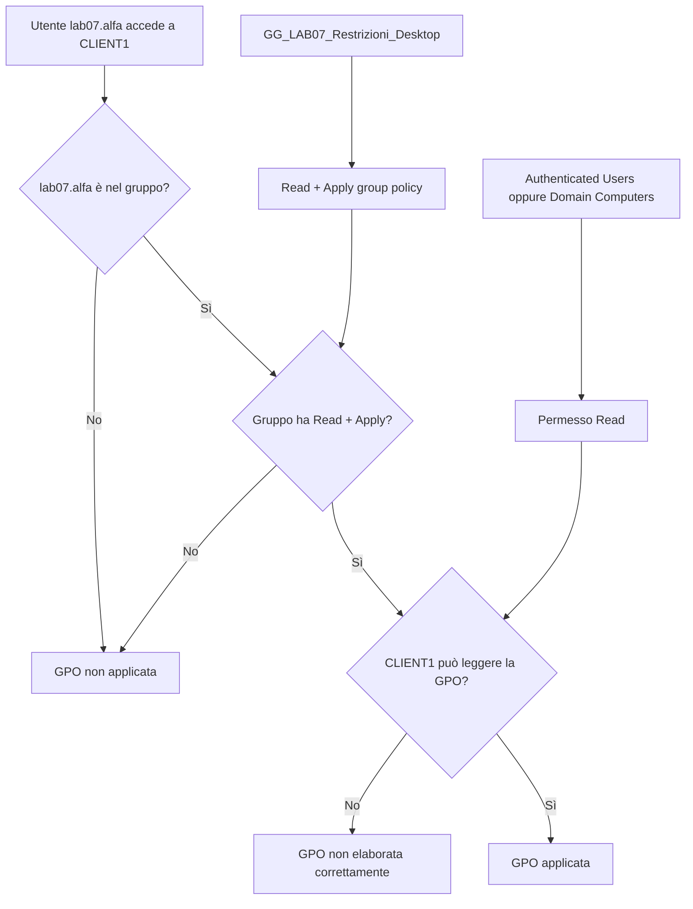

# ADDS LAB07 - Risoluzione anomalia nel Security Filtering: rimozione di Authenticated Users

## 1. Obiettivo del documento

Questo documento chiarisce una situazione frequente nelle Group Policy:

```text
La GPO è collegata alla OU corretta.
L'utente è nella OU corretta.
L'utente è membro del gruppo usato nel Security Filtering.
Eppure la GPO non si applica.
```

Nel LAB07 questa situazione può verificarsi nella GPO:

```text
GPO_LAB07_GUI_SecurityFiltering_User
```

La causa più probabile è legata alla rimozione di:

```text
Authenticated Users
```

dal **Security Filtering** della GPO.

---

## 2. Scenario del LAB07

Nel laboratorio viene creata una GPO utente collegata alla OU:

```text
OU=Utenti-LAB07,OU=LAB07,OU=Lab,DC=lab,DC=local
```

La GPO contiene una impostazione utente, ad esempio:

```text
User Configuration
  Policies
    Administrative Templates
      Start Menu and Taskbar
        Remove Run menu from Start Menu = Enabled
```

L'obiettivo è applicare la GPO solo all'utente:

```text
LAB\lab07.alfa
```

Per ottenere questo risultato viene creato il gruppo:

```text
GG_LAB07_Restrizioni_Desktop
```

Il gruppo contiene:

```text
lab07.alfa
```

Il gruppo non contiene:

```text
lab07.beta
```

Risultato desiderato:

| Utente | Membro del gruppo | GPO applicata |
|---|---:|---:|
| `lab07.alfa` | Sì | Sì |
| `lab07.beta` | No | No |

---

## 3. Configurazione che sembra corretta ma può creare problemi

Nel Security Filtering della GPO si rimuove:

```text
Authenticated Users
```

E si aggiunge:

```text
GG_LAB07_Restrizioni_Desktop
```

A prima vista sembra corretto:

```text
Authenticated Users rimosso
+ gruppo specifico aggiunto
= GPO applicata solo al gruppo specifico
```

Il ragionamento è comprensibile, ma incompleto.

Il Security Filtering non riguarda solo la scelta di chi deve applicare la GPO. Riguarda anche i permessi necessari per leggere la GPO durante l'elaborazione delle Group Policy.

---

## 4. Il punto fondamentale: leggere una GPO e applicare una GPO sono due cose diverse

Perché una GPO venga applicata, servono due permessi distinti:

| Permesso | Significato |
|---|---|
| `Read` | Il soggetto può leggere il contenuto della GPO |
| `Apply group policy` | Il soggetto può applicare la GPO |

Quindi una GPO deve essere:

```text
leggibile
+
autorizzata all'applicazione
```

Se manca il permesso di lettura, la GPO può non essere elaborata correttamente.

---

## 5. Perché il problema compare dopo la rimozione di Authenticated Users

Normalmente, quando si crea una nuova GPO, `Authenticated Users` ha i permessi necessari per leggere e applicare la GPO.

Quando si rimuove `Authenticated Users` dal Security Filtering, si rimuove anche la configurazione predefinita che permetteva a utenti e computer autenticati di accedere alla GPO.

Questo può creare un problema soprattutto con le **User Configuration**.

Durante il logon, Windows deve recuperare le impostazioni utente della GPO. Nelle versioni moderne di Windows, questa operazione richiede che anche il **computer account** possa leggere la GPO.

Esempio:

```text
Utente collegato: LAB\lab07.alfa
Computer usato: CLIENT1
Computer account in dominio: LAB\CLIENT1$
```

Anche se `lab07.alfa` è autorizzato ad applicare la GPO, il computer `CLIENT1` deve poter leggere la GPO durante l'elaborazione.

Se il computer non ha il permesso `Read`, la GPO può non essere applicata.

---

## 6. Configurazione corretta

La configurazione corretta deve distinguere due esigenze:

1. limitare l'applicazione della GPO solo al gruppo desiderato;
2. permettere comunque al client di leggere la GPO.

Configurazione consigliata:

| Soggetto | Read | Apply group policy | Scopo |
|---|---:|---:|---|
| `GG_LAB07_Restrizioni_Desktop` | Sì | Sì | Il gruppo applica la GPO |
| `Authenticated Users` | Sì | No | Permette la lettura della GPO |

In alternativa:

| Soggetto | Read | Apply group policy | Scopo |
|---|---:|---:|---|
| `GG_LAB07_Restrizioni_Desktop` | Sì | Sì | Il gruppo applica la GPO |
| `Domain Computers` | Sì | No | Permette ai computer di dominio di leggere la GPO |

Entrambe le soluzioni sono valide.

Nel laboratorio è spesso più semplice usare:

```text
Authenticated Users: Read
```

senza `Apply group policy`.

---

## 7. Cosa non bisogna fare

Non bisogna lasciare questa situazione:

| Soggetto | Read | Apply group policy |
|---|---:|---:|
| `GG_LAB07_Restrizioni_Desktop` | Sì | Sì |
| `Authenticated Users` | No | No |
| `Domain Computers` | No | No |

In questa configurazione il gruppo può sembrare corretto, ma il computer client potrebbe non avere i permessi necessari per leggere la GPO.

Il risultato può essere:

```text
La GPO non viene applicata.
```

Oppure nel report `gpresult` può comparire una motivazione simile a:

```text
Filtering: Denied (Security)
```

oppure la GPO può non comparire tra quelle applicate.

---

## 8. Procedura corretta da GUI

### 8.1 Aprire la GPO

Su `DC1`:

1. Aprire **Group Policy Management**.
2. Espandere:

```text
Forest: lab.local
Domains
lab.local
Lab
LAB07
Utenti-LAB07
```

3. Selezionare la GPO:

```text
GPO_LAB07_GUI_SecurityFiltering_User
```

---

### 8.2 Controllare il Security Filtering

Nella scheda **Scope**, nella sezione **Security Filtering**, deve essere presente:

```text
GG_LAB07_Restrizioni_Desktop
```

Questo gruppo stabilisce chi deve applicare la GPO.

In questa sezione può anche non comparire `Authenticated Users`, se si vuole limitare l'applicazione della GPO al gruppo specifico.

---

### 8.3 Aggiungere Read ad Authenticated Users

1. Aprire la scheda **Delegation**.
2. Fare clic su **Advanced**.
3. Aggiungere, se non presente:

```text
Authenticated Users
```

4. Impostare solo il permesso:

```text
Read
```

5. Verificare che non sia selezionato:

```text
Apply group policy
```

Risultato atteso:

| Soggetto | Permessi |
|---|---|
| `Authenticated Users` | `Read` |
| `GG_LAB07_Restrizioni_Desktop` | `Read`, `Apply group policy` |

---

## 9. Procedura alternativa con Domain Computers

Invece di assegnare `Read` ad `Authenticated Users`, è possibile assegnarlo a:

```text
Domain Computers
```

Configurazione:

| Soggetto | Permessi |
|---|---|
| `Domain Computers` | `Read` |
| `GG_LAB07_Restrizioni_Desktop` | `Read`, `Apply group policy` |

Questa soluzione rende più esplicito il motivo tecnico: i computer del dominio devono leggere la GPO.

Nel LAB07, usando `CLIENT1`, il computer account interessato è:

```text
LAB\CLIENT1$
```

`CLIENT1$` è membro di `Domain Computers`, salvo modifiche particolari all'ambiente.

---

## 10. Verifica da CLIENT1

Dopo aver corretto i permessi, accedere a `CLIENT1` con:

```text
LAB\lab07.alfa
```

Eseguire:

```cmd
gpupdate /force
```

Poi effettuare:

```text
logoff / logon
```

oppure disconnettersi e accedere nuovamente.

Le modifiche ai gruppi di sicurezza dell'utente richiedono un nuovo logon per essere presenti nel token di accesso.

---

## 11. Verificare che l'utente abbia il gruppo corretto

Da `CLIENT1`, con `lab07.alfa` connesso:

```cmd
whoami /groups | findstr /i LAB07
```

Risultato atteso:

```text
GG_LAB07_Restrizioni_Desktop
```

Se il gruppo non compare, l'utente non sta usando un token di accesso aggiornato.

In questo caso:

1. disconnettersi;
2. accedere di nuovo;
3. ripetere il comando.

---

## 12. Verificare l'applicazione della GPO con gpresult

Da `CLIENT1`, con `lab07.alfa` connesso:

```cmd
mkdir C:\Temp
gpresult /h C:\Temp\gpresult_lab07_alfa.html
start C:\Temp\gpresult_lab07_alfa.html
```

Nel report verificare la sezione relativa all'utente.

La GPO deve comparire tra le GPO applicate:

```text
GPO_LAB07_GUI_SecurityFiltering_User
```

Se la GPO compare tra quelle non applicate, controllare la motivazione.

Possibili indicazioni:

```text
Denied (Security)
Filtering: Denied (Security)
Access denied
```

Queste indicazioni rimandano a un problema di Security Filtering o permessi sulla GPO.

---

## 13. Verificare l'effetto della policy nel registro utente

Per la policy `Remove Run menu from Start Menu`, la verifica più chiara su Windows 11 è il registro utente.

Da `CLIENT1`, con `lab07.alfa` connesso:

```cmd
reg query HKCU\Software\Microsoft\Windows\CurrentVersion\Policies\Explorer /v NoRun
```

Risultato atteso:

```text
NoRun    REG_DWORD    0x1
```

Se il valore `NoRun` non esiste, la policy non è stata applicata al profilo dell'utente.

---

## 14. Verifica da PowerShell su DC1

Su `DC1`, aprire PowerShell come amministratore e importare il modulo:

```powershell
Import-Module GroupPolicy
```

Verificare i permessi della GPO:

```powershell
Get-GPPermission -Name "GPO_LAB07_GUI_SecurityFiltering_User" -All
```

Controllare che siano presenti almeno:

```text
GG_LAB07_Restrizioni_Desktop    GpoApply
Authenticated Users             GpoRead
```

oppure:

```text
GG_LAB07_Restrizioni_Desktop    GpoApply
Domain Computers                GpoRead
```

---

## 15. Correzione da PowerShell

Se si vuole correggere la GPO da PowerShell, usare una delle due soluzioni seguenti.

### Soluzione A: aggiungere Read ad Authenticated Users

```powershell
Import-Module GroupPolicy

Set-GPPermission `
  -Name "GPO_LAB07_GUI_SecurityFiltering_User" `
  -TargetName "Authenticated Users" `
  -TargetType Group `
  -PermissionLevel GpoRead
```

### Soluzione B: aggiungere Read a Domain Computers

```powershell
Import-Module GroupPolicy

Set-GPPermission `
  -Name "GPO_LAB07_GUI_SecurityFiltering_User" `
  -TargetName "Domain Computers" `
  -TargetType Group `
  -PermissionLevel GpoRead
```

Il gruppo usato per applicare la GPO deve mantenere `GpoApply`:

```powershell
Set-GPPermission `
  -Name "GPO_LAB07_GUI_SecurityFiltering_User" `
  -TargetName "GG_LAB07_Restrizioni_Desktop" `
  -TargetType Group `
  -PermissionLevel GpoApply
```

---

## 16. Checklist di troubleshooting

Se la GPO non si applica, verificare in ordine:

| Controllo | Comando o posizione | Esito atteso |
|---|---|---|
| GPO linkata alla OU corretta | GPMC, scheda Scope | Link su `Utenti-LAB07` |
| Utente nella OU corretta | `Get-ADUser lab07.alfa -Properties DistinguishedName` | DN contiene `OU=Utenti-LAB07` |
| Utente membro del gruppo | `whoami /groups` | Compare `GG_LAB07_Restrizioni_Desktop` |
| Gruppo nel Security Filtering | GPMC, scheda Scope | Compare il gruppo corretto |
| Gruppo con Apply | Delegation > Advanced | `Read` + `Apply group policy` |
| Client/computer può leggere la GPO | Delegation > Advanced | `Authenticated Users` o `Domain Computers` con `Read` |
| Policy aggiornata | `gpupdate /force` | Nessun errore grave |
| Report generato | `gpresult /h` | GPO presente tra quelle applicate |
| Valore registro presente | `reg query ... /v NoRun` | `NoRun REG_DWORD 0x1` |

---

## 17. Schema logico



---

## 18. Sintesi finale

Nel LAB07 la rimozione di `Authenticated Users` dal Security Filtering serve a evitare che la GPO venga applicata a tutti gli utenti autenticati.

Tuttavia, non bisogna togliere ogni possibilità di lettura della GPO ai computer del dominio.

La regola pratica è:

```text
Il gruppo filtrato deve avere Read + Apply group policy.
Authenticated Users oppure Domain Computers deve avere almeno Read.
```

Quindi:

```text
Security Filtering decide chi applica la GPO.
Delegation/Advanced permissions decide anche chi può leggerla.
```

Configurazione finale consigliata per il LAB07:

| Soggetto | Read | Apply group policy |
|---|---:|---:|
| `GG_LAB07_Restrizioni_Desktop` | Sì | Sì |
| `Authenticated Users` | Sì | No |

oppure:

| Soggetto | Read | Apply group policy |
|---|---:|---:|
| `GG_LAB07_Restrizioni_Desktop` | Sì | Sì |
| `Domain Computers` | Sì | No |

Questa configurazione permette di limitare l'applicazione della GPO al gruppo desiderato senza impedire al client di leggere la GPO durante l'elaborazione.
