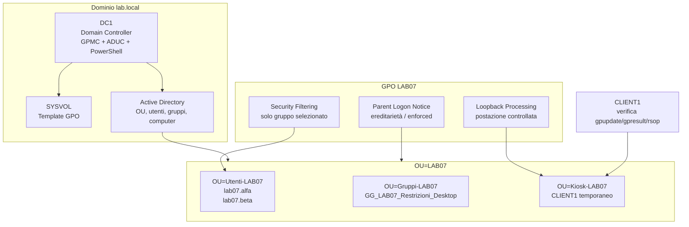
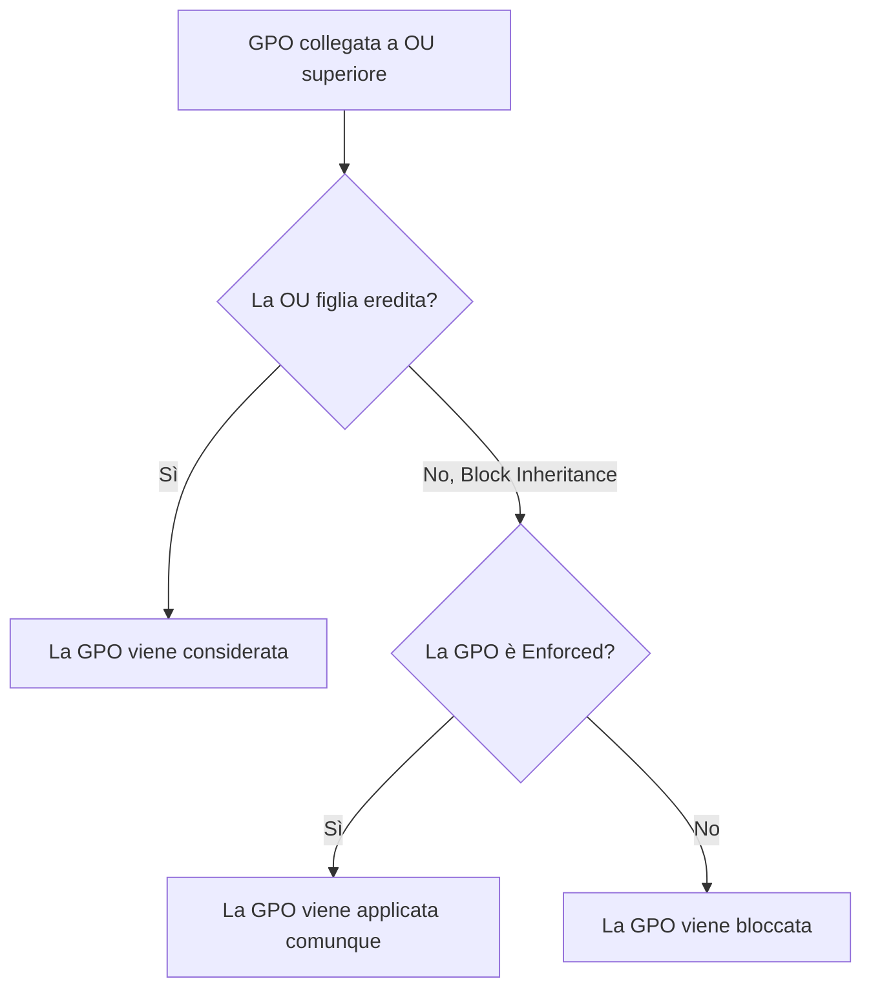
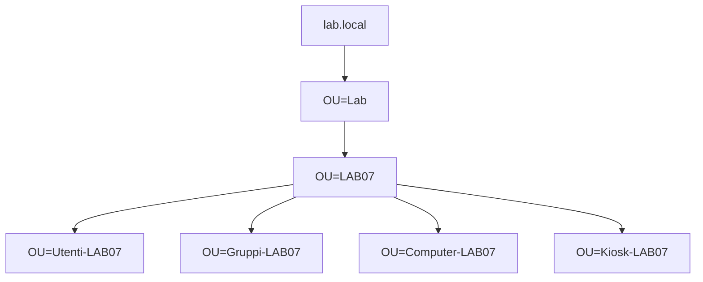
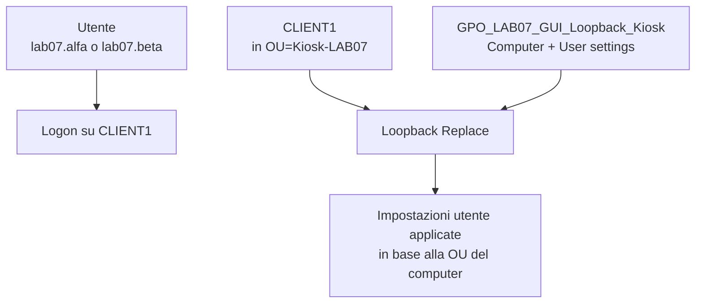
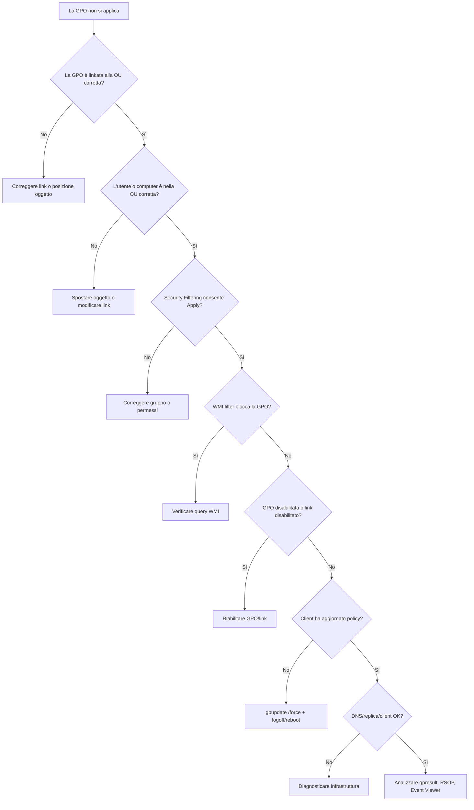

# ADDS LAB07 - Group Policy avanzate e troubleshooting

## Laboratorio step-by-step: prima GUI, poi PowerShell con esempi aggiuntivi

---

# 1. Obiettivo del laboratorio

In questo laboratorio si prosegue il lavoro iniziato nel LAB06 sulle **Group Policy**.

Nel LAB06 sono stati introdotti i concetti fondamentali:

- creazione di una GPO;
- collegamento a una OU;
- distinzione tra **User Configuration** e **Computer Configuration**;
- aggiornamento delle policy;
- verifica tramite `gpupdate` e `gpresult`;
- criteri account di dominio.

In questo laboratorio si lavora su scenari più realistici, dove non basta chiedersi se una GPO esiste. Occorre capire:

- a quali utenti o computer si applica realmente;
- perché una GPO apparentemente corretta non produce effetti;
- come limitare l'applicazione tramite **Security Filtering**;
- come usare il **Loopback Processing** per postazioni condivise o controllate;
- come valutare ereditarietà, precedenza, `Block Inheritance` ed `Enforced`;
- come produrre report tecnici leggibili;
- come distinguere un problema di OU, gruppo, filtro, DNS, replica o client.

Al termine del laboratorio il partecipante dovrà essere in grado di:

- spiegare la differenza tra **link della GPO** e **Security Filtering**;
- configurare una GPO applicata solo a un gruppo specifico;
- configurare e verificare il **loopback processing**;
- usare `gpresult /h` per produrre report HTML;
- usare `rsop.msc` per analizzare il risultato delle policy;
- interpretare l'ereditarietà delle GPO;
- usare `Block Inheritance` ed `Enforced` in modo controllato;
- diagnosticare casi tipici di mancata applicazione delle policy;
- usare PowerShell per creare, collegare, filtrare, documentare e rimuovere GPO.

---

# 2. Durata e organizzazione didattica

Durata prevista: **4 ore**

| Blocco | Durata | Attività |
|---|---:|---|
| Richiamo operativo LAB06 | 20 min | Verifica di ciò che deve già funzionare |
| Security Filtering da GUI | 45 min | GPO applicata solo a utenti selezionati |
| Loopback Processing da GUI | 45 min | Scenario postazione controllata |
| Ereditarietà, Block Inheritance ed Enforced | 45 min | Priorità e conflitti tra GPO |
| Troubleshooting guidato | 75 min | Casi volutamente rotti e diagnosi |
| PowerShell con esempi aggiuntivi | 50 min | Nuove impostazioni, report, filtri, link e ripristino |
| Evidenze e debrief | 20 min | Report finale e verifica di non regressione |


---

# 3. Prerequisiti

Sono considerati già completati:

- LAB00 - setup ambiente Hyper-V;
- LAB01 - architettura introduttiva Active Directory;
- LAB02 - installazione AD DS e promozione Domain Controller;
- LAB03 - join di `CLIENT1` al dominio;
- LAB04 - struttura OU, utenti e gruppi;
- LAB05 - deleghe amministrative;
- LAB06 - Group Policy base e criteri account.

Il laboratorio utilizza:

- dominio `lab.local`;
- Domain Controller `DC1`;
- client di dominio `CLIENT1`;
- console **Group Policy Management**;
- console **Active Directory Users and Computers**;
- PowerShell su `DC1`;
- prompt dei comandi o PowerShell su `CLIENT1` per le verifiche.

---

# 4. VM da usare

| VM | Stato | Uso |
|---|---|---|
| `DC1` | Accesa | Gestione AD DS, GPMC, PowerShell, creazione GPO |
| `CLIENT1` | Accesa | Test applicazione GPO, `gpupdate`, `gpresult`, RSOP |
| `SRV1` | Spenta o facoltativa | Non necessaria per il LAB07 |
| `CLU1`, `CLU2` | Spente | Non usate in questo laboratorio |

---

# 5. Account da usare

Per le attività amministrative su `DC1`:

```text
LAB\Administrator
```

Per i test su `CLIENT1` verranno creati due account dedicati al laboratorio:

```text
LAB\lab07.alfa
LAB\lab07.beta
```

I due account servono per dimostrare in modo chiaro la differenza tra:

- utente a cui la GPO deve applicarsi;
- utente a cui la GPO non deve applicarsi.

---

# 6. Oggetti creati nel laboratorio

Per evitare modifiche confuse agli oggetti già creati nei laboratori precedenti, in LAB07 verrà usata una piccola area dedicata:

```text
OU=LAB07,OU=Lab,DC=lab,DC=local
```

Al suo interno verranno create:

```text
OU=Utenti-LAB07
OU=Computer-LAB07
OU=Kiosk-LAB07
OU=Gruppi-LAB07
```

Verranno inoltre creati:

```text
Utente: lab07.alfa
Utente: lab07.beta
Gruppo: GG_LAB07_Restrizioni_Desktop
GPO: GPO_LAB07_GUI_SecurityFiltering_User
GPO: GPO_LAB07_GUI_Loopback_Kiosk
GPO: GPO_LAB07_GUI_Parent_LogonNotice
GPO: GPO_LAB07_PS_ControlPanel
GPO: GPO_LAB07_PS_TaskManager
GPO: GPO_LAB07_PS_LogonMessage
```

Il computer `CLIENT1` verrà temporaneamente spostato nella OU `Kiosk-LAB07` per provare il loopback processing. Alla fine del laboratorio dovrà essere riportato nella OU originaria.

---

# 7. Architettura logica del laboratorio



---

# 8. Concetti operativi prima della configurazione

## 8.1 Link della GPO

Il link stabilisce **dove** una GPO viene presa in considerazione.

Una GPO può essere collegata a:

- un dominio;
- una OU;
- un sito Active Directory.

Il link non basta a garantire l'applicazione. Dice solo che quella GPO è candidata a essere elaborata per gli oggetti presenti nel contenitore.

## 8.2 Security Filtering

Il **Security Filtering** stabilisce **chi** può applicare la GPO.

Perché una GPO venga applicata, l'utente o il computer devono avere almeno:

- permesso di lettura della GPO;
- permesso **Apply group policy**.

Quindi una GPO può essere:

- collegata alla OU corretta;
- visibile nella console;
- apparentemente configurata bene;
- ma non applicata perché il soggetto non è incluso nel filtro di sicurezza.

.

## 8.3 WMI Filtering

Il **WMI Filtering** consente di applicare una GPO solo se il computer soddisfa una condizione tecnica.

Esempi:

- versione di Windows;
- tipo di sistema operativo;
- architettura;
- caratteristiche hardware.

Nel LAB07 il WMI filtering viene trattato come tecnica di selezione avanzata e come possibile causa di mancata applicazione. 

## 8.4 Loopback Processing

Il **Loopback Processing** cambia il modo in cui vengono applicate le impostazioni utente.

Normalmente:

```text
Impostazioni utente -> dipendono dalla OU dell'utente
Impostazioni computer -> dipendono dalla OU del computer
```

Con il loopback, le impostazioni utente possono essere determinate anche dalla OU del computer.

È utile in scenari come:

- postazioni aula;
- chioschi informativi;
- computer condivisi;
- postazioni di laboratorio;
- terminal server/RDS;
- ambienti dove il comportamento deve dipendere dalla macchina, non dall'utente.

Modalità principali:

| Modalità | Comportamento |
|---|---|
| Merge | Le impostazioni utente normali vengono applicate e poi integrate/sovrascritte da quelle legate al computer |
| Replace | Le impostazioni utente normali vengono sostituite da quelle legate al computer |

In questo laboratorio verrà usata la modalità **Replace**, perché produce un comportamento più chiaro da verificare.

## 8.5 Block Inheritance ed Enforced

L'ereditarietà permette alle GPO collegate a livelli superiori di applicarsi anche ai contenitori inferiori.

Esempio:

```text
OU=LAB07
  └── OU=Kiosk-LAB07
```

Una GPO collegata a `OU=LAB07` può applicarsi anche agli oggetti dentro `OU=Kiosk-LAB07`.

`Block Inheritance` blocca l'ereditarietà delle GPO superiori.

`Enforced` forza l'applicazione della GPO anche se una OU inferiore blocca l'ereditarietà.



---

# 9. Convenzioni operative del laboratorio

Durante il laboratorio si useranno nomi espliciti.

| Tipo oggetto | Convenzione |
|---|---|
| OU | `LAB07`, `Utenti-LAB07`, `Kiosk-LAB07` |
| Gruppi | prefisso `GG_LAB07_` |
| GPO GUI | prefisso `GPO_LAB07_GUI_` |
| GPO PowerShell | prefisso `GPO_LAB07_PS_` |
| Utenti test | prefisso `lab07.` |


---

# Parte 1 - Preparazione ambiente da GUI

---

# 10. Verifica iniziale su DC1

## 10.1 Accedere a DC1

1. Avviare `DC1`.
2. Accedere con:

```text
LAB\Administrator
```

3. Aprire **Server Manager**.
4. Verificare che non siano presenti errori evidenti nei servizi AD DS e DNS.

## 10.2 Aprire Active Directory Users and Computers

1. Da **Server Manager**, aprire **Tools**.
2. Selezionare **Active Directory Users and Computers**.
3. Espandere il dominio:

```text
lab.local
```

4. Verificare la presenza della OU principale usata nel corso, ad esempio:

```text
OU=Lab
```

Se la OU principale ha un nome diverso, usare il nome effettivamente presente nell'ambiente.

## 10.3 Verificare la posizione attuale di CLIENT1

1. In **Active Directory Users and Computers**, cercare `CLIENT1`.
2. Annotare la OU in cui si trova attualmente.
3. Questa informazione servirà per il ripristino finale.

Creare una nota nel report:

```text
Posizione iniziale di CLIENT1: ______________________________
```

Questo passaggio è importante perché il laboratorio sposterà temporaneamente il computer object di `CLIENT1`.

---

# 11. Creazione della struttura LAB07 da GUI

## 11.1 Creare la OU principale LAB07

1. In **Active Directory Users and Computers**, fare clic destro su `OU=Lab`.
2. Selezionare **New > Organizational Unit**.
3. Inserire:

```text
LAB07
```

4. Confermare.

## 11.2 Creare le OU interne

Dentro `OU=LAB07`, creare le seguenti OU:

```text
Utenti-LAB07
Gruppi-LAB07
Computer-LAB07
Kiosk-LAB07
```

Risultato atteso:

```text
lab.local
└── Lab
    └── LAB07
        ├── Utenti-LAB07
        ├── Gruppi-LAB07
        ├── Computer-LAB07
        └── Kiosk-LAB07
```

## 11.3 Schema della struttura OU



---

# 12. Creazione utenti di test da GUI

## 12.1 Creare l'utente lab07.alfa

1. Fare clic destro su `OU=Utenti-LAB07`.
2. Selezionare **New > User**.
3. Compilare:

| Campo | Valore |
|---|---|
| First name | `lab07` |
| Last name | `alfa` |
| User logon name | `lab07.alfa` |

4. Fare clic su **Next**.
5. Impostare una password conforme alla policy del dominio, ad esempio:

```text
P@ssw0rdLAB07!
```

6. Selezionare:

```text
Password never expires
```


7. Deselezionare:

```text
User must change password at next logon
```

8. Confermare.

## 12.2 Creare l'utente lab07.beta

Ripetere gli stessi passaggi per:

```text
lab07.beta
```

Questi due utenti possono avere la stessa password dato il nostro contesto da laboratorio.

---

# 13. Creazione gruppo di filtro da GUI

## 13.1 Creare il gruppo GG_LAB07_Restrizioni_Desktop

1. Fare clic destro su `OU=Gruppi-LAB07`.
2. Selezionare **New > Group**.
3. Inserire:

```text
GG_LAB07_Restrizioni_Desktop
```

4. Impostare:

| Opzione | Valore |
|---|---|
| Group scope | Global |
| Group type | Security |

5. Confermare.

## 13.2 Aggiungere solo lab07.alfa al gruppo

1. Aprire le proprietà del gruppo `GG_LAB07_Restrizioni_Desktop`.
2. Aprire la scheda **Members**.
3. Fare clic su **Add**.
4. Inserire:

```text
lab07.alfa
```

5. Confermare.

L'utente `lab07.beta` non deve essere membro del gruppo.

## 13.3 Obiettivo della prova

| Utente | Membro del gruppo | GPO con Security Filtering |
|---|---|---|
| `lab07.alfa` | Sì | Deve applicarsi |
| `lab07.beta` | No | Non deve applicarsi |

---

# Parte 2 - Security Filtering da GUI

---

# 14. Creazione GPO con Security Filtering

## 14.1 Aprire Group Policy Management

1. Su `DC1`, aprire **Server Manager**.
2. Aprire **Tools**.
3. Selezionare **Group Policy Management**.
4. Espandere:

```text
Forest: lab.local
Domains
lab.local
```

## 14.2 Creare la GPO

1. Espandere la OU:

```text
Lab > LAB07 > Utenti-LAB07
```

2. Fare clic destro su `Utenti-LAB07`.
3. Selezionare:

```text
Create a GPO in this domain, and Link it here...
```

4. Inserire il nome:

```text
GPO_LAB07_GUI_SecurityFiltering_User
```

5. Confermare.

## 14.3 Configurare una restrizione utente

1. Fare clic destro sulla GPO appena creata.
2. Selezionare **Edit**.
3. Navigare in:

```text
User Configuration
  Policies
    Administrative Templates
      Start Menu and Taskbar
```

4. Aprire la policy:

```text
Remove Run menu from Start Menu
```

5. Impostare:

```text
Enabled
```

6. Confermare con **OK**.

Questa impostazione è volutamente semplice da osservare: l'utente filtrato non deve poter usare il comando **Run/Esegui** dal menu Start.

## 14.4 Impostare il Security Filtering

1. Tornare in **Group Policy Management**.
2. Selezionare la GPO:

```text
GPO_LAB07_GUI_SecurityFiltering_User
```

3. Nella scheda **Scope**, individuare **Security Filtering**.


4. Rimuovere:  <-- ATTENZIONE vedi nota qui in basso

```text
Authenticated Users 
```

5. Aggiungere:

```text
GG_LAB07_Restrizioni_Desktop
```

### NOTA: Attenzione
### Nota importante sul Security Filtering

Quando si rimuove `Authenticated Users` dal Security Filtering di una GPO utente, è necessario garantire comunque il permesso `Read` alla GPO per `Authenticated Users` oppure per `Domain Computers`.

Configurazione corretta:

| Soggetto | Read | Apply group policy |
|---|---:|---:|
| `GG_LAB07_Restrizioni_Desktop` | Sì | Sì |
| `Authenticated Users` oppure `Domain Computers` | Sì | No |

Il gruppo usato nel Security Filtering stabilisce chi applica la GPO.  
Il permesso `Read` consente al client di leggere la GPO durante l’elaborazione.


## 14.5 Verifica permessi Delegation

1. Aprire la scheda **Delegation** della GPO.
2. Fare clic su **Advanced**.
3. Verificare che il gruppo `GG_LAB07_Restrizioni_Desktop` abbia:

```text
Read
Apply group policy
```

4. Confermare.

---

# 15. Test Security Filtering su CLIENT1

## 15.1 Accedere con lab07.alfa

1. Avviare `CLIENT1`.
2. Accedere con:

```text
LAB\lab07.alfa
```

3. Aprire un prompt dei comandi o PowerShell.
4. Eseguire:

```cmd
gpupdate /force
```

5. Disconnettersi e riconnettersi con lo stesso utente.

## 15.2 Verificare l'effetto della policy

1. Aprire il menu Start.
2. Verificare se il comando **Run/Esegui** risulta non disponibile secondo il comportamento previsto dalla policy. **vedi nota**

Se l'effetto grafico non è immediatamente evidente, usare il report `gpresult`.

### NOTA
Attenzione: **La verifica tramite menu Start è poco adatta a Windows 11.**

La policy però esiste ed è ancora supportata su Windows 11. Microsoft la identifica come NoRun, applicabile sia a Computer sia a User Configuration, e indica compatibilità con Windows 11 dalla versione 21H2 in poi. Inoltre, quando è abilitata, rimuove il comando Run dal menu Start, rimuove il comando New Task / Run dal Task Manager e impedisce l’apertura della finestra Esegui con Windows + R.

## 15.3 Generare report HTML per lab07.alfa

Da `CLIENT1`, con `lab07.alfa` connesso:

```cmd
gpresult /h C:\Temp\gpresult_lab07_alfa.html
```

Se `C:\Temp` non esiste:

```cmd
mkdir C:\Temp
gpresult /h C:\Temp\gpresult_lab07_alfa.html
```

Aprire il report:

```cmd
start C:\Temp\gpresult_lab07_alfa.html
```

Verificare che tra le GPO applicate compaia:

```text
GPO_LAB07_GUI_SecurityFiltering_User
```

## 15.4 Accedere con lab07.beta

1. Disconnettersi da `CLIENT1`.
2. Accedere con:

```text
LAB\lab07.beta
```

3. Eseguire:

```cmd
gpupdate /force
```

4. Generare il report:

```cmd
gpresult /h C:\Temp\gpresult_lab07_beta.html
start C:\Temp\gpresult_lab07_beta.html
```

## 15.5 Risultato atteso

| Utente | GPO applicata? | Motivazione |
|---|---|---|
| `lab07.alfa` | Sì | È membro di `GG_LAB07_Restrizioni_Desktop` |
| `lab07.beta` | No | Non è membro del gruppo usato nel Security Filtering |

## 15.6 Evidenza richiesta

Nel report finale inserire:

```text
Security Filtering
- GPO creata: GPO_LAB07_GUI_SecurityFiltering_User
- Gruppo usato nel filtro: GG_LAB07_Restrizioni_Desktop
- Utente incluso: lab07.alfa
- Utente escluso: lab07.beta
- Risultato gpresult lab07.alfa: ______________________
- Risultato gpresult lab07.beta: ______________________
```

---

# Parte 3 - Loopback Processing da GUI

---

# 16. Preparazione scenario Kiosk

Lo scenario rappresenta una postazione controllata.

Obiettivo:

- quando un utente accede a `CLIENT1`, il comportamento utente deve dipendere dalla OU del computer;
- la policy deve essere applicata perché `CLIENT1` si trova nella OU `Kiosk-LAB07`;
- non deve dipendere solo dalla OU dell'utente.

## 16.1 Spostare CLIENT1 nella OU Kiosk-LAB07

1. Su `DC1`, aprire **Active Directory Users and Computers**.
2. Cercare l'oggetto computer:

```text
CLIENT1
```

3. Fare clic destro su `CLIENT1`.
4. Selezionare **Move**.
5. Spostarlo in:

```text
OU=Kiosk-LAB07,OU=LAB07,OU=Lab,DC=lab,DC=local
```

6. Annotare nel report:

```text
CLIENT1 spostato temporaneamente in OU=Kiosk-LAB07
```

## 16.2 Perché serve lo spostamento del computer

Il loopback processing viene configurato nella parte **Computer Configuration** della GPO.

Quindi la GPO deve applicarsi al computer.

Se `CLIENT1` non si trova nella OU a cui è collegata la GPO, il loopback non viene applicato. 

**Da dotare che:** pur essendo la configurazione utente dentro la GPO è perfetta, risulta scollegata dal perimetro amministrativo; motivo per il quale c'è da prestare molta attenzione.

---

# 17. Creare la GPO Loopback

## 17.1 Creare la GPO collegata a Kiosk-LAB07

1. Aprire **Group Policy Management**.
2. Navigare in:

```text
Lab > LAB07 > Kiosk-LAB07
```

3. Fare clic destro su `Kiosk-LAB07`.
4. Selezionare:

```text
Create a GPO in this domain, and Link it here...
```

5. Inserire:

```text
GPO_LAB07_GUI_Loopback_Kiosk
```

6. Confermare.

## 17.2 Abilitare il Loopback Processing

1. Fare clic destro sulla GPO `GPO_LAB07_GUI_Loopback_Kiosk`.
2. Selezionare **Edit**.
3. Navigare in:

```text
Computer Configuration
  Policies
    Administrative Templates
      System
        Group Policy
```

4. Aprire:

```text
Configure user Group Policy loopback processing mode
```

5. Impostare:

```text
Enabled
```

6. In **Mode**, selezionare:

```text
Replace
```

7. Confermare.

## 17.3 Configurare una restrizione utente nella stessa GPO

Sempre nella stessa GPO, navigare in:

```text
User Configuration
  Policies
    Administrative Templates
      Control Panel
```

Aprire:

```text
Prohibit access to Control Panel and PC settings
```

Impostare:

```text
Enabled
```

Questa impostazione si trova nella parte utente della GPO, ma verrà applicata in base alla posizione del computer grazie al loopback processing.

## 17.4 Schema del loopback



---

# 18. Test Loopback Processing

## 18.1 Aggiornare le policy computer

Su `CLIENT1`, accedere come amministratore o con un account autorizzato ed eseguire:

```cmd
gpupdate /force
```

Se richiesto, riavviare il computer.

In molti casi per le impostazioni computer è consigliabile riavviare:

```cmd
shutdown /r /t 0
```

## 18.2 Accedere con lab07.beta

1. Dopo il riavvio, accedere a `CLIENT1` con:

```text
LAB\lab07.beta
```

2. Eseguire:

```cmd
gpupdate /force
```

3. Disconnettersi e riconnettersi.

## 18.3 Verificare Control Panel

1. Provare ad aprire **Control Panel** o **Settings**.
2. Verificare se l'accesso è bloccato dalla policy.

## 18.4 Generare report HTML

Da `CLIENT1`, con `lab07.beta` connesso:

```cmd
gpresult /h C:\Temp\gpresult_lab07_loopback_beta.html
start C:\Temp\gpresult_lab07_loopback_beta.html
```

Nel report controllare:

- se la GPO `GPO_LAB07_GUI_Loopback_Kiosk` è presente;
- se il computer risulta in `OU=Kiosk-LAB07`;
- se è indicato il loopback processing;
- se la User Configuration della GPO viene considerata.

## 18.5 Interpretazione

Il punto fondamentale non è solo vedere una restrizione applicata.

Il punto è capire che:

```text
utente lab07.beta
+ accesso su CLIENT1
+ CLIENT1 in OU Kiosk-LAB07
+ loopback Replace
= impostazioni utente imposte dalla OU del computer
```

---

# Parte 4 - Ereditarietà, Block Inheritance ed Enforced

---

# 19. Creare una GPO padre

## 19.1 Creare GPO collegata a OU=LAB07

1. In **Group Policy Management**, selezionare:

```text
OU=LAB07
```

2. Fare clic destro e scegliere:

```text
Create a GPO in this domain, and Link it here...
```

3. Inserire:

```text
GPO_LAB07_GUI_Parent_LogonNotice
```

4. Confermare.

## 19.2 Configurare un messaggio di accesso

1. Fare clic destro sulla GPO.
2. Selezionare **Edit**.
3. Navigare in:

```text
Computer Configuration
  Policies
    Windows Settings
      Security Settings
        Local Policies
          Security Options
```

4. Configurare:

```text
Interactive logon: Message title for users attempting to log on
```

Valore:

```text
LAB07 - Avviso di laboratorio
```

5. Configurare:

```text
Interactive logon: Message text for users attempting to log on
```

Valore:

```text
Questa postazione è configurata per il laboratorio LAB07 sulle Group Policy avanzate.
```

6. Confermare.

## 19.3 Verificare ereditarietà

Poiché `Kiosk-LAB07` si trova sotto `LAB07`, la GPO collegata alla OU padre può essere ereditata dal computer `CLIENT1`.

Da `CLIENT1`:

```cmd
gpupdate /force
shutdown /r /t 0
```

Dopo il riavvio, verificare se compare il messaggio di accesso.

---

# 20. Usare Block Inheritance

## 20.1 Bloccare ereditarietà su Kiosk-LAB07

1. In **Group Policy Management**, fare clic destro su:

```text
OU=Kiosk-LAB07
```

2. Selezionare:

```text
Block Inheritance
```

3. Verificare che sulla OU compaia il simbolo che indica il blocco dell'ereditarietà.

## 20.2 Testare effetto del blocco

Da `CLIENT1`:

```cmd
gpupdate /force
shutdown /r /t 0
```

Dopo il riavvio, verificare se la GPO padre risulta bloccata.

Generare report:

```cmd
gpresult /r
oppure
gpresult /h C:\Temp\gpresult_lab07_block_inheritance.html
start C:\Temp\gpresult_lab07_block_inheritance.html
```

Nel report cercare:

```text
GPO_LAB07_GUI_Parent_LogonNotice
```

La GPO dovrebbe non essere applicata a causa del blocco di ereditarietà.

---

# 21. Usare Enforced

## 21.1 Rendere Enforced il link della GPO padre

1. In **Group Policy Management**, selezionare la OU:

```text
OU=LAB07
```

2. Individuare il link alla GPO:

```text
GPO_LAB07_GUI_Parent_LogonNotice
```

3. Fare clic destro sul link.
4. Selezionare:

```text
Enforced
```

## 21.2 Testare effetto di Enforced

Da `CLIENT1`:

```cmd
gpupdate /force
shutdown /r /t 0
```

Generare report:

```cmd
gpresult /h
oppure
gpresult /h C:\Temp\gpresult_lab07_enforced.html
start C:\Temp\gpresult_lab07_enforced.html
```

Verificare che la GPO padre torni applicabile nonostante `Block Inheritance` sulla OU figlia.

## 21.3 Tabella interpretativa

| Stato OU figlia | Stato link GPO padre | Risultato atteso |
|---|---|---|
| ereditarietà normale | link normale | GPO padre ereditata |
| Block Inheritance | link normale | GPO padre bloccata |
| Block Inheritance | Enforced | GPO padre applicata comunque |

---

# Parte 5 - Troubleshooting guidato

---

# 22. Metodo di diagnosi

Quando una GPO non si applica, non si deve procedere a tentativi casuali.

Seguire questa sequenza:



---

# 23. Caso 1 - Utente non incluso nel Security Filtering

## 23.1 Sintomo

La GPO è linkata correttamente, ma l'utente non riceve la configurazione.

## 23.2 Simulazione

1. Su `DC1`, aprire **Active Directory Users and Computers**.
2. Aprire il gruppo:

```text
GG_LAB07_Restrizioni_Desktop
```

3. Rimuovere temporaneamente:

```text
lab07.alfa
```

4. Su `CLIENT1`, accedere con `lab07.alfa`.
5. Eseguire:

```cmd
gpupdate /force
```

6. Disconnettersi e riconnettersi.
7. Generare report:

```cmd
gpresult /h
oppure
gpresult /h C:\Temp\gpresult_lab07_trouble_security.html
start C:\Temp\gpresult_lab07_trouble_security.html
```

## 23.3 Diagnosi attesa

Nel report la GPO può comparire tra le GPO negate o non applicate.

Motivazione attesa:

```text
Filtering: Denied (Security)
```

oppure comportamento equivalente.

## 23.4 Correzione

Reinserire `lab07.alfa` nel gruppo:

```text
GG_LAB07_Restrizioni_Desktop
```

Poi ripetere:

```cmd
gpupdate /force
```

Logoff/logon.

---

# 24. Caso 2 - Computer nella OU sbagliata

## 24.1 Sintomo

La GPO di loopback non si applica.

## 24.2 Verifica

Su `DC1`, controllare dove si trova l'oggetto computer:

```text
CLIENT1
```

Deve trovarsi in:

```text
OU=Kiosk-LAB07
```

## 24.3 Diagnosi

Se `CLIENT1` non è nella OU a cui è linkata la GPO, il computer non riceve la Computer Configuration e quindi il loopback non parte.

## 24.4 Correzione

Spostare `CLIENT1` in:

```text
OU=Kiosk-LAB07,OU=LAB07,OU=Lab,DC=lab,DC=local
```

Poi su `CLIENT1`:

```cmd
gpupdate /force
shutdown /r /t 0
```

---

# 25. Caso 3 - Link della GPO disabilitato

## 25.1 Sintomo

La GPO è presente ma non viene elaborata.

## 25.2 Simulazione

1. In **Group Policy Management**, selezionare la OU `Kiosk-LAB07`.
2. Fare clic destro sul link della GPO:

```text
GPO_LAB07_GUI_Loopback_Kiosk
```

3. Deselezionare:

```text
Link Enabled
```

## 25.3 Verifica

Da `CLIENT1`:

```cmd
gpupdate /force
gpresult /h C:\Temp\gpresult_lab07_link_disabled.html
start C:\Temp\gpresult_lab07_link_disabled.html
```

## 25.4 Correzione

Riabilitare:

```text
Link Enabled
```

---

# 26. Caso 4 - GPO disabilitata lato User o Computer

## 26.1 Sintomo

La GPO risulta linkata, ma una parte delle impostazioni non viene applicata.

## 26.2 Verifica da GUI

1. Selezionare la GPO.
2. Aprire la scheda **Details**.
3. Controllare:

```text
GPO Status
```

Valori possibili:

| Stato | Significato |
|---|---|
| Enabled | User e Computer Configuration attive |
| User configuration settings disabled | La parte utente è disabilitata |
| Computer configuration settings disabled | La parte computer è disabilitata |
| All settings disabled | Nessuna configurazione applicabile |

## 26.3 Correzione

Impostare:

```text
GPO Status: Enabled
```

---

# 27. Caso 5 - Problema DNS o comunicazione con il dominio

## 27.1 Sintomo

Il client non aggiorna correttamente le policy oppure mostra errori di dominio.

## 27.2 Verifiche su CLIENT1

Da `CLIENT1`:

```cmd
ipconfig /all
```

Verificare che il DNS punti al Domain Controller, ad esempio:

```text
DNS Server: IP di DC1
```

Test risoluzione:

```cmd
nslookup lab.local
nslookup dc1.lab.local
```

Test canale sicuro:

```cmd
nltest /sc_verify:lab.local
```

Verifica dominio:

```cmd
echo %LOGONSERVER%
```

## 27.3 Interpretazione

Se il client usa un DNS esterno o errato, le GPO possono fallire perché il client non trova correttamente il Domain Controller o SYSVOL.

Questo punto anticipa il LAB08 su DNS avanzato.

---

# 28. Caso 6 - SYSVOL non raggiungibile

## 28.1 Verifica accesso SYSVOL

Da `CLIENT1`:

```cmd
dir \\lab.local\SYSVOL
```

oppure:

```cmd
dir \\DC1\SYSVOL
```

## 28.2 Risultato atteso

Deve essere possibile visualizzare il contenuto di SYSVOL.

Se SYSVOL non è raggiungibile, la GPO può essere visibile in Active Directory ma il client potrebbe non riuscire a scaricare i template e gli script associati.

## 28.3 Possibili cause

- DNS errato;
- problemi di rete;
- servizi del Domain Controller non corretti;
- replica SYSVOL non integra;
- firewall o configurazioni locali alterate.

---

# 29. Uso di RSOP

## 29.1 Avviare RSOP

Da `CLIENT1`, con un utente di test connesso:

```cmd
rsop.msc
```

## 29.2 Cosa osservare

Analizzare:

```text
Computer Configuration
User Configuration
```

Verificare quali policy risultano applicate e da quale GPO provengono.

## 29.3 Differenza tra RSOP e gpresult

| Strumento | Utilità principale |
|---|---|
| `gpresult /h` | Report completo HTML, utile come evidenza |
| `rsop.msc` | Visualizzazione grafica del risultato delle policy |
| Event Viewer | Analisi errori e tempi di elaborazione |

---

# 30. Event Viewer per le GPO

## 30.1 Aprire Event Viewer

Da `CLIENT1`:

```text
Event Viewer
```

Navigare in:

```text
Applications and Services Logs
  Microsoft
    Windows
      GroupPolicy
        Operational
```

## 30.2 Cosa cercare

Verificare eventi relativi a:

- elaborazione policy computer;
- elaborazione policy utente;
- errori di accesso a SYSVOL;
- problemi di WMI filter;
- tempi di elaborazione anomali.

## 30.3 Evidenza richiesta

Nel report annotare almeno:

```text
GroupPolicy Operational Log
- Presenza eventi recenti: sì/no
- Eventuali errori: ______________________
- Policy citate negli eventi: ______________________
```

---

# Parte 6 - PowerShell con esempi aggiuntivi

Questa parte non ripete la configurazione eseguita da GUI. Usa PowerShell per mostrare altre impostazioni, altri controlli e altre operazioni amministrative.

L'obiettivo è far vedere come un amministratore può:

- creare GPO in modo ripetibile;
- collegarle a OU;
- applicare Security Filtering;
- impostare configurazioni tramite registro policy;
- produrre report;
- controllare ereditarietà ed Enforced;
- preparare il ripristino.

---

# 31. Preparazione PowerShell su DC1

## 31.1 Aprire PowerShell come amministratore

Su `DC1`:

1. Aprire il menu Start.
2. Cercare **Windows PowerShell**.
3. Fare clic destro.
4. Selezionare:

```text
Run as administrator
```

## 31.2 Importare i moduli

Eseguire:

```powershell
Import-Module ActiveDirectory
Import-Module GroupPolicy
```

## 31.3 Impostare variabili comuni

```powershell
$DomainDN = "DC=lab,DC=local"
$LabRoot  = "OU=Lab,$DomainDN"
$Lab07OU  = "OU=LAB07,$LabRoot"
$UsersOU  = "OU=Utenti-LAB07,$Lab07OU"
$GroupsOU = "OU=Gruppi-LAB07,$Lab07OU"
$KioskOU  = "OU=Kiosk-LAB07,$Lab07OU"
```

## 31.4 Verificare le OU

```powershell
Get-ADOrganizationalUnit -LDAPFilter "(ou=LAB07)" | Select-Object Name, DistinguishedName
Get-ADOrganizationalUnit -SearchBase $Lab07OU -Filter * | Select-Object Name, DistinguishedName
```

---

# 32. Esempio PowerShell 1 - Creare una GPO per bloccare Control Panel

Questa GPO è diversa da quella configurata nella parte GUI.

## 32.1 Creare la GPO

```powershell
$GpoName = "GPO_LAB07_PS_ControlPanel"

New-GPO -Name $GpoName -Comment "LAB07 - Esempio PowerShell: blocco Control Panel" | Out-Null
New-GPLink -Name $GpoName -Target $UsersOU -LinkEnabled Yes | Out-Null
```

## 32.2 Configurare impostazione via registro policy

```powershell
Set-GPRegistryValue `
  -Name $GpoName `
  -Key "HKCU\Software\Microsoft\Windows\CurrentVersion\Policies\Explorer" `
  -ValueName "NoControlPanel" `
  -Type DWord `
  -Value 1
```

## 32.3 Limitare la GPO a lab07.beta tramite Security Filtering

Creare un gruppo dedicato:

```powershell
New-ADGroup `
  -Name "GG_LAB07_PS_ControlPanel" `
  -SamAccountName "GG_LAB07_PS_ControlPanel" `
  -GroupScope Global `
  -GroupCategory Security `
  -Path $GroupsOU

Add-ADGroupMember -Identity "GG_LAB07_PS_ControlPanel" -Members "lab07.beta"
```

Rimuovere l'applicazione ad `Authenticated Users` e assegnarla al gruppo:

```powershell
Set-GPPermission -Name $GpoName -TargetName "Authenticated Users" -TargetType Group -PermissionLevel None

Set-GPPermission -Name $GpoName -TargetName "GG_LAB07_PS_ControlPanel" -TargetType Group -PermissionLevel GpoApply
```

## 32.4 Verifica attesa

| Utente | Risultato atteso |
|---|---|
| `lab07.beta` | Riceve il blocco Control Panel dalla GPO PowerShell |
| `lab07.alfa` | Non riceve questa specifica GPO PowerShell |

---

# 33. Esempio PowerShell 2 - Disabilitare Task Manager per un gruppo

Questa configurazione mostra un altro esempio di impostazione utente via GPO.

## 33.1 Creare GPO

```powershell
$GpoName = "GPO_LAB07_PS_TaskManager"

New-GPO -Name $GpoName -Comment "LAB07 - Esempio PowerShell: blocco Task Manager" | Out-Null
New-GPLink -Name $GpoName -Target $UsersOU -LinkEnabled Yes | Out-Null
```

## 33.2 Configurare valore policy

```powershell
Set-GPRegistryValue `
  -Name $GpoName `
  -Key "HKCU\Software\Microsoft\Windows\CurrentVersion\Policies\System" `
  -ValueName "DisableTaskMgr" `
  -Type DWord `
  -Value 1
```

## 33.3 Applicare solo al gruppo già creato nella parte GUI

```powershell
Set-GPPermission -Name $GpoName -TargetName "Authenticated Users" -TargetType Group -PermissionLevel None

Set-GPPermission -Name $GpoName -TargetName "GG_LAB07_Restrizioni_Desktop" -TargetType Group -PermissionLevel GpoApply
```

## 33.4 Nota operativa

Questa impostazione può impedire l'apertura del Task Manager agli utenti coinvolti.
**Valutazione di applicabilità di questa policy**
Nel nostro laboratorio serve a mostrare un effetto chiaro ma in ambienti reali va valutata con attenzione, perché una restrizione apparentemente innocua può complicare il supporto tecnico.

---

# 34. Esempio PowerShell 3 - Messaggio di accesso computer

Questa GPO configura impostazioni computer, non impostazioni utente.

## 34.1 Creare GPO

```powershell
$GpoName = "GPO_LAB07_PS_LogonMessage"

New-GPO -Name $GpoName -Comment "LAB07 - Esempio PowerShell: messaggio accesso" | Out-Null
New-GPLink -Name $GpoName -Target $KioskOU -LinkEnabled Yes | Out-Null
```

## 34.2 Configurare titolo e testo

```powershell
Set-GPRegistryValue `
  -Name $GpoName `
  -Key "HKLM\Software\Microsoft\Windows\CurrentVersion\Policies\System" `
  -ValueName "legalnoticecaption" `
  -Type String `
  -Value "LAB07 - Postazione controllata"

Set-GPRegistryValue `
  -Name $GpoName `
  -Key "HKLM\Software\Microsoft\Windows\CurrentVersion\Policies\System" `
  -ValueName "legalnoticetext" `
  -Type String `
  -Value "Questa impostazione è stata configurata tramite PowerShell e Group Policy."
```

## 34.3 Aggiornare il client

Da `CLIENT1`:

```cmd
gpupdate /force
shutdown /r /t 0
```

---

# 35. Esempio PowerShell 4 - Gestire Enforced e Block Inheritance

## 35.1 Verificare ereditarietà della OU Kiosk

```powershell
Get-GPInheritance -Target $KioskOU
```

## 35.2 Abilitare Block Inheritance

```powershell
Set-GPInheritance -Target $KioskOU -IsBlocked Yes
```

## 35.3 Disabilitare Block Inheritance

```powershell
Set-GPInheritance -Target $KioskOU -IsBlocked No
```

## 35.4 Rendere Enforced un link GPO

Esempio sulla GPO padre:

```powershell
Set-GPLink `
  -Name "GPO_LAB07_GUI_Parent_LogonNotice" `
  -Target $Lab07OU `
  -Enforced Yes
```

## 35.5 Rimuovere Enforced

```powershell
Set-GPLink `
  -Name "GPO_LAB07_GUI_Parent_LogonNotice" `
  -Target $Lab07OU `
  -Enforced No
```

---

# 36. Esempio PowerShell 5 - Report HTML delle GPO LAB07

## 36.1 Creare directory report

```powershell
New-Item -ItemType Directory -Path "C:\Temp\LAB07_GPOReports" -Force | Out-Null
```

## 36.2 Generare report per tutte le GPO LAB07

```powershell
Get-GPO -All | Where-Object DisplayName -like "GPO_LAB07*" | ForEach-Object {
    $SafeName = $_.DisplayName -replace "[^a-zA-Z0-9_-]", "_"
    Get-GPOReport -Guid $_.Id -ReportType Html -Path "C:\Temp\LAB07_GPOReports\$SafeName.html"
}
```

## 36.3 Aprire la cartella report

```powershell
explorer C:\Temp\LAB07_GPOReports
```

Questi report sono utili come documentazione amministrativa e come evidenza del laboratorio.

---

# 37. Esempio PowerShell 6 - Backup delle GPO LAB07

## 37.1 Creare directory di backup

```powershell
New-Item -ItemType Directory -Path "C:\Temp\LAB07_GPOBackup" -Force | Out-Null
```

## 37.2 Eseguire backup

```powershell
Get-GPO -All | Where-Object DisplayName -like "GPO_LAB07*" | ForEach-Object {
    Backup-GPO -Guid $_.Id -Path "C:\Temp\LAB07_GPOBackup" -Comment "Backup LAB07"
}
```

## 37.3 Verificare contenuto backup

```powershell
Get-ChildItem C:\Temp\LAB07_GPOBackup
```

---

# 38. Esempio PowerShell 7 - Verifica caratteristiche per WMI Filtering

In molti ambienti il WMI filter viene creato da console grafica, ma PowerShell è utile per verificare le condizioni tecniche del client.

## 38.1 Verificare versione sistema operativo da CLIENT1

Da `CLIENT1`, in PowerShell:

```powershell
Get-CimInstance Win32_OperatingSystem | Select-Object Caption, Version, BuildNumber, OSArchitecture
```

## 38.2 Query WMI di esempio

Una query WMI tipica per sistemi client Windows 10/11 può essere:

```sql
SELECT * FROM Win32_OperatingSystem WHERE ProductType = 1
```

Significato:

```text
ProductType = 1 -> sistema operativo client
ProductType = 2 -> domain controller
ProductType = 3 -> server
```

## 38.3 Uso didattico

Questa verifica aiuta a capire perché una GPO con WMI filter può non applicarsi:

- la GPO è linkata bene;
- il Security Filtering è corretto;
- ma la query WMI restituisce falso;
- quindi la GPO viene esclusa.

---

# 39. Esempio PowerShell 8 - Forzare aggiornamento remoto GPO

Da `DC1`, tentare l'aggiornamento remoto su `CLIENT1`:

```powershell
Invoke-GPUpdate -Computer "CLIENT1" -RandomDelayInMinutes 0 -Force
```

Se il comando fallisce, usare il metodo locale su `CLIENT1`:

```cmd
gpupdate /force
```

L'aggiornamento remoto può dipendere da firewall, servizi remoti e permessi. Non è un fallimento del concetto di GPO; è solo Windows che ricorda di avere più strati di complessità di una cipolla paranoica.

---

# Parte 7 - Verifiche finali

---

# 40. Checklist tecnica finale

Compilare la checklist.

| Controllo | Esito |
|---|---|
| OU `LAB07` creata | ☐ OK ☐ KO |
| Utenti `lab07.alfa` e `lab07.beta` creati | ☐ OK ☐ KO |
| Gruppo `GG_LAB07_Restrizioni_Desktop` creato | ☐ OK ☐ KO |
| `lab07.alfa` incluso nel gruppo di filtro | ☐ OK ☐ KO |
| `lab07.beta` escluso dal gruppo di filtro GUI | ☐ OK ☐ KO |
| GPO Security Filtering configurata | ☐ OK ☐ KO |
| Report `gpresult` di `lab07.alfa` prodotto | ☐ OK ☐ KO |
| Report `gpresult` di `lab07.beta` prodotto | ☐ OK ☐ KO |
| `CLIENT1` spostato temporaneamente in `Kiosk-LAB07` | ☐ OK ☐ KO |
| Loopback Processing configurato in Replace | ☐ OK ☐ KO |
| Report loopback prodotto | ☐ OK ☐ KO |
| Block Inheritance testato | ☐ OK ☐ KO |
| Enforced testato | ☐ OK ☐ KO |
| Almeno un caso di troubleshooting diagnosticato | ☐ OK ☐ KO |
| Report HTML GPO generati da PowerShell | ☐ OK ☐ KO |
| Backup GPO LAB07 creato | ☐ OK ☐ KO |
| `CLIENT1` ripristinato nella OU originaria | ☐ OK ☐ KO |

---

# 41. Evidenze richieste

Creare un file di report, ad esempio:

```text
ADDS_LAB07_Report_CognomeNome.md
```

Il report deve contenere almeno:

## 41.1 Ambiente

```text
Dominio:
DC usato:
Client usato:
Utenti di test:
OU iniziale di CLIENT1:
OU temporanea di CLIENT1:
```

## 41.2 Security Filtering

```text
GPO configurata:
Gruppo usato per filtering:
Utente incluso:
Utente escluso:
Risultato gpresult utente incluso:
Risultato gpresult utente escluso:
Conclusione:
```

## 41.3 Loopback Processing

```text
GPO configurata:
OU computer:
Modalità loopback:
Utente usato per il test:
Risultato osservato:
Report gpresult prodotto:
Conclusione:
```

## 41.4 Block Inheritance ed Enforced

```text
GPO padre:
OU figlia:
Risultato con ereditarietà normale:
Risultato con Block Inheritance:
Risultato con Enforced:
Conclusione:
```

## 41.5 Troubleshooting

Descrivere almeno due casi analizzati:

```text
Caso 1:
Sintomo:
Causa:
Strumento usato:
Correzione:

Caso 2:
Sintomo:
Causa:
Strumento usato:
Correzione:
```

## 41.6 PowerShell

Inserire:

```text
Elenco GPO create da PowerShell:
Comandi principali usati:
Report generati:
Backup creato:
```

---

# 42. Domande di verifica

Rispondere nel report finale.

## Domanda 1

Una GPO è linkata alla OU corretta ma non si applica a un utente. Quali sono almeno quattro verifiche da fare?

## Domanda 2

Qual è la differenza tra link della GPO e Security Filtering?

## Domanda 3

Perché il loopback processing si configura nella parte Computer Configuration?

## Domanda 4

In quale scenario ha senso usare loopback in modalità Replace?

## Domanda 5

Che differenza c'è tra `Block Inheritance` ed `Enforced`?

## Domanda 6

Perché `gpresult /h` è più adatto come evidenza rispetto alla sola osservazione grafica del desktop?

## Domanda 7

Perché un problema DNS può impedire la corretta applicazione delle GPO?

## Domanda 8

Quale rischio si corre usando troppe GPO con Security Filtering, WMI Filtering, Enforced e Block Inheritance senza documentazione?

---

# 43. Risposte guidate

## Risposta 1

Verifiche possibili:

- la GPO è linkata alla OU corretta;
- l'utente si trova nella OU corretta;
- il Security Filtering consente lettura e applicazione;
- l'utente è membro del gruppo previsto;
- la GPO non è disabilitata;
- il link non è disabilitato;
- non esiste un WMI filter che la blocca;
- il client ha aggiornato le policy;
- DNS e SYSVOL sono raggiungibili;
- nel report `gpresult` non compaiono motivi di esclusione.

## Risposta 2

Il link stabilisce dove la GPO entra nell'elaborazione. Il Security Filtering stabilisce chi può applicarla. Una GPO può essere linkata correttamente ma non applicarsi perché il soggetto non ha i permessi di applicazione.

## Risposta 3

Perché il loopback cambia il modo in cui le impostazioni utente vengono elaborate in base al computer su cui avviene il logon. La decisione dipende quindi dalla posizione del computer in Active Directory.

## Risposta 4

Ha senso in postazioni controllate, chioschi, aule, laboratori, terminal server o computer condivisi dove l'ambiente utente deve dipendere dalla macchina e non dal profilo ordinario dell'utente.

## Risposta 5

`Block Inheritance` impedisce a una OU di ereditare GPO dai livelli superiori. `Enforced` forza una GPO superiore ad applicarsi comunque, anche in presenza di blocco dell'ereditarietà.

## Risposta 6

Perché `gpresult /h` mostra l'elenco delle GPO applicate e non applicate, il contesto utente/computer, eventuali filtri, motivi di esclusione e dettagli tecnici utili per documentare la verifica.

## Risposta 7

Perché il client usa DNS per trovare Domain Controller, servizi di dominio e percorsi necessari all'elaborazione delle policy. Se DNS è errato, il client può non trovare correttamente `lab.local`, `DC1` o SYSVOL.

## Risposta 8

Si rischia di creare un ambiente difficile da diagnosticare. Le policy potrebbero applicarsi per combinazioni poco chiare di OU, gruppi, filtri e precedenze. Senza documentazione, ogni intervento successivo diventa un'indagine archeologica, ma con più riavvii.

---

# 44. Impatto sui laboratori successivi

## 44.1 Oggetti modificati

Durante il LAB07 vengono creati o modificati i seguenti oggetti:

```text
OU=LAB07,OU=Lab,DC=lab,DC=local
OU=Utenti-LAB07,OU=LAB07,OU=Lab,DC=lab,DC=local
OU=Gruppi-LAB07,OU=LAB07,OU=Lab,DC=lab,DC=local
OU=Computer-LAB07,OU=LAB07,OU=Lab,DC=lab,DC=local
OU=Kiosk-LAB07,OU=LAB07,OU=Lab,DC=lab,DC=local
```

Utenti:

```text
lab07.alfa
lab07.beta
```

Gruppi:

```text
GG_LAB07_Restrizioni_Desktop
GG_LAB07_PS_ControlPanel
```

GPO:

```text
GPO_LAB07_GUI_SecurityFiltering_User
GPO_LAB07_GUI_Loopback_Kiosk
GPO_LAB07_GUI_Parent_LogonNotice
GPO_LAB07_PS_ControlPanel
GPO_LAB07_PS_TaskManager
GPO_LAB07_PS_LogonMessage
```

Computer object temporaneamente modificato:

```text
CLIENT1
```

L'oggetto `CLIENT1` viene spostato temporaneamente in `OU=Kiosk-LAB07` e deve essere riportato nella posizione originaria.

## 44.2 Oggetti che non devono essere modificati

Non modificare:

```text
Default Domain Policy
Default Domain Controllers Policy
OU operative dei laboratori precedenti, salvo spostamento temporaneo controllato di CLIENT1
Utenti e gruppi non legati a LAB07
GPO del LAB06, salvo verifica in sola lettura
Configurazioni DNS
Configurazioni DHCP
Configurazioni File Server
Configurazioni WSUS
Oggetti cluster
```

## 44.3 Come ripristinare lo stato iniziale

### Ripristino minimo consigliato

Alla fine del laboratorio:

1. riportare `CLIENT1` nella OU originaria;
2. rimuovere `Block Inheritance` da `Kiosk-LAB07`, se ancora attivo;
3. rimuovere `Enforced` dal link della GPO padre, se ancora attivo;
4. verificare che le GPO LAB07 non siano linkate a OU operative esterne a `OU=LAB07`.

### Ripristino di CLIENT1 da GUI

1. Aprire **Active Directory Users and Computers**.
2. Cercare `CLIENT1`.
3. Fare clic destro su `CLIENT1`.
4. Selezionare **Move**.
5. Riportare `CLIENT1` nella OU annotata all'inizio del laboratorio.

### Ripristino di CLIENT1 da PowerShell

Adattare `$OriginalComputerOU` alla OU annotata all'inizio.

```powershell
$OriginalComputerOU = "OU=Workstations,OU=Computers,OU=Lab,DC=lab,DC=local"

Get-ADComputer -Identity "CLIENT1" | Move-ADObject -TargetPath $OriginalComputerOU
```

Poi su `CLIENT1`:

```cmd
gpupdate /force
shutdown /r /t 0
```

### Rimozione facoltativa degli oggetti LAB07

Eseguire solo se il docente richiede pulizia completa.

```powershell
Import-Module ActiveDirectory
Import-Module GroupPolicy

Get-GPO -All | Where-Object DisplayName -like "GPO_LAB07*" | ForEach-Object {
    Remove-GPO -Guid $_.Id -Confirm:$false
}

Remove-ADOrganizationalUnit `
  -Identity "OU=LAB07,OU=Lab,DC=lab,DC=local" `
  -Recursive `
  -Confirm:$false
```

Se la OU è protetta da eliminazione accidentale, rimuovere prima la protezione:

```powershell
Set-ADOrganizationalUnit `
  -Identity "OU=LAB07,OU=Lab,DC=lab,DC=local" `
  -ProtectedFromAccidentalDeletion $false
```

Poi ripetere la rimozione.

## 44.4 Verifica di non regressione

Dopo il ripristino, su `CLIENT1`:

```cmd
gpupdate /force
gpresult /h C:\Temp\gpresult_lab07_post_restore.html
start C:\Temp\gpresult_lab07_post_restore.html
```

Verificare che:

- `CLIENT1` non sia più nella OU `Kiosk-LAB07`;
- le GPO `GPO_LAB07*` non si applichino più a `CLIENT1`, salvo scelta didattica diversa;
- le GPO del LAB06 continuino a funzionare;
- il dominio `lab.local` sia raggiungibile;
- SYSVOL sia accessibile:

```cmd
dir \\lab.local\SYSVOL
```

---

# 45. Criteri minimi di completamento

Il laboratorio è completato correttamente se sono soddisfatte queste condizioni:

- la GPO con Security Filtering si applica solo all'utente previsto;
- l'utente escluso non riceve la stessa GPO;
- il loopback processing viene applicato quando `CLIENT1` si trova nella OU corretta;
- `gpresult /h` viene usato almeno tre volte come evidenza;
- `rsop.msc` viene usato almeno una volta;
- almeno due casi di troubleshooting vengono analizzati e corretti;
- PowerShell viene usato per creare almeno una GPO aggiuntiva;
- i report HTML delle GPO vengono generati;
- `CLIENT1` viene riportato nella OU originaria;
- viene prodotta una verifica di non regressione.

---

# 46. Sintesi finale

In questo laboratorio sono stati applicati i concetti avanzati principali delle Group Policy:

- Security Filtering;
- loopback processing;
- ereditarietà;
- Block Inheritance;
- Enforced;
- report HTML con `gpresult`;
- RSOP;
- troubleshooting strutturato;
- automazione PowerShell.

Il punto essenziale è che una GPO non si valuta mai solo guardando se esiste nella console.

Una GPO va analizzata considerando:

```text
link
+ posizione oggetto
+ Security Filtering
+ eventuale WMI filter
+ stato della GPO
+ stato del link
+ ereditarietà
+ aggiornamento client
+ DNS/SYSVOL
+ risultato effettivo
```

Solo mettendo insieme questi elementi è possibile capire perché una policy si applica, non si applica o si applica a qualcuno che non avrebbe dovuto riceverla. Che, negli ambienti reali, è spesso il momento in cui la teoria smette di sorridere e chiede il badge amministrativo.
