# LAB08 - DNS avanzato per Active Directory

Versione GUI-first con laboratorio completo, immagini e approfondimento su zone, autorità DNS e zone di backup

## Sessione di lavoro: DNS, risoluzione dei nomi e servizi di dominio

In questa sessione lavoriamo sul DNS in ambiente Active Directory. Il DNS non viene trattato come un servizio isolato, ma come una componente fondamentale per il funzionamento del dominio `lab.local`.

Durante le attività useremo principalmente strumenti grafici di Windows Server:

- **DNS Manager** su `DC1`;
- **Server Manager** quando necessario;
- **Network Connections** su `CLIENT1`;
- **Event Viewer** per la lettura degli eventi;
- **Command Prompt** per `ipconfig`, `ping`, `nslookup`, `nltest` e `dcdiag`;
- **PowerShell** solo nella fase finale, come confronto e consolidamento.

L'approccio è operativo: ogni concetto viene introdotto, osservato nella GUI e verificato con almeno un test. Le attività sono pensate per essere svolte in una sessione di **4 ore**, alternando spiegazione, configurazione, verifica e troubleshooting.

---

## Come useremo le 4 ore

Questa distribuzione serve a dare ritmo alla lezione e a mantenere il laboratorio entro il tempo disponibile.

| Fase di lavoro | Durata indicativa | Attività prevalente |
|---|---:|---|
| DNS di base: localhost, rete locale, Internet | 20 min | spiegazione + verifiche leggere |
| DNS Manager e zona `lab.local` | 25 min | GUI + lettura record |
| Zone DNS, server autorevoli, cache e zone di backup | 35 min | GUI + esempi + task guidati |
| Zone integrate in Active Directory e Dynamic Update | 30 min | GUI + verifica client |
| Record SRV, `_msdcs` e DC Locator | 30 min | GUI + `nslookup` |
| `nslookup` lato server e modalità interattiva | 35 min | comandi guidati |
| Forwarder, Root Hints, Conditional Forwarder | 20 min | GUI + confronto |
| Troubleshooting DNS controllato | 25 min | errore simulato + ripristino |
| PowerShell di consolidamento ed evidenze | 25 min | report e verifica finale |
| Debrief e consegna evidenze | 15 min | controllo finale |

Totale: **240 minuti**.

---

## Ambiente usato durante la sessione

Per evitare effetti indesiderati sui laboratori successivi, useremo solo le macchine già previste per il dominio principale.

| VM | Ruolo | Uso nel laboratorio |
|---|---|---|
| `DC1` | Domain Controller e DNS Server | configurazione e verifica lato server |
| `CLIENT1` | client membro del dominio | test di risoluzione e registrazione DNS |
| `SRV1` | server membro opzionale | eventuale test aggiuntivo di record e risoluzione |

Valori di riferimento usati nel laboratorio:

| Elemento | Valore didattico |
|---|---|
| Dominio AD | `lab.local` |
| DNS Server principale | `DC1` |
| IP di esempio di `DC1` | `192.168.10.10` |
| Client di test | `CLIENT1.lab.local` |

Se nel tuo ambiente gli indirizzi IP sono diversi, usa i valori reali della classe. Il principio tecnico non cambia.

---

## DNS: perché serve prima ancora di parlare di Active Directory

Un computer lavora con indirizzi IP. Le persone, invece, usano nomi. Il DNS serve a tradurre un nome, per esempio `dc1.lab.local`, in un indirizzo IP raggiungibile dalla rete.

Questa traduzione può avvenire in modi diversi a seconda del contesto:

- sul computer locale;
- nella rete aziendale;
- su Internet;
- all'interno di Active Directory.

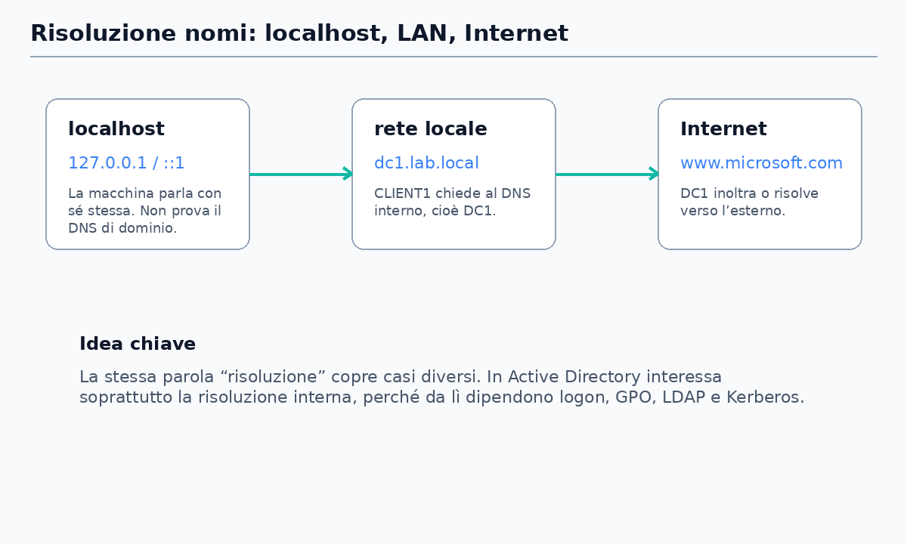

### Risoluzione su `localhost`

Quando usi `localhost`, il computer non deve interrogare un server DNS esterno. `localhost` indica il computer stesso e normalmente viene risolto verso:

```text
127.0.0.1
::1
```

`127.0.0.1` è l'indirizzo IPv4 di loopback. `::1` è l'equivalente IPv6.

📌 **Nota didattica**

Questa risoluzione è locale. Non dimostra che il DNS di dominio funzioni. Dimostra solo che il computer sa riferirsi a se stesso.

🛠️ **Attività operativa 1 - Verifica di localhost su CLIENT1**

Su `CLIENT1`, apri **Command Prompt** e digita:

```cmd
ping localhost
```

Poi esegui:

```cmd
nslookup localhost
```

🔎 **Verifica**

Osserva se il risultato punta a `127.0.0.1` o a `::1`. Se viene mostrato anche il DNS server usato, annotalo nelle evidenze.

🧾 **Evidenza da raccogliere**

Nel file `evidence_lab08.md`, inserisci:

```md
## Verifica localhost

Comando eseguito:

Risultato ottenuto:

Osservazione:
```

---

## Risoluzione nella rete locale

In una rete locale, un computer può risolvere nomi in diversi modi:

- file `hosts` locale;
- cache DNS locale;
- DNS Server aziendale;
- protocolli di risoluzione locale, se presenti;
- suffisso DNS configurato sulla scheda di rete.

Nel dominio Active Directory, il riferimento corretto deve essere il DNS interno del dominio. Per questo motivo `CLIENT1` deve usare `DC1` come DNS Server principale.

📌 **Nota didattica**

Un client di dominio non dovrebbe usare come DNS principale un DNS pubblico, come `8.8.8.8` o `1.1.1.1`. Quei DNS possono risolvere nomi Internet, ma non conoscono i record interni necessari ad Active Directory.

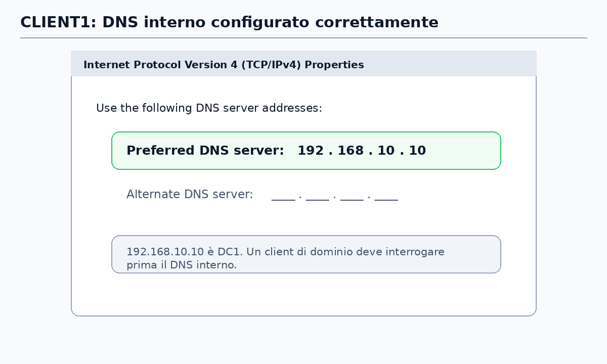

🛠️ **Attività operativa 2 - Verifica DNS configurato su CLIENT1 tramite GUI**

Su `CLIENT1`:

1. apri **Control Panel**;
2. entra in **Network and Sharing Center**;
3. seleziona **Change adapter settings**;
4. apri le proprietà della scheda di rete;
5. seleziona **Internet Protocol Version 4 (TCP/IPv4)**;
6. apri **Properties**;
7. verifica il campo **Preferred DNS server**.

Il DNS preferito deve puntare a `DC1`.

🔎 **Verifica da Command Prompt**

Su `CLIENT1`, esegui:

```cmd
ipconfig /all
```

Controlla queste righe:

```text
Primary Dns Suffix . . . . . . . : lab.local
DNS Servers . . . . . . . . . . . : <IP di DC1>
```

🧾 **Evidenza da raccogliere**

Nel report inserisci:

```md
## DNS configurato sul client

DNS Server configurato:
Suffisso DNS primario:
Il client usa il DNS interno del dominio? Sì/No
```

---

## Risoluzione su Internet

Quando un client cerca un nome Internet, per esempio `www.microsoft.com`, il DNS interno può comportarsi in due modi:

1. rispondere direttamente se conosce già la risposta o la trova in cache;
2. inoltrare la query ad altri DNS tramite **Forwarder** o, in assenza di forwarder, usare i **Root Hints**.

La struttura DNS pubblica è gerarchica:

- Root DNS;
- TLD, come `.com`, `.it`, `.org`;
- dominio, come `microsoft.com`;
- host o sottodominio, come `www.microsoft.com`.

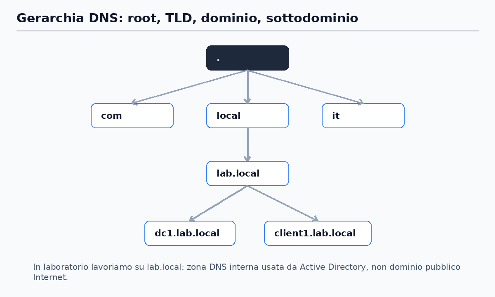

🛠️ **Attività operativa 3 - Verifica di un nome Internet da CLIENT1**

Su `CLIENT1`, esegui:

```cmd
nslookup www.microsoft.com
```

Poi prova:

```cmd
ping www.microsoft.com
```

🔎 **Verifica**

Il comando `nslookup` verifica la risoluzione DNS. Il comando `ping` verifica anche se la destinazione risponde al traffico ICMP. Se `ping` non riceve risposta, non significa automaticamente che il DNS sia guasto.

🧾 **Evidenza da raccogliere**

```md
## Risoluzione nome Internet

Nome testato:
DNS Server interrogato:
Risposta ottenuta:
Ping riuscito? Sì/No
Conclusione:
```

---

## DNS Manager: osservare la zona `lab.local`

Ora passiamo al lato server. Su `DC1` è installato il ruolo DNS Server. La console principale per osservare e gestire il servizio è **DNS Manager**.

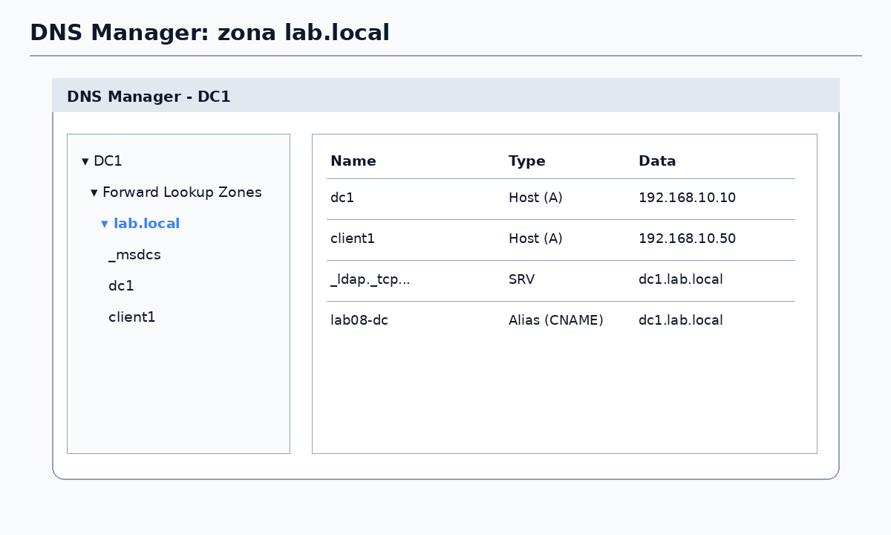

🛠️ **Attività operativa 4 - Aprire DNS Manager su DC1**

Su `DC1`:

1. apri **Server Manager**;
2. seleziona **Tools**;
3. apri **DNS**;
4. espandi il nodo del server `DC1`;
5. espandi **Forward Lookup Zones**;
6. seleziona la zona `lab.local`.

Osserva i record presenti nella zona.

### Record principali da riconoscere

| Tipo record | Significato | Esempio |
|---|---|---|
| `A` | associa un nome host a un IPv4 | `DC1 -> 192.168.10.10` |
| `AAAA` | associa un nome host a un IPv6 | `server -> fe80::...` |
| `CNAME` | alias verso un altro nome | `intranet -> srv1.lab.local` |
| `MX` | server di posta del dominio | usato per domini mail |
| `PTR` | risoluzione inversa IP -> nome | `192.168.10.10 -> dc1.lab.local` |
| `SRV` | localizzazione di un servizio | LDAP, Kerberos, GC |

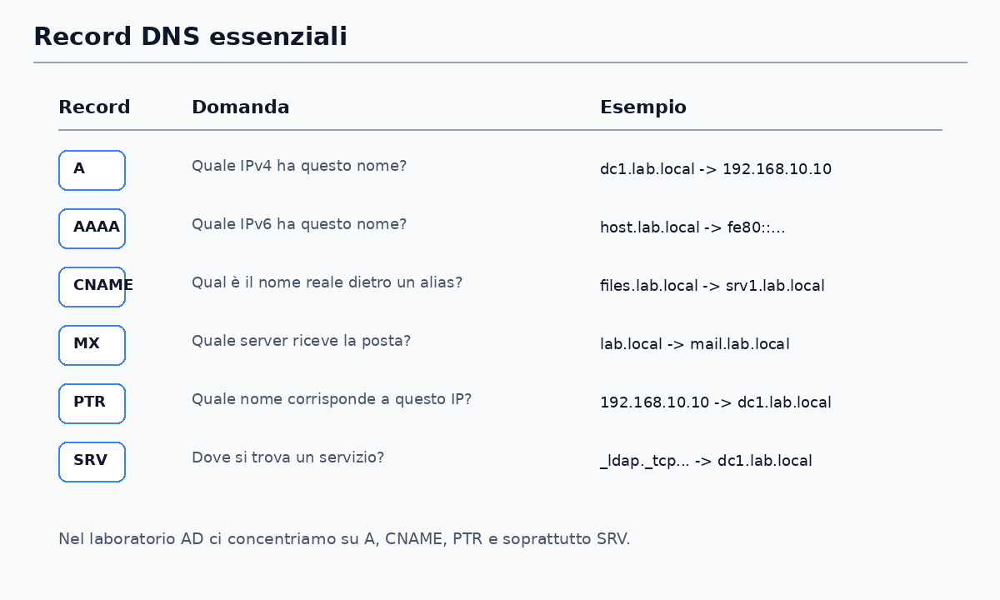

🛠️ **Attività operativa 5 - Creare un record A di test dalla GUI**

Su `DC1`, in **DNS Manager**:

1. seleziona la zona `lab.local`;
2. clic destro nello spazio bianco;
3. seleziona **New Host (A or AAAA)**;
4. inserisci:

```text
Name: app-lab08
IP address: 192.168.10.80
```

5. lascia selezionata l'opzione per creare anche il record PTR solo se è già presente una zona inversa coerente;
6. conferma con **Add Host**.

🔎 **Verifica da CLIENT1**

Su `CLIENT1`, esegui:

```cmd
nslookup app-lab08.lab.local
ping app-lab08.lab.local
```

Il `ping` può non ricevere risposta se non esiste realmente un host con quell'IP. In questo caso la parte importante è verificare che `nslookup` risolva il nome.

🧾 **Evidenza da raccogliere**

```md
## Record A creato da GUI

Nome record:
Indirizzo IP:
Risultato nslookup:
Osservazione su ping:
```

🧹 **Ripristino consigliato**

Alla fine del laboratorio elimina il record `app-lab08` se non sarà usato in altre attività.

---

## Forward Lookup Zone e Reverse Lookup Zone

Una **Forward Lookup Zone** risolve un nome in un indirizzo IP. Per esempio:

```text
dc1.lab.local -> 192.168.10.10
```

Una **Reverse Lookup Zone** fa il contrario:

```text
192.168.10.10 -> dc1.lab.local
```

La zona inversa è utile per diagnosi, log, strumenti di monitoraggio e alcuni servizi che verificano la coerenza tra IP e nome.

🛠️ **Attività operativa 6 - Verificare se esiste una zona inversa**

Su `DC1`, in **DNS Manager**:

1. espandi **Reverse Lookup Zones**;
2. verifica se esiste una zona relativa alla rete del laboratorio;
3. se esiste, aprila e osserva i record `PTR`;
4. se non esiste, annotalo nel report senza crearla automaticamente.

🔎 **Verifica con nslookup inverso**

Da `DC1` o `CLIENT1`:

```cmd
nslookup <IP_di_DC1>
```

Esempio:

```cmd
nslookup 192.168.10.10
```

🧾 **Evidenza da raccogliere**

```md
## Zona inversa

Reverse Lookup Zone presente? Sì/No
Risultato nslookup inverso:
Osservazione:
```

---


## Zone DNS, autorità e copie di backup

Prima di proseguire con le zone integrate in Active Directory, è utile chiarire un punto fondamentale: una zona DNS non è semplicemente una cartella che contiene record. Una zona DNS è una porzione dello spazio dei nomi per la quale uno o più server DNS possono essere responsabili.

Nel laboratorio stiamo lavorando con il dominio:

```text
lab.local
```

La zona `lab.local` contiene i record relativi al dominio didattico, per esempio `dc1.lab.local`, `client1.lab.local`, eventuali alias e record SRV usati da Active Directory.

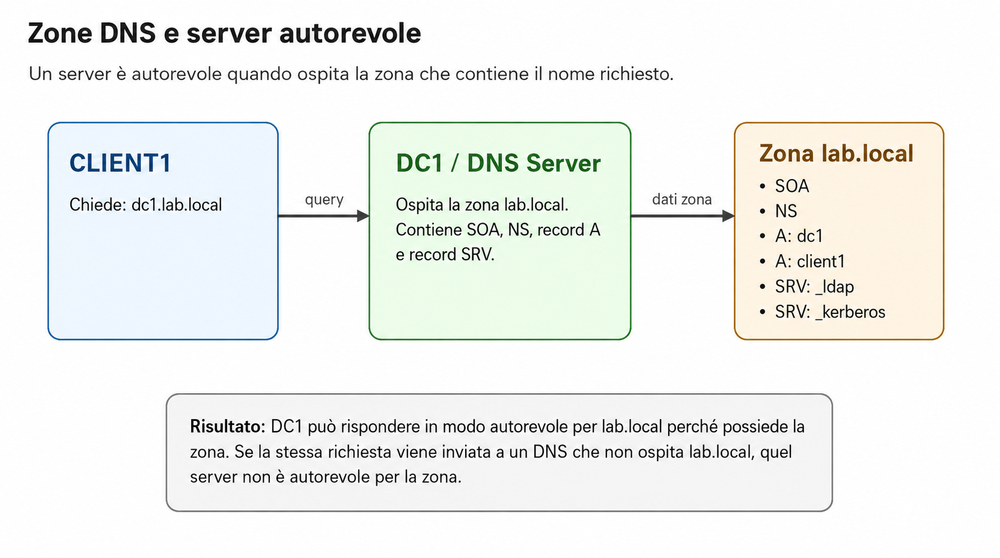

📌 **Concetto da fissare**

Un server DNS è **autorevole** per una zona quando ospita i dati ufficiali di quella zona. Se `DC1` ospita la zona `lab.local`, allora `DC1` è autorevole per i nomi contenuti in `lab.local`.

Esempio:

```text
client1.lab.local -> nome appartenente alla zona lab.local
www.microsoft.com -> nome esterno, non appartenente alla zona lab.local
```

Per il primo nome `DC1` può rispondere usando i dati della propria zona. Per il secondo nome `DC1` deve usare ricorsione, forwarder, root hints o cache, perché non ospita la zona `microsoft.com`.

🛠️ **Attività operativa 7 - Riconoscere la zona autorevole in DNS Manager**

Su `DC1`, apri **DNS Manager**:

1. espandi il server `DC1`;
2. apri **Forward Lookup Zones**;
3. seleziona la zona `lab.local`;
4. osserva i record presenti nella zona;
5. apri le proprietà della zona e verifica la scheda **Name Servers**.

🔎 **Verifica**

Annota quali server DNS risultano Name Server della zona `lab.local`.

🧾 **Evidenza da raccogliere**

```md
## Zona autorevole lab.local

Server DNS osservato:
Name Server della zona:
Record SOA presente? Sì/No
Record NS presenti:
Osservazione:
```

---

## Server autorevole e server non autorevole

Un server **autorevole** risponde per una zona che ospita direttamente. Un server **non autorevole** può comunque restituire una risposta, ma lo fa perché ha interrogato altri server oppure perché conserva una risposta nella cache.

Questa distinzione è importante perché aiuta a interpretare correttamente i risultati di `nslookup`.

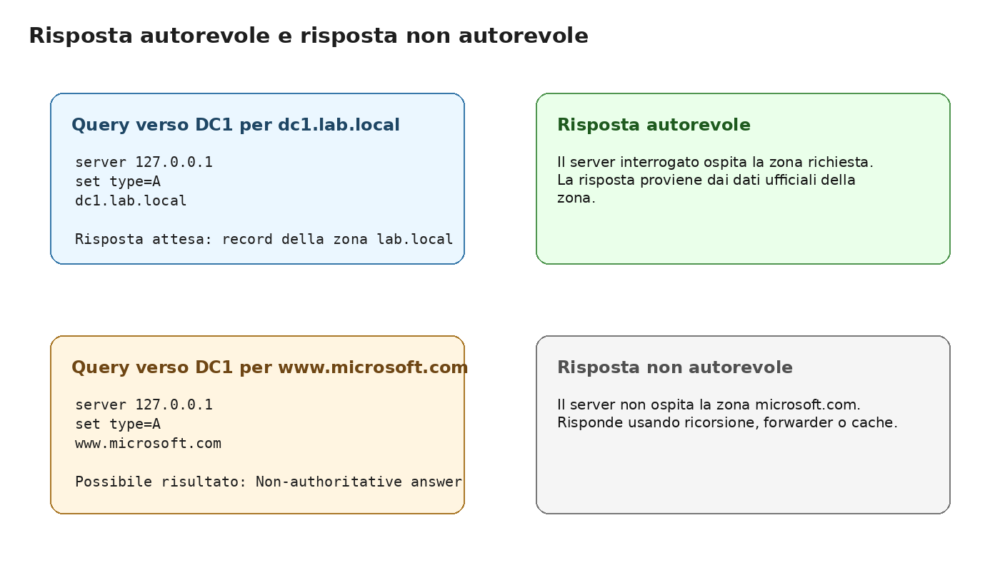

Esempio pratico:

- `DC1` è autorevole per `lab.local`;
- `DC1` non è autorevole per `microsoft.com`;
- se `CLIENT1` chiede a `DC1` un nome Internet, `DC1` può rispondere, ma non perché possiede quella zona;
- in quel caso la risposta deriva da ricorsione, forwarder o cache.

🛠️ **Attività operativa 8 - Confrontare risposta autorevole e non autorevole**

Su `DC1`, apri **Command Prompt**.

Esegui:

```cmd
nslookup dc1.lab.local 127.0.0.1
```

Poi esegui:

```cmd
nslookup www.microsoft.com 127.0.0.1
```

🔎 **Verifica**

Confronta i due risultati.

Nel primo caso stai interrogando `DC1` per un nome appartenente alla zona `lab.local`. Nel secondo caso stai interrogando `DC1` per un nome pubblico esterno.

📌 **Nota didattica**

La dicitura `Non-authoritative answer`, quando compare, non significa che la risposta sia necessariamente errata. Significa che il server interrogato non ospita direttamente la zona del nome richiesto.

🧾 **Evidenza da raccogliere**

```md
## Risposta autorevole e risposta non autorevole

Query interna eseguita:
Risultato query interna:

Query Internet eseguita:
Risultato query Internet:

Differenza osservata:
```

---

## Cache DNS e risposte non autorevoli

Un server DNS può conservare temporaneamente le risposte ottenute da altri server. Questa memoria temporanea si chiama **cache DNS**.

La cache permette di rispondere più rapidamente a richieste successive, ma non trasforma il server in autorevole per quella zona.

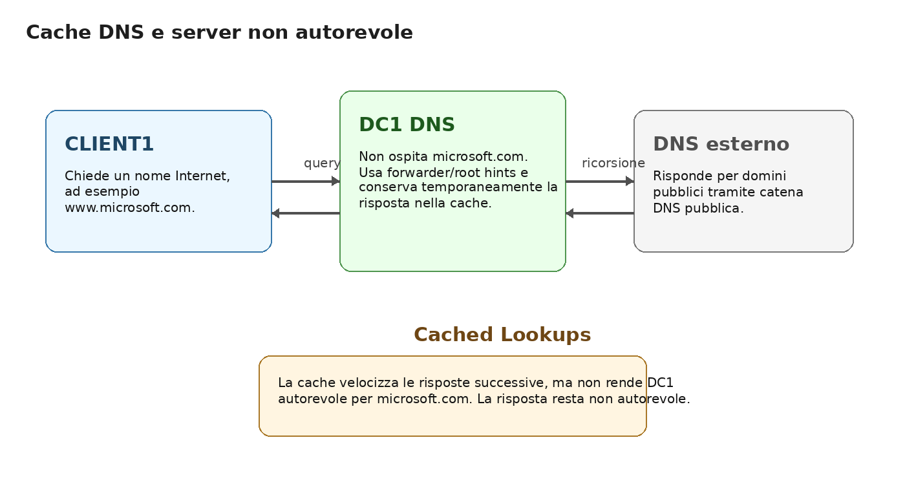

Esempio:

1. `CLIENT1` chiede a `DC1` l'indirizzo di `www.microsoft.com`;
2. `DC1` non ospita la zona `microsoft.com`;
3. `DC1` usa forwarder o root hints per ottenere la risposta;
4. `DC1` conserva temporaneamente la risposta in cache;
5. una richiesta successiva può essere servita più rapidamente.

🛠️ **Attività operativa 9 - Osservare la cache DNS da GUI**

Su `DC1`, in **DNS Manager**:

1. seleziona il server `DC1`;
2. dal menu **View**, abilita **Advanced**;
3. cerca il nodo **Cached Lookups**;
4. espandi le voci disponibili;
5. confronta queste voci con la zona `lab.local`.

🔎 **Verifica**

La zona `lab.local` è una zona ospitata dal server. Le voci in **Cached Lookups** sono risposte memorizzate temporaneamente.

🧾 **Evidenza da raccogliere**

```md
## Cache DNS

Cached Lookups visibile? Sì/No
Esempio di voce osservata:
Differenza rispetto alla zona lab.local:
```

---

## Zone primarie, zone secondarie e zone di backup

Dal punto di vista DNS, una zona può essere gestita in modi diversi.

| Tipo zona | Significato operativo | Modificabile dal server che la ospita? |
|---|---|---|
| Primary zone | Zona principale gestita dal server DNS | Sì |
| Secondary zone | Copia in sola lettura ottenuta da un altro server DNS | No |
| AD-integrated zone | Zona archiviata e replicata tramite Active Directory | Sì, sui Domain Controller DNS autorizzati |
| Stub zone | Zona ridotta che contiene solo i riferimenti necessari a trovare i server autorevoli | No, non contiene tutti i record |

In un ambiente Active Directory moderno, la continuità del DNS interno si ottiene normalmente usando **zone integrate in Active Directory** replicate tra più Domain Controller DNS. La zona secondaria resta però utile per comprendere il concetto di copia DNS, trasferimento di zona e server autorevole secondario.

📌 **Concetto importante**

Una **zona secondaria** è una copia in sola lettura della zona. Il server che ospita la zona secondaria può rispondere in modo autorevole per i dati copiati, ma non può modificare direttamente i record.

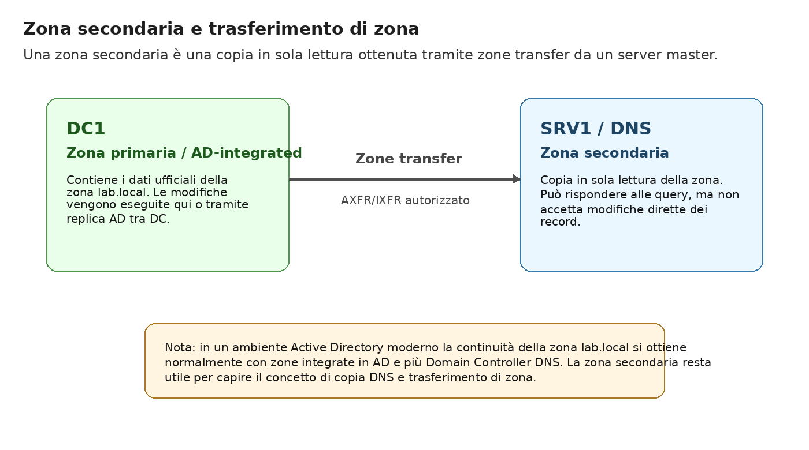

Esempio:

```text
DC1  -> ospita la zona lab.local
SRV1 -> ospita una zona secondaria lab.local, copiata da DC1
```

In questo scenario `SRV1` può rispondere alle query per `lab.local`, ma non può creare o modificare direttamente i record della zona. Gli aggiornamenti arrivano tramite **zone transfer** dal server master.

🛠️ **Attività operativa 10 - Analizzare l'idea di zona secondaria**

Questa attività può essere svolta in due modalità:

- **modalità osservazione guidata**, se non si vuole modificare `SRV1`;
- **modalità laboratorio**, se `SRV1` è disponibile e può ospitare temporaneamente il ruolo DNS Server.

### Modalità osservazione guidata

Su `DC1`, in **DNS Manager**:

1. clic destro sulla zona `lab.local`;
2. apri **Properties**;
3. vai nella scheda **Zone Transfers**;
4. osserva se i trasferimenti di zona sono abilitati o disabilitati;
5. non modificare la configurazione se non richiesto dal docente.

🔎 **Verifica**

Annota lo stato dei trasferimenti di zona.

```md
## Zone transfer osservato

Zona:
Zone transfer abilitato? Sì/No
Configurazione osservata:
```

### Modalità laboratorio su SRV1

Eseguire questa parte solo se `SRV1` è disponibile e può essere usato come DNS Server temporaneo.

Su `SRV1`, installa il ruolo DNS Server tramite **Server Manager**:

1. apri **Server Manager**;
2. seleziona **Manage > Add Roles and Features**;
3. scegli **Role-based or feature-based installation**;
4. seleziona `SRV1`;
5. abilita **DNS Server**;
6. completa il wizard.

Su `DC1`, abilita temporaneamente il trasferimento di zona per `lab.local`:

1. apri **DNS Manager**;
2. clic destro su `lab.local`;
3. seleziona **Properties**;
4. apri **Zone Transfers**;
5. abilita **Allow zone transfers**;
6. seleziona l'opzione più restrittiva disponibile, preferibilmente verso server specifici;
7. indica `SRV1` se richiesto dalla configurazione.

Su `SRV1`, crea una zona secondaria:

1. apri **DNS Manager**;
2. clic destro su **Forward Lookup Zones**;
3. seleziona **New Zone...**;
4. scegli **Secondary zone**;
5. nome zona: `lab.local`;
6. Master DNS Server: indirizzo IP di `DC1`;
7. completa il wizard.

🔎 **Verifica**

Da `SRV1`:

```cmd
nslookup dc1.lab.local 127.0.0.1
```

Da `DC1` o `CLIENT1`:

```cmd
nslookup dc1.lab.local <IP_di_SRV1>
```

🧾 **Evidenza da raccogliere**

```md
## Zona secondaria su SRV1

SRV1 usato? Sì/No
Ruolo DNS installato? Sì/No
Zona secondaria creata? Sì/No
Master server configurato:
Risultato nslookup verso SRV1:
Osservazione sulla sola lettura:
```

🧹 **Ripristino obbligatorio se è stata svolta la modalità laboratorio**

Alla fine dell'attività:

1. elimina la zona secondaria `lab.local` da `SRV1`;
2. su `DC1`, riporta i trasferimenti di zona allo stato precedente;
3. se il ruolo DNS Server su `SRV1` non serve più, documenta se viene lasciato installato o rimosso;
4. verifica che `CLIENT1` continui a usare `DC1` come DNS principale.

---

## Zone integrate in Active Directory

In un dominio AD DS, la zona DNS può essere integrata in Active Directory. In questo caso i dati della zona non sono gestiti come semplice file di testo DNS, ma vengono archiviati e replicati attraverso Active Directory.

Questo porta tre vantaggi importanti:

1. replica integrata con AD DS;
2. modifiche possibili da più Domain Controller DNS;
3. sicurezza tramite autorizzazioni e aggiornamenti dinamici sicuri.

🛠️ **Attività operativa 11 - Verificare che `lab.local` sia AD-integrated**

Su `DC1`, in **DNS Manager**:

1. clic destro sulla zona `lab.local`;
2. seleziona **Properties**;
3. nella scheda **General**, verifica:

```text
Type: Active Directory-Integrated
Dynamic updates: Secure only
```

Controlla anche il pulsante **Change...** accanto alla replica, se disponibile.

🔎 **Verifica del replication scope**

Osserva l'ambito di replica della zona. In un dominio didattico è frequente trovare una configurazione simile:

```text
To all DNS servers running on domain controllers in this domain: lab.local
```

📌 **Nota didattica**

Il replication scope stabilisce quali Domain Controller DNS ricevono la zona. Non è la stessa cosa di una semplice copia manuale di file DNS.

🧾 **Evidenza da raccogliere**

```md
## Zona integrata in Active Directory

Tipo zona:
Dynamic updates:
Replication scope:
Considerazione:
```

---

## Aggiornamenti dinamici sicuri

Con gli aggiornamenti dinamici, i client possono registrare o aggiornare automaticamente i propri record DNS. In un dominio Active Directory è preferibile usare aggiornamenti dinamici **Secure only**, cioè consentiti solo a computer e account autorizzati.

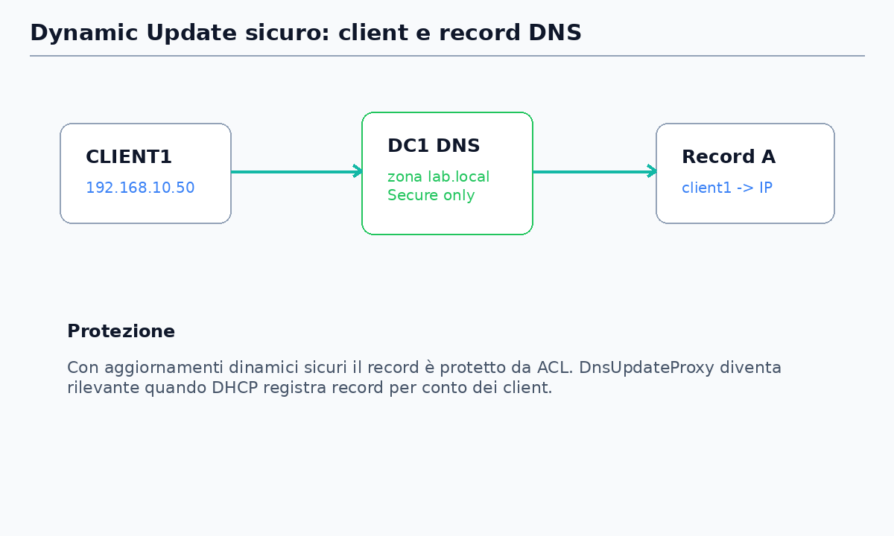

🛠️ **Attività operativa 12 - Verificare la registrazione DNS del client**

Su `CLIENT1`, esegui:

```cmd
hostname
ipconfig /all
ipconfig /registerdns
```

Attendi circa un minuto.

Su `DC1`, in **DNS Manager**:

1. apri la zona `lab.local`;
2. cerca il record relativo a `CLIENT1`;
3. controlla l'indirizzo IP associato.

🔎 **Verifica con nslookup**

Su `CLIENT1`:

```cmd
nslookup client1.lab.local
```

🧾 **Evidenza da raccogliere**

```md
## Registrazione dinamica client

Nome client:
IP client:
Record presente in DNS? Sì/No
Risultato nslookup:
```

📌 **Nota su DnsUpdateProxy**

Il gruppo `DnsUpdateProxy` può essere usato in scenari in cui un server DHCP registra record DNS per conto dei client. È un argomento importante quando DHCP e DNS lavorano insieme, ma in questa sessione lo trattiamo come concetto di collegamento verso il laboratorio DHCP.

---

## Record SRV: il punto centrale per Active Directory

I record `SRV` non servono a risolvere semplicemente il nome di un host. Servono a localizzare un servizio.

In Active Directory sono essenziali perché permettono ai client di trovare:

- Domain Controller;
- servizio LDAP;
- servizio Kerberos KDC;
- Global Catalog;
- servizi legati al dominio e alla foresta.

La struttura generale di un record SRV è:

```text
_service._proto.name. TTL class SRV priority weight port target
```

Esempio concettuale:

```text
_ldap._tcp.dc._msdcs.lab.local SRV 0 100 389 dc1.lab.local
```

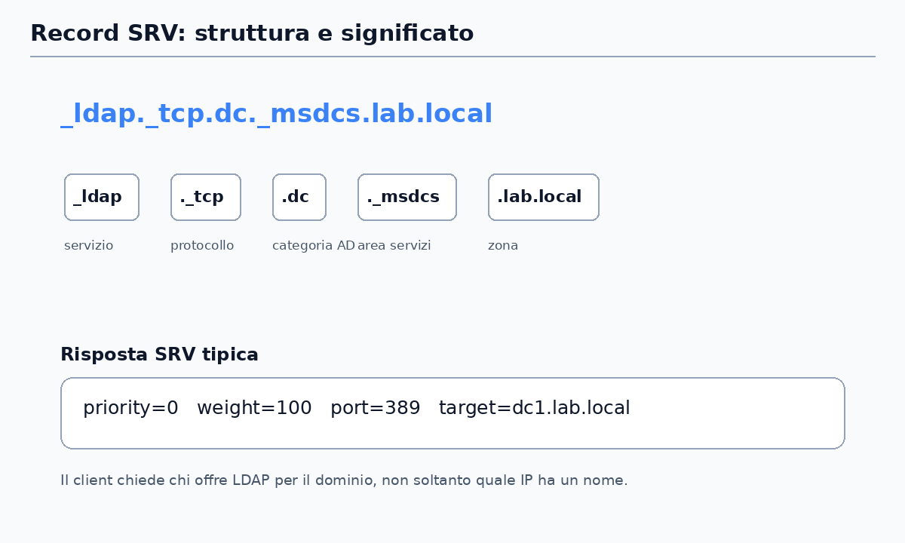

🛠️ **Attività operativa 13 - Osservare i record SRV nella GUI**

Su `DC1`, in **DNS Manager**:

1. espandi **Forward Lookup Zones**;
2. espandi `lab.local`;
3. osserva le cartelle con prefisso `_tcp`, `_udp`, `_sites`, `_msdcs`;
4. apri `_msdcs.lab.local`, se presente come zona separata o come struttura delegata;
5. cerca record collegati a LDAP, Kerberos e Domain Controller.

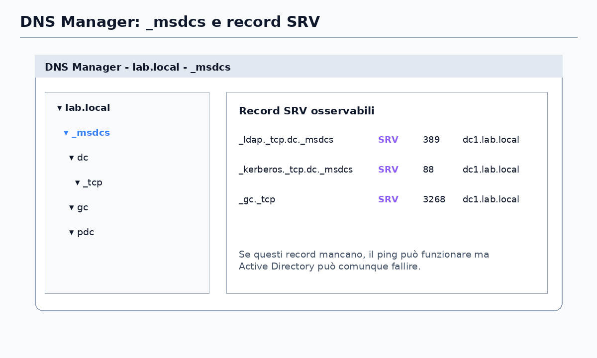

🔎 **Verifica guidata**

Individua almeno un record SRV e annota:

```md
Nome record SRV:
Porta:
Target:
Servizio rappresentato:
```

---

## DC Locator: come un client trova il Domain Controller

Quando `CLIENT1` deve autenticarsi o applicare criteri di dominio, deve trovare un Domain Controller adatto. Questo processo usa il DNS e in particolare i record SRV.

Il flusso semplificato è:

1. il client conosce il dominio `lab.local`;
2. interroga il DNS per record SRV del dominio;
3. riceve uno o più Domain Controller disponibili;
4. sceglie un DC e usa i servizi necessari, come LDAP e Kerberos.

🛠️ **Attività operativa 14 - Verificare DC Locator da CLIENT1**

Su `CLIENT1`, apri **Command Prompt** ed esegui:

```cmd
nltest /dsgetdc:lab.local
```

Poi esegui:

```cmd
echo %LOGONSERVER%
```

🔎 **Verifica**

Confronta il Domain Controller restituito da `nltest` con il server indicato da `%LOGONSERVER%`.

🧾 **Evidenza da raccogliere**

```md
## DC Locator

Output nltest:
Logon server:
Osservazione:
```

---

## nslookup lato client: interrogare il DNS usato da CLIENT1

`nslookup` permette di interrogare un DNS Server e verificare come viene risolto un nome. Se usato da `CLIENT1`, mostra quale DNS Server il client sta interrogando.

🛠️ **Attività operativa 15 - Uso base di nslookup da CLIENT1**

Su `CLIENT1`, esegui:

```cmd
nslookup dc1.lab.local
nslookup client1.lab.local
nslookup _ldap._tcp.dc._msdcs.lab.local
```

Il terzo comando può richiedere l'impostazione del tipo record a `SRV` in modalità interattiva, che vedremo tra poco.

🔎 **Verifica**

Controlla sempre le prime righe dell'output:

```text
Server:  <nome DNS server>
Address: <IP DNS server>
```

Se il server interrogato non è `DC1`, il test non descrive correttamente il DNS del dominio.

---

## nslookup lato server: interrogare il DNS direttamente da DC1

Ora lavoriamo da `DC1`. Questo passaggio è importante perché consente di distinguere due problemi diversi:

- il DNS Server non contiene o non risolve correttamente il record;
- il client non sta interrogando il DNS corretto.

Se da `DC1` la query funziona, ma da `CLIENT1` non funziona, il problema può essere sul client, sulla configurazione IP, sulla cache o sulla connettività.

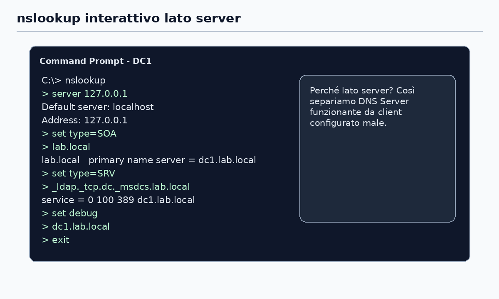

🛠️ **Attività operativa 16 - Query diretta dal server DNS**

Su `DC1`, apri **Command Prompt** ed esegui:

```cmd
nslookup dc1.lab.local 127.0.0.1
nslookup client1.lab.local 127.0.0.1
nslookup app-lab08.lab.local 127.0.0.1
```

Il parametro `127.0.0.1` indica a `nslookup` di interrogare il DNS Server locale.

🔎 **Verifica**

Se il record `app-lab08` è stato creato nella GUI, deve essere risolto anche interrogando il DNS locale.

🧾 **Evidenza da raccogliere**

```md
## nslookup lato server

Record interrogati:
Server DNS usato:
Risultati:
Differenza rispetto al test da CLIENT1:
```

---

## nslookup interattivo su DC1

La modalità interattiva di `nslookup` è utile perché consente di impostare il tipo di record da interrogare e di cambiare server DNS senza riscrivere ogni volta il comando.

🛠️ **Attività operativa 17 - Avviare nslookup interattivo su DC1**

Su `DC1`, esegui:

```cmd
nslookup
```

Poi imposta il server locale:

```cmd
server 127.0.0.1
```

### Lettura del record SOA

Il record `SOA` contiene informazioni amministrative sulla zona.

```cmd
set type=SOA
lab.local
```

Annota il server primario e le informazioni restituite.

### Lettura dei Name Server

```cmd
set type=NS
lab.local
```

Il risultato indica quali DNS Server sono autorevoli per la zona.

### Lettura dei record A

```cmd
set type=A
dc1.lab.local
client1.lab.local
```

### Lettura dei record SRV per LDAP

```cmd
set type=SRV
_ldap._tcp.dc._msdcs.lab.local
```

### Lettura dei record SRV per Kerberos

```cmd
_kerberos._tcp.dc._msdcs.lab.local
```

### Attivazione debug

```cmd
set debug
_ldap._tcp.dc._msdcs.lab.local
```

Per uscire:

```cmd
exit
```

🔎 **Verifica**

Durante il test, identifica almeno:

- un record `SOA`;
- un record `NS`;
- un record `A`;
- un record `SRV` relativo a LDAP;
- un record `SRV` relativo a Kerberos.

🧾 **Evidenza da raccogliere**

```md
## nslookup interattivo

SOA:
NS:
Record A verificato:
Record SRV LDAP:
Record SRV Kerberos:
Osservazione sul debug:
```

---

## Forwarder, Root Hints e Conditional Forwarder

Un DNS interno deve risolvere sia nomi interni sia nomi esterni. Per i nomi esterni può usare diversi meccanismi.

| Meccanismo | Uso |
|---|---|
| Forwarder | inoltra query non locali a DNS esterni configurati |
| Root Hints | usa la gerarchia DNS pubblica partendo dai root server |
| Conditional Forwarder | inoltra solo uno specifico dominio verso DNS specifici |

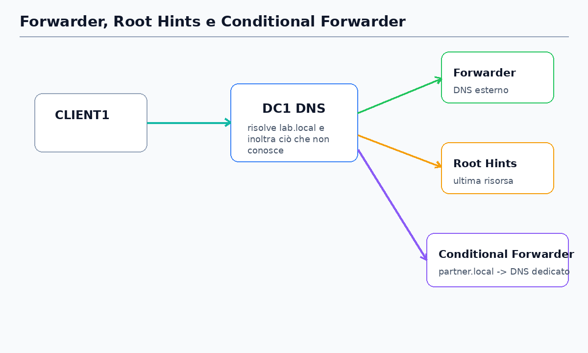

🛠️ **Attività operativa 18 - Verificare i Forwarder nella GUI**

Su `DC1`, in **DNS Manager**:

1. clic destro sul nome del server `DC1`;
2. seleziona **Properties**;
3. apri la scheda **Forwarders**;
4. osserva se sono configurati DNS esterni;
5. non modificare i valori senza indicazione del docente.

🔎 **Verifica**

Da `CLIENT1`, prova:

```cmd
nslookup www.microsoft.com
```

Se la risoluzione funziona, il DNS interno riesce a risolvere anche nomi esterni, tramite forwarder, root hints o cache.

🛠️ **Attività operativa 19 - Osservare Root Hints**

Sempre nelle proprietà del server DNS:

1. apri la scheda **Root Hints**;
2. osserva l'elenco dei root server;
3. non eliminare record.

📌 **Nota didattica**

In molte reti aziendali si preferisce usare forwarder espliciti e controllati. I Root Hints rappresentano una modalità di risoluzione alternativa, ma non sempre sono desiderati in ambienti con policy di sicurezza restrittive.

🛠️ **Attività operativa 20 - Creare un Conditional Forwarder di esempio non operativo**

Questa attività è dimostrativa. Non deve interferire con il dominio `lab.local`.

Su `DC1`, in **DNS Manager**:

1. clic destro su **Conditional Forwarders**;
2. seleziona **New Conditional Forwarder**;
3. inserisci:

```text
DNS Domain: partner.example
IP address of the master servers: 192.168.10.250
```

4. crea il conditional forwarder;
5. osserva come appare nella console;
6. elimina subito il conditional forwarder al termine dell'osservazione.

🧹 **Ripristino**

Elimina `partner.example` dopo la verifica.

🧾 **Evidenza da raccogliere**

```md
## Forwarder e Conditional Forwarder

Forwarder presenti:
Root Hints osservati:
Conditional Forwarder creato:
Conditional Forwarder eliminato: Sì/No
```

---

## Cache DNS del client

Il client conserva una cache locale delle risposte DNS. Questo riduce le query ripetute, ma può creare confusione durante i test se la cache contiene informazioni vecchie.

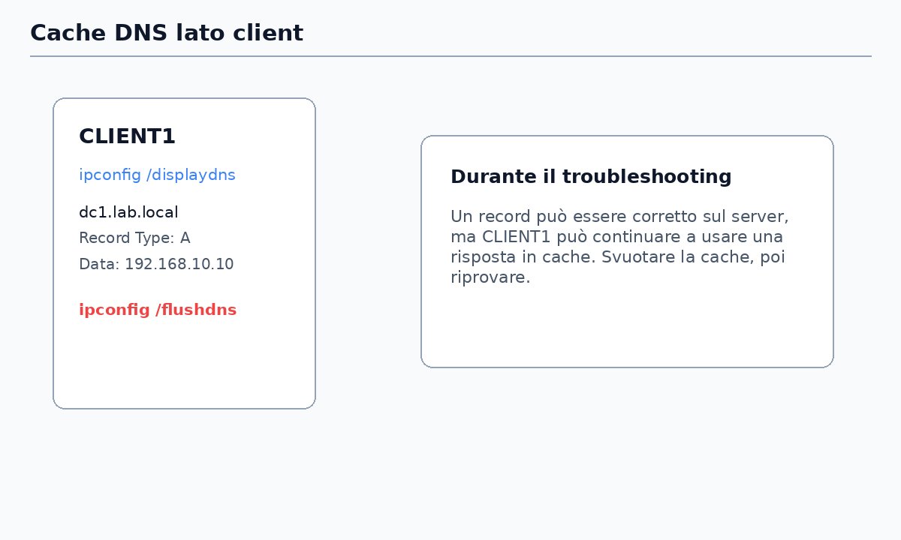

🛠️ **Attività operativa 21 - Osservare e svuotare la cache DNS**

Su `CLIENT1`:

```cmd
ipconfig /displaydns
```

Poi svuota la cache:

```cmd
ipconfig /flushdns
```

Ripeti una query:

```cmd
nslookup dc1.lab.local
```

🔎 **Verifica**

Dopo `flushdns`, il client deve interrogare nuovamente il DNS Server per ottenere la risposta.

---

## Troubleshooting controllato: DNS client errato

Ora simuleremo un problema frequente: il client usa un DNS non corretto. Questo è uno degli errori più comuni nei domini Active Directory.

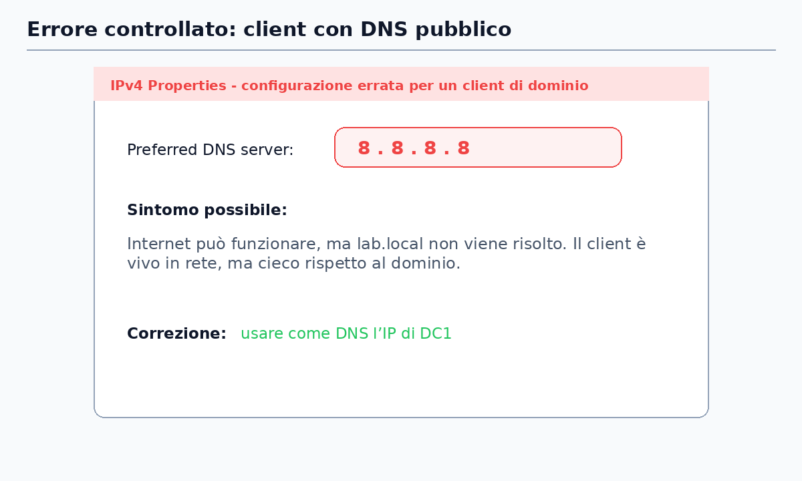

🧪 **Prova controllata 1 - Configurare temporaneamente DNS errato su CLIENT1**

Su `CLIENT1`:

1. apri le proprietà IPv4 della scheda di rete;
2. annota il DNS attuale;
3. imposta temporaneamente come DNS preferito:

```text
8.8.8.8
```

4. conferma le finestre.

🔎 **Verifica dell'errore**

Da `CLIENT1`, esegui:

```cmd
ipconfig /flushdns
nslookup dc1.lab.local
nltest /dsgetdc:lab.local
```

Risultato atteso: la risoluzione dei nomi interni e/o la localizzazione del Domain Controller può fallire, perché il DNS pubblico non conosce `lab.local`.

🧾 **Evidenza da raccogliere**

```md
## Troubleshooting DNS client errato

DNS errato impostato:
Comando fallito:
Messaggio ottenuto:
Motivo tecnico:
```

🧹 **Ripristino obbligatorio**

Riporta il DNS preferito all'indirizzo IP di `DC1`.

Poi esegui:

```cmd
ipconfig /flushdns
ipconfig /registerdns
nltest /dsgetdc:lab.local
```

Il laboratorio può proseguire solo dopo il ripristino.

---

## Troubleshooting controllato: record mancante o non aggiornato

Un altro caso frequente riguarda record mancanti, duplicati o non aggiornati. In questa sessione non elimineremo record critici di dominio. Useremo solo record di test.

🧪 **Prova controllata 2 - Eliminare e ricreare un record di test**

Su `DC1`, in **DNS Manager**:

1. trova il record `app-lab08` creato in precedenza;
2. eliminalo;
3. da `CLIENT1`, verifica:

```cmd
nslookup app-lab08.lab.local
```

4. ricrea il record `A` da GUI;
5. svuota la cache DNS su `CLIENT1`:

```cmd
ipconfig /flushdns
```

6. ripeti la verifica:

```cmd
nslookup app-lab08.lab.local
```

🔎 **Verifica**

La differenza tra test fallito e test riuscito deve essere documentata.

🧾 **Evidenza da raccogliere**

```md
## Record mancante e ripristino

Record eliminato:
Risultato prima del ripristino:
Risultato dopo il ripristino:
Conclusione:
```

---

## Event Viewer e diagnostica DNS

La GUI non serve solo a configurare. Serve anche a leggere errori. In Windows Server gli eventi DNS si trovano in Event Viewer.

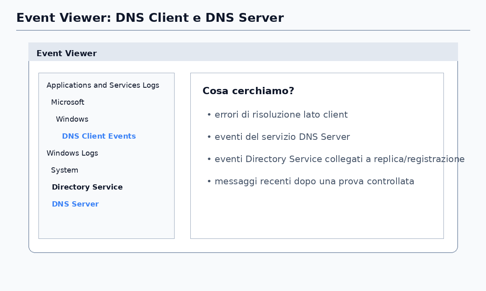

🛠️ **Attività operativa 22 - Consultare eventi DNS su DC1**

Su `DC1`:

1. apri **Event Viewer**;
2. espandi **Applications and Services Logs**;
3. cerca i log relativi a **DNS Server**;
4. osserva eventi informativi, warning o errori;
5. non modificare configurazioni da Event Viewer.

🔎 **Verifica**

Annota almeno un evento DNS, anche se informativo.

🧾 **Evidenza da raccogliere**

```md
## Event Viewer DNS

Log consultato:
Event ID osservato:
Tipo evento:
Descrizione sintetica:
```

📌 **Nota su DNS Debug Logging**

Il DNS Debug Logging può registrare informazioni dettagliate sulle query DNS. È utile per diagnosi avanzata, ma può generare molti dati. In un ambiente di produzione va usato con attenzione e per periodi limitati.

---

## Scavenging, DHCP e record obsoleti

Nel tempo il DNS può accumulare record non più validi, per esempio relativi a client eliminati, rinominati o con IP cambiato. Questi record vengono spesso chiamati record obsoleti.

Lo **scavenging** permette di rimuovere record dinamici non più aggiornati, secondo intervalli di refresh e no-refresh. La configurazione va pianificata con attenzione, perché una pulizia aggressiva può eliminare record ancora utili.

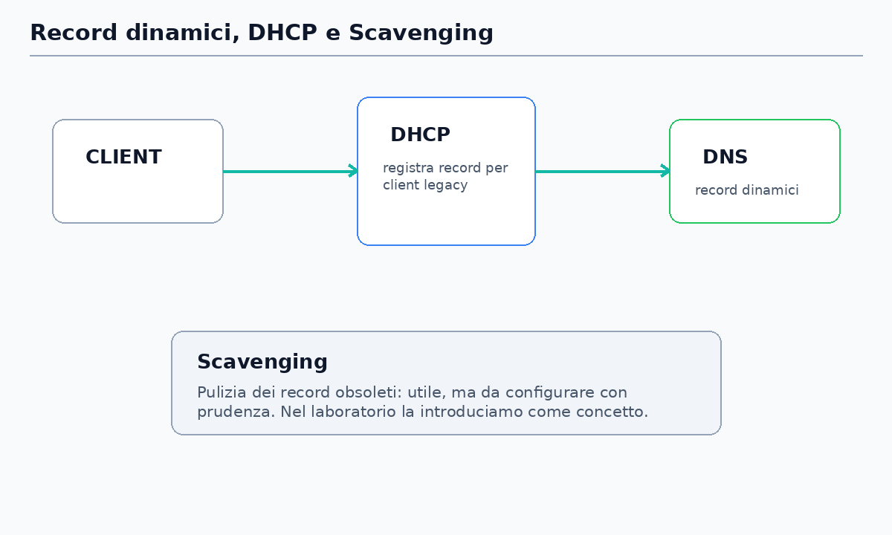

🛠️ **Attività operativa 23 - Osservare le opzioni di aging/scavenging**

Su `DC1`, in **DNS Manager**:

1. clic destro sulla zona `lab.local`;
2. seleziona **Properties**;
3. cerca le impostazioni relative ad **Aging**;
4. osserva senza modificare se non indicato dal docente.

📌 **Collegamento con DHCP**

Nel laboratorio DHCP, il server DHCP potrà essere configurato per registrare record DNS per conto dei client. Questo diventa importante per client non Windows, dispositivi legacy o ambienti in cui si vuole centralizzare la registrazione DNS.

---

## Cenni enterprise da riconoscere

In questa sessione non configuriamo tutte le funzionalità avanzate, ma è utile riconoscerle.

| Funzionalità | A cosa serve | Livello di approfondimento in questa sessione |
|---|---|---|
| DNS Policies | risposte DNS diverse in base a criteri come subnet o posizione | cenno concettuale |
| DNSSEC | firma e validazione DNS per ridurre spoofing e manomissioni | cenno concettuale |
| Stub Zone | contiene riferimenti ai DNS autorevoli di un'altra zona | confronto concettuale |
| Secondary Zone | copia leggibile di una zona primaria | confronto concettuale |
| Custom DNS Application Partition | replica DNS su partizione applicativa specifica | cenno architetturale |

🛠️ **Attività operativa 24 - Confronto guidato in DNS Manager**

Su `DC1`, senza creare nuove zone:

1. clic destro su **Forward Lookup Zones**;
2. seleziona **New Zone...**;
3. osserva i tipi di zona disponibili;
4. leggi le opzioni senza completare il wizard;
5. annulla il wizard.

🔎 **Verifica**

Nel report indica almeno due tipi di zona disponibili e il loro significato.

---

## PowerShell di consolidamento

Questa sezione serve a confrontare ciò che è stato visto nella GUI con comandi utili per lettura, report e verifica. Non sostituisce il percorso GUI della sessione.

🛠️ **Attività operativa 25 - Lettura delle zone DNS**

Su `DC1`, apri **PowerShell come amministratore**:

```powershell
Get-DnsServerZone
```

Filtra la zona del dominio:

```powershell
Get-DnsServerZone | Where-Object {$_.ZoneName -eq "lab.local"}
```

🛠️ **Attività operativa 26 - Lettura dei record principali**

```powershell
Get-DnsServerResourceRecord -ZoneName "lab.local" | Select-Object HostName, RecordType, Timestamp
```

🛠️ **Attività operativa 27 - Lettura record SRV**

```powershell
Get-DnsServerResourceRecord -ZoneName "_msdcs.lab.local" -RRType SRV
```

Se `_msdcs.lab.local` non è una zona separata nel tuo ambiente, osserva la struttura dalla GUI e adatta il controllo alla zona disponibile.

🛠️ **Attività operativa 28 - Verifica AD DS e DNS con dcdiag**

```cmd
dcdiag /test:dns /v
```

🛠️ **Attività operativa 29 - Export dei record DNS**

```powershell
Get-DnsServerResourceRecord -ZoneName "lab.local" |
Select-Object HostName, RecordType, Timestamp |
Export-Csv "C:\Temp\lab08_dns_records.csv" -NoTypeInformation -Encoding UTF8
```

🔎 **Verifica**

Apri il CSV e controlla che contenga i record esportati.

---

## Mappa di troubleshooting DNS

Quando un problema sembra riguardare Active Directory, prima di modificare utenti, OU o GPO è utile controllare DNS e connettività.

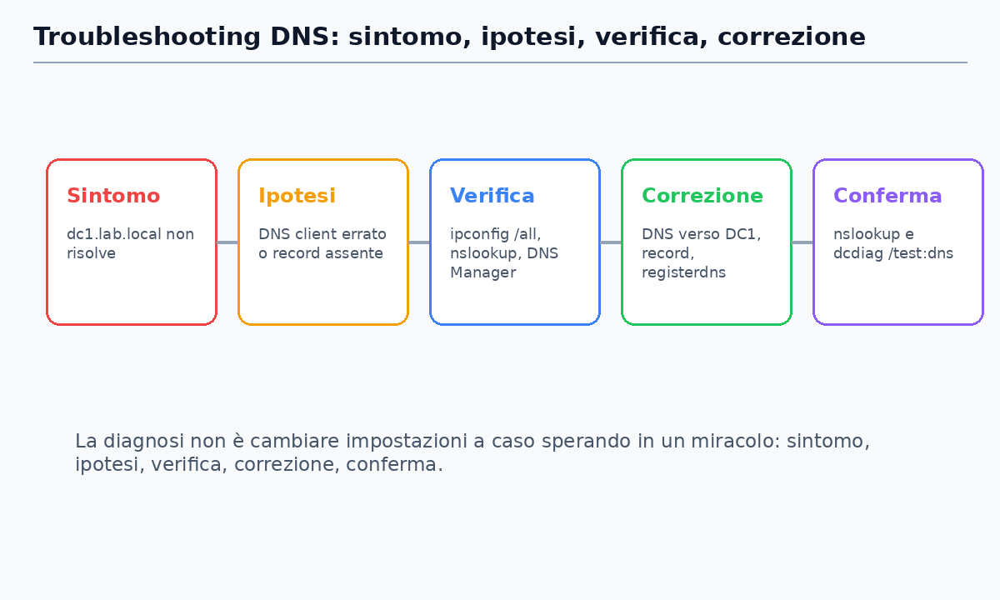

Sequenza consigliata:

1. verificare IP e DNS client con `ipconfig /all`;
2. verificare risoluzione del Domain Controller con `nslookup dc1.lab.local`;
3. verificare record SRV con `nslookup` interattivo;
4. verificare DC Locator con `nltest /dsgetdc:lab.local`;
5. verificare stato DNS lato server con DNS Manager;
6. controllare Event Viewer;
7. usare `dcdiag /test:dns` per diagnosi più completa.

---

## Consegna finale del laboratorio

Alla fine della sessione ogni partecipante deve produrre un file:

```text
evidence_lab08.md
```

Il file deve contenere almeno:

```md
# Evidenze LAB08 - DNS avanzato per Active Directory

## 1. Verifica localhost

## 2. Configurazione DNS di CLIENT1

## 3. Zona lab.local osservata da DNS Manager

## 4. Record A app-lab08 creato e verificato

## 5. Zona autorevole lab.local

## 6. Risposta autorevole e risposta non autorevole

## 7. Cache DNS

## 8. Zone transfer osservato

## 9. Zona secondaria su SRV1, se svolta

## 10. Zona integrata in Active Directory

## 11. Dynamic Update e record CLIENT1

## 12. Record SRV e _msdcs

## 13. DC Locator con nltest

## 14. nslookup lato server

## 15. nslookup interattivo

## 16. Forwarder e Root Hints

## 17. Troubleshooting DNS client errato

## 18. Event Viewer DNS

## 19. PowerShell di consolidamento

## 20. Conclusione tecnica
```

---

## Domande di consolidamento

1. Perché `localhost` non dimostra che il DNS di dominio funziona?
2. Perché `CLIENT1` deve usare `DC1` come DNS principale?
3. Qual è la differenza tra record `A` e record `SRV`?
4. A cosa serve `_msdcs.lab.local`?
5. Che differenza c'è tra Forward Lookup Zone e Reverse Lookup Zone?
6. Quando un server DNS è autorevole per una zona?
7. Che cosa significa risposta non autorevole in `nslookup`?
8. Perché la cache DNS non rende un server autorevole per una zona?
9. Qual è la differenza tra zona primaria, zona secondaria e zona integrata in Active Directory?
10. Perché una zona secondaria può essere considerata una copia di backup DNS ma non sostituisce la replica AD?
11. Cosa significa che una zona è integrata in Active Directory?
12. Perché gli aggiornamenti dinamici sicuri sono preferibili in un dominio?
13. Quale comando permette di verificare il Domain Controller trovato dal client?
14. Perché `nslookup` lato server aiuta a distinguere un problema server da un problema client?
15. Quando useresti un Conditional Forwarder?
16. Perché lo scavenging va configurato con attenzione?
17. Quali evidenze useresti per dimostrare che il DNS supporta correttamente Active Directory?

---

## Ripristino finale

Prima di chiudere il laboratorio verifica che:

- `CLIENT1` usi nuovamente `DC1` come DNS principale;
- il conditional forwarder `partner.example`, se creato, sia stato eliminato;
- la zona secondaria `lab.local` su `SRV1`, se creata, sia stata rimossa o documentata secondo indicazione del docente;
- i trasferimenti di zona di `lab.local` siano stati riportati allo stato iniziale;
- il record di test `app-lab08` sia eliminato o documentato;
- non siano state modificate zone critiche non richieste;
- `nltest /dsgetdc:lab.local` funzioni da `CLIENT1`;
- `dcdiag /test:dns` non segnali errori critici inattesi.

Comandi finali consigliati su `CLIENT1`:

```cmd
ipconfig /all
nslookup dc1.lab.local
nltest /dsgetdc:lab.local
```

Comando finale consigliato su `DC1`:

```cmd
dcdiag /test:dns
```

---

## Criterio di completamento

La sessione è completata quando sono presenti:

- configurazione DNS client corretta;
- lettura guidata della zona `lab.local`;
- riconoscimento di server autorevole e risposta non autorevole;
- osservazione della cache DNS e dei trasferimenti di zona;
- eventuale creazione controllata di una zona secondaria su `SRV1`, se svolta;
- creazione e verifica di almeno un record DNS di test;
- verifica dei record SRV;
- verifica di DC Locator;
- uso di `nslookup` lato client e lato server;
- uso di `nslookup` interattivo;
- troubleshooting DNS client errato e ripristino;
- evidenze raccolte nel file `evidence_lab08.md`.
