# LAB09 - File Server, permessi NTFS/share, AGDLP e prime funzioni avanzate

Versione GUI-first con laboratorio completo, immagini e attività operative - v2

## Sessione di lavoro: pubblicare risorse condivise in modo controllato

In questa sessione lavoriamo sul ruolo File Server in un ambiente Active Directory. L'attenzione non è rivolta soltanto alla creazione di una cartella condivisa, ma al modo corretto di pubblicare una risorsa aziendale, assegnare i permessi, verificarne l'accesso e documentare il risultato.

Nel dominio `lab.local` useremo `SRV1` come File Server e `CLIENT1` come postazione di test. `DC1` rimane il riferimento per Active Directory, per gli utenti e per i gruppi.

La logica della sessione è questa: un utente non deve ricevere permessi direttamente sulla cartella. L'utente appartiene a un gruppo globale che rappresenta il ruolo aziendale; il gruppo globale viene inserito in un gruppo Domain Local; il gruppo Domain Local riceve il permesso sulla risorsa. Questo è il modello AGDLP.

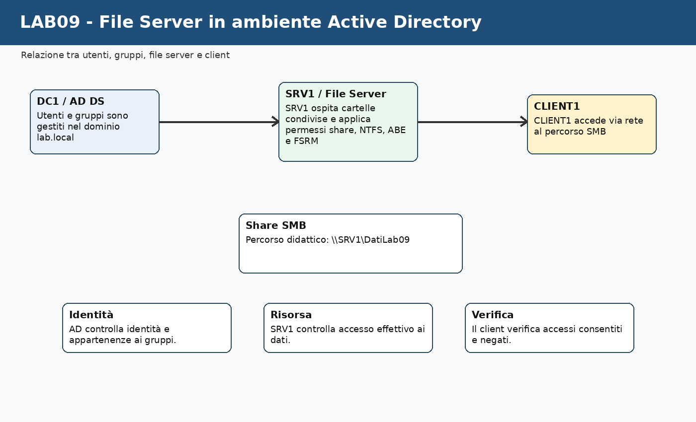

Durante il laboratorio useremo principalmente strumenti grafici:

- **Server Manager** su `SRV1`;
- **File and Storage Services** per creare e gestire la share;
- **Active Directory Users and Computers** su `DC1`;
- **File Explorer** e proprietà avanzate di sicurezza;
- **Effective Access** per verificare il risultato effettivo dei permessi;
- **File Server Resource Manager** per introdurre quote e file screening;
- **Command Prompt** e **PowerShell** solo come consolidamento finale e raccolta evidenze.

La sessione è progettata per **4 ore** di lavoro guidato. Il ritmo alterna spiegazione, configurazione GUI, test da client, troubleshooting controllato e breve consolidamento finale.

---

## Come useremo le 4 ore

Questa distribuzione serve a mantenere il laboratorio entro il tempo disponibile, alternando spiegazione, configurazione da GUI, test da client, prova controllata, ripristino e raccolta delle evidenze.

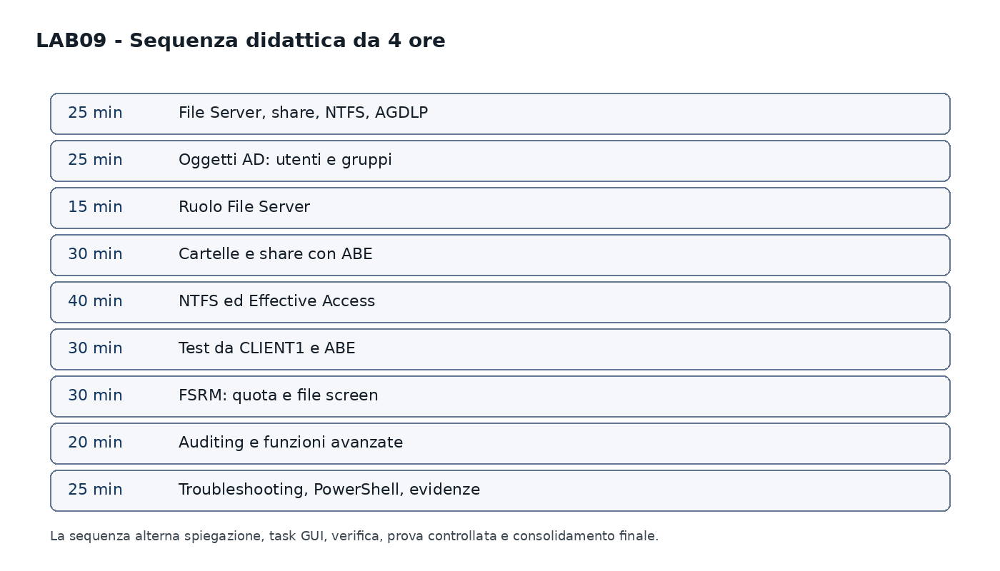

| Fase di lavoro | Durata indicativa | Attività prevalente |
|---|---:|---|
| File Server, share, NTFS e modello AGDLP | 25 min | spiegazione discorsiva + lettura schema |
| Verifica ambiente e preparazione oggetti AD | 25 min | GUI su `DC1` |
| Installazione/verifica ruolo File Server | 15 min | Server Manager su `SRV1` |
| Cartelle, share SMB e Access Based Enumeration | 30 min | GUI su `SRV1` |
| Permessi NTFS, ereditarietà ed Effective Access | 40 min | proprietà cartelle + verifica guidata |
| Test reale da `CLIENT1` e confronto con ABE | 30 min | logon utenti + prova positiva/negativa |
| FSRM: quota didattica e file screening | 30 min | GUI su `SRV1` |
| Auditing base e collegamento con funzioni avanzate | 20 min | SACL, Event Viewer, ragionamento guidato |
| Troubleshooting, PowerShell di consolidamento ed evidenze | 25 min | diagnosi, output essenziali, report |

Totale: **240 minuti**.

Se in aula procediamo più lentamente, completiamo comunque il nucleo essenziale: share, NTFS, AGDLP, Effective Access, test positivo/negativo e ABE. FSRM e auditing possono essere svolti come dimostrazione guidata, ma il file mantiene la struttura per coprire l'intera sessione da 4 ore.

---

## Ambiente usato durante la sessione

| VM | Ruolo | Uso nel laboratorio |
|---|---|---|
| `DC1` | Domain Controller | gestione utenti e gruppi |
| `SRV1` | server membro | File Server e share SMB |
| `CLIENT1` | client membro del dominio | test accesso utente |
| `CLU1`, `CLU2` | nodi cluster | non utilizzati in questa sessione |

Valori di riferimento:

| Elemento | Valore didattico |
|---|---|
| Dominio | `lab.local` |
| File Server | `SRV1` |
| Share principale | `\\SRV1\DatiLab09` |
| Percorso locale consigliato | `D:\DatiLab09` |
| Percorso alternativo se `D:` non esiste | `C:\Shares\DatiLab09` |
| Cartelle di reparto | `Sales`, `HR`, `Scambio` |

🛠️ **Task - Verifica iniziale delle VM**

Accediamo alle VM indicate e verifichiamo che:

- `DC1` sia acceso e funzionante;
- `SRV1` sia membro del dominio `lab.local`;
- `CLIENT1` sia membro del dominio e raggiunga `SRV1`;
- le VM `CLU1` e `CLU2` siano spente o non utilizzate.

🔎 **Verifica**

Da `CLIENT1`, apriamo un prompt dei comandi e verifica la raggiungibilità del server:

```cmd
ping SRV1
```

Se il ping non risponde, prima di procedere verifica nome DNS, rete virtuale e firewall. Il laboratorio sui permessi non deve iniziare se il client non riesce nemmeno a raggiungere il server.

---

## Prima di creare la share: che cosa fa davvero un File Server

Un File Server pubblica dati in rete tramite condivisioni SMB. La parte visibile all'utente è il percorso di rete, per esempio:

```text
\\SRV1\DatiLab09
```

La parte amministrativa, però, è composta da più livelli:

- cartella locale sul disco del server;
- share SMB;
- permessi share;
- permessi NTFS;
- appartenenze ai gruppi;
- eventuali impostazioni avanzate come ABE, quote, file screening e auditing.

Il punto importante è che l'accesso finale non dipende da una sola impostazione. Un utente può vedere la share ma non entrare in una cartella; può avere un permesso NTFS corretto ma essere limitato dal permesso share; può essere stato aggiunto a un gruppo ma non avere ancora un token aggiornato perché non ha fatto logoff/logon.

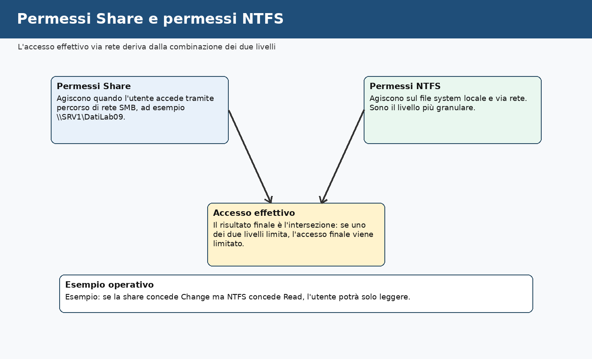

📌 **Esempio**

Se `lab09.sales1` accede a `\\SRV1\DatiLab09\Sales`, l'accesso riuscirà solo se:

- il percorso di rete è raggiungibile;
- la share consente l'accesso;
- NTFS consente l'accesso alla cartella `Sales`;
- l'utente appartiene al gruppo corretto;
- il token di logon contiene la nuova appartenenza al gruppo.

🛠️ **Task - Lettura dello scenario**

Annotiamo nel file `evidence_lab09.md` la differenza tra:

```text
\\SRV1\DatiLab09
```

e:

```text
D:\DatiLab09
```

La prima è la vista di rete usata dai client. La seconda è la posizione locale della cartella sul File Server.

---

## NTFS e ReFS: scelta del file system nel contesto del laboratorio

Nel laboratorio useremo **NTFS**, perché è il file system più adatto per lavorare con permessi granulari, ereditarietà, Effective Access, quote e strumenti comuni del File Server.

**ReFS** è un file system orientato alla resilienza, utile in scenari specifici di storage, virtualizzazione e grandi volumi. Non è l'obiettivo operativo di questa sessione, ma va riconosciuto come alternativa architetturale in scenari diversi.

📌 **Esempio**

Per una cartella condivisa di reparto con permessi granulari e test didattici su ACL, NTFS è la scelta più lineare.

Per volumi dedicati a scenari di resilienza dello storage, ReFS può essere valutato, ma richiede una progettazione diversa.

🛠️ **Task - Verifica file system del volume**

Su `SRV1`:

1. apriamo **File Explorer**;
2. andiamo su **This PC**;
3. facciamo clic destro sul volume che userai per il laboratorio, per esempio `D:`;
4. selezioniamo **Properties**;
5. leggi il campo **File system**.

🧾 **Evidenza**

Nel file `evidence_lab09.md` annotiamo:

```text
Volume usato per il laboratorio:
File system rilevato:
Percorso locale scelto per DatiLab09:
```

---

## Il modello AGDLP applicato ai permessi

Il modello AGDLP consente di separare in modo ordinato identità, ruoli aziendali e permessi tecnici.

La catena è:

```text
Account → Global Group → Domain Local Group → Permission
```

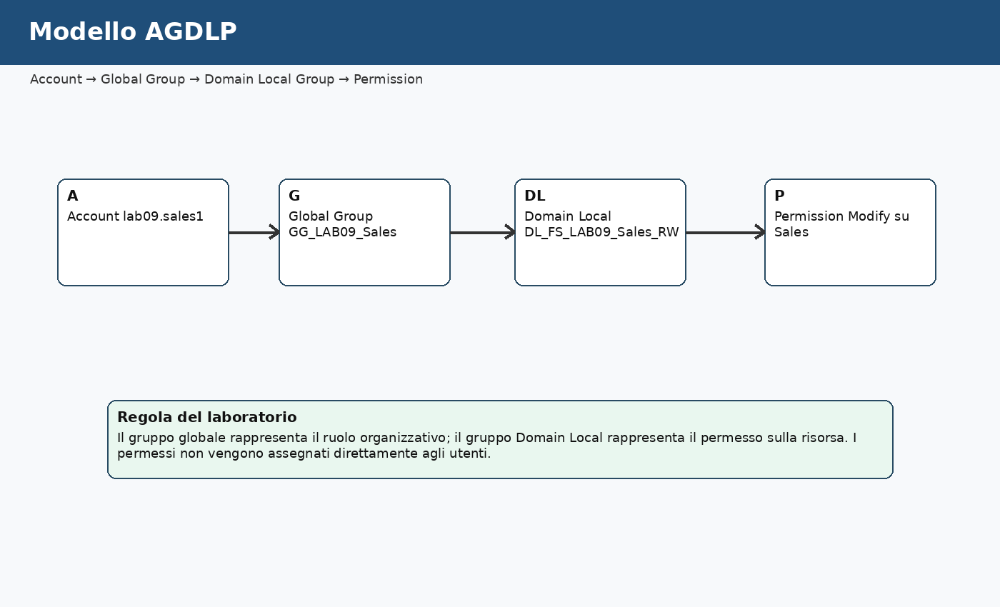

Nel laboratorio useremo questa struttura:

| Elemento | Esempio |
|---|---|
| Account | `lab09.sales1`, `lab09.hr1` |
| Global Group | `GG_LAB09_Sales`, `GG_LAB09_HR`, `GG_LAB09_Staff` |
| Domain Local Group | `DL_FS_LAB09_Sales_RW`, `DL_FS_LAB09_HR_RW`, `DL_FS_LAB09_Scambio_RW` |
| Permission | Modify su cartelle specifiche |

📌 **Esempio**

`lab09.sales1` non riceve direttamente il permesso sulla cartella `Sales`.

Il percorso corretto è:

```text
lab09.sales1
→ GG_LAB09_Sales
→ DL_FS_LAB09_Sales_RW
→ Modify su D:\DatiLab09\Sales
```

🛠️ **Task - Creazione o verifica degli utenti**

Su `DC1`, apri **Active Directory Users and Computers**.

Percorso:

```text
Server Manager
Tools
Active Directory Users and Computers
```

Verifica se esiste già una OU didattica per il laboratorio, per esempio:

```text
OU=Lab
```

Se esiste una struttura più dettagliata, usa le OU già presenti. Se non esiste, usa una OU coerente con il percorso del corso e documenta la scelta.

Creiamo o verifichiamo questi utenti di test:

| Utente | Uso |
|---|---|
| `lab09.sales1` | utente del reparto Sales |
| `lab09.hr1` | utente del reparto HR |
| `lab09.audit1` | utente per test di accesso negato o verifica |

Se gli utenti sono già presenti con nomi diversi, puoi usare quelli già creati nei laboratori precedenti, purché il report finale riporti i nomi reali usati.

🛠️ **Task - Creazione dei gruppi globali**

Sempre in **Active Directory Users and Computers**, creiamo o verifichiamo i gruppi globali:

| Gruppo globale | Membri |
|---|---|
| `GG_LAB09_Sales` | `lab09.sales1` |
| `GG_LAB09_HR` | `lab09.hr1` |
| `GG_LAB09_Staff` | `lab09.sales1`, `lab09.hr1` |

Tipo gruppo:

```text
Security
```

Ambito gruppo:

```text
Global
```

🛠️ **Task - Creazione dei gruppi Domain Local**

Creiamo o verifichiamo questi gruppi:

| Gruppo Domain Local | Uso |
|---|---|
| `DL_FS_LAB09_Sales_RW` | permesso Modify su `Sales` |
| `DL_FS_LAB09_HR_RW` | permesso Modify su `HR` |
| `DL_FS_LAB09_Scambio_RW` | permesso Modify su `Scambio` |

Tipo gruppo:

```text
Security
```

Ambito gruppo:

```text
Domain Local
```

🛠️ **Task - Collegamento tra gruppi**

Configuriamo le appartenenze:

| Inserisci questo gruppo | Dentro questo gruppo |
|---|---|
| `GG_LAB09_Sales` | `DL_FS_LAB09_Sales_RW` |
| `GG_LAB09_HR` | `DL_FS_LAB09_HR_RW` |
| `GG_LAB09_Staff` | `DL_FS_LAB09_Scambio_RW` |

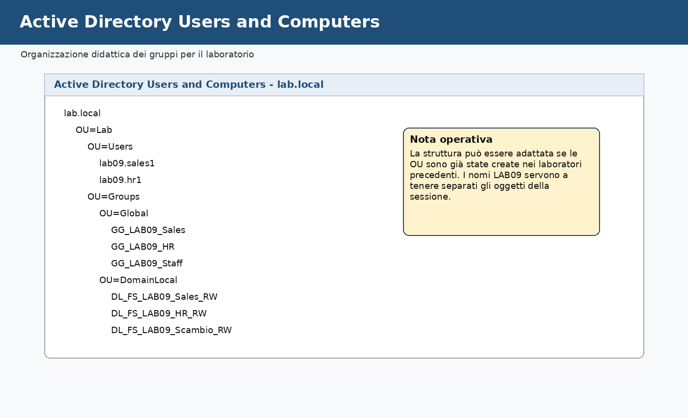

🔎 **Verifica**

Apri le proprietà di ciascun gruppo Domain Local e controlla la scheda **Members**.

🧾 **Evidenza**

Nel file `evidence_lab09.md` inserisci una tabella con:

```text
Utente → Gruppo globale → Gruppo Domain Local → Cartella di destinazione
```

---

## Installazione o verifica del ruolo File Server su SRV1

Il ruolo File Server può essere già presente. In questa sessione lo verifichiamo da GUI.

🛠️ **Task - Verifica del ruolo File Server**

Su `SRV1`:

1. apriamo **Server Manager**;
2. andiamo su **Manage**;
3. selezioniamo **Add Roles and Features**;
4. prosegui fino alla sezione **Server Roles**;
5. espandi:

```text
File and Storage Services
File and iSCSI Services
```

6. verifichiamo che sia selezionato:

```text
File Server
```

Se non è selezionato, installalo.

📌 **Esempio**

Il ruolo File Server abilita il server a pubblicare cartelle condivise SMB e a gestirle da **File and Storage Services**. Senza questo ruolo il server può comunque avere cartelle locali, ma non è configurato come File Server gestito nel contesto di Windows Server.

🔎 **Verifica**

In **Server Manager**, controlla che nel menu laterale compaia:

```text
File and Storage Services
```

---

## Preparazione delle cartelle locali

La share non deve puntare a una cartella improvvisata. Creiamo una struttura semplice, leggibile e documentabile.

Useremo:

```text
D:\DatiLab09
D:\DatiLab09\Sales
D:\DatiLab09\HR
D:\DatiLab09\Scambio
```

Se `D:` non esiste, usa:

```text
C:\Shares\DatiLab09
```

🛠️ **Task - Creazione delle cartelle**

Su `SRV1`:

1. apriamo **File Explorer**;
2. creiamo la cartella principale:

```text
D:\DatiLab09
```

3. dentro la cartella principale crea:

```text
Sales
HR
Scambio
```

📌 **Esempio**

La cartella `Sales` sarà accessibile agli utenti del reparto Sales.

La cartella `HR` sarà accessibile agli utenti del reparto HR.

La cartella `Scambio` sarà accessibile a entrambi i gruppi tramite `GG_LAB09_Staff`.

🔎 **Verifica**

La struttura attesa è:

```text
D:\DatiLab09
├── Sales
├── HR
└── Scambio
```

🧾 **Evidenza**

Inserisci nel report uno screenshot della struttura cartelle o una trascrizione testuale.

---

## Creazione della share con Access Based Enumeration

Ora pubblichiamo la cartella principale come share SMB. Lavoriamo da GUI usando **Server Manager**.

Access Based Enumeration, abbreviato ABE, consente di nascondere agli utenti le cartelle per cui non hanno almeno un permesso di lettura. Non sostituisce i permessi NTFS, ma migliora la vista utente e riduce la visibilità di risorse non pertinenti.

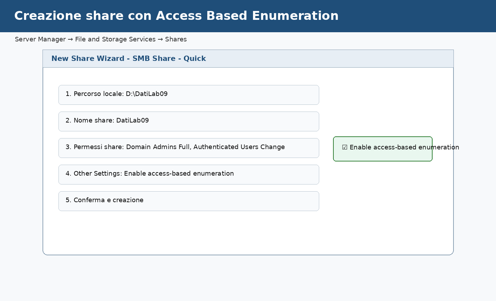

📌 **Esempio**

Se `lab09.sales1` ha accesso a `Sales` ma non a `HR`, con ABE attiva vedrà `Sales` e `Scambio`, ma non `HR`.

🛠️ **Task - Creazione della share da Server Manager**

Su `SRV1`:

1. apriamo **Server Manager**;
2. selezioniamo **File and Storage Services**;
3. selezioniamo **Shares**;
4. nel menu **Tasks**, scegli **New Share**;
5. seleziona:

```text
SMB Share - Quick
```

6. scegliamo il percorso:

```text
D:\DatiLab09
```

7. impostiamo il nome share:

```text
DatiLab09
```

8. quando arrivi a **Other Settings**, abilita:

```text
Enable access-based enumeration
```

9. completiamo la procedura guidata.

🛠️ **Task - Permessi share**

Nella configurazione della share, imposta i permessi in modo controllato.

Configurazione consigliata per il laboratorio:

| Identità | Permesso share |
|---|---|
| `LAB\Domain Admins` | Full Control |
| `LAB\Authenticated Users` | Change oppure Read/Change secondo configurazione didattica |

Il controllo fine verrà fatto con NTFS sulle sottocartelle. In molti ambienti si assegna un permesso share ampio e si governa il dettaglio con NTFS. In aula questa scelta aiuta a vedere chiaramente il ruolo del livello NTFS.

🔎 **Verifica**

Da `CLIENT1`, prova ad aprire:

```text
\\SRV1\DatiLab09
```

In questa fase potresti vedere la share ma non avere ancora accesso completo alle sottocartelle, perché i permessi NTFS non sono stati configurati.

🧾 **Evidenza**

Nel report annotiamo:

```text
Nome share:
Percorso locale:
ABE attiva: sì/no
Permessi share principali:
```

---

## Configurazione dei permessi NTFS

Ora configuriamo il livello più importante per il controllo granulare: NTFS.

L'obiettivo è:

| Cartella | Gruppo autorizzato | Permesso |
|---|---|---|
| `Sales` | `DL_FS_LAB09_Sales_RW` | Modify |
| `HR` | `DL_FS_LAB09_HR_RW` | Modify |
| `Scambio` | `DL_FS_LAB09_Scambio_RW` | Modify |

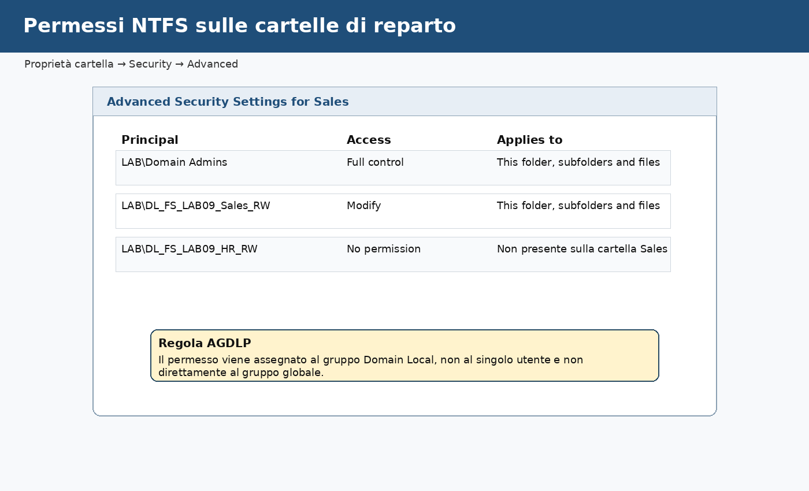

📌 **Esempio**

Il gruppo `DL_FS_LAB09_Sales_RW` riceve il permesso sulla cartella `Sales`, non sulla cartella `HR`.

Se un utente HR proviamo ad accedere a `Sales`, il test deve fallire. Il test negativo è parte del laboratorio, perché dimostra che il controllo degli accessi non concede più del necessario.

🛠️ **Task - Disattivazione ereditarietà sulla cartella principale**

Su `SRV1`:

1. apriamo **File Explorer**;
2. facciamo clic destro su:

```text
D:\DatiLab09
```

3. selezioniamo **Properties**;
4. apriamo la scheda **Security**;
5. selezioniamo **Advanced**;
6. scegliamo **Disable inheritance**;
7. quando richiesto, scegli di convertire le autorizzazioni ereditate in autorizzazioni esplicite, se vuoi partire da una base controllabile;
8. verifichiamo che `Domain Admins` e `SYSTEM` mantengano accesso amministrativo.

🛠️ **Task - Permessi sulla cartella Sales**

Su `D:\DatiLab09\Sales`:

1. apriamo **Properties**;
2. andiamo su **Security**;
3. selezioniamo **Advanced**;
4. disabilita l'ereditarietà se necessario;
5. aggiungi:

```text
LAB\DL_FS_LAB09_Sales_RW
```

6. assegna:

```text
Modify
```

7. applichiamo a:

```text
This folder, subfolders and files
```

🛠️ **Task - Permessi sulla cartella HR**

Su `D:\DatiLab09\HR`, ripeti la procedura assegnando:

```text
LAB\DL_FS_LAB09_HR_RW
```

con permesso:

```text
Modify
```

🛠️ **Task - Permessi sulla cartella Scambio**

Su `D:\DatiLab09\Scambio`, assegna:

```text
LAB\DL_FS_LAB09_Scambio_RW
```

con permesso:

```text
Modify
```

🔎 **Verifica**

Riapriamo le proprietà di ogni cartella e controlla che il gruppo Domain Local corretto sia presente.

🧾 **Evidenza**

Nel report inseriamo una tabella:

| Cartella | Gruppo Domain Local assegnato | Permesso NTFS |
|---|---|---|
| Sales | | |
| HR | | |
| Scambio | | |

---

## Effective Access: verificare prima di testare dal client

La scheda **Effective Access** permette di stimare l'accesso effettivo di un utente a una cartella. Non sostituisce il test reale da client, ma aiuta a capire la combinazione tra gruppi e permessi.

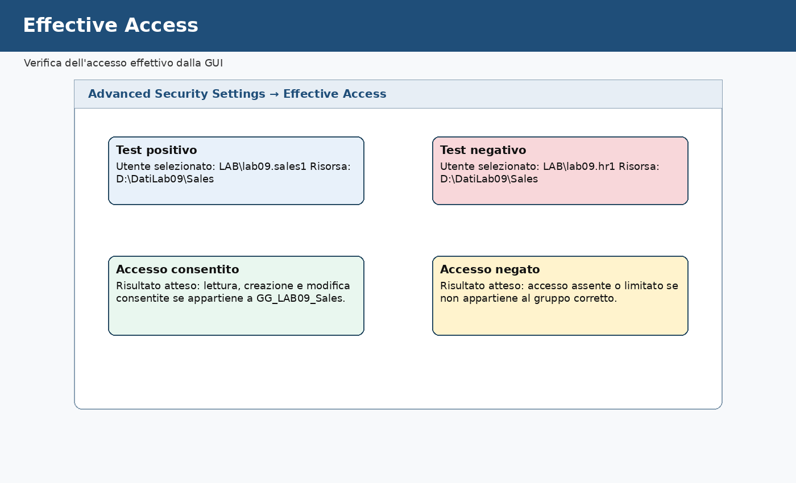

📌 **Esempio**

Per la cartella `Sales`:

- `lab09.sales1` dovrebbe avere accesso;
- `lab09.hr1` non dovrebbe avere accesso.

🛠️ **Task - Verifica Effective Access su Sales**

Su `SRV1`:

1. facciamo clic destro su:

```text
D:\DatiLab09\Sales
```

2. apriamo **Properties**;
3. andiamo su **Security**;
4. selezioniamo **Advanced**;
5. apriamo la scheda **Effective Access**;
6. scegliamo **Select a user**;
7. inserisci:

```text
LAB\lab09.sales1
```

8. selezioniamo **View effective access**.

🔎 **Verifica**

Il risultato deve mostrare permessi coerenti con lettura, creazione e modifica.

Ripetiamo il test con:

```text
LAB\lab09.hr1
```

Il risultato deve essere assente o limitato.

🧾 **Evidenza**

Nel report annotiamo:

```text
Cartella testata:
Utente con accesso previsto:
Risultato:
Utente senza accesso previsto:
Risultato:
```

---

## Test reale da CLIENT1

Il test reale serve a verificare il comportamento percepito dall'utente. Dopo aver modificato appartenenze ai gruppi, l'utente deve effettuare logoff/logon per ricevere un token aggiornato.

🛠️ **Task - Test positivo con utente Sales**

Su `CLIENT1`:

1. esegui logoff;
2. accedi come:

```text
LAB\lab09.sales1
```

3. apriamo **File Explorer**;
4. nella barra indirizzi digita:

```text
\\SRV1\DatiLab09
```

5. apriamo la cartella `Sales`;
6. creiamo un file di testo:

```text
test_sales.txt
```

7. modifica il file e salvalo.

🔎 **Verifica**

L'utente `lab09.sales1` deve riuscire a creare e modificare il file nella cartella `Sales`.

🛠️ **Task - Test negativo verso HR**

Sempre come `lab09.sales1`, proviamo ad accedere alla cartella:

```text
HR
```

Risultato atteso:

- con ABE attiva, la cartella potrebbe non essere visibile;
- se è visibile, l'accesso deve essere negato.

🧾 **Evidenza**

Annota il comportamento osservato:

```text
Utente:
Cartella Sales:
Cartella HR:
ABE attiva:
Risultato osservato:
```

🛠️ **Task - Test positivo con utente HR**

Effettuiamo logoff da `CLIENT1` e accedi come:

```text
LAB\lab09.hr1
```

Ripetiamo il test:

- accesso alla cartella `HR`;
- creazione di `test_hr.txt`;
- tentativo di accesso a `Sales`;
- accesso a `Scambio`.

🔎 **Verifica**

`lab09.hr1` deve poter lavorare su `HR` e `Scambio`, ma non su `Sales`.

---

## Access Based Enumeration: osservare la differenza lato utente

ABE non è un meccanismo di sicurezza sostitutivo. I permessi NTFS rimangono obbligatori. ABE cambia la visibilità delle cartelle.

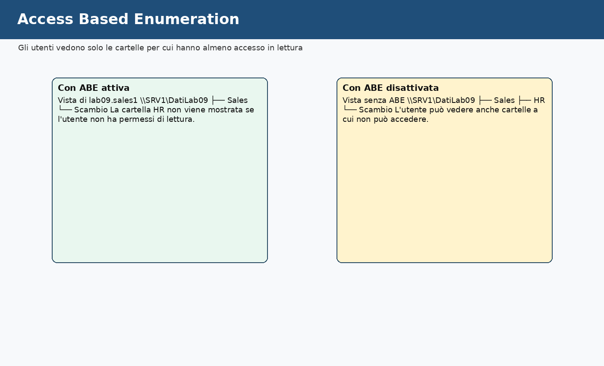

📌 **Esempio**

Senza ABE, un utente potrebbe vedere anche cartelle non accessibili. Con ABE, la vista è più pulita e più coerente con i permessi effettivi.

🧪 **Prova controllata - Disattiviamo temporaneamente ABE**

Su `SRV1`:

1. apriamo **Server Manager**;
2. andiamo in **File and Storage Services**;
3. selezioniamo **Shares**;
4. apriamo le proprietà della share `DatiLab09`;
5. cerca l'impostazione relativa ad **Access-Based Enumeration**;
6. disattivala temporaneamente;
7. applichiamo la modifica.

Su `CLIENT1`, accedi come `lab09.sales1` e riapri:

```text
\\SRV1\DatiLab09
```

🔎 **Verifica**

Osserva se la vista delle cartelle cambia.

🧹 **Ripristino**

Riattiviamo ABE sulla share `DatiLab09`.

🧾 **Evidenza**

Nel report descrivi la differenza tra:

```text
Vista con ABE attiva
Vista con ABE disattivata
```

---

## FSRM: quota e file screening come primo controllo dello storage

FSRM, File Server Resource Manager, consente di applicare controlli aggiuntivi allo storage. In questa sessione usiamo un esempio semplice e controllato.

Due funzioni utili sono:

- **Quota Management**, per limitare o monitorare lo spazio usato;
- **File Screening**, per impedire il salvataggio di determinati tipi di file.

La microprogettazione avanzata del modulo include anche scenari più ampi: protezione da file indesiderati, supporto a strategie anti-ransomware, classificazione dei file e automazioni di gestione. In questa sessione configuriamo solo un esempio didattico, per capire dove si colloca FSRM nel disegno complessivo.

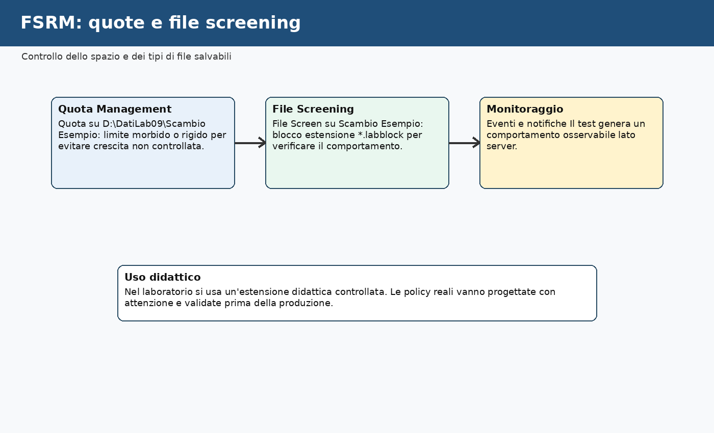

📌 **Esempio**

Nella cartella `Scambio` si può consentire il salvataggio di file `.txt`, ma bloccare file con estensione didattica:

```text
*.labblock
```

Questa estensione è usata solo per il test del laboratorio.

🛠️ **Task - Installazione File Server Resource Manager**

Su `SRV1`:

1. apriamo **Server Manager**;
2. selezioniamo **Manage**;
3. scegliamo **Add Roles and Features**;
4. andiamo in **Server Roles**;
5. espandi:

```text
File and Storage Services
File and iSCSI Services
```

6. seleziona:

```text
File Server Resource Manager
```

7. completiamo l'installazione.

🔎 **Verifica**

Da **Tools**, deve essere disponibile:

```text
File Server Resource Manager
```

🛠️ **Task - Creazione di una quota didattica su Scambio**

Restiamo su `SRV1` e usiamo **File Server Resource Manager**.

1. apriamo **File Server Resource Manager**;
2. espandiamo **Quota Management**;
3. selezioniamo **Quotas**;
4. dal menu **Actions**, scegliamo **Create Quota**;
5. come percorso indichiamo:

```text
D:\DatiLab09\Scambio
```

6. scegliamo una quota didattica semplice, per esempio una quota soft da 50 MB se disponibile tra i template, oppure creiamo un template dedicato al laboratorio;
7. salviamo la configurazione.

📌 **Esempio**

La quota non serve a decidere chi può entrare nella cartella. Per quello usiamo NTFS. La quota serve a controllare o limitare lo spazio occupato. Sono due livelli diversi della gestione del File Server.

🔎 **Verifica**

Controlliamo che la quota compaia nell'elenco di FSRM e che il percorso sia quello corretto.

🧾 **Evidenza**

Nel report annotiamo:

```text
Percorso quota:
Tipo quota:
Limite configurato:
Scopo della quota:
```

🛠️ **Task - Creazione di un file screen didattico**

Su `SRV1`:

1. apriamo **File Server Resource Manager**;
2. espandi **File Screening Management**;
3. selezioniamo **File Groups**;
4. creiamo un nuovo gruppo file:

```text
LAB09_File_Bloccati
```

5. inseriamo tra i file da includere:

```text
*.labblock
```

6. selezioniamo **File Screens**;
7. creiamo un nuovo file screen sul percorso:

```text
D:\DatiLab09\Scambio
```

8. scegliamo un file screen **Active screening**;
9. associa il gruppo file `LAB09_File_Bloccati`;
10. salva.

🧪 **Prova controllata - File consentito e file bloccato**

Da `CLIENT1`, come utente autorizzato, lavoriamo così su `Scambio`:

1. apri:

```text
\\SRV1\DatiLab09\Scambio
```

2. creiamo un file:

```text
note.txt
```

3. creiamo un file:

```text
prova.labblock
```

🔎 **Verifica**

Il file `.txt` deve essere consentito.

Il file `.labblock` deve essere bloccato dal File Screen.

🧾 **Evidenza**

Nel report annotiamo:

```text
File consentito:
File bloccato:
Percorso File Screen:
Risultato osservato:
```

---

## DFS, DAC, deduplica, auditing e integrazione cloud: dove si collocano

In questa sessione non configuriamo integralmente DFS Namespace, DFS-R, Dynamic Access Control, Data Deduplication, Azure File Sync e auditing avanzato. Li collochiamo però correttamente nel quadro del File Server moderno.

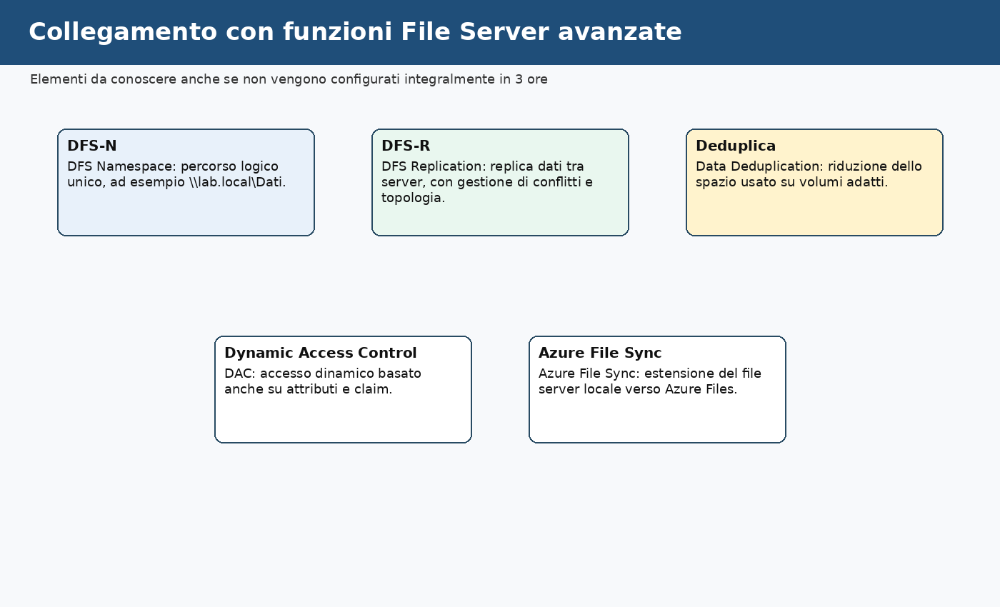

| Funzione | Esempio pratico | Perché è rilevante |
|---|---|---|
| DFS Namespace | `\\lab.local\Dati` invece di `\\SRV1\DatiLab09` | nasconde il nome del server fisico |
| DFS-R | replica tra due file server di sedi diverse | aumenta disponibilità e distribuzione geografica |
| Dynamic Access Control | accesso basato anche su attributi come reparto o sede | utile in scenari di sicurezza avanzata |
| Data Deduplication | riduzione spazio su volumi con molti file ripetuti | ottimizza storage in scenari compatibili |
| Azure File Sync | cache locale con dati estesi in Azure Files | collega file server locale e cloud |
| Auditing avanzato | traccia eliminazioni, modifiche e accessi negati | supporta controllo e conformità |

🛠️ **Task - Collegamento concettuale al laboratorio**

Nel report scegliamo due funzioni della tabella e completa:

```text
Funzione:
Esempio:
In quale scenario aziendale sarebbe utile:
Perché non la configuriamo integralmente in questa sessione:
```

📌 **Esempio**

```text
Funzione: DFS Namespace
Esempio: \\lab.local\Dati\Sales
Scenario: azienda con più file server o futura migrazione
Motivo: in questa sessione stiamo consolidando permessi, share e AGDLP
```

---

## Auditing base: collegare accessi e registro eventi

Dopo aver configurato permessi e test di accesso, introduciamo il concetto di auditing. L'auditing non concede o nega permessi: registra eventi selezionati, così possiamo ricostruire chi ha tentato un accesso, chi ha modificato un file o chi ha ricevuto un accesso negato.

Perché l'auditing funzioni servono due elementi:

- una policy di audit attiva sul server;
- una SACL configurata sulla cartella o sull'oggetto da monitorare.

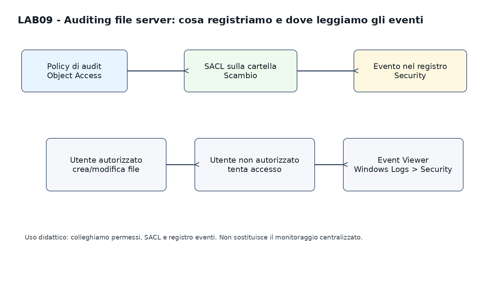

📌 **Esempio**

Se vogliamo controllare i tentativi di accesso negato alla cartella `HR`, non basta guardare i permessi NTFS. Dobbiamo abilitare l'auditing e poi leggere gli eventi nel registro **Security** di `SRV1`.

🛠️ **Task - Verifica della policy di audit su SRV1**

Su `SRV1` lavoriamo da GUI:

1. apriamo **Local Security Policy**;
2. andiamo in:

```text
Security Settings
Advanced Audit Policy Configuration
System Audit Policies
Object Access
```

3. apriamo **Audit File System**;
4. verifichiamo se sono abilitate le opzioni di audit per **Success** e/o **Failure**;
5. per il laboratorio abilitiamo almeno **Failure**, così possiamo osservare i tentativi non riusciti.

🛠️ **Task - Configurazione SACL su una cartella di test**

Su `SRV1`:

1. apriamo le proprietà della cartella:

```text
D:\DatiLab09\HR
```

2. andiamo in **Security**;
3. selezioniamo **Advanced**;
4. apriamo la scheda **Auditing**;
5. aggiungiamo un controllo per un utente o gruppo di test, per esempio `LAB\lab09.sales1`;
6. selezioniamo un controllo limitato, per esempio tentativi di lettura non riusciti;
7. applichiamo la configurazione.

🧪 **Prova controllata - Accesso negato registrato**

Da `CLIENT1`, accediamo come `LAB\lab09.sales1` e proviamo ad aprire:

```text
\SRV1\DatiLab09\HR
```

Il risultato atteso è un accesso negato o una cartella non visibile, in base alla configurazione di ABE. Se la cartella è raggiungibile come percorso diretto ma l'accesso è negato, controlliamo poi il registro eventi.

🔎 **Verifica**

Su `SRV1`, apriamoamo **Event Viewer** e andiamo in:

```text
Windows Logs
Security
```

Cerchiamo eventi collegati all'accesso ai file. In ambienti Windows l'evento più comune da osservare in questi scenari è collegato all'accesso a oggetti del file system, ma il risultato dipende dalla policy di audit effettivamente attiva e dal livello di dettaglio configurato.

🧾 **Evidenza**

Nel report annotiamo:

```text
Cartella controllata:
Utente usato per la proviamo:
Tipo di audit configurato:
Evento osservato:
Risultato della proviamo:
```

## Troubleshooting controllato

Ora simuliamo alcuni problemi semplici e li colleghiamo agli strumenti di diagnosi.

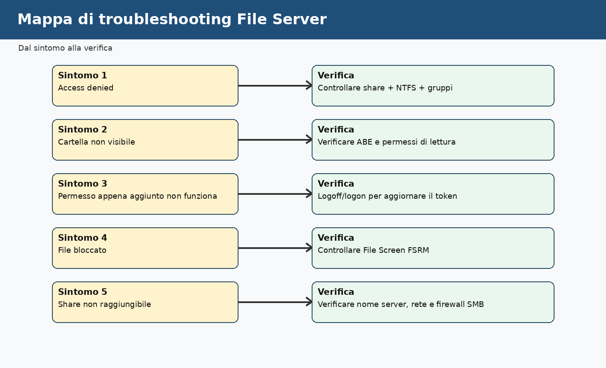

🧪 **Prova controllata - Utente aggiunto al gruppo ma accesso ancora negato**

Su `DC1`, aggiungiamo temporaneamente `lab09.audit1` a `GG_LAB09_Sales`.

Su `CLIENT1`, se `lab09.audit1` era già connesso, proviamo ad accedere subito a:

```text
\\SRV1\DatiLab09\Sales
```

🔎 **Verifica**

Se l'accesso non riflette subito la nuova appartenenza, effettua logoff/logon.

📌 **Spiegazione**

Le appartenenze ai gruppi vengono inserite nel token di accesso al momento del logon. Se l'utente era già connesso, potrebbe non avere ancora il token aggiornato.

🧪 **Prova controllata - Share accessibile ma cartella negata**

Su `CLIENT1`, con un utente non autorizzato a `Sales`, proviamo:

```text
\\SRV1\DatiLab09
```

e poi:

```text
\\SRV1\DatiLab09\Sales
```

🔎 **Verifica**

La share principale può essere raggiungibile, ma la sottocartella può essere negata da NTFS.

🧹 **Ripristino**

Rimuovi eventuali modifiche temporanee non previste, per esempio appartenenze aggiunte solo per il test.

🧾 **Evidenza**

Nel report documenta almeno un problema simulato:

```text
Problema:
Sintomo:
Causa:
Correzione:
Verifica dopo la correzione:
```

---

## PowerShell di consolidamento e raccolta evidenze

La configurazione principale è stata svolta da GUI. In questa fase usiamo PowerShell per leggere, esportare e documentare lo stato finale.

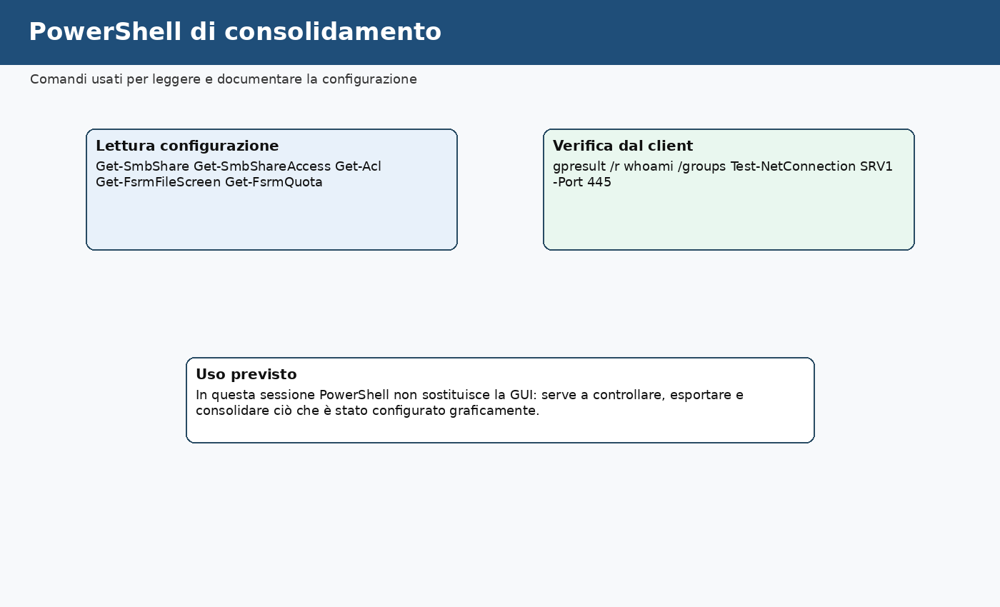

Su `SRV1`, apriamo PowerShell come amministratore.

🔎 **Verifica share**

```powershell
Get-SmbShare -Name DatiLab09
Get-SmbShareAccess -Name DatiLab09
```

🔎 **Verifica ACL NTFS**

Se hai usato `D:\DatiLab09`:

```powershell
Get-Acl D:\DatiLab09\Sales | Format-List
Get-Acl D:\DatiLab09\HR | Format-List
Get-Acl D:\DatiLab09\Scambio | Format-List
```

🔎 **Verifica FSRM**

```powershell
Get-FsrmFileScreen
Get-FsrmFileGroup
```

Da `CLIENT1`, con l'utente di test:

```cmd
whoami
whoami /groups
```

Per verificare la porta SMB verso `SRV1`:

```powershell
Test-NetConnection SRV1 -Port 445
```

🧾 **Evidenza**

Copiamo nel report gli output essenziali, evitando output lunghi non commentati. Ogni output deve essere accompagnato da una breve frase che spiega cosa dimostra.

---

## Esercitazione di consolidamento

Questa esercitazione riprende la consegna del materiale precedente e la rende coerente con il laboratorio svolto.

🛠️ **Task - Nuova cartella di reparto**

Creiamo una nuova cartella:

```text
D:\DatiLab09\Progetti
```

Creiamo o verifichiamo i gruppi:

```text
GG_LAB09_Progetti
DL_FS_LAB09_Progetti_RW
```

Associa:

```text
utente scelto → GG_LAB09_Progetti → DL_FS_LAB09_Progetti_RW → Modify su Progetti
```

Configura i permessi usando lo stesso modello del laboratorio.

🔎 **Verifica**

Esegui:

- un test positivo con utente autorizzato;
- un test negativo con utente non autorizzato;
- una verifica Effective Access;
- una verifica della visibilità con ABE.

🧾 **Evidenza**

Integriamo nel report:

```text
Cartella creata:
Gruppo globale:
Gruppo Domain Local:
Utente autorizzato:
Utente non autorizzato:
Risultato test positivo:
Risultato test negativo:
```

---

## Domande di consolidamento

1. Perché nel modello AGDLP non assegniamo il permesso direttamente all'utente?
2. Qual è la differenza tra permesso share e permesso NTFS?
3. Perché il risultato effettivo è più restrittivo della semplice somma dei permessi?
4. Che cosa cambia con Access Based Enumeration attiva?
5. Perché dopo una modifica ai gruppi può essere necessario fare logoff/logon?
6. Che differenza c'è tra una quota FSRM e un permesso NTFS?
7. Perché un file screen non sostituisce una soluzione di sicurezza completa?
8. In quale scenario avrebbe senso usare un DFS Namespace?
9. Quale controllo faresti se un utente vede la share ma non riesce ad aprire una sottocartella?
10. Quale controllo faresti se un utente dovrebbe vedere una cartella ma ABE la nasconde?

---

## Evidenze finali richieste

Creiamo un file:

```text
evidence_lab09.md
```

Il file deve contenere:

- VM usate;
- percorso locale della cartella principale;
- nome della share;
- conferma di ABE attiva;
- elenco utenti e gruppi usati;
- tabella AGDLP completa;
- tabella permessi NTFS;
- risultato test positivo;
- risultato test negativo;
- risultato Effective Access;
- risultato quota FSRM, se svolta;
- risultato File Screen FSRM, se svolto;
- risultato auditing base, se svolto;
- almeno un problema simulato e corretto;
- risposte alle domande di consolidamento principali.

---

## Impatto sui laboratori successivi

### Oggetti modificati

Durante questa sessione vengono modificati o creati:

- cartelle su `SRV1`;
- share SMB `DatiLab09`;
- permessi NTFS su `DatiLab09` e sottocartelle;
- eventuali gruppi Global e Domain Local con prefisso `LAB09`;
- eventuale ruolo o console File Server Resource Manager;
- eventuale quota FSRM su `Scambio`;
- eventuale File Screen didattico su `Scambio`;
- eventuale configurazione di auditing didattico sulle cartelle di test.

### Oggetti che non devono essere modificati

Non modificare:

- configurazioni DNS di `DC1`;
- configurazioni DHCP;
- GPO operative dei laboratori precedenti;
- configurazioni WSUS;
- VM del cluster;
- utenti e gruppi non pertinenti alla sessione.

### Come ripristinare lo stato iniziale

🧹 **Ripristino controllato**

Se il docente richiede il ripristino:

1. rimuoviamo o disattiviamo la quota e il File Screen didattico;
2. eliminiamo i file di test creati dai client;
3. rimuoviamo la share `DatiLab09`;
4. eliminiamo o archiviamo la cartella locale `DatiLab09`;
5. rimuoviamo i gruppi `LAB09` solo se sono stati creati esclusivamente per questa sessione;
6. documentiamo ogni rimozione.

### Verifica di non regressione

Al termine:

- `DC1` deve continuare a rispondere come Domain Controller;
- `CLIENT1` deve continuare ad accedere al dominio;
- `SRV1` deve rimanere server membro del dominio;
- i laboratori DNS, DHCP, WSUS e Cluster non devono risultare alterati.

Comandi di controllo utili:

```cmd
nltest /dsgetdc:lab.local
ping DC1
ping SRV1
```

---

## Criterio di completamento

Il laboratorio è completato quando:

- la share `DatiLab09` è raggiungibile da `CLIENT1`;
- i permessi AGDLP sono configurati senza assegnazioni dirette agli utenti;
- almeno un utente accede correttamente alla propria cartella;
- almeno un utente viene bloccato su una cartella non autorizzata;
- ABE è stata verificata;
- Effective Access è stato usato almeno una volta;
- FSRM è stato svolto o documentato come dimostrazione guidata;
- il file `evidence_lab09.md` permette di ricostruire le attività svolte.
