# LAB10 - DHCP in ambiente Active Directory Domain Services

Versione GUI-first con laboratorio completo, immagini, attività operative e consolidamento finale - v1

## Sessione di lavoro: distribuire configurazioni IP in modo controllato

In questa sessione lavoriamo sul servizio **DHCP** in un ambiente Active Directory. Nei laboratori precedenti abbiamo già visto quanto sia importante il DNS per il dominio; ora aggiungiamo il servizio che consente ai client di ricevere automaticamente una configurazione di rete coerente.

Il DHCP non assegna soltanto un indirizzo IP. In una rete di dominio distribuisce anche informazioni fondamentali come il DNS da usare, il suffisso di dominio e, quando presente, il gateway predefinito. Per questo motivo un client può ricevere un indirizzo IP formalmente valido ma continuare a non funzionare correttamente nel dominio, se le opzioni DHCP sono errate.

Nel dominio `lab.local` useremo:

- `DC1` come Domain Controller e DNS AD-integrato;
- `SRV1` come server membro su cui installeremo e configureremo il ruolo DHCP;
- `CLIENT1` come postazione di test che passerà temporaneamente da configurazione statica a configurazione automatica.

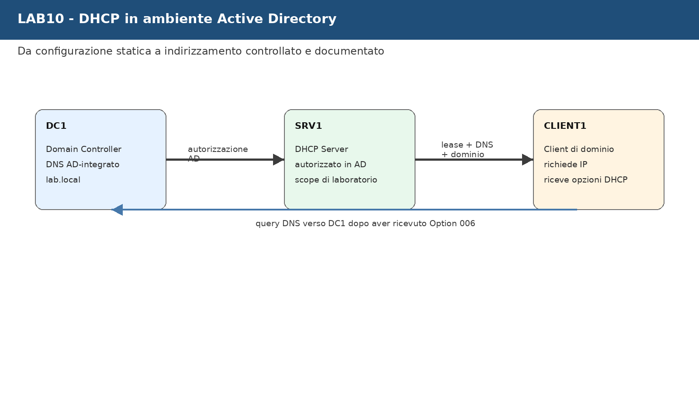

Durante il laboratorio lavoreremo principalmente con strumenti grafici:

- **Server Manager** su `SRV1`;
- **DHCP Console** su `SRV1`;
- **Network Connections** su `CLIENT1`;
- **Event Viewer** per la diagnostica;
- **DNS Manager** su `DC1` per verifiche correlate.

Useremo PowerShell e comandi solo nella parte finale, come consolidamento, verifica e raccolta delle evidenze.

---

## Come useremo le 4 ore

La sessione è progettata per **4 ore**. Il ritmo alterna spiegazione, configurazione da GUI, test da client, prove controllate, ripristino e raccolta evidenze.

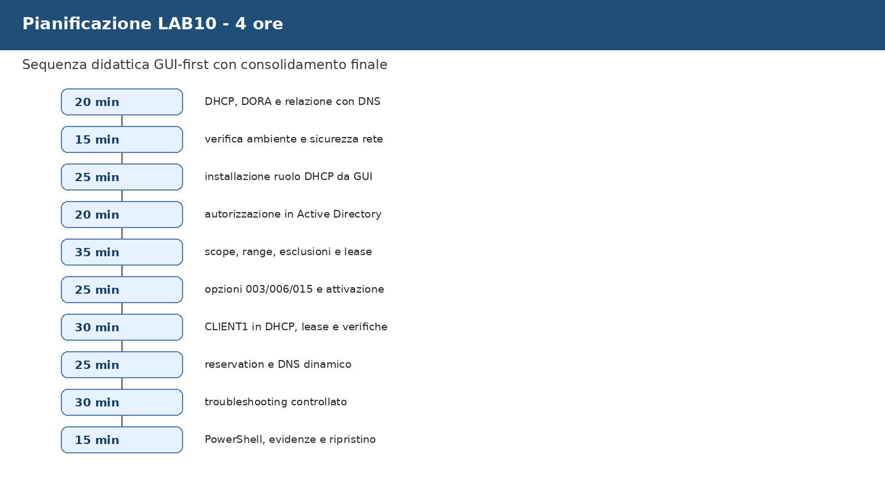

| Fase di lavoro | Durata indicativa | Attività prevalente |
|---|---:|---|
| DHCP, sequenza DORA e relazione con DNS | 20 min | spiegazione discorsiva + lettura schema |
| Verifica ambiente e sicurezza della rete lab | 15 min | GUI e controlli preliminari |
| Installazione ruolo DHCP su `SRV1` | 25 min | Server Manager |
| Autorizzazione DHCP in Active Directory | 20 min | post-install wizard + DHCP Console |
| Scope, range, esclusioni e lease | 35 min | New Scope Wizard |
| Opzioni DHCP 003, 006, 015 e attivazione | 25 min | Scope Options |
| Test su `CLIENT1`, lease e verifiche | 30 min | GUI client + `ipconfig /all` |
| Reservation e registrazione DNS dinamica | 25 min | DHCP Console + DNS Manager |
| Troubleshooting controllato | 30 min | prove guidate e ripristino |
| PowerShell di consolidamento, evidenze e chiusura | 15 min | comandi essenziali e report |

Totale: **240 minuti**.

Se in aula procediamo più lentamente, completiamo comunque il nucleo essenziale: installazione ruolo, autorizzazione in AD, creazione scope, opzioni DNS corrette, test lease su `CLIENT1`, verifica con `ipconfig /all` e ripristino finale. Reservation, DNS dinamico e backup possono essere completati come dimostrazione guidata.

---

## Ambiente usato durante la sessione

| VM | Ruolo | Uso nel laboratorio |
|---|---|---|
| `DC1` | Domain Controller e DNS | riferimento per dominio e risoluzione nomi |
| `SRV1` | server membro | installazione e configurazione DHCP |
| `CLIENT1` | client membro del dominio | test di lease DHCP e opzioni ricevute |
| `CLU1`, `CLU2` | nodi cluster | non utilizzati in questa sessione |

Valori di riferimento:

| Elemento | Valore didattico |
|---|---|
| Dominio | `lab.local` |
| DNS AD-integrato | `DC1` |
| IP di riferimento `DC1` | `192.168.50.10` |
| DHCP Server | `SRV1` |
| IP di riferimento `SRV1` | `192.168.50.20` |
| Scope didattico | `192.168.50.100 - 192.168.50.150` |
| Subnet mask | `255.255.255.0` |
| DNS distribuito ai client | `192.168.50.10` |
| Dominio DNS distribuito | `lab.local` |
| Gateway | solo se esiste nella rete lab, per esempio `192.168.50.1` |

Se la rete del laboratorio usa un indirizzamento diverso, manteniamo la stessa logica e adattiamo gli indirizzi reali. Non cambiamo indirizzi in modo casuale: prima leggiamo la configurazione attuale, poi decidiamo.

🛠️ **Task - Verifica iniziale delle VM**

Accediamo alle VM indicate e verifichiamo che:

- `DC1` sia acceso e funzioni come Domain Controller e DNS;
- `SRV1` sia membro del dominio `lab.local`;
- `SRV1` abbia IP statico;
- `CLIENT1` sia membro del dominio;
- la rete virtuale sia isolata o controllata;
- non ci siano altri server DHCP attivi sulla stessa rete del laboratorio.

🔎 **Verifica**

Da `SRV1`, apriamo un prompt dei comandi e verifichiamo:

```cmd
hostname
ipconfig /all
nltest /dsgetdc:lab.local
```

🧾 **Evidenza**

Nel file `evidence_lab10.md` annotiamo:

```text
IP SRV1:
DNS configurato su SRV1:
Dominio rilevato:
Domain Controller individuato:
Rete virtuale usata:
```

---

## Prima di installare DHCP: perché il servizio è delicato

Un server DHCP risponde alle richieste dei client e distribuisce configurazioni IP. Questo lo rende utile, ma anche delicato. Un DHCP configurato nel posto sbagliato può assegnare indirizzi o DNS errati a più client contemporaneamente.

Nel nostro laboratorio questo rischio viene controllato in due modi:

- lavoriamo nella rete virtuale prevista dal corso;
- autorizziamo il DHCP in Active Directory.

In un dominio AD DS, l'autorizzazione del server DHCP riduce il rischio che server non approvati distribuiscano configurazioni nella rete di dominio.

📌 **Esempio**

Se un client riceve:

```text
IP Address: 192.168.50.115
DNS Server: 8.8.8.8
```

il client può navigare verso Internet, ma potrebbe non trovare correttamente `lab.local`, i Domain Controller e le risorse interne. In Active Directory il DNS primario del client deve puntare al DNS AD-integrato, quindi nel nostro laboratorio a `DC1`.

🛠️ **Task - Controllo della configurazione IP di SRV1**

Su `SRV1`:

1. apriamo **Server Manager**;
2. selezioniamo **Local Server**;
3. leggiamo il valore accanto a **Ethernet**;
4. apriamo le proprietà della scheda di rete;
5. verifichiamo che l'indirizzo IP sia statico;
6. verifichiamo che il DNS punti a `DC1`.

🔎 **Verifica**

Il server DHCP deve avere una configurazione statica. Non installiamo un DHCP server su una macchina che cambia indirizzo tramite DHCP.

---

## Come un client ottiene una configurazione DHCP

Quando `CLIENT1` viene impostato per ottenere automaticamente un indirizzo IP, non conosce ancora quale server DHCP usare. Per questo avvia una sequenza di messaggi nota come **DORA**:

```text
Discover → Offer → Request → Acknowledgement
```

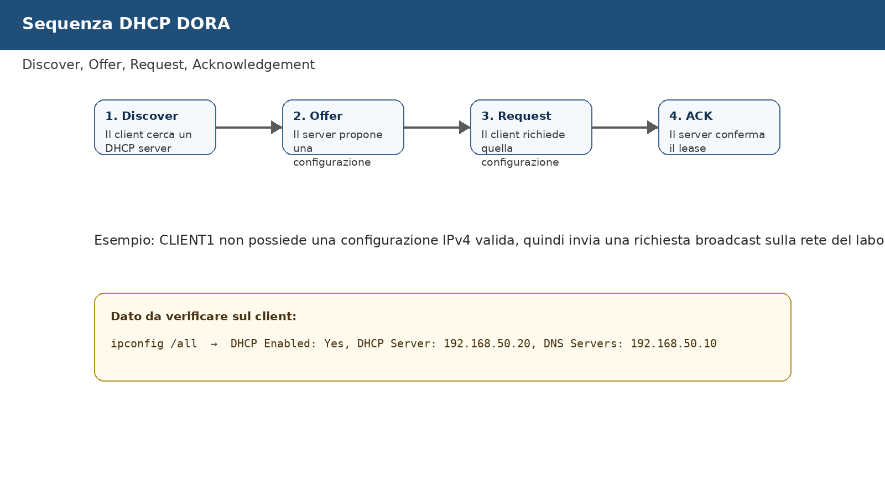

Il significato operativo è semplice:

- il client cerca un server DHCP;
- il server propone una configurazione;
- il client accetta la proposta;
- il server conferma il lease.

📌 **Esempio**

Quando più avanti eseguiremo su `CLIENT1`:

```cmd
ipconfig /release
ipconfig /renew
```

forzeremo il client a rilasciare la configurazione corrente e richiederne una nuova al DHCP server.

🛠️ **Task - Preparazione del file evidenze**

Prima di modificare la configurazione del client, creiamo il file:

```text
evidence_lab10.md
```

Inseriamo una prima sezione:

```md
# Evidenze LAB10 - DHCP in Active Directory

## Stato iniziale

- SRV1 IP:
- SRV1 DNS:
- CLIENT1 configurazione iniziale:
- Rete virtuale:
```

---

## Installiamo il ruolo DHCP Server su SRV1

Ora installiamo il ruolo DHCP Server su `SRV1` usando la GUI. Questo è il percorso principale del laboratorio.

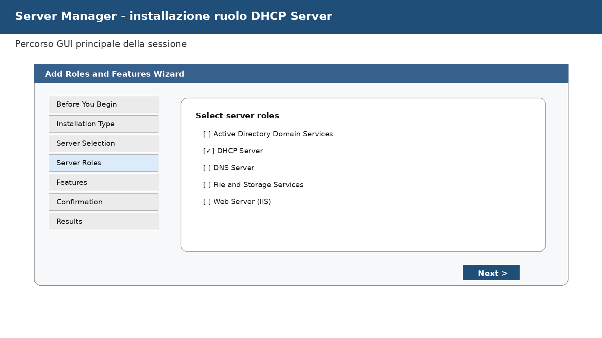

🛠️ **Task - Installazione ruolo DHCP da Server Manager**

Su `SRV1`:

1. apriamo **Server Manager**;
2. selezioniamo **Manage**;
3. scegliamo **Add Roles and Features**;
4. proseguiamo con **Role-based or feature-based installation**;
5. selezioniamo `SRV1` come server di destinazione;
6. nella pagina **Server Roles** selezioniamo:

```text
DHCP Server
```

7. accettiamo l'aggiunta degli strumenti di gestione;
8. proseguiamo fino alla pagina **Confirmation**;
9. avviamo l'installazione;
10. attendiamo il completamento.

📌 **Esempio**

Il ruolo DHCP installa il servizio che risponderà alle richieste dei client. Gli strumenti di gestione installano anche la console **DHCP**, che useremo per creare scope, opzioni, lease e reservation.

🔎 **Verifica**

Al termine dell'installazione, in **Server Manager** deve comparire la notifica di completamento configurazione DHCP.

🧾 **Evidenza**

Inseriamo nel report:

```text
Ruolo DHCP installato su:
Esito installazione:
```

---

## Completiamo la post-installazione e autorizziamo il DHCP in Active Directory

Dopo l'installazione del ruolo, Windows Server richiede una configurazione post-installazione. In questa fase vengono creati i gruppi locali usati dal servizio DHCP e il server viene autorizzato nel dominio.

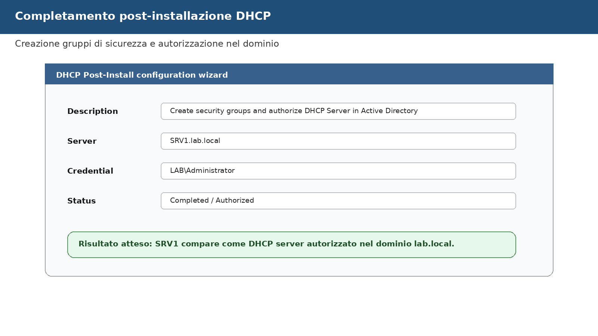

🛠️ **Task - Completamento post-installazione**

Su `SRV1`:

1. in **Server Manager**, apriamo la notifica in alto a destra;
2. selezioniamo **Complete DHCP configuration**;
3. nella procedura guidata verifichiamo le credenziali;
4. confermiamo la creazione dei gruppi di sicurezza DHCP;
5. completiamo la procedura.

📌 **Esempio**

Un DHCP Server installato ma non autorizzato non è pronto per servire correttamente i client di dominio. Nel laboratorio vogliamo che `SRV1` sia esplicitamente autorizzato nel dominio `lab.local`.

🛠️ **Task - Verifica da DHCP Console**

1. Da **Server Manager** apriamo:

```text
Tools → DHCP
```

2. espandiamo il server `SRV1.lab.local`;
3. verifichiamo la presenza del nodo **IPv4**;
4. controlliamo che non compaiano indicatori di errore sul server.

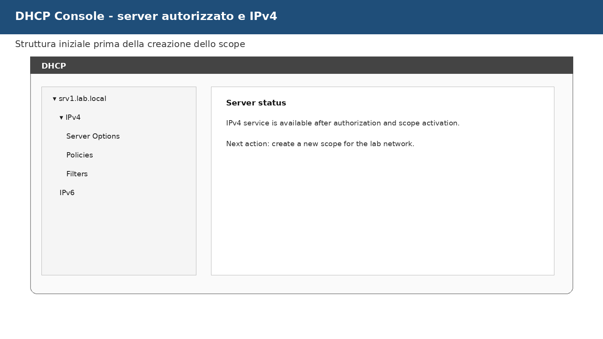

🔎 **Verifica**

Nel dominio, il server DHCP deve risultare autorizzato. Più avanti lo confermeremo anche con PowerShell.

---

## Progettiamo lo scope prima di crearlo

Lo **scope** è l'intervallo di indirizzi che il DHCP server può assegnare ai client. Non coincide necessariamente con tutta la subnet. Di solito una parte della subnet resta riservata a server, gateway, stampanti, apparati di rete o indirizzi gestiti manualmente.

Nel laboratorio useremo questo scope:

```text
Scope name: LAB10_SCOPE_CLIENT
Subnet: 192.168.50.0/24
Start IP: 192.168.50.100
End IP: 192.168.50.150
Subnet mask: 255.255.255.0
Lease duration: 8 giorni
```

📌 **Esempio**

Se `DC1` usa `192.168.50.10` e `SRV1` usa `192.168.50.20`, questi indirizzi non devono essere distribuiti dal DHCP ai client. Per questo il pool dinamico parte da `192.168.50.100`.

🛠️ **Task - Annotazione del disegno dello scope**

Nel file `evidence_lab10.md` inseriamo:

```text
Subnet:
Range dinamico:
Indirizzi statici esclusi:
DNS da distribuire:
Dominio DNS da distribuire:
Gateway, se presente:
```

---

## Creiamo lo scope IPv4 da GUI

Creiamo ora lo scope con la console DHCP.

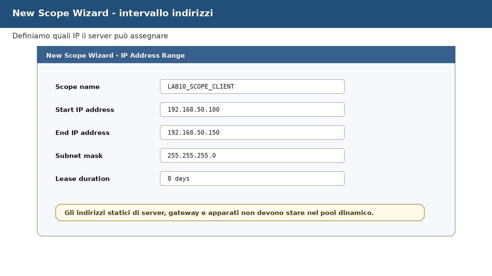

🛠️ **Task - Avvio del New Scope Wizard**

Su `SRV1`, nella console **DHCP**:

1. espandiamo `SRV1.lab.local`;
2. facciamo clic destro su **IPv4**;
3. selezioniamo **New Scope**;
4. assegniamo il nome:

```text
LAB10_SCOPE_CLIENT
```

5. inseriamo il range:

```text
Start IP address: 192.168.50.100
End IP address:   192.168.50.150
Subnet mask:      255.255.255.0
```

Se la rete reale del laboratorio è diversa, usiamo i valori corretti e documentiamoli.

🛠️ **Task - Configurazione esclusioni e lease**

Nella procedura guidata possiamo indicare eventuali esclusioni. Per rendere visibile il concetto, configuriamo una piccola esclusione didattica:

```text
192.168.50.100 - 192.168.50.110
```

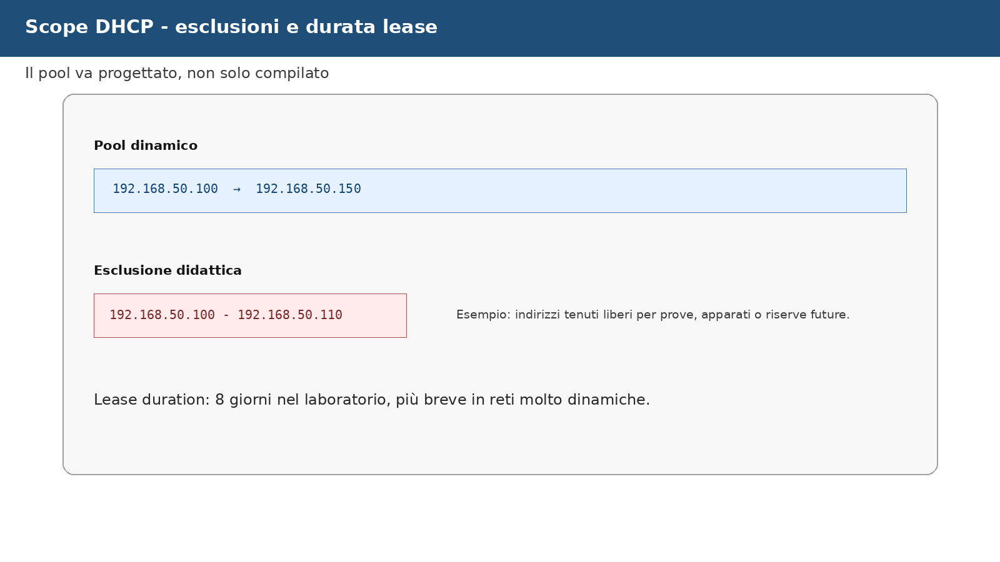

Manteniamo la durata lease predefinita o impostiamo:

```text
8 days
```

📌 **Esempio**

Con questa configurazione il server può assegnare indirizzi nel range generale `192.168.50.100-150`, ma non assegnerà quelli esclusi. Il primo indirizzo realmente assegnabile potrebbe quindi essere `192.168.50.111`.

🔎 **Verifica**

Prima di completare lo scope, rileggiamo:

- nome scope;
- range;
- subnet mask;
- esclusioni;
- durata del lease.

---

## Configuriamo le opzioni DHCP indispensabili

Uno scope non è completo se assegna solo un indirizzo IP. Per Active Directory sono fondamentali almeno queste opzioni:

| Opzione | Nome | Valore nel laboratorio |
|---|---|---|
| `003` | Router | solo se esiste un gateway, per esempio `192.168.50.1` |
| `006` | DNS Servers | `192.168.50.10` |
| `015` | DNS Domain Name | `lab.local` |

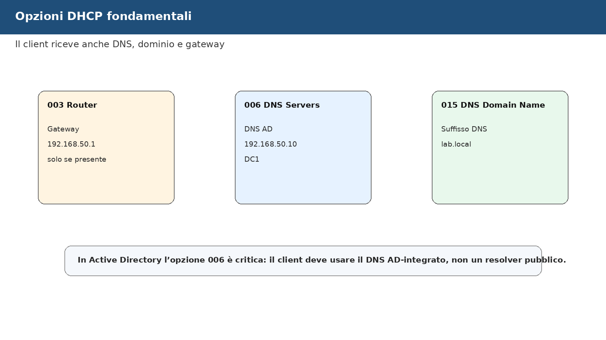

📌 **Esempio**

Un client che riceve `192.168.50.115` come IP ma `8.8.8.8` come DNS può non riuscire a localizzare correttamente i Domain Controller di `lab.local`. Per questo l'opzione `006 DNS Servers` deve puntare al DNS AD-integrato.

🛠️ **Task - Configurazione delle opzioni dello scope**

Durante il wizard, quando viene richiesto se configurare le opzioni DHCP:

1. scegliamo **Yes, I want to configure these options now**;
2. configuriamo **Router** solo se nella rete lab esiste un gateway;
3. configuriamo **DNS Servers** con:

```text
192.168.50.10
```

4. configuriamo **DNS Domain Name** con:

```text
lab.local
```

5. completiamo il wizard;
6. scegliamo di attivare lo scope.

🔎 **Verifica**

Nella console DHCP apriamo:

```text
IPv4 → Scope [192.168.50.0] LAB10_SCOPE_CLIENT → Scope Options
```

Verifichiamo che siano presenti le opzioni configurate.

🧾 **Evidenza**

Nel report inseriamo una tabella:

```text
Opzione DHCP | Valore configurato | Motivo
003 Router   | ...                | ...
006 DNS      | ...                | ...
015 Domain   | ...                | ...
```

---

## Attiviamo e leggiamo lo scope

Uno scope configurato ma non attivo non distribuisce lease. Dopo la creazione verifichiamo che sia attivo e leggiamo la struttura dalla console.

🛠️ **Task - Lettura dello scope da DHCP Console**

Nella console **DHCP** apriamo:

```text
IPv4
└── Scope [192.168.50.0] LAB10_SCOPE_CLIENT
    ├── Address Pool
    ├── Address Leases
    ├── Reservations
    ├── Scope Options
    └── Policies
```

Per ogni nodo osserviamo il significato:

- **Address Pool** mostra il range e le esclusioni;
- **Address Leases** mostra gli IP assegnati ai client;
- **Reservations** mostra IP riservati a specifici client;
- **Scope Options** mostra i parametri distribuiti ai client;
- **Policies** consente configurazioni più avanzate non necessarie nella prova base.

🔎 **Verifica**

Apriamo **Address Pool** e controlliamo che il range dinamico e le esclusioni siano coerenti.

---

## Passiamo CLIENT1 a DHCP in modo controllato

Ora usiamo `CLIENT1` per verificare il risultato. Prima di modificare la configurazione, salviamo lo stato iniziale. Questo è importante perché alcuni laboratori successivi potrebbero richiedere una configurazione IP specifica.

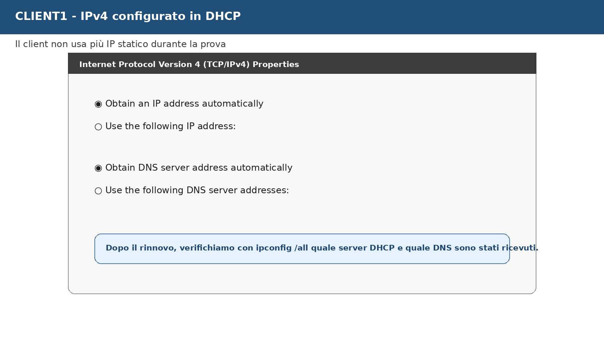

🛠️ **Task - Salvataggio dello stato iniziale di CLIENT1**

Su `CLIENT1`, apriamo un prompt dei comandi e salviamo la configurazione:

```cmd
mkdir C:\Temp
ipconfig /all > C:\Temp\LAB10_CLIENT1_ipconfig_prima.txt
```

Nel file `evidence_lab10.md` riportiamo:

```text
CLIENT1 configurazione iniziale:
IP:
DNS:
Gateway:
```

🛠️ **Task - Passaggio a configurazione automatica da GUI**

Su `CLIENT1`:

1. apriamo **Control Panel**;
2. andiamo su **Network and Sharing Center**;
3. selezioniamo **Change adapter settings**;
4. apriamo le proprietà della scheda **Ethernet**;
5. selezioniamo **Internet Protocol Version 4 (TCP/IPv4)**;
6. scegliamo:

```text
Obtain an IP address automatically
Obtain DNS server address automatically
```

7. confermiamo con **OK**.

🛠️ **Task - Rinnovo configurazione**

Da prompt dei comandi su `CLIENT1`:

```cmd
ipconfig /release
ipconfig /renew
ipconfig /all
```

🔎 **Verifica**

Controlliamo che `CLIENT1` abbia ricevuto:

```text
DHCP Enabled: Yes
DHCP Server: 192.168.50.20
IPv4 Address: 192.168.50.xxx
DNS Servers: 192.168.50.10
Primary DNS Suffix: lab.local
```

---

## Verifichiamo lease, DNS e dominio

Il lease è l'assegnazione temporanea di un indirizzo IP a un client. Lo vediamo sia dal lato client sia dal lato server.

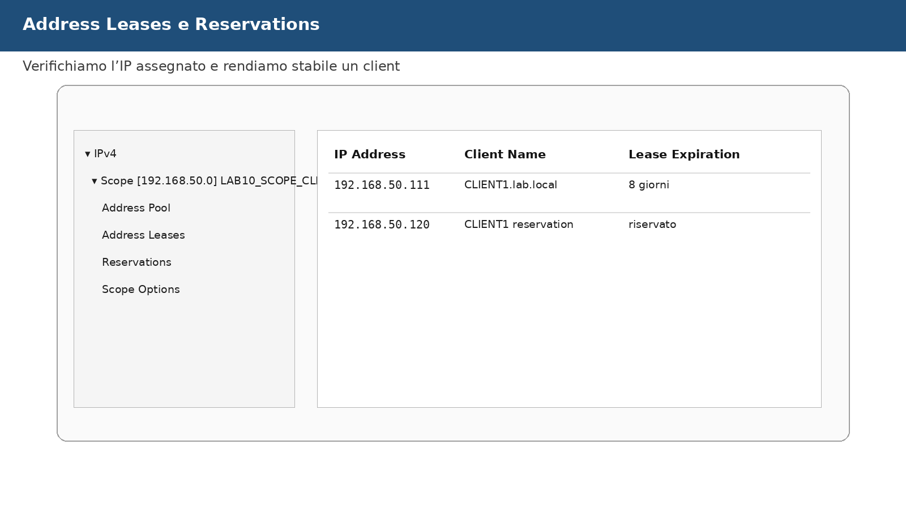

🛠️ **Task - Verifica lease da DHCP Console**

Su `SRV1`, nella console **DHCP**:

1. apriamo lo scope `LAB10_SCOPE_CLIENT`;
2. selezioniamo **Address Leases**;
3. individuiamo il lease di `CLIENT1`;
4. annotiamo indirizzo IP, nome client e scadenza lease.

🔎 **Verifica lato client**

Su `CLIENT1`:

```cmd
nslookup lab.local
nltest /dsgetdc:lab.local
ping SRV1
```

📌 **Esempio**

Se `CLIENT1` riceve un IP corretto ma `nltest /dsgetdc:lab.local` fallisce, non consideriamo concluso il laboratorio. In un dominio non basta “avere un IP”: dobbiamo verificare anche DNS e localizzazione del Domain Controller.

🧾 **Evidenza**

Nel report inseriamo:

```text
IP ricevuto da CLIENT1:
DHCP Server rilevato:
DNS ricevuto:
Lease visibile su SRV1: sì/no
Test nslookup lab.local: esito
Test nltest /dsgetdc:lab.local: esito
```

---

## Reservation: rendere stabile l'indirizzo di un client specifico

Una **reservation** associa un indirizzo IP a un client specifico, identificato dal suo MAC address o client identifier. È utile per dispositivi che devono ricevere sempre lo stesso indirizzo ma restare gestiti tramite DHCP.

📌 **Esempio**

Una stampante di rete, un dispositivo di laboratorio o una workstation di test possono usare una reservation invece di una configurazione statica manuale.

🛠️ **Task - Lettura del MAC address di CLIENT1**

Su `CLIENT1`, apriamo un prompt:

```cmd
getmac /v
```

Annotiamo il MAC address della scheda Ethernet usata nella rete del laboratorio.

🛠️ **Task - Creazione reservation da GUI**

Su `SRV1`, nella console **DHCP**:

1. apriamo lo scope `LAB10_SCOPE_CLIENT`;
2. facciamo clic destro su **Reservations**;
3. selezioniamo **New Reservation**;
4. inseriamo:

```text
Reservation name: CLIENT1_LAB10
IP address:       192.168.50.120
MAC address:      MAC reale di CLIENT1
Description:      Reservation didattica CLIENT1
Supported types:  DHCP only
```

5. confermiamo.

🔎 **Verifica**

Su `CLIENT1`:

```cmd
ipconfig /release
ipconfig /renew
ipconfig /all
```

Controlliamo se il client riceve l'indirizzo riservato.

🧾 **Evidenza**

Nel report inseriamo:

```text
Reservation name:
MAC address usato:
IP riservato:
IP ricevuto dopo renew:
```

---

## DHCP e registrazione DNS dinamica

DHCP e DNS non sono servizi isolati. In un dominio, il nome del client deve essere risolvibile e coerente con l'indirizzo IP assegnato. A seconda della configurazione, il client può registrare i propri record DNS oppure il server DHCP può aggiornare alcuni record per conto del client.

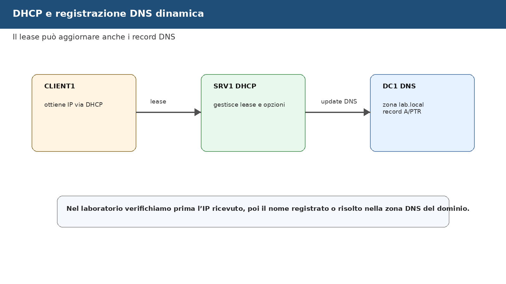

🛠️ **Task - Verifica impostazioni DNS dello scope**

Su `SRV1`, nella console **DHCP**:

1. clic destro su **IPv4** o sullo scope;
2. apriamo **Properties**;
3. selezioniamo la scheda **DNS**;
4. osserviamo le opzioni disponibili per gli aggiornamenti dinamici.

Non cambiamo impostazioni avanzate senza indicazione del docente. In questa sessione l'obiettivo è riconoscere il collegamento tra lease DHCP e risoluzione DNS.

🔎 **Verifica su DC1**

Su `DC1`, apriamo **DNS Manager** e controlliamo nella zona:

```text
Forward Lookup Zones → lab.local
```

Cerchiamo eventuali record collegati a `CLIENT1`.

📌 **Esempio**

Se il lease assegna `192.168.50.120` a `CLIENT1`, il record DNS dovrebbe permettere di risolvere:

```text
CLIENT1.lab.local
```

Il comportamento dipende dalle impostazioni di registrazione dinamica e dalla configurazione del client.

---

## Prova controllata: opzione DNS errata

Ora simuliamo un errore frequente: il client riceve un IP valido ma un DNS sbagliato. Questa prova serve a distinguere un problema DHCP da un problema DNS.

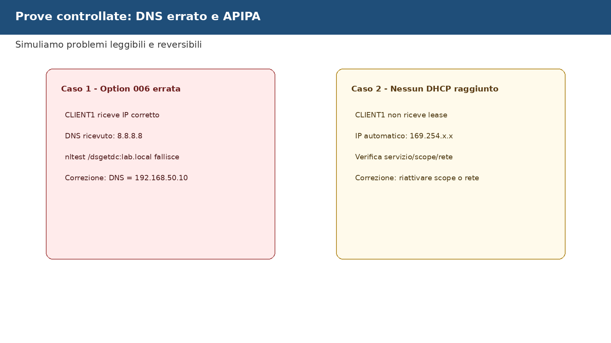

🧪 **Prova controllata - DNS errato nello scope**

Su `SRV1`, nella console **DHCP**:

1. apriamo:

```text
IPv4 → Scope LAB10_SCOPE_CLIENT → Scope Options
```

2. modifichiamo temporaneamente l'opzione `006 DNS Servers` inserendo un valore non adatto al dominio, per esempio:

```text
8.8.8.8
```

3. su `CLIENT1` eseguiamo:

```cmd
ipconfig /release
ipconfig /renew
ipconfig /all
nltest /dsgetdc:lab.local
```

🔎 **Verifica**

Il client può ricevere un indirizzo IP, ma non usare correttamente il dominio se il DNS non punta a `DC1`.

🧹 **Ripristino**

Su `SRV1`, riportiamo l'opzione `006 DNS Servers` a:

```text
192.168.50.10
```

Su `CLIENT1`:

```cmd
ipconfig /release
ipconfig /renew
nltest /dsgetdc:lab.local
```

🧾 **Evidenza**

Nel report documentiamo:

```text
Errore simulato:
Sintomo osservato:
Comando di verifica:
Correzione applicata:
Esito dopo ripristino:
```

---

## Prova controllata: scope disattivato e indirizzo APIPA

Un secondo errore frequente è la mancata disponibilità dello scope. Se il client non riceve risposta DHCP, può assegnarsi un indirizzo automatico APIPA della famiglia `169.254.x.x`.

🧪 **Prova controllata - Scope disattivato**

Su `SRV1`, nella console **DHCP**:

1. clic destro sullo scope `LAB10_SCOPE_CLIENT`;
2. selezioniamo **Deactivate**;
3. su `CLIENT1` eseguiamo:

```cmd
ipconfig /release
ipconfig /renew
ipconfig /all
```

🔎 **Verifica**

Se il client non raggiunge altri DHCP server, potremmo osservare un indirizzo APIPA:

```text
169.254.x.x
```

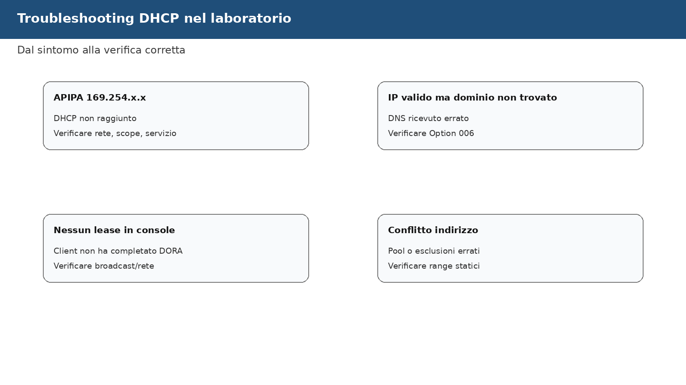

🧹 **Ripristino**

Su `SRV1`:

1. clic destro sullo scope;
2. selezioniamo **Activate**;
3. su `CLIENT1` rinnoviamo:

```cmd
ipconfig /release
ipconfig /renew
```

🔎 **Verifica finale della prova**

Il client deve tornare a ricevere un indirizzo coerente con lo scope.

---

## Event Viewer: leggiamo i sintomi anche dai log

La console DHCP mostra scope e lease, ma per la diagnosi dobbiamo abituarci anche ai registri eventi.

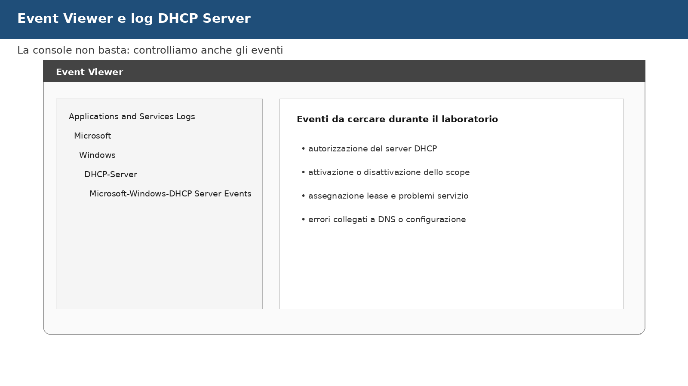

🛠️ **Task - Lettura eventi DHCP Server**

Su `SRV1`:

1. apriamo **Event Viewer**;
2. navighiamo in:

```text
Applications and Services Logs
Microsoft
Windows
DHCP-Server
Microsoft-Windows-DHCP Server Events
```

3. cerchiamo eventi relativi a:

- avvio del servizio DHCP;
- autorizzazione;
- scope;
- problemi di servizio;
- errori rilevati durante le prove controllate.

🧾 **Evidenza**

Nel report annotiamo almeno un evento osservato:

```text
Log consultato:
Evento rilevante:
Significato:
```

---

## Backup, esportazione e ripristino della configurazione DHCP

Alla fine della configurazione dobbiamo sapere come documentare e salvare lo stato del server DHCP.

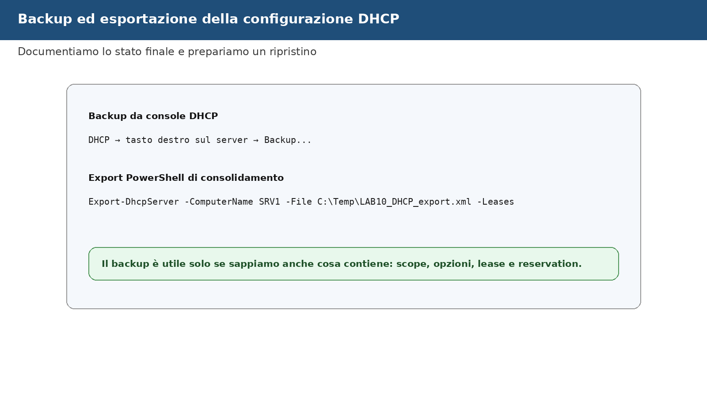

🛠️ **Task - Backup da console DHCP**

Su `SRV1`, nella console **DHCP**:

1. clic destro sul server `SRV1.lab.local`;
2. selezioniamo **Backup**;
3. scegliamo un percorso locale, per esempio:

```text
C:\Backup\DHCP_LAB10
```

4. completiamo il backup.

🔎 **Verifica**

Controlliamo che la cartella di backup contenga i file generati dal servizio.

📌 **Esempio**

Un backup DHCP è utile prima di modificare scope, opzioni o reservation in un ambiente già configurato.

---

## Consolidamento finale con comandi e PowerShell

Solo dopo aver completato la configurazione da GUI usiamo alcuni comandi per consolidare quanto fatto. Qui non stiamo sostituendo la GUI: stiamo verificando e documentando.

🛠️ **Task - Verifiche lato client**

Su `CLIENT1`:

```cmd
ipconfig /all
nslookup lab.local
nltest /dsgetdc:lab.local
```

🛠️ **Task - Verifiche lato server**

Su `SRV1`, da PowerShell amministrativo:

```powershell
Get-DhcpServerInDC
Get-DhcpServerv4Scope
Get-DhcpServerv4OptionValue -ScopeId 192.168.50.0
Get-DhcpServerv4Lease -ScopeId 192.168.50.0
Get-DhcpServerv4Reservation -ScopeId 192.168.50.0
```

Se la rete usa un altro indirizzamento, sostituiamo `192.168.50.0` con lo Scope ID reale.

🛠️ **Task - Export della configurazione DHCP**

Su `SRV1`:

```powershell
mkdir C:\Temp -ErrorAction SilentlyContinue
Export-DhcpServer -ComputerName SRV1 -File C:\Temp\LAB10_DHCP_export.xml -Leases -Force
```

🧾 **Evidenza**

Nel report finale inseriamo:

```text
Get-DhcpServerInDC: esito
Scope configurato:
Opzioni scope:
Lease CLIENT1:
Reservation CLIENT1:
Export DHCP creato: sì/no
```

---

## Ripristino dello stato iniziale di CLIENT1

Se i laboratori successivi richiedono `CLIENT1` con IP statico, ripristiniamo la configurazione iniziale usando il file salvato all'inizio.

🧹 **Ripristino - CLIENT1 statico se richiesto**

Su `CLIENT1`:

1. apriamo le proprietà IPv4 della scheda Ethernet;
2. reinseriamo IP, subnet mask, gateway e DNS annotati nello stato iniziale;
3. confermiamo;
4. verifichiamo:

```cmd
ipconfig /all
nltest /dsgetdc:lab.local
```

Se invece il percorso didattico decide di mantenere `CLIENT1` in DHCP, documentiamo la scelta nel report.

---

## Verifica di non regressione

Prima di chiudere, controlliamo che la sessione non abbia compromesso i servizi già usati nei laboratori precedenti.

🔎 **Verifica finale**

Da `CLIENT1`:

```cmd
nslookup lab.local
nltest /dsgetdc:lab.local
ping SRV1
```

Da `SRV1`:

```powershell
Get-DhcpServerInDC
Get-DhcpServerv4Scope
Get-DhcpServerv4Lease -ScopeId 192.168.50.0
```

Da `DC1`, tramite **DNS Manager**, verifichiamo che la zona `lab.local` sia ancora presente e funzionante.

---

## Evidenze finali richieste

Completiamo il file:

```text
evidence_lab10.md
```

Il file deve contenere:

- stato iniziale di `SRV1` e `CLIENT1`;
- screenshot o descrizione dell'installazione ruolo DHCP;
- autorizzazione DHCP in AD;
- scope creato;
- opzioni `003`, `006`, `015` configurate;
- lease di `CLIENT1`;
- reservation, se completata;
- prova controllata con DNS errato;
- prova controllata con scope disattivato o descrizione del test guidato;
- evento DHCP osservato;
- comandi finali di consolidamento;
- decisione finale su `CLIENT1`: DHCP o ripristino IP statico.

---

## Domande di consolidamento

1. Perché in un dominio Active Directory il server DHCP deve essere autorizzato?
2. Quale differenza c'è tra scope, lease, exclusion e reservation?
3. Perché l'opzione DHCP `006 DNS Servers` è critica per un client di dominio?
4. In quali casi configuriamo l'opzione `003 Router`?
5. Perché un client può avere un IP valido ma non riuscire a trovare il Domain Controller?
6. Che cosa indica un indirizzo `169.254.x.x` su `CLIENT1`?
7. Come distinguiamo un problema DHCP da un problema DNS?
8. Quale informazione osserviamo in **Address Leases**?
9. Perché una reservation non è la stessa cosa di un IP statico configurato manualmente?
10. Quali controlli eseguiamo prima di chiudere il laboratorio per evitare regressioni?

---

## Impatto sui laboratori successivi

### Oggetti modificati

Durante questa sessione modifichiamo o creiamo:

- ruolo DHCP Server su `SRV1`;
- autorizzazione DHCP in Active Directory;
- scope IPv4 del laboratorio;
- opzioni DHCP dello scope;
- lease di `CLIENT1`;
- eventuale reservation per `CLIENT1`;
- eventuale backup/export DHCP;
- configurazione IP di `CLIENT1`, se passa temporaneamente a DHCP.

### Oggetti che non devono essere modificati

Non modifichiamo:

- IP statico di `DC1`;
- ruolo DNS AD-integrato su `DC1`;
- GPO operative dei laboratori precedenti;
- File Server del LAB09, salvo verifiche di raggiungibilità;
- WSUS, che verrà trattato nella sessione successiva;
- VM `CLU1` e `CLU2`.

### Come ripristinare lo stato iniziale

Se serve tornare allo stato precedente:

1. ripristiniamo la configurazione IP statica di `CLIENT1`, se era prevista;
2. disattiviamo lo scope DHCP, se il docente lo richiede;
3. manteniamo o rimuoviamo la reservation in base alle indicazioni del percorso;
4. conserviamo il backup/export DHCP come evidenza.

### Verifica di non regressione

La verifica minima è:

```cmd
nslookup lab.local
nltest /dsgetdc:lab.local
ping SRV1
```

più il controllo da `SRV1`:

```powershell
Get-DhcpServerInDC
Get-DhcpServerv4Scope
```

Il laboratorio è completato quando `CLIENT1` riceve una configurazione coerente, trova il dominio, vede `SRV1`, e il report consente di ricostruire cosa è stato configurato e verificato.
