# LAB11 - WSUS e aggiornamenti centralizzati con Group Policy

Versione GUI-first con laboratorio completo, immagini, attività operative e consolidamento finale - v2

## Sessione di lavoro: governare gli aggiornamenti Windows nel dominio

In questa sessione lavoriamo su **Windows Server Update Services**, spesso abbreviato in **WSUS**. Nei laboratori precedenti abbiamo costruito una base importante: dominio Active Directory, DNS funzionante, GPO, File Server e DHCP. Ora aggiungiamo un altro tassello dell’amministrazione centralizzata: la gestione degli aggiornamenti dei client Windows.

In una rete aziendale non è sempre opportuno lasciare ogni client libero di aggiornarsi direttamente da Internet in modo autonomo. Un’organizzazione può avere bisogno di approvare gli aggiornamenti, testarli su un gruppo pilota, evitare download duplicati su molte postazioni e raccogliere informazioni sullo stato dei computer. WSUS nasce per questo: centralizzare il processo di aggiornamento e renderlo governabile.

Durante il laboratorio lavoriamo principalmente con strumenti grafici:

- **Server Manager** su `SRV1`;
- **Windows Server Update Services Console**;
- **Group Policy Management** su `DC1`;
- **Windows Update** e strumenti di verifica su `CLIENT1`;
- **Event Viewer** quando serve diagnosticare un comportamento anomalo.

Useremo PowerShell e comandi solo nella parte finale, come consolidamento, verifica e raccolta delle evidenze.

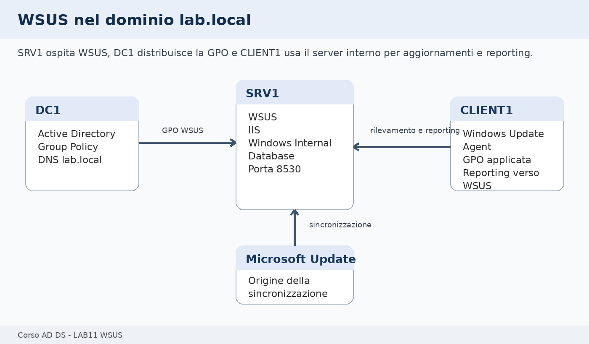

---

## Come useremo le 3 ore

La sessione è progettata per **3 ore**. L’obiettivo non è scaricare e approvare un grande numero di aggiornamenti, ma comprendere e configurare il flusso completo:

1. WSUS viene installato su `SRV1`;
2. WSUS viene configurato con scelte limitate e documentate;
3. una GPO configura `CLIENT1` per usare WSUS;
4. il client riceve la policy e contatta il server interno;
5. raccogliamo evidenze per distinguere una configurazione funzionante da una configurazione solo apparentemente completata.

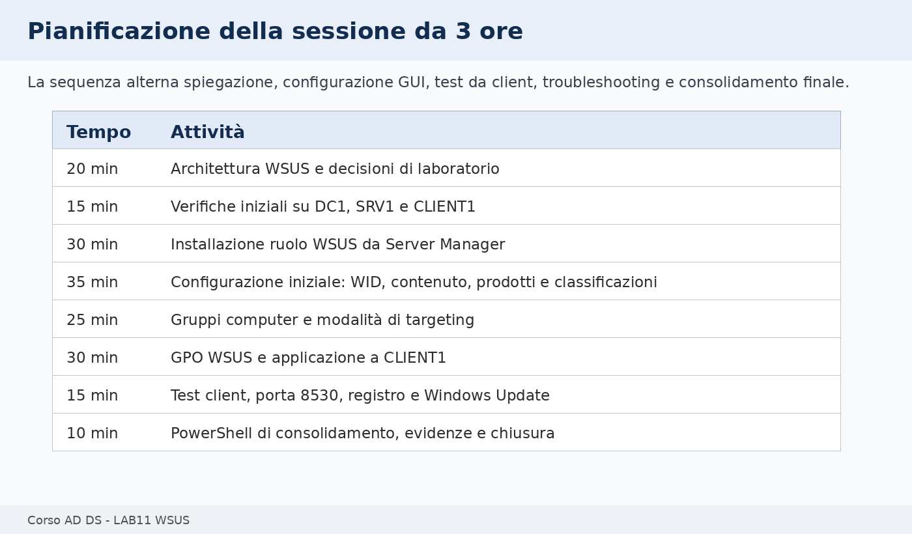

| Fase di lavoro | Durata indicativa | Attività prevalente |
|---|---:|---|
| WSUS, aggiornamenti e decisioni di laboratorio | 20 min | spiegazione discorsiva + lettura schema |
| Verifica ambiente e prerequisiti | 15 min | controlli su DC1, SRV1 e CLIENT1 |
| Installazione ruolo WSUS su `SRV1` | 30 min | Server Manager |
| Configurazione iniziale WSUS | 35 min | wizard WSUS, prodotti, classificazioni, lingue |
| Gruppi computer e targeting | 25 min | console WSUS |
| GPO WSUS e test su `CLIENT1` | 30 min | Group Policy Management + client |
| Troubleshooting guidato | 15 min | casi frequenti |
| PowerShell di consolidamento ed evidenze | 10 min | comandi essenziali e report |

Totale: **180 minuti**.

Se la prima sincronizzazione richiede molto tempo, non aspettiamo il completamento di tutte le operazioni online. Nel laboratorio è sufficiente configurare correttamente WSUS, avviare o predisporre la sincronizzazione, configurare la GPO e verificare che `CLIENT1` riceva le impostazioni corrette.

---

## Ambiente usato durante la sessione

| VM | Ruolo | Uso nel laboratorio |
|---|---|---|
| `DC1` | Domain Controller, DNS e gestione GPO | creazione e collegamento della GPO WSUS |
| `SRV1` | server membro | installazione e configurazione WSUS |
| `CLIENT1` | client membro del dominio | test di applicazione della GPO e contatto con WSUS |
| `CLU1`, `CLU2` | nodi cluster | non utilizzati in questa sessione |

Valori di riferimento:

| Elemento | Valore didattico |
|---|---|
| Dominio | `lab.local` |
| Server WSUS | `SRV1` |
| Nome FQDN WSUS | `srv1.lab.local` |
| URL WSUS HTTP | `http://srv1.lab.local:8530` |
| Database | Windows Internal Database |
| Percorso contenuto consigliato | `D:\WSUS` oppure `C:\WSUS` |
| Gruppo computer WSUS | `LAB-Client-Test` |
| GPO | `GPO_LAB11_WSUS_Client` |

📌 **Esempio**

Se `CLIENT1` riceve dalla GPO il valore:

```text
WUServer = http://srv1.lab.local:8530
```

il client non userà più direttamente Windows Update come origine principale della configurazione di aggiornamento, ma tenterà di contattare il server WSUS interno.

🛠️ **Task - Verifica iniziale delle VM**

Accediamo alle VM indicate e verifichiamo che:

- `DC1` sia acceso;
- `SRV1` sia membro del dominio;
- `CLIENT1` sia membro del dominio;
- la risoluzione DNS di `srv1.lab.local` funzioni da `CLIENT1`;
- `SRV1` abbia spazio disco sufficiente per il contenuto WSUS;
- non siano in corso attività di laboratorio incompatibili su `SRV1`.

🔎 **Verifica**

Da `CLIENT1`, apriamo un prompt dei comandi e verifichiamo:

```cmd
ping srv1.lab.local
nslookup srv1.lab.local
```

Da `SRV1`, verifichiamo:

```cmd
hostname
ipconfig /all
```

🧾 **Evidenza**

Nel file `evidence_lab11.md` annotiamo:

```text
Nome SRV1:
IP SRV1:
Risoluzione srv1.lab.local da CLIENT1:
Percorso contenuto WSUS scelto:
```

---

## Perché WSUS richiede una progettazione minima

WSUS non è soltanto una console da cui premere “approva”. Prima di installarlo è necessario chiarire alcune decisioni:

- quale server ospita il ruolo;
- dove verrà memorizzato il contenuto;
- quali prodotti Microsoft gestire;
- quali classificazioni sincronizzare;
- come i client verranno indirizzati verso WSUS;
- come distinguere un gruppo pilota da gruppi più ampi.

In questo laboratorio scegliamo una configurazione contenuta, adatta alla durata della sessione e all’ambiente didattico.

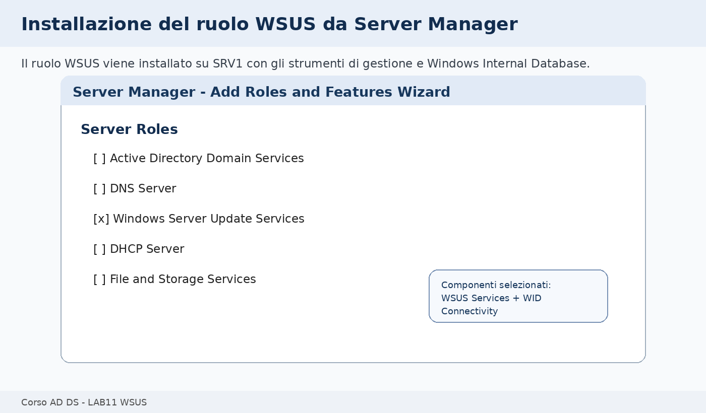

📌 **Esempio**

In produzione potremmo avere più gruppi:

```text
Pilot-Clients
Workstations
Servers
Critical-Servers
```

Nel laboratorio usiamo un solo gruppo principale:

```text
LAB-Client-Test
```

Questo ci consente di vedere il meccanismo senza introdurre troppe variabili.

---

## Installiamo il ruolo WSUS su SRV1

L’installazione viene eseguita da **Server Manager** su `SRV1`.

🛠️ **Task - Avvio dell’installazione del ruolo**

Su `SRV1`:

1. apriamo **Server Manager**;
2. selezioniamo **Manage**;
3. selezioniamo **Add Roles and Features**;
4. scegliamo **Role-based or feature-based installation**;
5. selezioniamo il server locale `SRV1`;
6. nella pagina **Server Roles** selezioniamo **Windows Server Update Services**;
7. accettiamo l’aggiunta degli strumenti di gestione quando richiesto.

🔎 **Verifica**

Nell’elenco dei ruoli deve risultare selezionato **Windows Server Update Services**.

🧾 **Evidenza**

Inseriamo nel report uno screenshot o una descrizione del ruolo selezionato.

---

## Scegliamo i servizi di ruolo WSUS

Durante il wizard scegliamo i servizi di ruolo. Per il laboratorio useremo **Windows Internal Database**, che evita di dover installare SQL Server.

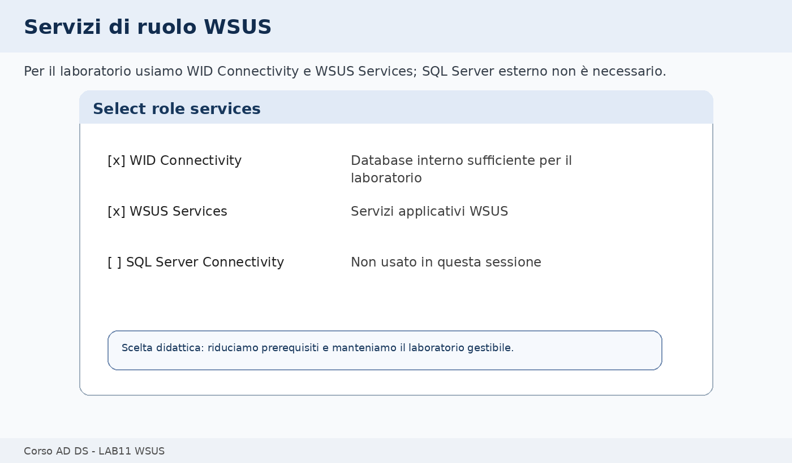

🛠️ **Task - Selezione dei servizi di ruolo**

Nella pagina dei servizi WSUS selezioniamo:

- **WID Connectivity**;
- **WSUS Services**.

Non selezioniamo **SQL Server Connectivity**, salvo indicazione specifica del docente e disponibilità di un SQL Server già predisposto.

📌 **Esempio**

Con **WID Connectivity**, WSUS usa un database interno locale. Questo è sufficiente per il laboratorio e per molte installazioni semplici. Con **SQL Server Connectivity**, invece, WSUS si appoggia a un’istanza SQL esterna o dedicata.

🔎 **Verifica**

Prima di proseguire, controlliamo che siano selezionati solo i componenti previsti.

---

## Definiamo il percorso del contenuto WSUS

WSUS può scaricare localmente i file degli aggiornamenti approvati. Per questo motivo chiede un percorso per il contenuto.

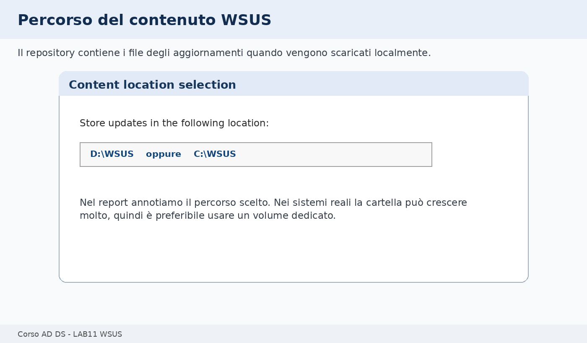

🛠️ **Task - Scelta del percorso contenuto**

Se `SRV1` dispone di un disco dati, usiamo:

```text
D:\WSUS
```

Se non esiste un disco `D:`, usiamo:

```text
C:\WSUS
```

Creiamo la cartella se necessario e proseguiamo con l’installazione.

📌 **Esempio**

Se il laboratorio usa solo il disco di sistema, `C:\WSUS` è accettabile. In produzione, invece, è preferibile separare il contenuto WSUS dal volume di sistema, perché gli aggiornamenti possono occupare molto spazio.

🔎 **Verifica**

Al termine dell’installazione controlliamo che la cartella scelta sia stata creata o sia utilizzabile.

🧾 **Evidenza**

Nel report annotiamo:

```text
Percorso contenuto WSUS scelto:
Motivo della scelta:
```

---

## Completiamo la configurazione post-installazione

Dopo l’installazione del ruolo, Server Manager può mostrare un avviso di configurazione post-installazione. Questa fase prepara WSUS e collega i componenti installati.

🛠️ **Task - Avvio configurazione post-installazione**

Su `SRV1`:

1. apriamo **Server Manager**;
2. controlliamo le notifiche in alto a destra;
3. selezioniamo l’attività post-installazione relativa a WSUS;
4. attendiamo il completamento.

🔎 **Verifica**

Al termine non devono esserci errori bloccanti nella notifica di Server Manager.

🧾 **Evidenza**

Annotiamo nel report se la configurazione post-installazione è stata completata correttamente.

---

## Apriamo la console WSUS e avviamo il wizard iniziale

Dopo la post-installazione apriamo la console **Windows Server Update Services**.

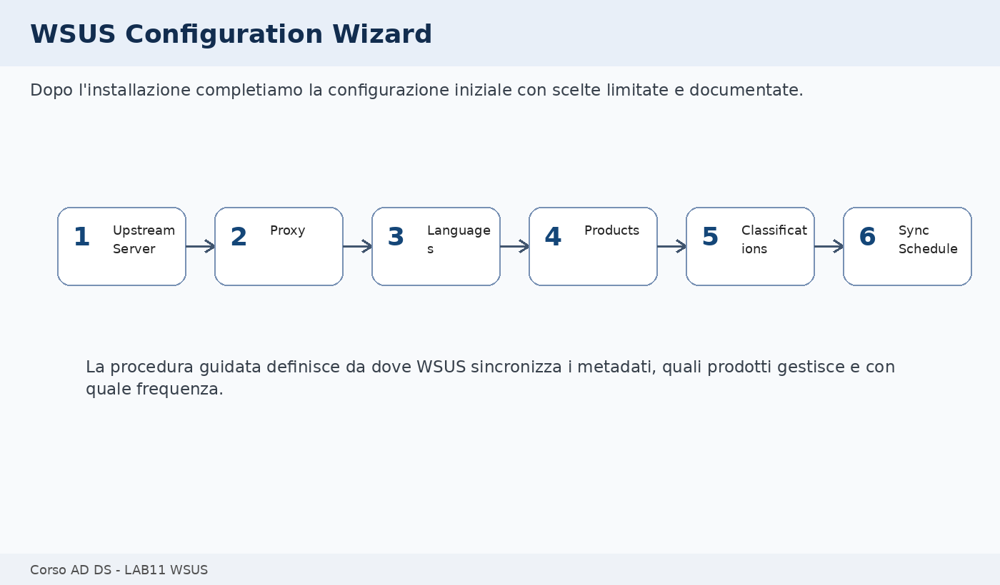

🛠️ **Task - Apertura della console WSUS**

Su `SRV1`:

1. apriamo **Server Manager**;
2. selezioniamo **Tools**;
3. apriamo **Windows Server Update Services**;
4. avviamo il wizard iniziale se viene proposto automaticamente.

Durante il wizard impostiamo una configurazione semplice:

| Pagina | Scelta consigliata |
|---|---|
| Upstream Server | Synchronize from Microsoft Update |
| Proxy Server | non configurato, salvo rete che lo richieda |
| Languages | solo le lingue necessarie |
| Products | Windows del laboratorio |
| Classifications | Critical, Security, Definition Updates |
| Synchronization Schedule | manuale o pianificata, secondo indicazione del docente |

📌 **Esempio**

Se `CLIENT1` è Windows 10, selezioniamo il prodotto coerente con Windows 10. Se `CLIENT1` è Windows 11, selezioniamo Windows 11. Selezionare prodotti non presenti nel laboratorio aumenta il carico senza migliorare la comprensione.

---

## Selezioniamo prodotti e classificazioni con perimetro controllato

La selezione di prodotti e classificazioni è una delle scelte più importanti. Più prodotti selezioniamo, più grande diventa il catalogo degli aggiornamenti e più tempo può richiedere la sincronizzazione.

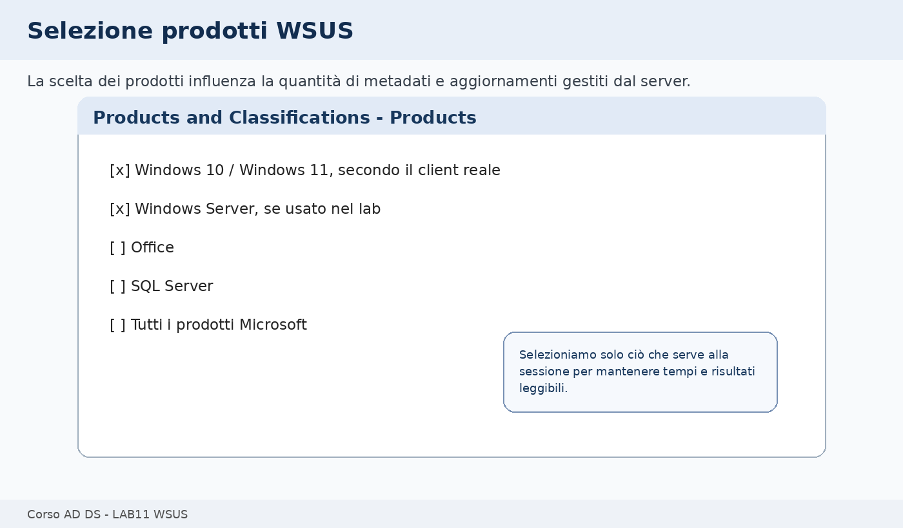

🛠️ **Task - Selezione dei prodotti**

Nella pagina **Products** selezioniamo solo i prodotti coerenti con l’ambiente:

- Windows 10 oppure Windows 11, in base a `CLIENT1`;
- Windows Server 2022 o la versione server effettivamente usata, se vogliamo includere anche server del laboratorio.

Non selezioniamo categorie non necessarie alla sessione.

🔎 **Verifica**

Prima di proseguire, leggiamo ad alta voce il criterio scelto: gestiamo solo i sistemi presenti nel laboratorio.

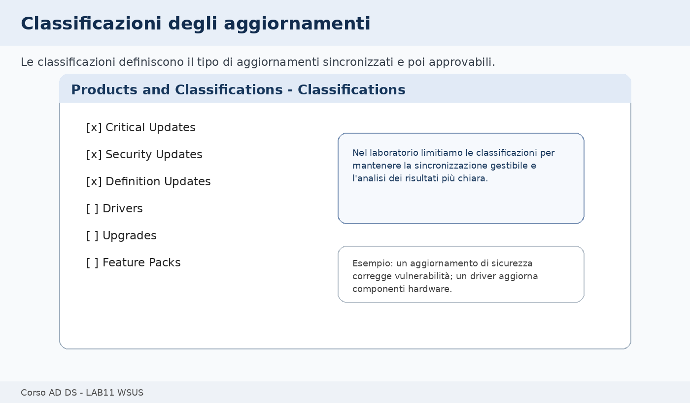

🛠️ **Task - Selezione delle classificazioni**

Nella pagina **Classifications** selezioniamo:

- **Critical Updates**;
- **Security Updates**;
- **Definition Updates**.

Possiamo lasciare non selezionati driver, feature pack e upgrade, salvo indicazione specifica.

📌 **Esempio**

Un aggiornamento di sicurezza corregge una vulnerabilità. Un driver aggiorna un componente hardware. In un laboratorio AD DS è più utile comprendere il flusso WSUS/GPO che gestire l’intero ciclo driver.

🧾 **Evidenza**

Nel report indichiamo:

```text
Prodotti selezionati:
Classificazioni selezionate:
Lingue selezionate:
Tipo di sincronizzazione scelto:
```

---

## Configuriamo i gruppi computer in WSUS

WSUS può gestire computer in gruppi. In questo modo possiamo approvare aggiornamenti per un gruppo pilota prima di estenderli ad altri computer.

Nel laboratorio useremo il gruppo:

```text
LAB-Client-Test
```

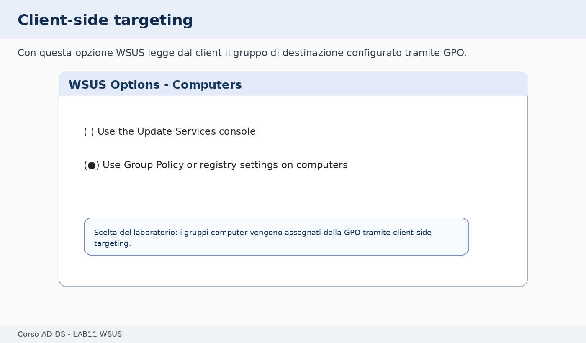

🛠️ **Task - Impostare la modalità di assegnazione gruppi**

Nella console WSUS:

1. selezioniamo **Options**;
2. apriamo **Computers**;
3. scegliamo **Use Group Policy or registry settings on computers**;
4. confermiamo.

Questa scelta abilita il cosiddetto **client-side targeting**: sarà la GPO a comunicare al client in quale gruppo WSUS deve comparire.

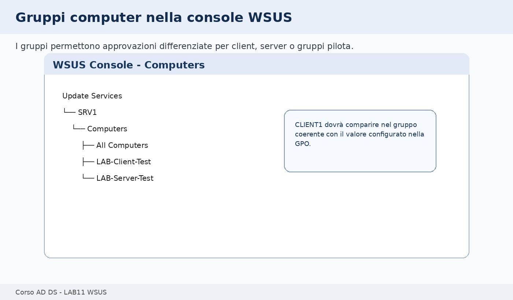

🛠️ **Task - Creazione del gruppo computer**

Nella console WSUS:

1. espandiamo **Computers**;
2. selezioniamo **All Computers**;
3. creiamo un nuovo gruppo chiamato:

```text
LAB-Client-Test
```

🔎 **Verifica**

Il gruppo deve comparire sotto **Computers** nella console WSUS.

🧾 **Evidenza**

Nel report annotiamo:

```text
Modalità computer WSUS:
Gruppo creato:
```

---

## Creiamo la GPO che indirizza CLIENT1 verso WSUS

A questo punto il server WSUS è configurato, ma `CLIENT1` non lo userà automaticamente. Serve una Group Policy.

La GPO deve essere collegata alla OU che contiene `CLIENT1` o i computer di test. Non modifichiamo la **Default Domain Policy** per questa attività: creiamo una policy dedicata e leggibile.

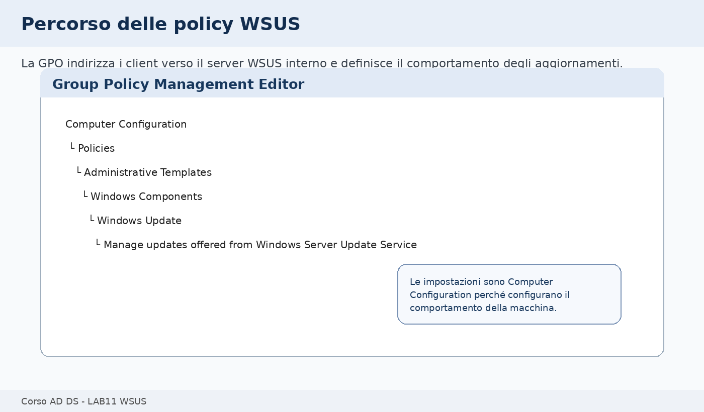

🛠️ **Task - Creazione della GPO**

Su `DC1`:

1. apriamo **Group Policy Management**;
2. individuiamo la OU che contiene `CLIENT1`;
3. creiamo una nuova GPO collegata alla OU;
4. assegniamo il nome:

```text
GPO_LAB11_WSUS_Client
```

5. apriamo la GPO in modifica.

🔎 **Verifica**

La GPO deve essere collegata alla OU corretta. Se `CLIENT1` non è in quella OU, la policy non verrà applicata.

🧾 **Evidenza**

Nel report annotiamo:

```text
Nome GPO:
OU collegata:
Computer presenti nella OU:
```

---

## Configuriamo la posizione interna del server WSUS

La prima impostazione fondamentale è quella che indica al client il server WSUS interno.

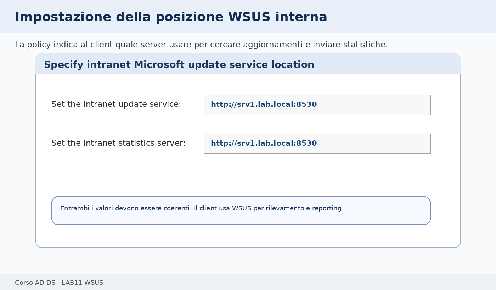

🛠️ **Task - Specify intranet Microsoft update service location**

Nel Group Policy Management Editor apriamo:

```text
Computer Configuration
└── Policies
    └── Administrative Templates
        └── Windows Components
            └── Windows Update
                └── Manage updates offered from Windows Server Update Service
```

Apriamo la policy:

```text
Specify intranet Microsoft update service location
```

Impostiamo:

```text
Enabled
```

Inseriamo in entrambi i campi:

```text
http://srv1.lab.local:8530
```

I due campi sono:

```text
Set the intranet update service for detecting updates:
Set the intranet statistics server:
```

📌 **Esempio**

Il primo valore indica dove il client deve cercare aggiornamenti. Il secondo indica dove inviare le informazioni di stato. Nel laboratorio entrambi puntano allo stesso server WSUS.

🔎 **Verifica**

Controlliamo che l’URL sia scritto correttamente e che non ci siano spazi finali.

---

## Configuriamo comportamento degli aggiornamenti e gruppo target

Ora definiamo come il client deve comportarsi rispetto agli aggiornamenti automatici e in quale gruppo WSUS deve essere registrato.

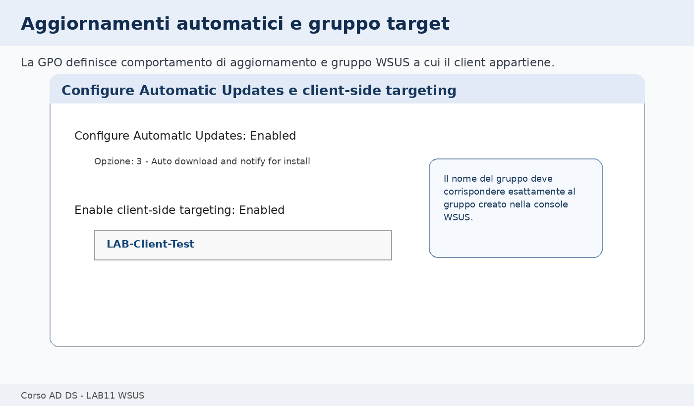

🛠️ **Task - Configure Automatic Updates**

Nella stessa area delle policy Windows Update apriamo:

```text
Configure Automatic Updates
```

Impostiamo:

```text
Enabled
```

Per il laboratorio usiamo una scelta controllata, per esempio:

```text
3 - Auto download and notify for install
```

Questa scelta consente di vedere il comportamento senza forzare installazioni o riavvii non desiderati durante la sessione.

🛠️ **Task - Enable client-side targeting**

Apriamo la policy:

```text
Enable client-side targeting
```

Impostiamo:

```text
Enabled
```

Nel campo del gruppo inseriamo:

```text
LAB-Client-Test
```

Il nome deve corrispondere esattamente al gruppo creato nella console WSUS.

🔎 **Verifica**

Rileggiamo tre elementi:

```text
Server WSUS: http://srv1.lab.local:8530
Gruppo target: LAB-Client-Test
GPO collegata alla OU di CLIENT1
```

---

## Applichiamo la GPO su CLIENT1

Ora passiamo a `CLIENT1` e verifichiamo se la policy arriva realmente.

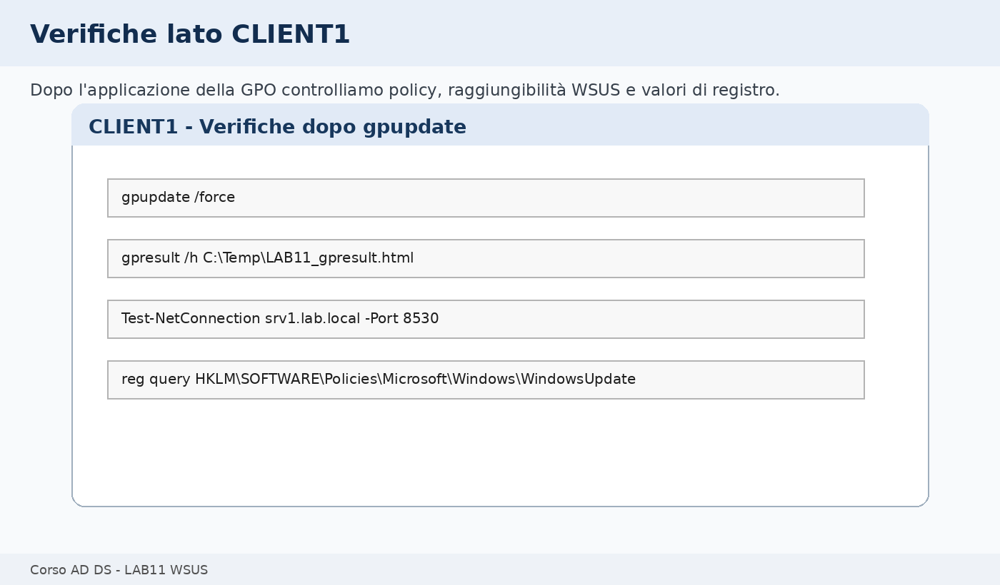

🛠️ **Task - Aggiornamento criteri di gruppo**

Su `CLIENT1`, apriamo un prompt dei comandi come amministratori ed eseguiamo:

```cmd
gpupdate /force
```

Generiamo anche un report:

```cmd
mkdir C:\Temp
gpresult /h C:\Temp\LAB11_gpresult.html
```

Apriamo il report HTML e verifichiamo che la GPO `GPO_LAB11_WSUS_Client` sia applicata nella sezione **Computer Details**.

🔎 **Verifica**

Se la GPO non compare:

- controlliamo che `CLIENT1` sia nella OU corretta;
- controlliamo che la GPO sia linkata alla OU;
- controlliamo eventuali filtri di sicurezza;
- controlliamo che non ci siano blocchi o conflitti con altre GPO.

---

## Verifichiamo il registro client

Quando la policy WSUS viene applicata, Windows scrive valori specifici nel registro del client.

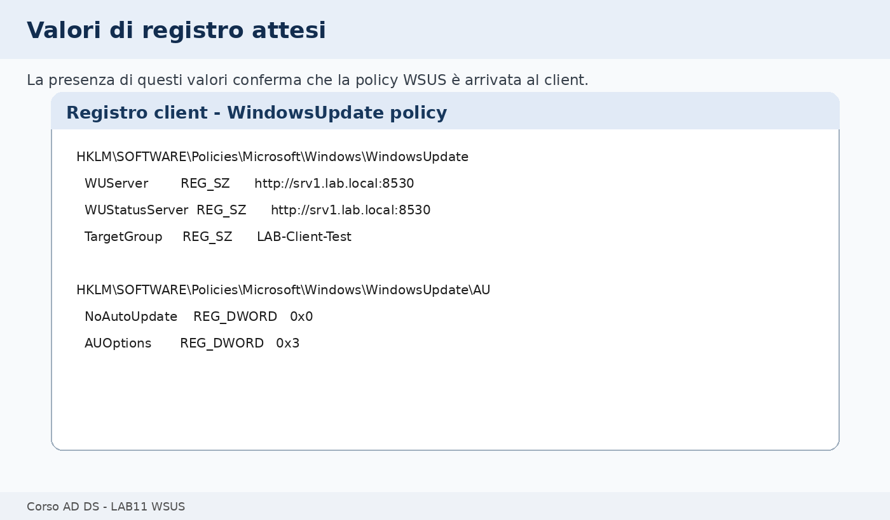

🛠️ **Task - Controllo valori di registro**

Su `CLIENT1`, apriamo **Registry Editor** oppure usiamo il prompt.

Percorso:

```text
HKEY_LOCAL_MACHINE\SOFTWARE\Policies\Microsoft\Windows\WindowsUpdate
```

Valori attesi:

```text
WUServer       http://srv1.lab.local:8530
WUStatusServer http://srv1.lab.local:8530
TargetGroup    LAB-Client-Test
```

Sotto la chiave:

```text
HKEY_LOCAL_MACHINE\SOFTWARE\Policies\Microsoft\Windows\WindowsUpdate\AU
```

verifichiamo i valori relativi alla configurazione automatica.

🔎 **Verifica**

Se questi valori non esistono, il problema è quasi certamente lato GPO, non lato WSUS.

🧾 **Evidenza**

Nel report riportiamo:

```text
WUServer:
WUStatusServer:
TargetGroup:
GPO applicata:
```

---

## Verifichiamo la raggiungibilità del server WSUS

Prima di aspettarci che `CLIENT1` compaia nella console WSUS, dobbiamo verificare che il client riesca a raggiungere il server.

🛠️ **Task - Test porta 8530**

Su `CLIENT1`, da PowerShell o prompt amministrativo:

```powershell
Test-NetConnection srv1.lab.local -Port 8530
```

Se il comando non è disponibile, possiamo provare da browser:

```text
http://srv1.lab.local:8530
```

Non è necessario ottenere una pagina grafica completa; ci interessa verificare che il servizio risponda e che nome e porta siano raggiungibili.

🔎 **Verifica**

Risultati attesi:

```text
TcpTestSucceeded : True
```

oppure una risposta HTTP coerente dal server.

📌 **Esempio**

Se la GPO è applicata ma la porta `8530` non è raggiungibile, il client conosce il server WSUS ma non riesce a comunicare con esso. In quel caso controlliamo DNS, firewall, servizi WSUS e IIS su `SRV1`.

---

## Facciamo rilevare il client da WSUS

Il client può richiedere tempo prima di comparire nella console WSUS. Durante il laboratorio possiamo forzare l’aggiornamento dei criteri e avviare manualmente la ricerca aggiornamenti dall’interfaccia Windows Update.

🛠️ **Task - Avvio rilevamento da GUI**

Su `CLIENT1`:

1. apriamo **Settings**;
2. selezioniamo **Windows Update**;
3. avviamo la ricerca aggiornamenti;
4. attendiamo alcuni minuti;
5. torniamo alla console WSUS su `SRV1`.

In alternativa, come verifica finale, possiamo usare:

```cmd
UsoClient StartScan
```

Il comando può non mostrare output testuale immediato. Per questo lo usiamo solo come supporto, non come unica evidenza.

🔎 **Verifica in WSUS Console**

Su `SRV1`:

1. apriamo la console WSUS;
2. espandiamo **Computers**;
3. selezioniamo **LAB-Client-Test**;
4. aggiorniamo la vista.

Se `CLIENT1` non compare subito, documentiamo lo stato e proseguiamo con le verifiche di GPO, registro e connettività. In aula può essere normale che il reporting richieda più tempo.

---

## Prova controllata: gruppo target errato

Per imparare a diagnosticare WSUS, simuliamo un errore semplice e reversibile: un gruppo target scritto in modo diverso nella GPO rispetto alla console WSUS.

🧪 **Prova controllata - Target group non corrispondente**

Nella GPO modifichiamo temporaneamente il gruppo target, per esempio:

```text
LAB-Clienti-Test
```

mentre nella console WSUS il gruppo reale è:

```text
LAB-Client-Test
```

Su `CLIENT1` eseguiamo:

```cmd
gpupdate /force
```

Poi controlliamo il registro:

```cmd
reg query HKLM\SOFTWARE\Policies\Microsoft\Windows\WindowsUpdate
```

🔎 **Verifica**

Il valore `TargetGroup` cambia, ma non corrisponde a un gruppo esistente o previsto nella console WSUS.

🧹 **Ripristino**

Ripristiniamo nella GPO il valore corretto:

```text
LAB-Client-Test
```

Eseguiamo nuovamente:

```cmd
gpupdate /force
```

🧾 **Evidenza**

Nel report descriviamo:

```text
Errore simulato:
Sintomo:
Correzione:
Verifica finale:
```

---

## Troubleshooting guidato

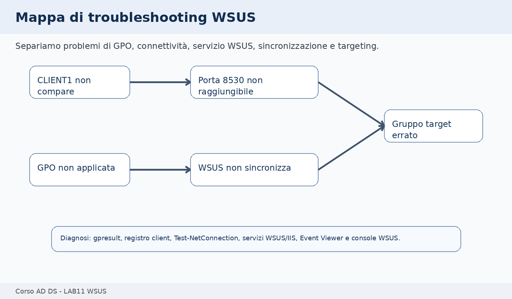

Quando WSUS non funziona come previsto, separiamo il problema in livelli.

### CLIENT1 non riceve la GPO

Controlliamo:

- posizione di `CLIENT1` nella OU;
- link della GPO;
- filtri di sicurezza;
- risultato di `gpresult`.

🔎 **Verifica**

```cmd
gpresult /h C:\Temp\LAB11_gpresult.html
```

### CLIENT1 riceve la GPO ma non raggiunge WSUS

Controlliamo:

- risoluzione di `srv1.lab.local`;
- porta `8530`;
- firewall;
- servizi WSUS e IIS su `SRV1`.

🔎 **Verifica**

```powershell
Test-NetConnection srv1.lab.local -Port 8530
```

### CLIENT1 raggiunge WSUS ma non compare subito nella console

Controlliamo:

- tempo di reporting;
- gruppo target;
- ricerca aggiornamenti avviata dal client;
- filtri della vista WSUS.

📌 **Esempio**

Se la console WSUS filtra solo computer con stato specifico, il client può esistere ma non essere visibile nella vista corrente.

### La sincronizzazione WSUS non parte o fallisce

Controlliamo:

- accesso Internet da `SRV1`;
- eventuale proxy;
- DNS;
- prodotti e classificazioni selezionati;
- Event Viewer.

---

## PowerShell e comandi di consolidamento finale

Questa sezione serve a verificare e raccogliere evidenze. Non sostituisce il percorso GUI svolto in precedenza.

Su `SRV1`:

```powershell
Get-Service WsusService,W3SVC,BITS | Select-Object Name,Status,StartType
```

Verifichiamo la porta:

```powershell
Get-NetTCPConnection -LocalPort 8530 -ErrorAction SilentlyContinue
```

Su `CLIENT1`:

```powershell
Test-NetConnection srv1.lab.local -Port 8530
```

Controlliamo i valori di registro:

```cmd
reg query HKLM\SOFTWARE\Policies\Microsoft\Windows\WindowsUpdate
reg query HKLM\SOFTWARE\Policies\Microsoft\Windows\WindowsUpdate\AU
```

Generiamo report GPO:

```cmd
gpresult /h C:\Temp\LAB11_gpresult.html
```

Se vogliamo raccogliere un file di verifica rapido:

```powershell
"=== WSUS Client Policy ===" | Out-File C:\Temp\LAB11_wsus_client_check.txt
reg query HKLM\SOFTWARE\Policies\Microsoft\Windows\WindowsUpdate | Out-File C:\Temp\LAB11_wsus_client_check.txt -Append
Test-NetConnection srv1.lab.local -Port 8530 | Out-File C:\Temp\LAB11_wsus_client_check.txt -Append
```

---

## Evidenze finali

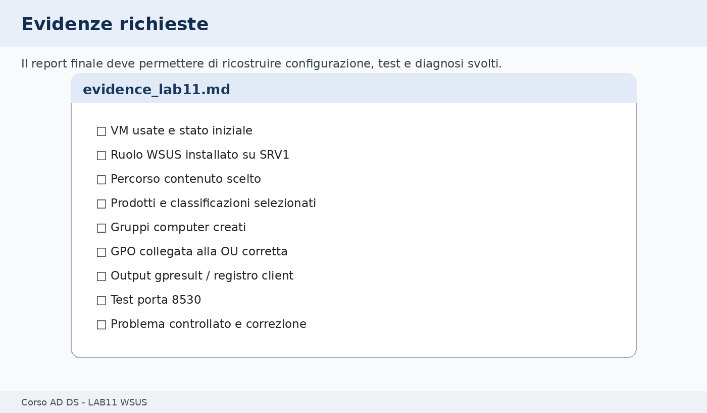

Creiamo un file:

```text
evidence_lab11.md
```

Il file deve contenere:

- VM usate;
- stato iniziale dell’ambiente;
- ruolo WSUS installato su `SRV1`;
- database scelto;
- percorso contenuto scelto;
- prodotti selezionati;
- classificazioni selezionate;
- gruppo computer creato;
- nome e posizione della GPO;
- URL WSUS configurato nella GPO;
- output o screenshot della GPO applicata;
- valori di registro client;
- test porta `8530`;
- esito della prova controllata;
- eventuali problemi incontrati e correzioni.

---

## Domande di consolidamento

1. Quale problema risolve WSUS in un dominio Active Directory?
2. Perché `CLIENT1` non usa automaticamente WSUS solo perché il ruolo è installato su `SRV1`?
3. Qual è la funzione della GPO in questo laboratorio?
4. Perché nel laboratorio usiamo `http://srv1.lab.local:8530`?
5. Qual è la differenza tra prodotti e classificazioni in WSUS?
6. Perché è utile creare un gruppo `LAB-Client-Test`?
7. Che cosa significa client-side targeting?
8. Perché `CLIENT1` potrebbe non comparire subito nella console WSUS?
9. Quali verifiche aiutano a distinguere un problema GPO da un problema WSUS?
10. Quali oggetti o servizi vengono modificati durante questo laboratorio?

---

## Impatto sui laboratori successivi

### Oggetti modificati

Durante il laboratorio modifichiamo o creiamo:

- ruolo WSUS su `SRV1`;
- componenti IIS e WID collegati a WSUS;
- cartella contenuto WSUS;
- configurazione WSUS;
- gruppi computer WSUS;
- GPO `GPO_LAB11_WSUS_Client`;
- impostazioni Windows Update su `CLIENT1` tramite policy.

### Oggetti che non devono essere modificati

Non modifichiamo:

- DNS AD-integrato di `DC1`, salvo verifiche di risoluzione;
- DHCP configurato nella UD precedente;
- File Server e permessi della UD09;
- configurazioni Cluster;
- Default Domain Policy, salvo diversa indicazione esplicita.

### Come ripristinare lo stato iniziale

Se il docente richiede il ripristino:

1. rimuoviamo o scolleghiamo la GPO `GPO_LAB11_WSUS_Client`;
2. su `CLIENT1` eseguiamo:

```cmd
gpupdate /force
```

3. verifichiamo che le chiavi di policy WSUS non siano più applicate;
4. lasciamo WSUS installato se servirà per successive dimostrazioni;
5. rimuoviamo il ruolo WSUS solo se previsto dal piano dell’aula.

### Verifica di non regressione

Al termine verifichiamo:

```cmd
nltest /dsgetdc:lab.local
```

Da `CLIENT1` verifichiamo:

```cmd
gpresult /h C:\Temp\LAB11_gpresult_finale.html
```

Da `SRV1` verifichiamo che i servizi principali siano nello stato atteso:

```powershell
Get-Service WsusService,W3SVC,BITS
```

---

## Criterio di completamento

Il laboratorio è completato quando:

- WSUS è installato su `SRV1`;
- la configurazione iniziale è stata completata o predisposta correttamente;
- sono stati selezionati prodotti e classificazioni coerenti;
- il gruppo `LAB-Client-Test` è stato creato;
- la GPO WSUS è collegata alla OU corretta;
- `CLIENT1` riceve nel registro l’URL WSUS interno;
- la porta `8530` è raggiungibile;
- le evidenze sono state raccolte;
- la verifica di non regressione è stata eseguita.
