# LAB12 - AD Sites, Subnets e Replica tra Domain Controller

Versione GUI-first con laboratorio completo, immagini, attività operative e consolidamento finale - v2

## Sessione di lavoro: rappresentare la rete fisica dentro Active Directory

In questa sessione lavoriamo su **Active Directory Sites and Services**, cioè sull’area di Active Directory che permette di rappresentare la struttura fisica della rete: sedi, subnet, collegamenti e replica tra Domain Controller.

Nei laboratori precedenti abbiamo lavorato soprattutto sulla struttura logica e amministrativa: dominio, OU, utenti, gruppi, GPO, DNS, File Server, DHCP e WSUS. Ora osserviamo un livello diverso: non ci chiediamo soltanto “a quale OU appartiene un oggetto?”, ma anche “in quale rete si trova un client?”, “quale Domain Controller dovrebbe usare?” e “come avviene la replica tra Domain Controller collocati in sedi diverse?”.

Questa sessione usa un **ambiente sandbox** separato. Lavoriamo su:

```text
lab.sites
```

Non modifichiamo il dominio principale:

```text
lab.local
```

Questa separazione è parte essenziale del laboratorio. Sites, Subnets e Replica possono influenzare DC Locator, replica, accesso ai Domain Controller e comportamento dei client. Per questo motivo lavoriamo in un dominio dedicato.

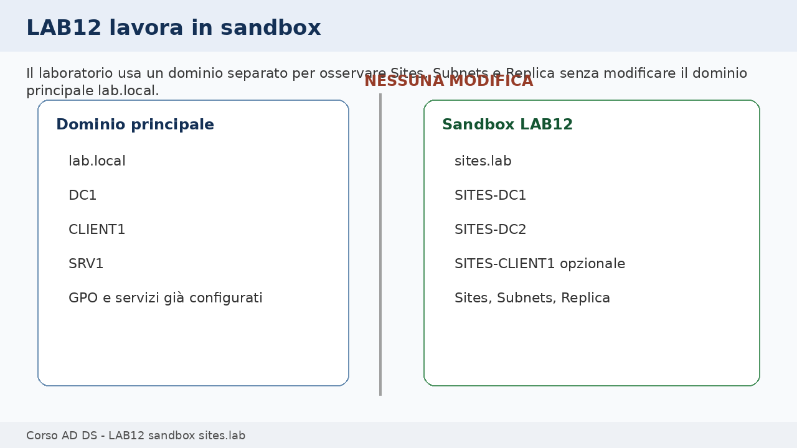

---

## Come useremo le 3 ore

La sessione è progettata per **3 ore**. Per rispettare il tempo disponibile, partiamo da VM sandbox già predisposte o verificabili rapidamente. Se le VM `SITES-DC1` e `SITES-DC2` non sono ancora pronte, la promozione dei Domain Controller deve essere stata completata prima della sessione oppure gestita come dimostrazione docente.

Durante il laboratorio lavoriamo principalmente da GUI:

- **Active Directory Sites and Services**;
- **DNS Manager**;
- **Active Directory Users and Computers**, solo per un oggetto di test;
- **Event Viewer**, se necessario.

Useremo `nltest`, `repadmin`, `dcdiag` e PowerShell nella parte finale, per confermare quello che abbiamo configurato e raccogliere evidenze.

### Prerequisito tecnico atteso

Questo laboratorio presuppone che l'ambiente sandbox sia già stato preparato dal file:

```text
ADDS_LAB12_Prereq_Preparazione_Sandbox_lab_sites_Routing_v2.md
```

Lo stato atteso all'inizio del LAB12 è il seguente:

```text
Dominio sandbox creato: lab.sites
SITES-DC1 promosso come primo Domain Controller e DNS
SITES-DC2 promosso come Domain Controller aggiuntivo e DNS
SITES-RTR1 configurato come router tra 10.20.10.0/24 e 10.20.20.0/24
Routing tra le due subnet verificato
DNS e replica base verificati
```

Il prerequisito **non deve creare** `HQ-Site`, `Branch-Site`, le subnet AD o il Site Link `HQ-BR-LINK`: queste attività restano parte del LAB12 operativo, così i partecipanti lavorano davvero sugli oggetti Active Directory Sites and Services invece di trovarli già pronti.


| Fase di lavoro | Durata indicativa | Attività prevalente |
|---|---:|---|
| Struttura logica e struttura fisica | 20 min | spiegazione con esempi |
| Verifica sandbox e VM | 15 min | controlli iniziali |
| Creazione Sites | 25 min | GUI |
| Creazione Subnets e associazione ai Sites | 25 min | GUI |
| Spostamento DC nei Sites corretti | 20 min | GUI |
| Site Link, costo e replica | 25 min | GUI |
| DNS SRV, DC Locator e replica | 30 min | GUI + verifiche |
| Prova controllata e troubleshooting | 25 min | diagnosi guidata |
| Consolidamento finale ed evidenze | 15 min | comandi e report |

Totale: **180 minuti**.

---

## Prima distinguiamo struttura logica e struttura fisica

Active Directory contiene sia una rappresentazione logica sia una rappresentazione fisica dell’infrastruttura.

La struttura logica comprende:

- foresta;
- dominio;
- OU;
- utenti;
- gruppi;
- GPO.

La struttura fisica comprende:

- Sites;
- Subnets;
- Site Links;
- costi;
- pianificazioni di replica;
- connessioni tra Domain Controller.

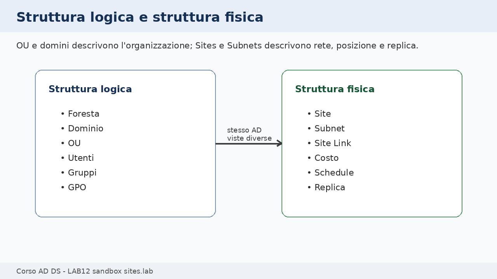

📌 **Esempio**

Una OU chiamata `OU=Clienti` può contenere computer distribuiti in più sedi fisiche. La OU descrive un’organizzazione amministrativa. Il Site, invece, descrive dove quei computer si trovano nella rete.

🛠️ **Task - Lettura guidata dello scenario**

Prima di aprire le console, leggiamo la topologia didattica:

```text
Dominio sandbox: lab.sites

HQ-Site:
- subnet 10.20.10.0/24
- Domain Controller SITES-DC1

Branch-Site:
- subnet 10.20.20.0/24
- Domain Controller SITES-DC2
```

🔎 **Verifica**

Dobbiamo essere in grado di rispondere a due domande:

```text
Quale Site rappresenta la sede principale?
Quale Site rappresenta la filiale?
```

---

## Riconosciamo la topologia che vogliamo ottenere

La topologia finale del laboratorio prevede due siti collegati da un Site Link.

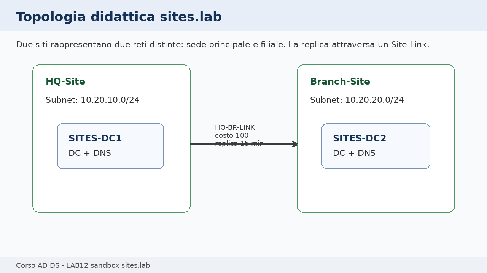

| Oggetto | Valore |
|---|---|
| Dominio sandbox | `lab.sites` |
| Site sede principale | `HQ-Site` |
| Site filiale | `Branch-Site` |
| Subnet HQ | `10.20.10.0/24` |
| Subnet Branch | `10.20.20.0/24` |
| Site Link | `HQ-BR-LINK` |
| Costo Site Link | `100` |
| Frequenza replica didattica | `15 minuti` |
| DC sede principale | `SITES-DC1` |
| DC filiale | `SITES-DC2` |

🧾 **Evidenza**

Nel file `evidence_lab12.md` riportiamo questa tabella iniziale. Ci servirà per confrontare stato atteso e stato finale.

---

## Verifichiamo il perimetro sandbox

Prima di modificare qualsiasi oggetto, verifichiamo che stiamo lavorando sulle VM corrette.

🛠️ **Task - Controllo VM e dominio**

Accediamo a `SITES-DC1` e verifichiamo:

```cmd
hostname
whoami
ipconfig /all
```

Verifichiamo che il dominio sia:

```text
lab.sites
```

Da `SITES-DC1`, apriamo **Server Manager** e controlliamo che gli strumenti AD siano disponibili.

🔎 **Verifica**

Non dobbiamo usare:

```text
DC1
CLIENT1
SRV1
lab.local
```

durante le modifiche di questo laboratorio.

🧾 **Evidenza**

Nel report annotiamo:

```text
VM usate:
Dominio usato:
Conferma non uso di lab.local:
```

---

## Apriamo Active Directory Sites and Services

La console principale del laboratorio è **Active Directory Sites and Services**. Qui vediamo gli oggetti che descrivono la topologia fisica AD.

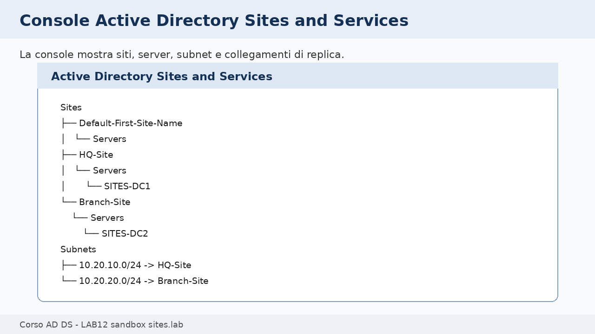

🛠️ **Task - Apertura della console**

Su `SITES-DC1`:

1. apriamo **Server Manager**;
2. selezioniamo **Tools**;
3. apriamo **Active Directory Sites and Services**;
4. espandiamo il nodo **Sites**.

All’inizio potremmo trovare:

```text
Default-First-Site-Name
```

Questo site viene creato automaticamente durante la creazione del dominio.

📌 **Esempio**

`Default-First-Site-Name` non è un errore. È il site iniziale. Nel laboratorio però vogliamo creare nomi più espressivi, perché `HQ-Site` e `Branch-Site` comunicano meglio la topologia che stiamo rappresentando.

---

## Creiamo i Sites della sede principale e della filiale

Un **Site** rappresenta una porzione di rete con buona connettività interna. In genere corrisponde a una sede, un data center o un segmento ben connesso.

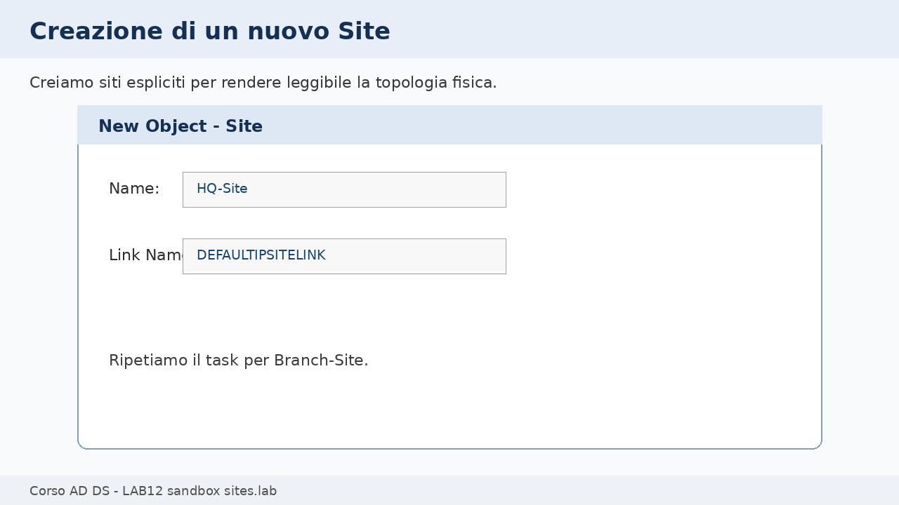

🛠️ **Task - Creazione di HQ-Site**

Nella console **Active Directory Sites and Services**:

1. clicchiamo con il tasto destro su **Sites**;
2. selezioniamo **New Site**;
3. nel campo nome inseriamo:

```text
HQ-Site
```

4. selezioniamo il link disponibile, normalmente:

```text
DEFAULTIPSITELINK
```

5. confermiamo.

🛠️ **Task - Creazione di Branch-Site**

Ripetiamo la stessa procedura e creiamo:

```text
Branch-Site
```

🔎 **Verifica**

Sotto **Sites** devono comparire:

```text
HQ-Site
Branch-Site
```

🧾 **Evidenza**

Nel report inseriamo:

```text
Sites creati:
- HQ-Site
- Branch-Site
```

---

## Creiamo e associamo le Subnets

La subnet è il collegamento tra indirizzamento IP e Site. Active Directory usa le subnet per capire a quale Site appartiene un client o un Domain Controller.

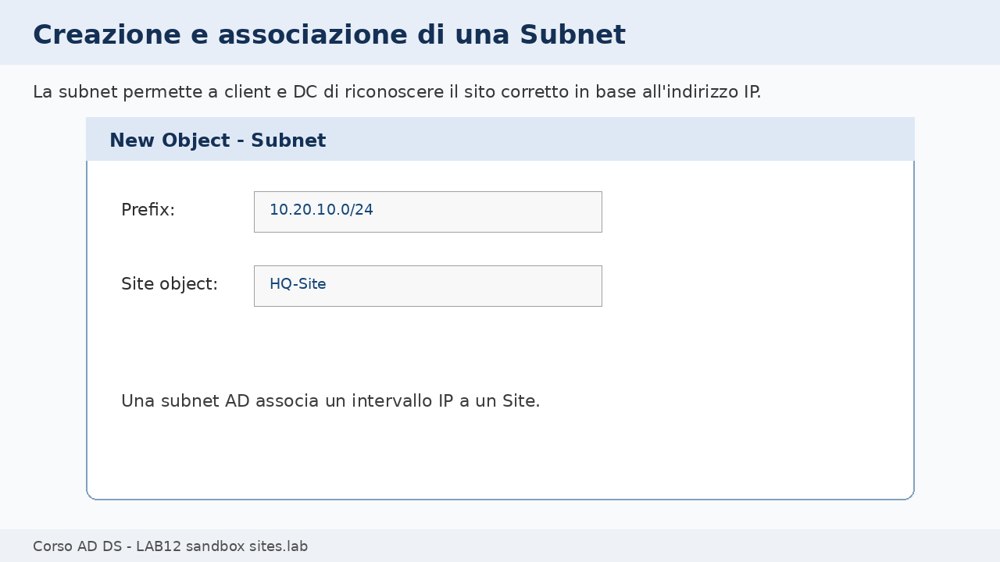

📌 **Esempio**

Se un client ha IP:

```text
10.20.10.100
```

e in AD esiste la subnet:

```text
10.20.10.0/24 -> HQ-Site
```

il client può essere collocato nel Site `HQ-Site`.

🛠️ **Task - Creazione subnet HQ**

Nella console **Active Directory Sites and Services**:

1. espandiamo **Sites**;
2. clicchiamo con il tasto destro su **Subnets**;
3. selezioniamo **New Subnet**;
4. inseriamo il prefisso:

```text
10.20.10.0/24
```

5. associamo la subnet a:

```text
HQ-Site
```

6. confermiamo.

🛠️ **Task - Creazione subnet Branch**

Ripetiamo la procedura per:

```text
10.20.20.0/24
```

e associamo la subnet a:

```text
Branch-Site
```

🔎 **Verifica**

Sotto **Subnets** devono comparire:

```text
10.20.10.0/24
10.20.20.0/24
```

Ciascuna subnet deve essere associata al Site corretto.

🧾 **Evidenza**

Nel report annotiamo:

```text
10.20.10.0/24 -> HQ-Site
10.20.20.0/24 -> Branch-Site
```

---

## Spostiamo i Domain Controller nei Sites corretti

Dopo aver creato Sites e Subnets, dobbiamo verificare dove si trovano gli oggetti server dei Domain Controller.

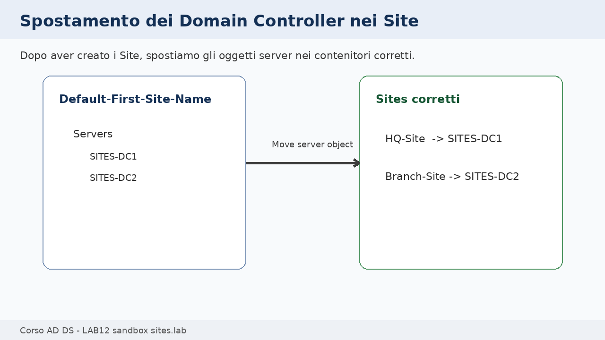

🛠️ **Task - Spostamento di SITES-DC1**

Nella console:

1. espandiamo `Default-First-Site-Name`;
2. apriamo **Servers**;
3. individuiamo `SITES-DC1`;
4. clicchiamo con il tasto destro;
5. selezioniamo **Move**;
6. scegliamo:

```text
HQ-Site
```

🛠️ **Task - Spostamento di SITES-DC2**

Ripetiamo la procedura e spostiamo:

```text
SITES-DC2 -> Branch-Site
```

🔎 **Verifica**

La struttura attesa è:

```text
HQ-Site
└── Servers
    └── SITES-DC1

Branch-Site
└── Servers
    └── SITES-DC2
```

📌 **Esempio**

Se `SITES-DC2` resta nel site sbagliato, un client della filiale potrebbe non preferire il DC locale. Il problema non sarebbe l’OU del client, ma la rappresentazione fisica della rete.

---

## Configuriamo il Site Link

Il Site Link descrive il collegamento logico tra siti. Permette di definire quali site sono collegati, con quale costo e con quale frequenza di replica.

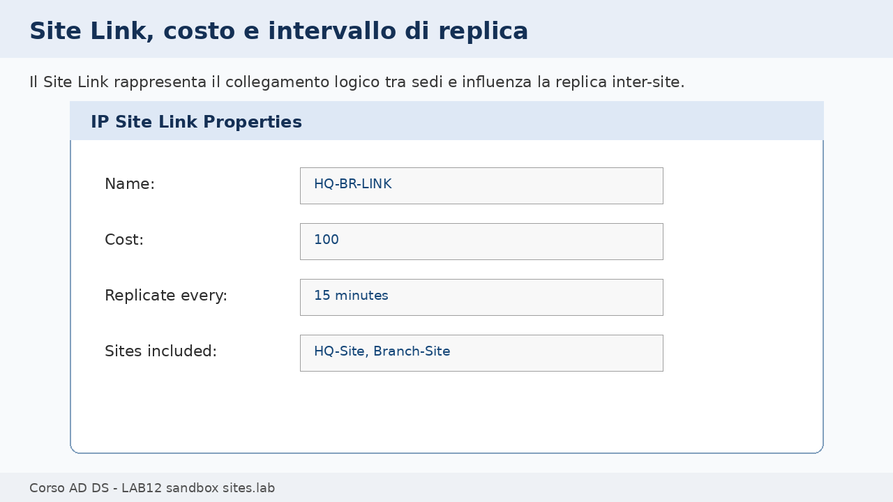

🛠️ **Task - Creazione o rinomina del Site Link**

Nella console:

1. espandiamo **Inter-Site Transports**;
2. apriamo **IP**;
3. individuiamo `DEFAULTIPSITELINK`;
4. possiamo rinominarlo oppure creare un nuovo link, secondo indicazione del docente;
5. usiamo il nome:

```text
HQ-BR-LINK
```

6. includiamo i Site:

```text
HQ-Site
Branch-Site
```

7. impostiamo:

```text
Cost: 100
Replicate every: 15 minutes
```

📌 **Esempio**

Il costo aiuta AD a scegliere il percorso di replica preferito quando esistono più collegamenti. In questo laboratorio abbiamo un solo collegamento, ma impostiamo comunque il costo per leggere il concetto.

🔎 **Verifica**

Nel Site Link devono essere presenti entrambi i Site.

🧾 **Evidenza**

Nel report annotiamo:

```text
Nome Site Link:
Sites inclusi:
Costo:
Intervallo replica:
```

---

## Osserviamo il ruolo del KCC e degli oggetti di connessione

Il **KCC**, Knowledge Consistency Checker, è il componente che costruisce e mantiene la topologia di replica tra Domain Controller.

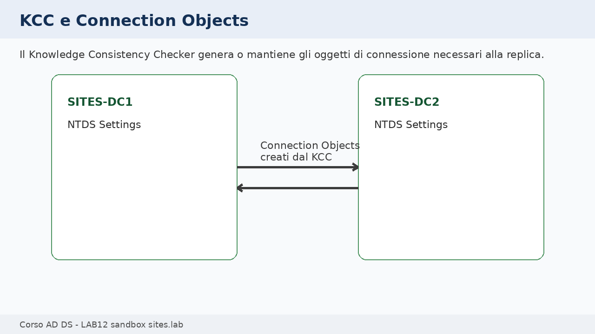

Gli oggetti di connessione si trovano sotto:

```text
Site
└── Servers
    └── Nome DC
        └── NTDS Settings
```

🛠️ **Task - Osservazione degli oggetti NTDS Settings**

In **Active Directory Sites and Services**:

1. espandiamo `HQ-Site`;
2. espandiamo `Servers`;
3. espandiamo `SITES-DC1`;
4. selezioniamo **NTDS Settings**;
5. osserviamo eventuali connection objects;
6. ripetiamo su `SITES-DC2`.

🔎 **Verifica**

Dobbiamo riconoscere dove AD rappresenta la connessione di replica tra Domain Controller.

📌 **Esempio**

Se vediamo un connection object in ingresso verso `SITES-DC2`, significa che la replica può essere rappresentata come una connessione gestita da AD. Non stiamo creando una condivisione file: stiamo osservando la replica del database Active Directory.

---

## Verifichiamo la replica con un oggetto di test

Per verificare la replica, creiamo o modifichiamo un oggetto su un Domain Controller e controlliamo se l’informazione diventa visibile anche sull’altro.

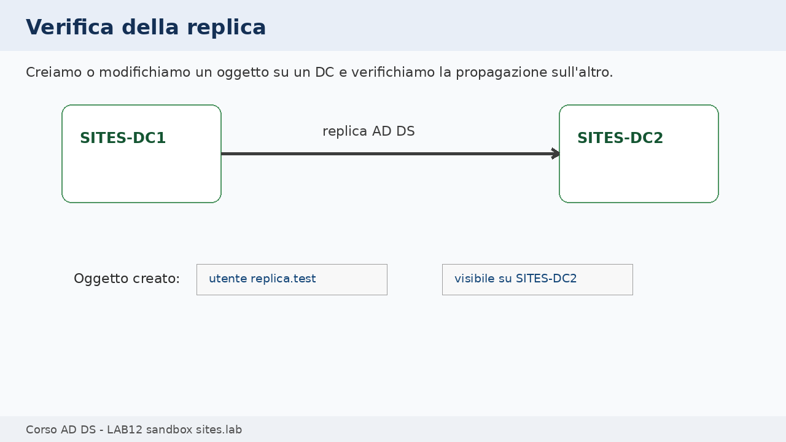

🛠️ **Task - Creazione utente di test da GUI**

Su `SITES-DC1`:

1. apriamo **Active Directory Users and Computers**;
2. creiamo, se necessario, una OU didattica:

```text
OU=LAB12_Test
```

3. creiamo un utente:

```text
replica.test
```

4. impostiamo una password didattica coerente con le policy del dominio;
5. abilitiamo l’utente se richiesto.

🔎 **Verifica su SITES-DC2**

Su `SITES-DC2`:

1. apriamo **Active Directory Users and Computers**;
2. controlliamo se l’oggetto `replica.test` è visibile;
3. se non compare subito, aggiorniamo la vista e attendiamo il tempo previsto;
4. se serve, usiamo i comandi di consolidamento finale per verificare lo stato della replica.

🧾 **Evidenza**

Nel report annotiamo:

```text
Oggetto creato:
DC usato per la creazione:
Verifica sull'altro DC:
Esito:
```

---

## Colleghiamo Sites, Subnets e DC Locator

Il **DC Locator** è il meccanismo con cui un client individua un Domain Controller adatto. I record DNS SRV, la subnet del client e la configurazione dei Sites contribuiscono alla scelta.

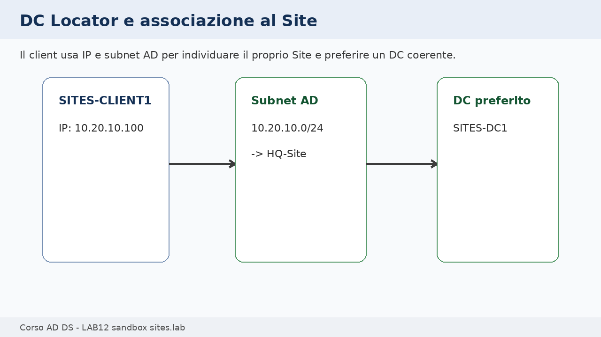

📌 **Esempio**

Se `SITES-CLIENT1` ha IP:

```text
10.20.10.100
```

e la subnet `10.20.10.0/24` è associata a `HQ-Site`, il client dovrebbe riconoscere `HQ-Site` come proprio site.

🛠️ **Task opzionale - Verifica da client sandbox**

Se `SITES-CLIENT1` è disponibile:

1. accediamo al client;
2. verifichiamo IP e DNS;
3. apriamo un prompt;
4. eseguiamo:

```cmd
nltest /dsgetsite
```

🔎 **Verifica**

Il risultato atteso è:

```text
HQ-Site
```

Se il client si trova nella subnet Branch, il risultato atteso è:

```text
Branch-Site
```

---

## Osserviamo i record DNS SRV legati ai Sites

DNS e Active Directory lavorano insieme anche in questo laboratorio. I record SRV permettono ai client di localizzare servizi di dominio, come LDAP e Kerberos.

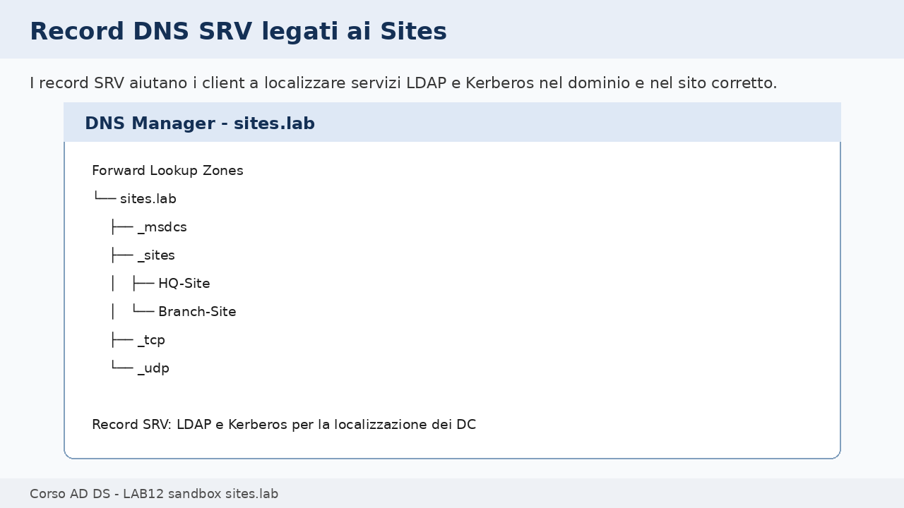

🛠️ **Task - Osservazione DNS Manager**

Su `SITES-DC1`:

1. apriamo **DNS Manager**;
2. espandiamo **Forward Lookup Zones**;
3. apriamo `lab.sites`;
4. osserviamo le cartelle `_msdcs`, `_sites`, `_tcp`, `_udp`;
5. verifichiamo la presenza di riferimenti ai Domain Controller.

📌 **Esempio**

I record SRV aiutano un client a trovare servizi come LDAP e Kerberos. Con Sites configurati correttamente, AD può orientare il client verso un Domain Controller più vicino o più coerente con la sua subnet.

🔎 **Verifica**

Dobbiamo riuscire a spiegare perché DNS resta coinvolto anche in una lezione su Sites e Replica.

---

## Eseguiamo verifiche testuali di consolidamento

A questo punto abbiamo configurato gli oggetti da GUI. Usiamo ora alcuni comandi per verificare Site mapping, DC Locator e replica.

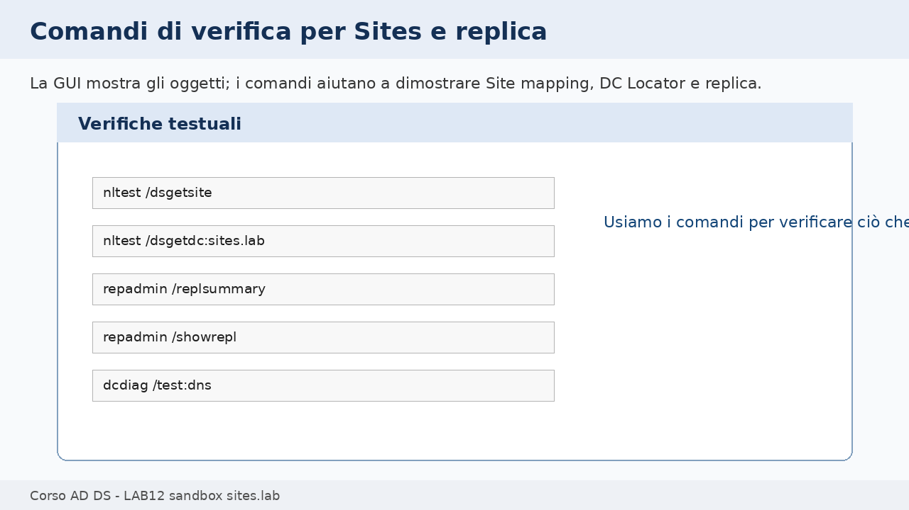

Su `SITES-DC1`:

```cmd
nltest /dsgetsite
nltest /dsgetdc:lab.sites
repadmin /replsummary
repadmin /showrepl
dcdiag /test:dns
```

Su `SITES-DC2`:

```cmd
nltest /dsgetsite
nltest /dsgetdc:lab.sites
repadmin /showrepl
```

🔎 **Verifica**

Annotiamo:

```text
Site rilevato da SITES-DC1:
Site rilevato da SITES-DC2:
Esito repadmin /replsummary:
Eventuali errori:
```

🧾 **Evidenza**

Inseriamo nel report almeno due output significativi:

- uno relativo al Site;
- uno relativo alla replica.

---

## Prova controllata: subnet associata al Site errato

Per consolidare il concetto, simuliamo un errore controllato: associamo temporaneamente una subnet al Site sbagliato e osserviamo l’effetto.

🧪 **Prova controllata**

Scegliamo una delle due subnet, per esempio:

```text
10.20.10.0/24
```

Modifichiamo temporaneamente l’associazione da:

```text
HQ-Site
```

a:

```text
Branch-Site
```

Se `SITES-CLIENT1` è disponibile e si trova nella subnet `10.20.10.0/24`, verifichiamo:

```cmd
nltest /dsgetsite
```

🔎 **Verifica**

Il risultato può cambiare in modo incoerente rispetto alla sede prevista. Questo mostra perché la subnet AD non è un dettaglio descrittivo, ma un oggetto operativo.

🧹 **Ripristino**

Ripristiniamo subito:

```text
10.20.10.0/24 -> HQ-Site
```

E ripetiamo la verifica.

🧾 **Evidenza**

Nel report scriviamo:

```text
Errore simulato:
Sintomo osservato:
Correzione:
Verifica dopo il ripristino:
```

---

## Troubleshooting guidato

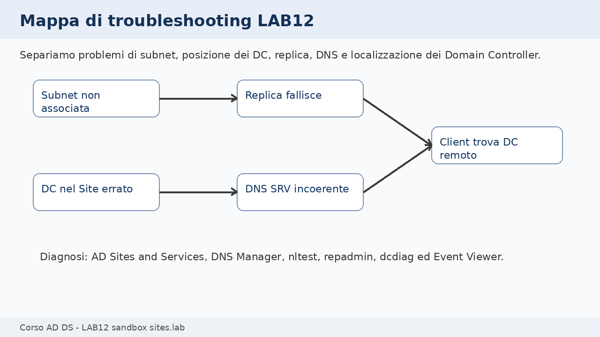

Quando qualcosa non torna, separiamo il problema in livelli.

### Il client o il DC risulta nel Site errato

Controlliamo:

- indirizzo IP;
- subnet configurate in AD;
- associazione subnet-site;
- eventuali subnet mancanti.

Verifica:

```cmd
nltest /dsgetsite
```

### La replica fallisce

Controlliamo:

- DNS;
- connettività tra DC;
- Event Viewer;
- connection objects;
- output di `repadmin`.

Verifica:

```cmd
repadmin /replsummary
repadmin /showrepl
```

### I record SRV sembrano incoerenti

Controlliamo:

- DNS Manager;
- registrazione dei DC;
- servizio Netlogon;
- `dcdiag /test:dns`.

Verifica:

```cmd
dcdiag /test:dns
```

### Il dominio principale risulta modificato

Se ci accorgiamo di aver aperto o modificato `lab.local`, dobbiamo fermarci e documentare l’accaduto. Il laboratorio richiede esplicitamente di lavorare solo su `lab.sites`.

---

## PowerShell e comandi finali di consolidamento

Questa sezione serve a raccogliere evidenze e a osservare gli oggetti configurati. Non sostituisce il percorso GUI.

Su `SITES-DC1`:

```powershell
Import-Module ActiveDirectory

Get-ADReplicationSite -Filter * | Select-Object Name
Get-ADReplicationSubnet -Filter * | Select-Object Name,Site
Get-ADReplicationSiteLink -Filter * | Select-Object Name,Cost,ReplicationFrequencyInMinutes
Get-ADDomainController -Filter * | Select-Object HostName,Site,IPv4Address
```

Per esportare evidenze:

```powershell
Get-ADReplicationSite -Filter * |
    Select-Object Name |
    Out-File C:\Temp\LAB12_sites.txt

Get-ADReplicationSubnet -Filter * |
    Select-Object Name,Site |
    Out-File C:\Temp\LAB12_subnets.txt

repadmin /replsummary > C:\Temp\LAB12_repadmin_summary.txt
```

---

## Evidenze finali

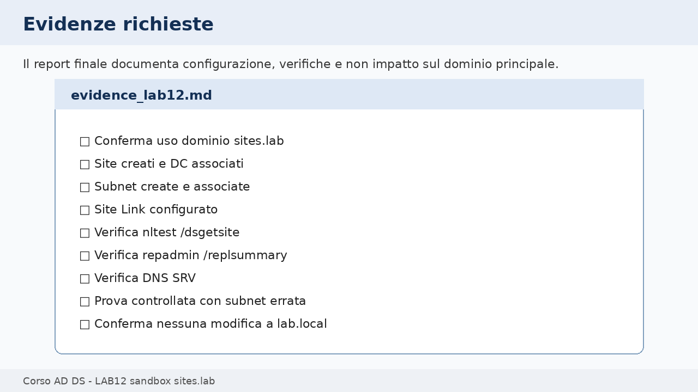

Creiamo un file:

```text
evidence_lab12.md
```

Il file deve contenere:

- conferma che abbiamo lavorato su `lab.sites`;
- VM usate;
- Sites creati;
- Subnets create e associate;
- posizione finale dei Domain Controller;
- configurazione del Site Link;
- verifica DNS SRV;
- output di `nltest /dsgetsite`;
- output di `repadmin /replsummary`;
- prova controllata con errore subnet;
- ripristino della subnet;
- conferma che `lab.local` non è stato modificato.

---

## Domande di consolidamento

1. Perché LAB12 viene svolto in un dominio sandbox?
2. Qual è la differenza tra OU e Site?
3. A cosa serve una Subnet in Active Directory Sites and Services?
4. Che cosa rappresenta un Site Link?
5. Che cosa indica il costo di un Site Link?
6. Qual è il ruolo del KCC?
7. Che cosa sono i Connection Objects?
8. Perché DNS è ancora importante in una lezione su Sites e Replica?
9. Che cosa verifica `nltest /dsgetsite`?
10. Che cosa verifica `repadmin /replsummary`?
11. Perché una subnet associata al Site sbagliato può causare problemi?
12. Quali oggetti non devono essere modificati durante questo laboratorio?

---

## Impatto sui laboratori successivi

### Oggetti modificati

Durante il laboratorio modifichiamo o creiamo solo oggetti nel dominio sandbox `lab.sites`:

- `HQ-Site`;
- `Branch-Site`;
- subnet AD;
- Site Link;
- posizione degli oggetti server `SITES-DC1` e `SITES-DC2`;
- eventuale OU/utente di test nel dominio sandbox.

### Oggetti che non devono essere modificati

Non modifichiamo:

- dominio `lab.local`;
- `DC1`;
- `CLIENT1`;
- `SRV1`;
- `CLU1`;
- `CLU2`;
- GPO del corso;
- DHCP;
- WSUS;
- File Server;
- utenti, gruppi e OU del dominio principale.

### Come ripristinare lo stato iniziale

Se il docente richiede il ripristino della sandbox:

1. rimuoviamo l’utente `replica.test`;
2. rimuoviamo eventuale OU `LAB12_Test`;
3. ripristiniamo le subnet ai Site corretti;
4. lasciamo Sites e Site Link se la sandbox dovrà essere riutilizzata;
5. in alternativa, spegniamo o ripristiniamo snapshot delle VM `SITES-*`.

### Verifica di non regressione

Al termine confermiamo:

```text
lab.local non è stato modificato
```

e verifichiamo che i comandi siano stati eseguiti solo sulle VM:

```text
SITES-DC1
SITES-DC2
SITES-CLIENT1 opzionale
```

---

## Criterio di completamento

Il laboratorio è completato quando:

- i Site `HQ-Site` e `Branch-Site` sono presenti;
- le subnet sono associate ai Site corretti;
- `SITES-DC1` e `SITES-DC2` sono nei Site corretti;
- il Site Link è configurato;
- almeno una verifica `nltest` è stata eseguita;
- almeno una verifica `repadmin` è stata eseguita;
- la prova controllata è stata ripristinata;
- il report `evidence_lab12.md` è stato compilato;
- non sono state apportate modifiche al dominio `lab.local`.
