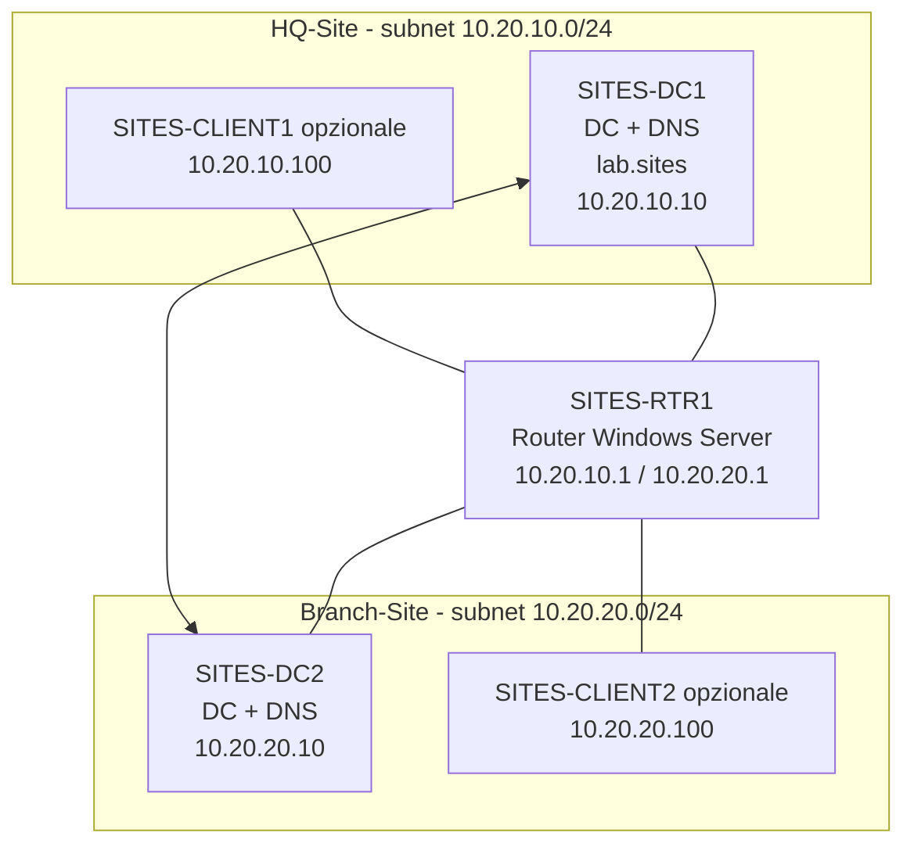

# LAB12 - Piano B - Preparazione ambiente sandbox `lab.sites` con due subnet e routing

Versione preparatoria per LAB12 Sites, Subnets e Replica - v1

## In questa attività prepariamo l’ambiente separato per LAB12

In questa attività prepariamo un ambiente sandbox dedicato, separato dal dominio principale del corso. L’obiettivo è predisporre una piccola infrastruttura Active Directory autonoma, con due subnet distinte e capacità di routing tra le due reti.

Il dominio sandbox sarà:

```text
lab.sites
```

L’ambiente principale del corso resta:

```text
lab.local
```

Durante questa preparazione non modifichiamo `lab.local`, non modifichiamo `DC1`, non modifichiamo `SRV1`, non modifichiamo `CLIENT1` e non tocchiamo le configurazioni di DHCP, WSUS, File Server o Cluster già presenti nel percorso principale.

Questa preparazione serve a rendere possibile la versione completa del laboratorio su:

- Sites;
- Subnets;
- replica tra Domain Controller;
- DC Locator;
- record DNS SRV legati ai Sites;
- routing tra sedi simulate.

---

## Perché prepariamo una sandbox separata

Nel dominio principale `lab.local` abbiamo già costruito diversi servizi del corso. Modificare Sites, Subnets, routing o Domain Controller in quel dominio può introdurre effetti collaterali sui laboratori successivi o su configurazioni già consolidate.

La sandbox `lab.sites` ci permette invece di osservare una topologia più realistica:

```text
HQ-Site      -> subnet 10.20.10.0/24
Branch-Site  -> subnet 10.20.20.0/24
```

Con due subnet reali, Active Directory può associare correttamente client e Domain Controller ai rispettivi Sites. Questo rende il laboratorio più coerente rispetto a una simulazione con una sola subnet.

---

## Architettura finale prevista



---

## VM previste

| VM | Ruolo | Rete | IP | Gateway | DNS |
|---|---|---|---|---|---|
| `SITES-DC1` | primo Domain Controller, DNS | HQ | `10.20.10.10/24` | `10.20.10.1` | `10.20.10.10` |
| `SITES-RTR1` | router tra le subnet | HQ + Branch | `10.20.10.1/24`, `10.20.20.1/24` | nessuno | nessuno o `10.20.10.10` |
| `SITES-DC2` | secondo Domain Controller, DNS | Branch | `10.20.20.10/24` | `10.20.20.1` | inizialmente `10.20.10.10`; dopo promozione anche `10.20.20.10` |
| `SITES-CLIENT1` | client opzionale HQ | HQ | DHCP o `10.20.10.100/24` | `10.20.10.1` | `10.20.10.10` |
| `SITES-CLIENT2` | client opzionale Branch | Branch | DHCP o `10.20.20.100/24` | `10.20.20.1` | `10.20.20.10`, alternativo `10.20.10.10` |

📌 **Nota didattica**

Per il laboratorio Sites è sufficiente avere almeno:

```text
SITES-DC1
SITES-DC2
SITES-RTR1
```

I client sono utili per verificare DC Locator dal punto di vista delle postazioni, ma non sono obbligatori se il tempo è limitato.

---

## Switch virtuali Hyper-V

Prepariamo due switch virtuali interni, uno per la sede principale e uno per la filiale.

| Switch Hyper-V | Tipo consigliato | Uso |
|---|---|---|
| `LAB12-HQ` | Internal | rete `10.20.10.0/24` |
| `LAB12-BRANCH` | Internal | rete `10.20.20.0/24` |

Non colleghiamo questi switch alla rete fisica esterna, salvo esigenza esplicita del docente. La sandbox deve restare isolata e non deve interferire con reti reali.

🛠️ **Task - Creazione degli switch virtuali**

Sull’host Hyper-V apriamo **Hyper-V Manager** e procediamo così:

1. apriamo **Virtual Switch Manager**;
2. creiamo un nuovo switch di tipo **Internal**;
3. assegniamo il nome:

```text
LAB12-HQ
```

4. creiamo un secondo switch di tipo **Internal**;
5. assegniamo il nome:

```text
LAB12-BRANCH
```

🔎 **Verifica**

In Hyper-V Manager devono essere visibili i due switch:

```text
LAB12-HQ
LAB12-BRANCH
```

🧾 **Evidenza**

Nel report di preparazione annotiamo:

```text
Switch LAB12-HQ creato:
Switch LAB12-BRANCH creato:
Tipo switch:
```

---

## Collegamento delle schede di rete alle VM

Colleghiamo le VM agli switch corretti.

| VM | Scheda 1 | Scheda 2 |
|---|---|---|
| `SITES-DC1` | `LAB12-HQ` | non necessaria |
| `SITES-RTR1` | `LAB12-HQ` | `LAB12-BRANCH` |
| `SITES-DC2` | `LAB12-BRANCH` | non necessaria |
| `SITES-CLIENT1` opzionale | `LAB12-HQ` | non necessaria |
| `SITES-CLIENT2` opzionale | `LAB12-BRANCH` | non necessaria |

🛠️ **Task - Collegamento delle VM**

In Hyper-V Manager:

1. apriamo le impostazioni di `SITES-DC1`;
2. colleghiamo la scheda di rete a `LAB12-HQ`;
3. apriamo le impostazioni di `SITES-RTR1`;
4. colleghiamo una scheda a `LAB12-HQ`;
5. aggiungiamo o verifichiamo una seconda scheda collegata a `LAB12-BRANCH`;
6. colleghiamo `SITES-DC2` a `LAB12-BRANCH`.

🔎 **Verifica**

Prima di avviare le VM, controlliamo che `SITES-RTR1` abbia due schede e che ciascuna sia collegata allo switch corretto.

---

## Configurazione IP di SITES-RTR1

`SITES-RTR1` sarà il router tra le due subnet.

| Interfaccia | Switch | IP |
|---|---|---|
| NIC HQ | `LAB12-HQ` | `10.20.10.1/24` |
| NIC Branch | `LAB12-BRANCH` | `10.20.20.1/24` |

🛠️ **Task - Rinomina delle interfacce**

Su `SITES-RTR1`, apriamo **Network Connections** e rinominiamo le schede in modo leggibile:

```text
HQ
BRANCH
```

📌 **Esempio**

Se le schede restano chiamate `Ethernet` ed `Ethernet 2`, il rischio di configurare l’IP sulla scheda sbagliata aumenta. La rinomina rende il laboratorio più leggibile.

🛠️ **Task - Configurazione IP da GUI**

Su `SITES-RTR1`:

1. apriamo **Control Panel**;
2. apriamo **Network and Sharing Center**;
3. selezioniamo **Change adapter settings**;
4. apriamo le proprietà della scheda `HQ`;
5. configuriamo:

```text
IP address: 10.20.10.1
Subnet mask: 255.255.255.0
Default gateway: vuoto
DNS: vuoto oppure 10.20.10.10 dopo la creazione di SITES-DC1
```

6. apriamo le proprietà della scheda `BRANCH`;
7. configuriamo:

```text
IP address: 10.20.20.1
Subnet mask: 255.255.255.0
Default gateway: vuoto
DNS: vuoto oppure 10.20.10.10 dopo la creazione di SITES-DC1
```

🔎 **Verifica**

Da `SITES-RTR1` eseguiamo:

```cmd
ipconfig /all
```

Dobbiamo vedere entrambe le reti:

```text
10.20.10.1
10.20.20.1
```

---

## Abilitazione del routing su SITES-RTR1

Per consentire comunicazione tra le due subnet, `SITES-RTR1` deve inoltrare pacchetti tra le interfacce.

La modalità più leggibile per il laboratorio è usare il ruolo **Remote Access** con funzione **Routing**.

🛠️ **Task - Installazione del ruolo Remote Access**

Su `SITES-RTR1`:

1. apriamo **Server Manager**;
2. selezioniamo **Manage**;
3. selezioniamo **Add Roles and Features**;
4. scegliamo **Role-based or feature-based installation**;
5. selezioniamo `SITES-RTR1`;
6. abilitiamo il ruolo:

```text
Remote Access
```

7. nella selezione dei servizi ruolo abilitiamo:

```text
Routing
```

8. completiamo l’installazione.

🛠️ **Task - Configurazione RRAS per LAN routing**

Su `SITES-RTR1`:

1. apriamo **Tools**;
2. apriamo **Routing and Remote Access**;
3. clicchiamo con il tasto destro sul server `SITES-RTR1`;
4. selezioniamo **Configure and Enable Routing and Remote Access**;
5. scegliamo **Custom configuration**;
6. selezioniamo:

```text
LAN routing
```

7. completiamo il wizard;
8. avviamo il servizio RRAS quando richiesto.

🔎 **Verifica**

In **Routing and Remote Access**, il server deve risultare attivo. Le interfacce `HQ` e `BRANCH` devono essere visibili.

🧾 **Evidenza**

Nel report annotiamo:

```text
Ruolo Remote Access installato:
Routing abilitato:
Interfacce visibili in RRAS:
```

---

## Configurazione IP di SITES-DC1

`SITES-DC1` sarà il primo Domain Controller del dominio `lab.sites`.

| Parametro | Valore |
|---|---|
| IP | `10.20.10.10` |
| Subnet mask | `255.255.255.0` |
| Gateway | `10.20.10.1` |
| DNS | `10.20.10.10` dopo la promozione |

🛠️ **Task - Configurazione IP di SITES-DC1**

Su `SITES-DC1`, prima della promozione, configuriamo:

```text
IP address: 10.20.10.10
Subnet mask: 255.255.255.0
Default gateway: 10.20.10.1
Preferred DNS: 10.20.10.10
```

📌 **Nota didattica**

Durante la creazione del primo Domain Controller, il DNS sarà installato localmente. Per questo il server può puntare a sé stesso come DNS.

🔎 **Verifica**

Da `SITES-DC1`:

```cmd
ipconfig /all
ping 10.20.10.1
```

---

## Creazione della foresta `lab.sites`

A questo punto creiamo il dominio sandbox.

🛠️ **Task - Installazione ruolo AD DS su SITES-DC1**

Su `SITES-DC1`:

1. apriamo **Server Manager**;
2. selezioniamo **Manage**;
3. selezioniamo **Add Roles and Features**;
4. abilitiamo:

```text
Active Directory Domain Services
```

5. accettiamo l’aggiunta degli strumenti richiesti;
6. completiamo l’installazione.

🛠️ **Task - Promozione di SITES-DC1**

Dopo l’installazione del ruolo:

1. selezioniamo la notifica di promozione;
2. scegliamo:

```text
Add a new forest
```

3. inseriamo il dominio root:

```text
lab.sites
```

4. lasciamo selezionato **DNS Server**;
5. lasciamo selezionato **Global Catalog**;
6. impostiamo la password DSRM;
7. completiamo il wizard;
8. attendiamo il riavvio.

🔎 **Verifica**

Dopo il riavvio:

```cmd
hostname
whoami
nslookup lab.sites
nltest /dsgetdc:lab.sites
```

🧾 **Evidenza**

Annotiamo:

```text
Dominio creato:
SITES-DC1 IP:
DNS installato:
Verifica nltest:
```

---

## Configurazione IP di SITES-DC2

`SITES-DC2` si trova nella subnet Branch.

| Parametro | Valore prima della promozione |
|---|---|
| IP | `10.20.20.10` |
| Subnet mask | `255.255.255.0` |
| Gateway | `10.20.20.1` |
| DNS primario | `10.20.10.10` |

🛠️ **Task - Configurazione IP di SITES-DC2**

Su `SITES-DC2`, configuriamo:

```text
IP address: 10.20.20.10
Subnet mask: 255.255.255.0
Default gateway: 10.20.20.1
Preferred DNS: 10.20.10.10
```

📌 **Esempio**

Prima della promozione, `SITES-DC2` deve usare `SITES-DC1` come DNS, perché solo `SITES-DC1` conosce il dominio `lab.sites`.

🔎 **Verifica della raggiungibilità**

Da `SITES-DC2`:

```cmd
ping 10.20.20.1
ping 10.20.10.1
ping 10.20.10.10
nslookup lab.sites
```

Se `SITES-DC2` non raggiunge `10.20.10.10`, controlliamo prima il routing su `SITES-RTR1`.

---

## Verifica del routing tra HQ e Branch

Prima di promuovere `SITES-DC2`, la comunicazione tra le due subnet deve funzionare.

🛠️ **Task - Test dalla rete HQ alla rete Branch**

Da `SITES-DC1`:

```cmd
ping 10.20.10.1
ping 10.20.20.1
ping 10.20.20.10
```

🛠️ **Task - Test dalla rete Branch alla rete HQ**

Da `SITES-DC2`:

```cmd
ping 10.20.20.1
ping 10.20.10.1
ping 10.20.10.10
```

🔎 **Verifica**

Il test minimo necessario è:

```text
SITES-DC1 raggiunge SITES-DC2
SITES-DC2 raggiunge SITES-DC1
SITES-DC2 risolve lab.sites tramite DNS su SITES-DC1
```

🧾 **Evidenza**

Nel report annotiamo:

```text
Ping DC1 -> DC2:
Ping DC2 -> DC1:
Risoluzione lab.sites da DC2:
```

---

## Promozione di SITES-DC2 come Domain Controller aggiuntivo

Ora possiamo aggiungere `SITES-DC2` al dominio `lab.sites`.

🛠️ **Task - Join al dominio**

Su `SITES-DC2`:

1. apriamo **System Properties**;
2. selezioniamo **Change settings**;
3. cambiamo appartenenza da workgroup a dominio;
4. inseriamo:

```text
lab.sites
```

5. usiamo credenziali amministrative del dominio;
6. riavviamo.

🔎 **Verifica**

Dopo il riavvio:

```cmd
whoami
nltest /dsgetdc:lab.sites
```

🛠️ **Task - Installazione AD DS e promozione**

Su `SITES-DC2`:

1. apriamo **Server Manager**;
2. installiamo **Active Directory Domain Services**;
3. selezioniamo la notifica di promozione;
4. scegliamo:

```text
Add a domain controller to an existing domain
```

5. dominio:

```text
lab.sites
```

6. lasciamo selezionati **DNS Server** e **Global Catalog**, salvo diversa indicazione del docente;
7. impostiamo la password DSRM;
8. completiamo il wizard;
9. attendiamo il riavvio.

🔎 **Verifica**

Dopo la promozione:

```cmd
dcdiag /test:dns
repadmin /replsummary
nslookup sites-dc1.lab.sites
nslookup sites-dc2.lab.sites
```

---

## Configurazione DNS finale su SITES-DC2

Dopo la promozione di `SITES-DC2`, possiamo impostare il DNS locale come preferito e `SITES-DC1` come alternativo.

| Campo | Valore consigliato dopo la promozione |
|---|---|
| Preferred DNS | `10.20.20.10` |
| Alternate DNS | `10.20.10.10` |

🛠️ **Task - Aggiornamento DNS client su SITES-DC2**

Su `SITES-DC2`, apriamo le proprietà IPv4 e configuriamo:

```text
Preferred DNS: 10.20.20.10
Alternate DNS: 10.20.10.10
```

🔎 **Verifica**

Da `SITES-DC2`:

```cmd
nslookup lab.sites
nslookup sites-dc1.lab.sites
nslookup sites-dc2.lab.sites
```

---


## Criterio di completamento

La preparazione è completata quando:

- esistono due switch Hyper-V separati;
- `SITES-RTR1` instrada traffico tra `10.20.10.0/24` e `10.20.20.0/24`;
- `SITES-DC1` è Domain Controller del dominio `lab.sites`;
- `SITES-DC2` è Domain Controller aggiuntivo;
- DNS risolve entrambi i Domain Controller;
