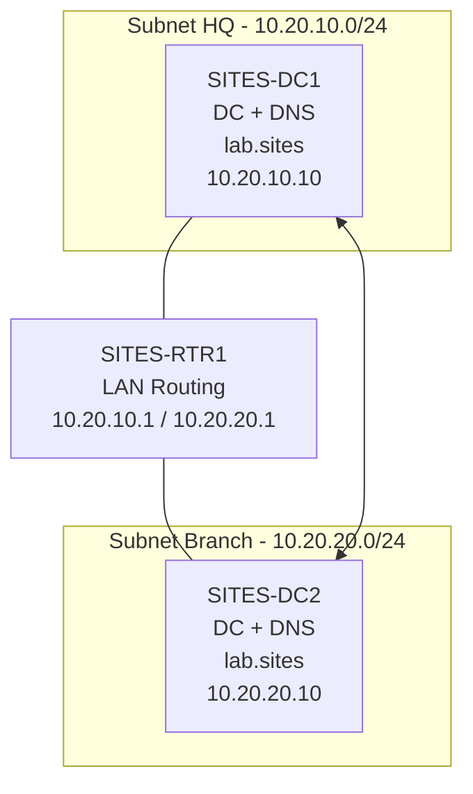

# LAB12 - Prerequisito - Preparazione ambiente sandbox `lab.sites` con due subnet e routing

Versione preparatoria per LAB12 Sites, Subnets e Replica - v2

## Scopo del file

Questo file prepara l'ambiente tecnico necessario per svolgere il LAB12 sandbox su **AD Sites, Subnets e Replica**.

Il dominio sandbox sarà:

```text
lab.sites
```

Il dominio principale del corso resta:

```text
lab.local
```

Durante questa preparazione non modifichiamo `lab.local`, non modifichiamo `DC1`, `SRV1`, `CLIENT1`, `CLU1`, `CLU2`, DHCP, WSUS, File Server o GPO operative del percorso principale.

Questa preparazione deve produrre un ambiente pronto per il LAB12 operativo, ma **non deve già svolgere il laboratorio al posto dei partecipanti**. Quindi prepariamo VM, rete, routing, dominio, DNS e replica base, ma lasciamo al LAB12 la creazione di:

```text
HQ-Site
Branch-Site
10.20.10.0/24 -> HQ-Site
10.20.20.0/24 -> Branch-Site
HQ-BR-LINK
spostamento dei Domain Controller nei Sites corretti
prova controllata sulle subnet
```

Questa distinzione evita la solita meraviglia didattica in cui il laboratorio chiede di creare oggetti che esistono già. La tecnologia è già abbastanza creativa da sola.

---

## Stato finale atteso prima di iniziare il LAB12 operativo

Alla fine di questo prerequisito dobbiamo avere:

```text
Dominio sandbox: lab.sites

SITES-DC1
- primo Domain Controller del dominio lab.sites
- DNS installato
- IP 10.20.10.10/24
- gateway 10.20.10.1

SITES-DC2
- Domain Controller aggiuntivo del dominio lab.sites
- DNS installato
- IP 10.20.20.10/24
- gateway 10.20.20.1

SITES-RTR1
- router Windows Server tra le due subnet
- interfaccia HQ: 10.20.10.1/24
- interfaccia BRANCH: 10.20.20.1/24

Routing
- traffico tra 10.20.10.0/24 e 10.20.20.0/24 funzionante

Active Directory Sites and Services
- ambiente ancora nello stato iniziale
- non creare ancora HQ-Site
- non creare ancora Branch-Site
- non creare ancora le subnet AD
- non configurare ancora il Site Link
```

---

## Architettura tecnica di preparazione



---

## VM previste

| VM | Ruolo | Switch | IP | Gateway | DNS |
|---|---|---|---|---|---|
| `SITES-DC1` | primo DC e DNS | `LAB12-HQ` | `10.20.10.10/24` | `10.20.10.1` | `10.20.10.10` |
| `SITES-RTR1` | router Windows | `LAB12-HQ` + `LAB12-BRANCH` | `10.20.10.1/24`, `10.20.20.1/24` | vuoto | vuoto o `10.20.10.10` |
| `SITES-DC2` | secondo DC e DNS | `LAB12-BRANCH` | `10.20.20.10/24` | `10.20.20.1` | prima `10.20.10.10`; dopo promozione preferito `10.20.20.10`, alternativo `10.20.10.10` |

Client opzionali, se disponibili:

| VM | Ruolo | Switch | IP | Gateway | DNS |
|---|---|---|---|---|---|
| `SITES-CLIENT1` | client HQ opzionale | `LAB12-HQ` | `10.20.10.100/24` | `10.20.10.1` | `10.20.10.10` |
| `SITES-CLIENT2` | client Branch opzionale | `LAB12-BRANCH` | `10.20.20.100/24` | `10.20.20.1` | `10.20.20.10`, alternativo `10.20.10.10` |

---

## Creazione degli switch virtuali Hyper-V

Prepariamo due switch virtuali interni.

| Switch Hyper-V | Tipo | Uso |
|---|---|---|
| `LAB12-HQ` | Internal | rete `10.20.10.0/24` |
| `LAB12-BRANCH` | Internal | rete `10.20.20.0/24` |

🛠️ **Task - Creazione degli switch**

Sull'host Hyper-V:

1. apriamo **Hyper-V Manager**;
2. apriamo **Virtual Switch Manager**;
3. creiamo uno switch di tipo **Internal** chiamato:

```text
LAB12-HQ
```

4. creiamo un secondo switch di tipo **Internal** chiamato:

```text
LAB12-BRANCH
```

🔎 **Verifica**

In Hyper-V Manager devono essere presenti:

```text
LAB12-HQ
LAB12-BRANCH
```

📌 **Nota**

Non colleghiamo questi switch alla rete esterna. L'ambiente sandbox deve restare isolato.

---

## Collegamento delle VM agli switch

| VM | Scheda 1 | Scheda 2 |
|---|---|---|
| `SITES-DC1` | `LAB12-HQ` | non necessaria |
| `SITES-RTR1` | `LAB12-HQ` | `LAB12-BRANCH` |
| `SITES-DC2` | `LAB12-BRANCH` | non necessaria |

🛠️ **Task - Collegamento schede**

In Hyper-V Manager:

1. colleghiamo `SITES-DC1` a `LAB12-HQ`;
2. colleghiamo la prima scheda di `SITES-RTR1` a `LAB12-HQ`;
3. colleghiamo la seconda scheda di `SITES-RTR1` a `LAB12-BRANCH`;
4. colleghiamo `SITES-DC2` a `LAB12-BRANCH`.

🔎 **Verifica**

`SITES-RTR1` deve avere due schede. Se ne ha una sola, il routing non potrà funzionare. Geniale scoperta, ma meglio farla ora e non davanti alla classe.

---

## Configurazione IP di SITES-RTR1

`SITES-RTR1` instrada il traffico tra le due subnet.

| Interfaccia | Switch | IP |
|---|---|---|
| `HQ` | `LAB12-HQ` | `10.20.10.1/24` |
| `BRANCH` | `LAB12-BRANCH` | `10.20.20.1/24` |

🛠️ **Task - Rinomina interfacce**

Su `SITES-RTR1`, rinominiamo le schede:

```text
HQ
BRANCH
```

🛠️ **Task - Configurazione IPv4**

Scheda `HQ`:

```text
IP address: 10.20.10.1
Subnet mask: 255.255.255.0
Default gateway: vuoto
DNS: vuoto
```

Scheda `BRANCH`:

```text
IP address: 10.20.20.1
Subnet mask: 255.255.255.0
Default gateway: vuoto
DNS: vuoto
```

🔎 **Verifica**

```cmd
ipconfig /all
```

Devono comparire:

```text
10.20.10.1
10.20.20.1
```

---

## Abilitazione del routing su SITES-RTR1

Per consentire traffico tra le due subnet, `SITES-RTR1` deve inoltrare pacchetti tra le due interfacce. Usiamo il ruolo **Remote Access** con servizio **Routing**.

🛠️ **Task - Installazione ruolo Remote Access**

Su `SITES-RTR1`:

1. apriamo **Server Manager**;
2. selezioniamo **Manage**;
3. selezioniamo **Add Roles and Features**;
4. abilitiamo il ruolo:

```text
Remote Access
```

5. nei servizi ruolo selezioniamo:

```text
Routing
```

6. completiamo l'installazione.

🛠️ **Task - Configurazione RRAS**

Su `SITES-RTR1`:

1. apriamo **Tools**;
2. apriamo **Routing and Remote Access**;
3. clicchiamo con il tasto destro su `SITES-RTR1`;
4. selezioniamo **Configure and Enable Routing and Remote Access**;
5. scegliamo **Custom configuration**;
6. selezioniamo:

```text
LAN routing
```

7. completiamo il wizard;
8. avviamo il servizio.

🔎 **Verifica servizio**

```powershell
Get-Service RemoteAccess
```

Lo stato deve essere:

```text
Running
```

---

## Configurazione IP di SITES-DC1

`SITES-DC1` sarà il primo Domain Controller del dominio `lab.sites`.

| Parametro | Valore |
|---|---|
| IP | `10.20.10.10` |
| Subnet mask | `255.255.255.0` |
| Gateway | `10.20.10.1` |
| DNS | `10.20.10.10` |

🛠️ **Task - Configurazione IP**

Su `SITES-DC1` configuriamo:

```text
IP address: 10.20.10.10
Subnet mask: 255.255.255.0
Default gateway: 10.20.10.1
Preferred DNS: 10.20.10.10
```

🔎 **Verifica**

```cmd
ipconfig /all
ping 10.20.10.1
```

---

## Creazione della foresta lab.sites

🛠️ **Task - Installazione AD DS**

Su `SITES-DC1`:

1. apriamo **Server Manager**;
2. installiamo **Active Directory Domain Services**;
3. accettiamo gli strumenti aggiuntivi;
4. completiamo l'installazione.

🛠️ **Task - Promozione del primo Domain Controller**

Dopo l'installazione:

1. selezioniamo la notifica di promozione;
2. scegliamo:

```text
Add a new forest
```

3. inseriamo:

```text
lab.sites
```

4. lasciamo selezionato **DNS Server**;
5. lasciamo selezionato **Global Catalog**;
6. impostiamo la password DSRM;
7. completiamo il wizard;
8. attendiamo il riavvio.

🔎 **Verifica**

Dopo il riavvio:

```cmd
hostname
whoami
nslookup lab.sites
nltest /dsgetdc:lab.sites
```

---

## Configurazione IP di SITES-DC2 prima del join

`SITES-DC2` si trova nella subnet Branch e deve usare `SITES-DC1` come DNS prima del join e prima della promozione.

| Parametro | Valore |
|---|---|
| IP | `10.20.20.10` |
| Subnet mask | `255.255.255.0` |
| Gateway | `10.20.20.1` |
| DNS primario | `10.20.10.10` |

🛠️ **Task - Configurazione IP**

Su `SITES-DC2` configuriamo:

```text
IP address: 10.20.20.10
Subnet mask: 255.255.255.0
Default gateway: 10.20.20.1
Preferred DNS: 10.20.10.10
```

---

## Verifica robusta di routing e firewall

Prima di fare il join di `SITES-DC2` al dominio, verifichiamo routing e servizi necessari. Non usiamo solo `ping`, perché ICMP può essere bloccato dal firewall e farci inseguire un problema fantasma, sport molto praticato nei laboratori Windows.

### Test ICMP, se consentito

Da `SITES-DC1`:

```cmd
ping 10.20.10.1
ping 10.20.20.1
ping 10.20.20.10
```

Da `SITES-DC2`:

```cmd
ping 10.20.20.1
ping 10.20.10.1
ping 10.20.10.10
```

### Abilitazione ICMP opzionale per il laboratorio

Se vogliamo usare `ping` come evidenza didattica, abilitiamo temporaneamente le regole ICMP sui server sandbox:

```cmd
netsh advfirewall firewall set rule group="File and Printer Sharing" new enable=Yes
```

Oppure, da PowerShell amministrativo:

```powershell
New-NetFirewallRule -DisplayName "LAB12 Allow ICMPv4 Echo" `
    -Protocol ICMPv4 `
    -IcmpType 8 `
    -Direction Inbound `
    -Action Allow
```

### Test dei servizi necessari

Da `SITES-DC2`, prima del join, verifichiamo almeno:

```powershell
Test-NetConnection 10.20.10.10 -Port 53
Test-NetConnection 10.20.10.10 -Port 88
Test-NetConnection 10.20.10.10 -Port 389
Test-NetConnection 10.20.10.10 -Port 445
Test-NetConnection 10.20.10.10 -Port 135
```

Significato sintetico:

| Porta | Servizio | Perché ci interessa |
|---:|---|---|
| 53 | DNS | risoluzione del dominio |
| 88 | Kerberos | autenticazione |
| 389 | LDAP | interrogazione AD |
| 445 | SMB | accesso a SYSVOL/NETLOGON |
| 135 | RPC Endpoint Mapper | operazioni AD e replica |

🔎 **Verifica minima**

Prima di procedere, da `SITES-DC2` devono funzionare:

```cmd
nslookup lab.sites
nltest /dsgetdc:lab.sites
```

e i test TCP essenziali verso `10.20.10.10` devono risultare positivi.

---

## Join di SITES-DC2 al dominio lab.sites

🛠️ **Task - Join al dominio**

Su `SITES-DC2`:

1. apriamo **System Properties**;
2. selezioniamo **Change settings**;
3. cambiamo appartenenza da workgroup a dominio;
4. inseriamo:

```text
lab.sites
```

5. usiamo credenziali amministrative del dominio;
6. riavviamo.

🔎 **Verifica**

Dopo il riavvio:

```cmd
whoami
nltest /dsgetdc:lab.sites
```

---

## Promozione di SITES-DC2 come Domain Controller aggiuntivo

🛠️ **Task - Installazione AD DS**

Su `SITES-DC2`:

1. apriamo **Server Manager**;
2. installiamo **Active Directory Domain Services**;
3. completiamo l'installazione.

🛠️ **Task - Promozione**

Dopo l'installazione:

1. selezioniamo la notifica di promozione;
2. scegliamo:

```text
Add a domain controller to an existing domain
```

3. dominio:

```text
lab.sites
```

4. lasciamo selezionati **DNS Server** e **Global Catalog**;
5. impostiamo la password DSRM;
6. completiamo il wizard;
7. attendiamo il riavvio.

🔎 **Verifica**

Dopo il riavvio:

```cmd
dcdiag /test:dns
repadmin /replsummary
nslookup sites-dc1.lab.sites
nslookup sites-dc2.lab.sites
```

---

## Configurazione DNS finale di SITES-DC2

Dopo la promozione:

| Campo | Valore consigliato |
|---|---|
| Preferred DNS | `10.20.20.10` |
| Alternate DNS | `10.20.10.10` |

🛠️ **Task - Aggiornamento DNS client su SITES-DC2**

Su `SITES-DC2`, nelle proprietà IPv4 configuriamo:

```text
Preferred DNS: 10.20.20.10
Alternate DNS: 10.20.10.10
```

🔎 **Verifica**

```cmd
nslookup lab.sites
nslookup sites-dc1.lab.sites
nslookup sites-dc2.lab.sites
```

---

## Verifica finale da completare prima del LAB12 operativo

Questa è la sezione più importante del prerequisito. Se qui qualcosa non torna, non iniziamo il LAB12 operativo.

### Verifica rete e routing

Da `SITES-DC1`:

```cmd
ping 10.20.20.10
```

Da `SITES-DC2`:

```cmd
ping 10.20.10.10
```

Se ICMP è bloccato, usiamo anche:

```powershell
Test-NetConnection 10.20.10.10 -Port 53
Test-NetConnection 10.20.10.10 -Port 389
Test-NetConnection 10.20.20.10 -Port 53
Test-NetConnection 10.20.20.10 -Port 389
```

### Verifica dominio e DNS

Su entrambi i DC:

```cmd
nltest /dsgetdc:lab.sites
nslookup lab.sites
nslookup sites-dc1.lab.sites
nslookup sites-dc2.lab.sites
dcdiag /test:dns
```

### Verifica replica

Su entrambi i DC:

```cmd
repadmin /replsummary
repadmin /showrepl
```

### Verifica stato Sites prima del laboratorio

Apriamo **Active Directory Sites and Services** e verifichiamo che **non siano già stati creati**:

```text
HQ-Site
Branch-Site
10.20.10.0/24
10.20.20.0/24
HQ-BR-LINK
```

Il LAB12 operativo deve poter creare questi oggetti durante la sessione.

---

## Report di preparazione

Creiamo un file:

```text
PREP_LAB12_sandbox_lab_sites_report.md
```

Il file deve contenere:

- VM usate;
- switch Hyper-V creati;
- IP configurati;
- ruolo routing abilitato;
- test di connettività;
- dominio `lab.sites` creato;
- `SITES-DC2` promosso;
- DNS verificato;
- replica verificata;
- conferma che Sites/Subnets/Site Link non sono ancora stati creati;
- conferma che `lab.local` non è stato modificato.

---

## Criterio di completamento del prerequisito

Il prerequisito è completato quando:

- `LAB12-HQ` e `LAB12-BRANCH` esistono;
- `SITES-RTR1` instrada tra `10.20.10.0/24` e `10.20.20.0/24`;
- `SITES-DC1` è Domain Controller e DNS del dominio `lab.sites`;
- `SITES-DC2` è Domain Controller aggiuntivo e DNS del dominio `lab.sites`;
- `SITES-DC1` e `SITES-DC2` si risolvono via DNS;
- `repadmin /replsummary` non mostra errori bloccanti;
- `dcdiag /test:dns` non mostra errori bloccanti;
- `HQ-Site`, `Branch-Site`, le subnet AD e `HQ-BR-LINK` non sono ancora stati creati;
- `lab.local` non è stato modificato.
