# LAB13 - Failover Cluster Windows Server

Versione GUI-first con laboratorio completo, schemi concettuali spiegati, immagini, attività operative e consolidamento finale - v3

## Sessione di lavoro: introdurre l’alta disponibilità con Windows Server

In questa sessione lavoriamo sul **Failover Cluster** di Windows Server. Dopo aver configurato servizi centrali come DNS, File Server, DHCP, WSUS e Sites, ci concentriamo su un tema diverso: cosa succede quando un servizio deve rimanere disponibile anche se un server non è più utilizzabile.

Un cluster non rende un singolo server “più potente” e non serve principalmente a distribuire carico. Permette invece a più nodi di collaborare per ospitare uno o più ruoli ad alta disponibilità. Se il nodo che esegue un ruolo diventa indisponibile, il ruolo può essere spostato su un altro nodo. Nel laboratorio useremo questo meccanismo per creare un ruolo **File Server clusterizzato**.

Durante la parte concettuale distingueremo tre idee che spesso vengono confuse:

- **alta disponibilità**, cioè riduzione del tempo di indisponibilità di un servizio;
- **failover cluster**, cioè spostamento controllato o automatico di un ruolo da un nodo a un altro;
- **load balancing**, cioè distribuzione delle richieste tra più istanze attive dello stesso servizio.

Lavoriamo principalmente da GUI:

- **Server Manager**;
- **Add Roles and Features Wizard**;
- **Failover Cluster Manager**;
- **Validate Configuration Wizard**;
- **Configure Role Wizard**;
- strumenti grafici per storage, nodi, reti e ruoli.

PowerShell verrà usato solo nella parte finale, come verifica e consolidamento.

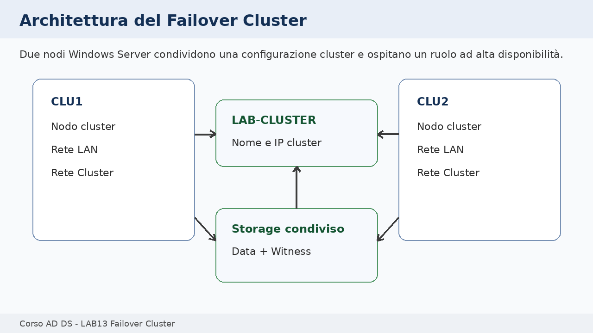

---

## Come useremo le 3 ore

La sessione è progettata per **3 ore**. Per rispettare i tempi, assumiamo che le VM `CLU1` e `CLU2` siano già predisposte come server membri del dominio `lab.local`, con rete e storage condiviso preparati o verificabili rapidamente.

Se la preparazione Hyper-V dello storage condiviso non è stata completata prima della sessione, il docente può mostrarla come dimostrazione. Durante il laboratorio, invece, ci concentriamo sulla validazione, sulla creazione del cluster e sul test di failover.

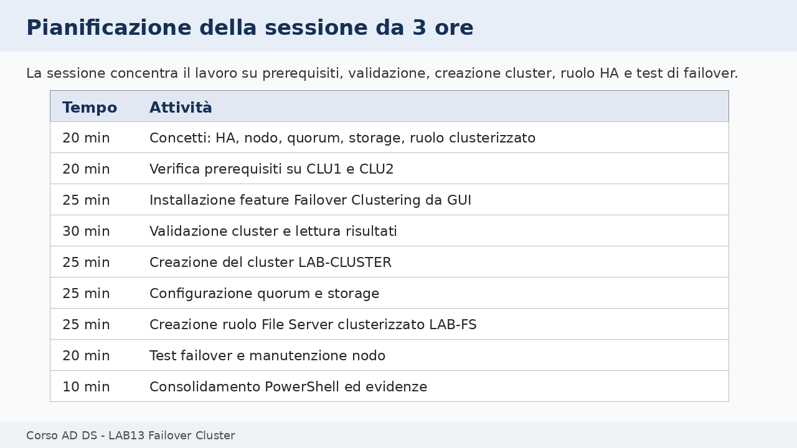

| Fase di lavoro | Durata indicativa | Attività prevalente |
|---|---:|---|
| Concetti: HA, cluster, LB, quorum, witness, casi d’uso | 30 min | spiegazione con schemi |
| Verifica prerequisiti su `CLU1` e `CLU2` | 15 min | GUI + controlli |
| Installazione feature Failover Clustering | 20 min | Server Manager |
| Validazione cluster | 25 min | Failover Cluster Manager |
| Creazione cluster `LAB-CLUSTER` | 20 min | wizard |
| Quorum e storage | 20 min | wizard e osservazione |
| Ruolo File Server clusterizzato `LAB-FS` e share | 25 min | configure role |
| Test failover | 15 min | spostamento ruolo |
| Consolidamento finale ed evidenze | 10 min | comandi e report |

Totale: **180 minuti**.

---

## Primo chiarimento: alta disponibilità non significa backup

Un cluster riduce l’interruzione del servizio quando un nodo non è disponibile. Non sostituisce backup, snapshot, replica dei dati fuori sede o procedure di disaster recovery.

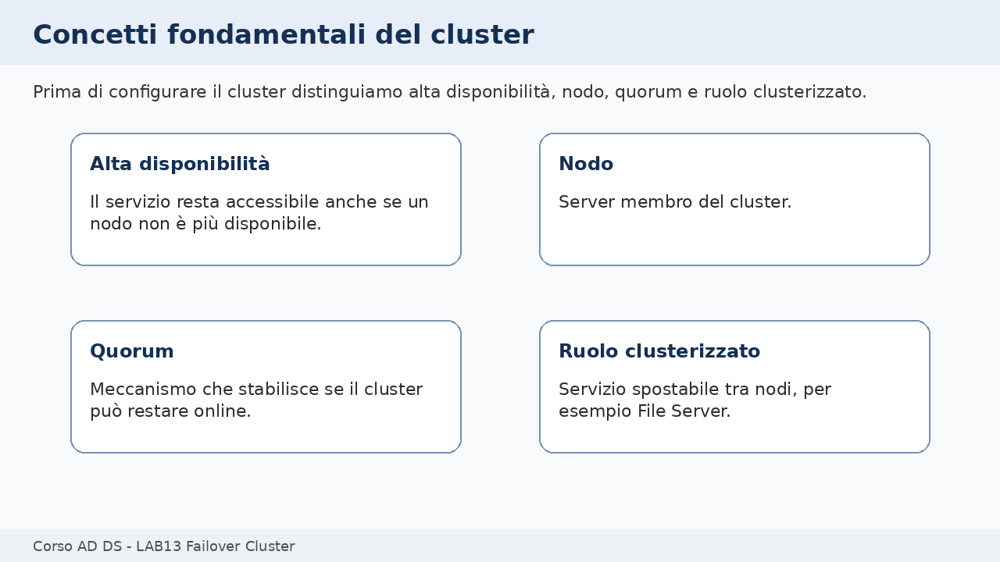

📌 **Esempio**

Se `LAB-FS` è il nome del File Server clusterizzato, gli utenti accederanno alla condivisione usando:

```text
\\LAB-FS\DocumentiHA
```

Non useranno:

```text
\\CLU1\DocumentiHA
```

o:

```text
\\CLU2\DocumentiHA
```

Il vantaggio è che il ruolo può spostarsi da un nodo all’altro mantenendo lo stesso nome di accesso per i client.

📌 **Distinzione essenziale**

| Concetto | Domanda a cui risponde | Esempio |
|---|---|---|
| Backup | Come recuperiamo dati cancellati, corrotti o cifrati? | ripristino di una cartella eliminata |
| Alta disponibilità | Come riduciamo l’interruzione se un server non è disponibile? | spostamento del ruolo `LAB-FS` da `CLU1` a `CLU2` |
| Disaster recovery | Come ripartiamo dopo un evento grave sul sito principale? | replica e ripartenza in un altro sito |
| Load balancing | Come distribuiamo richieste contemporanee tra più istanze attive? | più web server dietro un bilanciatore |

🛠️ **Task - Lettura dello scenario**

Durante la sessione lavoriamo con questi oggetti:

| Oggetto | Funzione |
|---|---|
| `CLU1` | primo nodo cluster |
| `CLU2` | secondo nodo cluster |
| `LAB-CLUSTER` | nome del cluster |
| `LAB-FS` | ruolo File Server clusterizzato |
| `DocumentiHA` | share di test |
| Disco Data | disco condiviso per i dati |
| Disco Witness | disco usato per il quorum, se previsto |

🔎 **Verifica**

Dobbiamo essere in grado di spiegare la differenza tra:

```text
nodo fisico
nome cluster
ruolo clusterizzato
share accessibile dai client
```

---

## Cluster e load balancer non risolvono lo stesso problema

Un **Failover Cluster** e un **Load Balancer** possono entrambi contribuire alla disponibilità di un servizio, ma lavorano in modo diverso.

Nel failover cluster un ruolo ha normalmente un **proprietario attivo** in un dato momento. Il ruolo possiede risorse coordinate dal cluster: nome, indirizzo IP, storage, servizio applicativo o dipendenze. Se il nodo proprietario non è più disponibile, il cluster prova a portare online lo stesso ruolo su un altro nodo.

Nel load balancing, invece, più server sono contemporaneamente attivi e ricevono richieste. Il bilanciatore distribuisce il traffico verso le istanze disponibili. Se una istanza non risponde, il bilanciatore smette di inviarle traffico, ma non “sposta” un ruolo con il suo storage condiviso.

| Aspetto | Failover Cluster | Load Balancer |
|---|---|---|
| Obiettivo principale | continuità del ruolo in caso di guasto o manutenzione | distribuzione del traffico e scalabilità orizzontale |
| Modello tipico | active/passive o active/active per ruoli diversi | active/active sulle istanze applicative |
| Stato del servizio | spesso richiede risorse coordinate e dipendenze | preferibilmente stateless o con stato esterno |
| Storage | può usare storage condiviso o storage replicato | normalmente ogni istanza non condivide un disco locale con le altre |
| Esempio adatto | file server, istanza SQL Server in failover cluster, servizi con identità unica | web front-end, API stateless, reverse proxy |
| Nome usato dai client | nome del ruolo clusterizzato, per esempio `LAB-FS` | nome virtuale del servizio pubblicato dal bilanciatore |

### Schema: load balancing per web server front-end

In questo scenario più web server sono attivi nello stesso momento. Il bilanciatore riceve le richieste dei client e le inoltra a uno dei front-end disponibili.

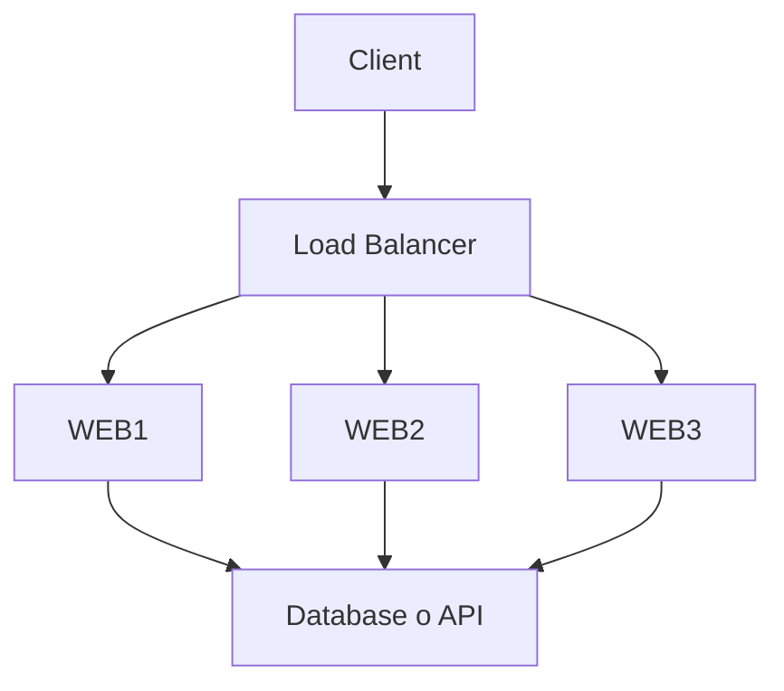
```mermaid
flowchart TD
    C["Client"] --> LB["Load Balancer"]
    LB --> W1["WEB1"]
    LB --> W2["WEB2"]
    LB --> W3["WEB3"]
    W1 --> DB["Database o API"]
    W2 --> DB
    W3 --> DB
```

Questo modello è particolarmente efficace quando i front-end sono **stateless**, cioè non conservano localmente informazioni indispensabili alla sessione. Se una richiesta arriva a `WEB1` o a `WEB2`, il risultato deve essere coerente perché lo stato importante si trova altrove: database, cache distribuita, storage applicativo o sistema di sessione condiviso.

### Schema: failover cluster per File Server

Nel laboratorio useremo questo modello. Il client accede al nome `LAB-FS`; il ruolo è online su un nodo alla volta e usa un disco dati gestito dal cluster.

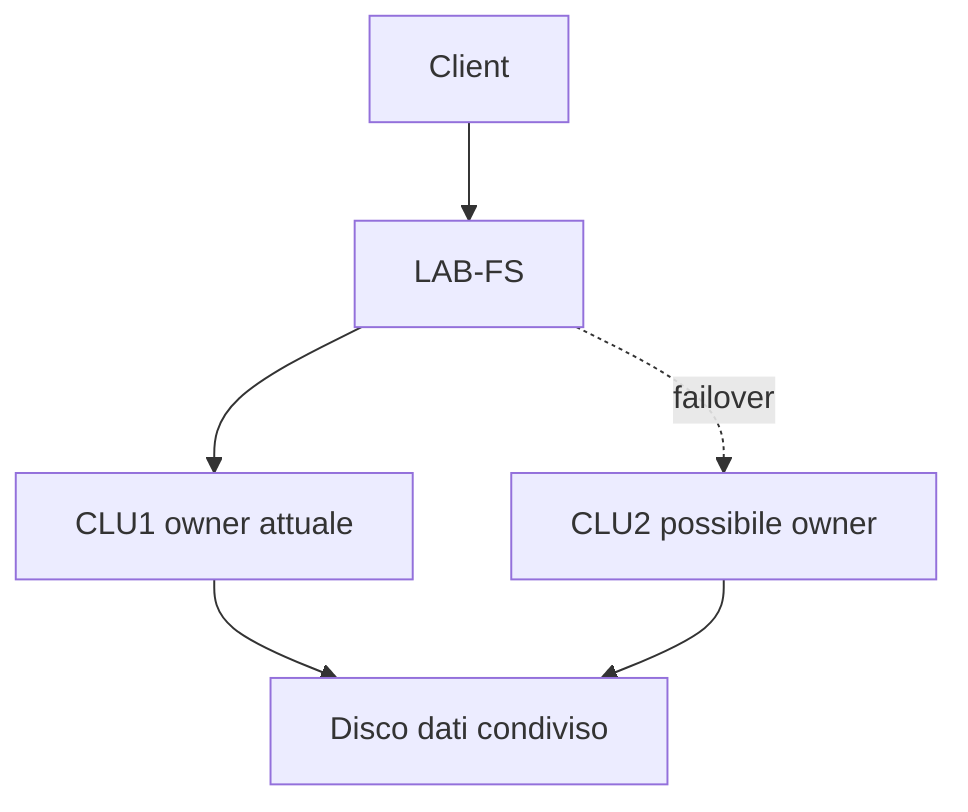
```mermaid
flowchart TD
    C["Client"] --> FS["LAB-FS"]
    FS --> N1["CLU1 owner attuale"]
    FS -. "failover" .-> N2["CLU2 possibile owner"]
    N1 --> D["Disco dati condiviso"]
    N2 --> D
```

Il punto importante è che il client non deve conoscere quale nodo stia ospitando il ruolo. La stabilità del nome `LAB-FS` nasconde lo spostamento del servizio.

### Schema: cluster per RDBMS

Lo stesso principio può essere applicato anche a servizi diversi dal file server. Un esempio classico è un database relazionale configurato in alta disponibilità. In ambiente Microsoft, SQL Server può essere installato come **Failover Cluster Instance** oppure può usare altre tecnologie di alta disponibilità, come gli Availability Groups. Qui ci interessa il concetto generale: il client usa un nome stabile, mentre l’infrastruttura gestisce quale nodo eroga il servizio.

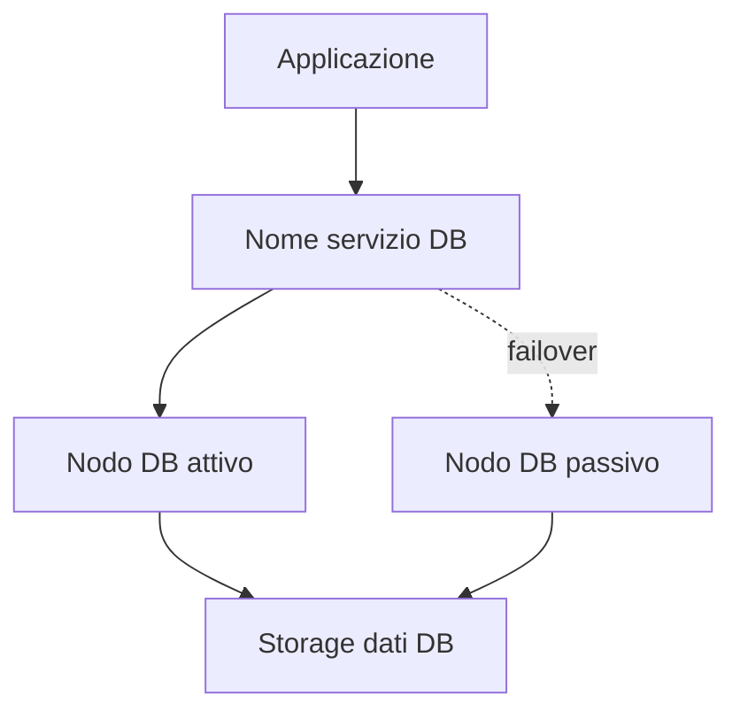
```mermaid
flowchart TD
    A["Applicazione"] --> SQL["Nome servizio DB"]
    SQL --> N1["Nodo DB attivo"]
    SQL -. "failover" .-> N2["Nodo DB passivo"]
    N1 --> S["Storage dati DB"]
    N2 --> S
```

Per un RDBMS il tema è più delicato rispetto a una semplice share: bisogna considerare consistenza transazionale, log, tempi di recovery, licenze, supporto del vendor e compatibilità della specifica tecnologia di database.

### Altri servizi che possono richiedere alta disponibilità

| Servizio | Possibile approccio | Nota didattica |
|---|---|---|
| File Server | Failover Cluster con ruolo File Server | è il caso pratico del laboratorio |
| SQL Server | Failover Cluster Instance o Availability Groups | richiede progettazione specifica del database |
| DHCP Server | Failover DHCP dedicato, non necessariamente Failover Cluster | Windows Server offre una funzione specifica |
| Web front-end | Load Balancer | adatto a più istanze attive |
| API stateless | Load Balancer | scalabilità e disponibilità lavorano insieme |
| Servizi legacy con identità unica | Failover Cluster, se supportato | utile quando il servizio non scala bene in active/active |

---

## Quorum e witness: perché sono centrali

Un cluster deve prendere decisioni anche quando una parte dell’infrastruttura non risponde. Il problema più importante è evitare che due parti separate del cluster pensino entrambe di essere autorizzate a erogare lo stesso servizio. Questa situazione è nota come **split brain**.

Il **quorum** è il meccanismo con cui il cluster stabilisce se dispone di una maggioranza sufficiente per restare operativo. In termini semplici, ogni elemento con diritto di voto contribuisce alla decisione. Se il cluster conserva la maggioranza dei voti, può continuare a ospitare i ruoli. Se perde la maggioranza, deve fermarsi per evitare decisioni incoerenti.

Il **witness** è una risorsa aggiuntiva che aiuta il cluster a raggiungere una maggioranza chiara. Non ospita il servizio applicativo e non sostituisce un nodo. Serve come voto aggiuntivo o come arbitro, soprattutto nelle configurazioni con numero pari di nodi.

| Elemento | Che cosa rappresenta | Perché conta |
|---|---|---|
| Nodo | server membro del cluster | può ospitare ruoli e può avere un voto |
| Voto | contributo alla maggioranza del cluster | determina se il cluster può restare operativo |
| Quorum | regola di maggioranza | evita che il cluster lavori in modo incoerente |
| Witness | risorsa di supporto al quorum | rende più stabile la decisione nei cluster a numero pari di nodi |

### Schema: due nodi senza witness

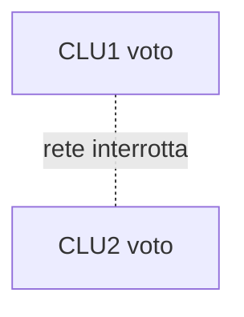
```mermaid
flowchart TD
    N1["CLU1 voto"]
    N2["CLU2 voto"]
    N1 -. "rete interrotta" .- N2
```

Con due soli nodi e nessun witness, se i nodi non riescono più a comunicare, non esiste una terza evidenza che aiuti a stabilire quale parte debba restare attiva. Il cluster rischia di non poter mantenere una maggioranza affidabile.

### Schema: due nodi con witness

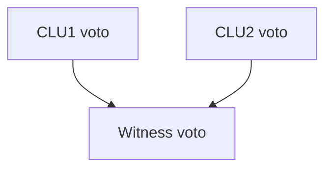
```mermaid
flowchart TD
    N1["CLU1 voto"] --> W["Witness voto"]
    N2["CLU2 voto"] --> W
```

Con due nodi e un witness, la maggioranza diventa più chiara. Se `CLU1` resta in comunicazione con il witness, può avere abbastanza voti per continuare. Se `CLU2` è isolato e non vede né `CLU1` né il witness, non deve portare online lo stesso ruolo in modo indipendente.

### Tipi comuni di witness

| Tipo di witness | Dove si trova | Quando ha senso |
|---|---|---|
| Disk Witness | disco condiviso visibile dai nodi | laboratorio o cluster con storage condiviso |
| File Share Witness | condivisione SMB esterna al cluster | ambienti con una terza macchina affidabile |
| Cloud Witness | risorsa cloud dedicata | ambienti moderni o distribuiti |

Nel nostro laboratorio useremo o verificheremo un **Disk Witness**, perché è coerente con lo scenario basato su storage condiviso. Il concetto da trattenere è più generale: il witness non contiene i dati degli utenti e non è il backup; aiuta il cluster a decidere se può rimanere online.

---

## Verifichiamo i prerequisiti

Un cluster richiede prerequisiti coerenti. Se saltiamo questa fase, la validazione mostrerà errori o warning difficili da interpretare.

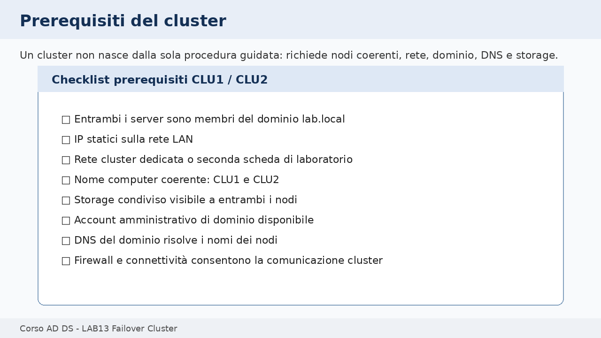

🛠️ **Task - Controllo iniziale dei nodi**

Accediamo a `CLU1` e `CLU2` e verifichiamo:

- entrambi i server sono membri del dominio `lab.local`;
- i nomi macchina sono corretti;
- i nodi hanno IP statici sulla rete LAN;
- la risoluzione DNS funziona;
- il dominio è raggiungibile;
- lo storage condiviso è visibile secondo la configurazione predisposta;
- l’account usato ha privilegi amministrativi adeguati.

Da prompt possiamo usare:

```cmd
hostname
whoami
ipconfig /all
nltest /dsgetdc:lab.local
```

🧾 **Evidenza**

Nel file `evidence_lab13.md` annotiamo:

```text
CLU1 IP LAN:
CLU2 IP LAN:
Dominio rilevato:
DNS configurato:
Storage condiviso visibile:
```

---

## Osserviamo lo storage condiviso predisposto

Un ruolo clusterizzato che usa dati condivisi richiede storage accessibile dai nodi. Nel laboratorio possiamo usare dischi condivisi predisposti dal docente o una configurazione Hyper-V equivalente.

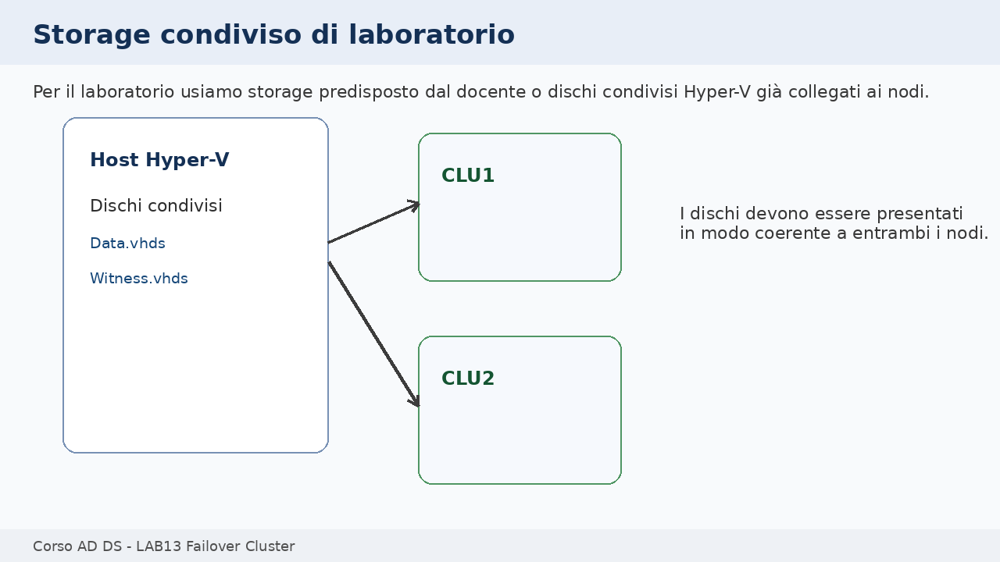

📌 **Esempio**

Possiamo avere:

```text
Data.vhds
Witness.vhds
```

Il disco `Data` ospiterà la share. Il disco `Witness`, se usato, aiuterà il cluster a stabilire il quorum.

🛠️ **Task - Verifica da Disk Management**

Su `CLU1`:

1. apriamo **Disk Management**;
2. verifichiamo la presenza dei dischi predisposti;
3. controlliamo se sono offline o online;
4. non formattiamo dischi senza indicazione del docente.

Su `CLU2`:

1. apriamo **Disk Management**;
2. verifichiamo che la situazione sia coerente;
3. non inizializziamo lo stesso disco contemporaneamente su entrambi i nodi.

🔎 **Verifica**

Lo storage deve essere adatto alla validazione cluster. Se la validazione segnala problemi di storage, ci fermiamo e analizziamo il report.

---

## Installiamo la feature Failover Clustering

La feature deve essere presente su entrambi i nodi.

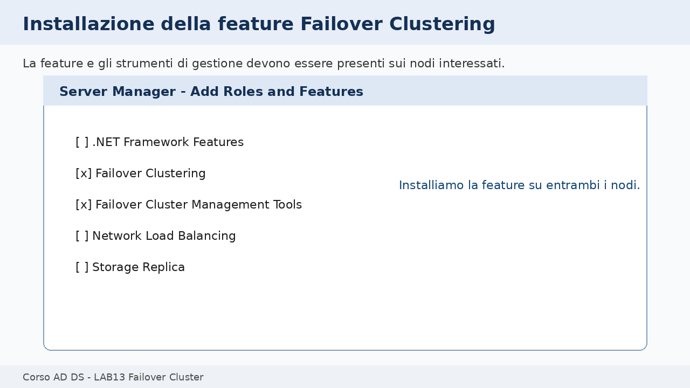

🛠️ **Task - Installazione da Server Manager**

Su `CLU1`:

1. apriamo **Server Manager**;
2. selezioniamo **Manage**;
3. scegliamo **Add Roles and Features**;
4. selezioniamo **Role-based or feature-based installation**;
5. selezioniamo `CLU1`;
6. nella sezione **Features** abilitiamo:

```text
Failover Clustering
```

7. accettiamo l’aggiunta degli strumenti di gestione;
8. completiamo l’installazione.

Ripetiamo la stessa attività per `CLU2`.

🔎 **Verifica**

Su entrambi i nodi devono essere disponibili:

```text
Failover Cluster Manager
Failover Clustering feature
```

🧾 **Evidenza**

Nel report annotiamo:

```text
Feature installata su CLU1:
Feature installata su CLU2:
```

---

## Eseguiamo la validazione della configurazione

La validazione è una fase centrale. Non è un passaggio formale: controlla se nodi, rete, storage e configurazione di sistema sono adatti al cluster.

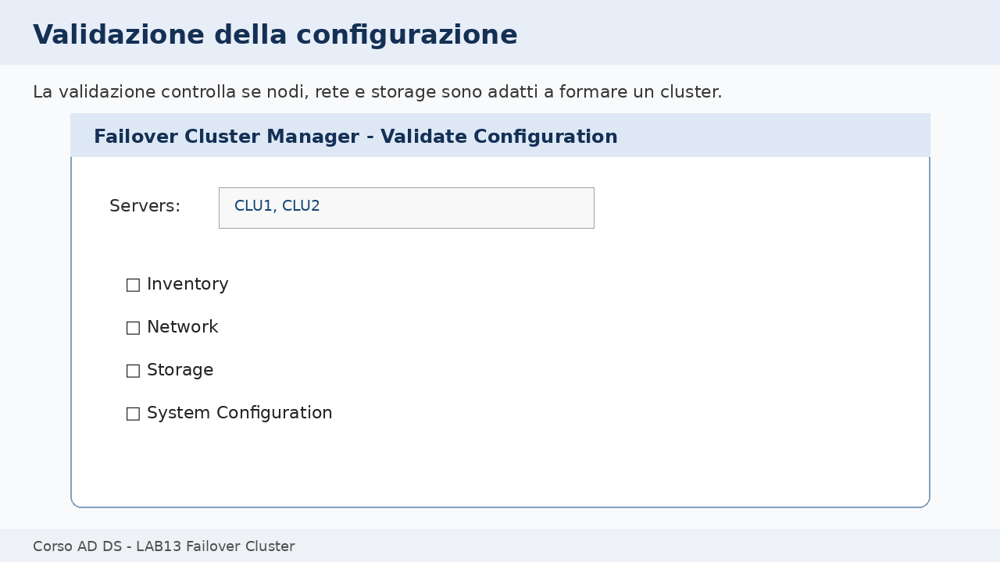

🛠️ **Task - Avvio del Validate Configuration Wizard**

Da `CLU1` o da un server con strumenti di gestione:

1. apriamo **Failover Cluster Manager**;
2. selezioniamo **Validate Configuration**;
3. aggiungiamo i nodi:

```text
CLU1
CLU2
```

4. scegliamo di eseguire tutti i test;
5. avviamo la validazione;
6. attendiamo il completamento.

🔎 **Verifica**

Al termine analizziamo il report. Gli esiti possibili sono:

- successi;
- warning;
- errori.

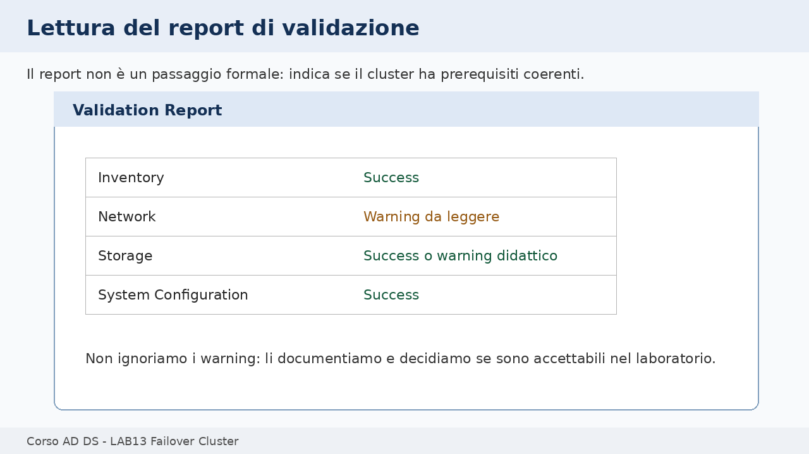

📌 **Esempio**

Un warning di rete può essere accettabile in un laboratorio se deriva da una configurazione semplificata e documentata. Un errore sullo storage, invece, può impedire la creazione corretta del cluster.

🧾 **Evidenza**

Nel report inseriamo:

```text
Validazione eseguita:
Risultato generale:
Warning presenti:
Errori presenti:
Decisione del gruppo:
```

---

## Creiamo il cluster LAB-CLUSTER

Dopo aver letto la validazione, creiamo il cluster.

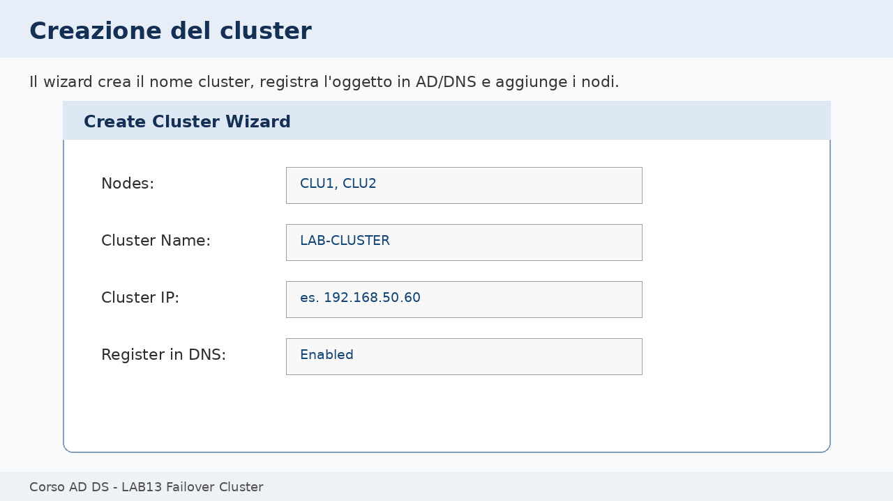

🛠️ **Task - Create Cluster Wizard**

In **Failover Cluster Manager**:

1. selezioniamo **Create Cluster**;
2. aggiungiamo i nodi:

```text
CLU1
CLU2
```

3. assegniamo il nome:

```text
LAB-CLUSTER
```

4. assegniamo un IP libero sulla rete LAN del laboratorio, per esempio:

```text
192.168.50.60
```

5. completiamo il wizard.

Il valore IP deve essere adattato alla rete reale dell’aula.

🔎 **Verifica**

Al termine apriamo il cluster `LAB-CLUSTER` in Failover Cluster Manager.

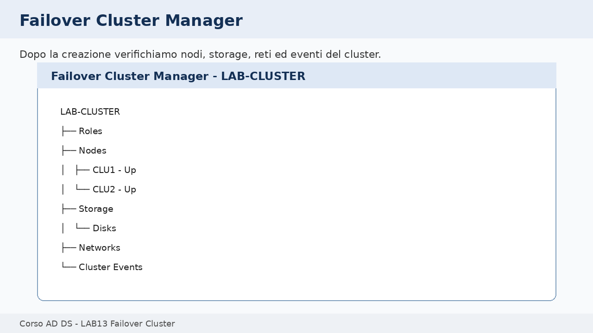

Verifichiamo:

```text
Nodes
Storage
Networks
Cluster Events
```

🧾 **Evidenza**

Nel report annotiamo:

```text
Nome cluster:
IP cluster:
Nodi presenti:
Stato nodi:
```

---

## Configuriamo il quorum

Il quorum serve a stabilire se il cluster ha abbastanza voti per rimanere operativo. In un cluster a due nodi è importante introdurre un witness perché, senza un elemento aggiuntivo, la perdita di comunicazione tra i nodi rende più difficile stabilire una maggioranza.

Prima di aprire il wizard, fissiamo il ragionamento:

- `CLU1` e `CLU2` sono i nodi che possono ospitare il ruolo;
- il ruolo `LAB-FS` deve essere online in un solo punto coerente;
- il witness non eroga la share e non contiene i file degli utenti;
- il witness aiuta il cluster a decidere se esiste una maggioranza sufficiente;
- se la maggioranza non è disponibile, il cluster preferisce fermare il ruolo invece di rischiare due istanze incoerenti dello stesso servizio.

📌 **Esempio**

Se `CLU1` perde la comunicazione con `CLU2`, il cluster deve evitare che entrambi provino a rendere disponibile `LAB-FS` usando le stesse risorse. Il witness aiuta a stabilire quale parte del cluster ha titolo per continuare a ospitare il ruolo.

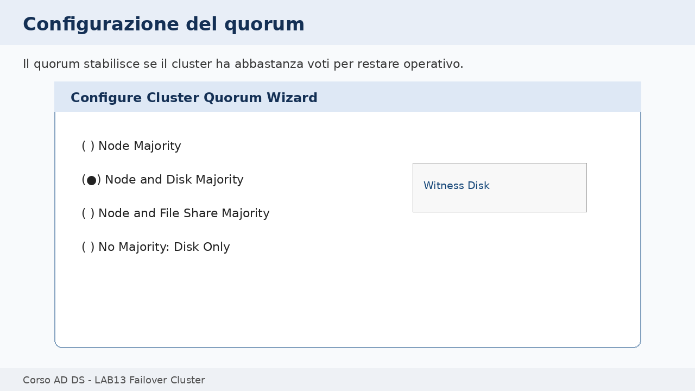

### Come leggiamo lo schema del wizard

Lo schema mostra quattro possibili configurazioni storicamente presenti nel **Configure Cluster Quorum Wizard**. Non sono quattro scelte equivalenti. Ogni opzione stabilisce quali elementi partecipano alla maggioranza del cluster e quale risorsa, se presente, viene usata come witness.

| Opzione del wizard | Che cosa significa | Quando può avere senso | Nota operativa |
|---|---|---|---|
| **Node Majority** | Votano solo i nodi del cluster. Non viene usato un witness. | Cluster con numero dispari di nodi, per esempio 3 o 5 nodi. | In un cluster a 2 nodi è fragile, perché la perdita di un nodo lascia un solo voto disponibile. |
| **Node and Disk Majority** | Votano i nodi e vota anche un disco witness condiviso. | Cluster con numero pari di nodi e storage condiviso disponibile. | È la scelta più coerente con il nostro laboratorio se abbiamo il disco `Witness`. |
| **Node and File Share Majority** | Votano i nodi e vota una condivisione SMB esterna al cluster. | Cluster con numero pari di nodi quando non vogliamo o non possiamo usare un disco witness. | La file share deve stare su un server affidabile che non dipende dal cluster stesso. |
| **No Majority: Disk Only** | Il quorum dipende solo dal disco. I nodi non formano una maggioranza autonoma. | Scenari legacy o molto specifici. | Da evitare come scelta didattica standard: il disco diventa un punto critico e il modello è meno robusto. |

📌 **Scelta nel nostro laboratorio**

Nel nostro scenario abbiamo due nodi, `CLU1` e `CLU2`, e prevediamo un disco `Witness`. Per questo la scelta coerente è:

```text
Node and Disk Majority
```

Questa scelta significa che il cluster usa i voti dei nodi e il voto del disco witness per stabilire se esiste una maggioranza. Il disco witness non ospita la share `DocumentiHA` e non contiene i dati degli utenti: serve solo alla decisione di quorum.

📌 **Esempio di ragionamento**

| Situazione | Cosa succede con due nodi e disk witness |
|---|---|
| `CLU1`, `CLU2` e witness sono raggiungibili | il cluster ha piena visibilità e può ospitare il ruolo |
| `CLU1` si ferma, `CLU2` vede il witness | `CLU2` può mantenere il ruolo online perché conserva la maggioranza |
| `CLU2` è isolato e non vede né `CLU1` né witness | `CLU2` non deve portare online il ruolo in modo autonomo |
| il witness non è disponibile ma i due nodi comunicano | il cluster può continuare, ma la resilienza è ridotta |

🛠️ **Task - Configurazione del quorum**

In **Failover Cluster Manager**:

1. selezioniamo il cluster `LAB-CLUSTER`;
2. apriamo **More Actions**;
3. selezioniamo **Configure Cluster Quorum Settings**;
4. scegliamo la modalità indicata dal docente, motivando la scelta;
5. se usiamo un disco witness, selezioniamo il disco dedicato;
6. completiamo il wizard.

🔎 **Verifica**

Nel riepilogo del cluster controlliamo la configurazione quorum.

🧾 **Evidenza**

Annotiamo:

```text
Tipo quorum:
Witness usato:
Disco witness:
Motivo della scelta:
```

---

## Creiamo un ruolo File Server clusterizzato

Ora creiamo un ruolo ad alta disponibilità. Useremo un **File Server for general use**.

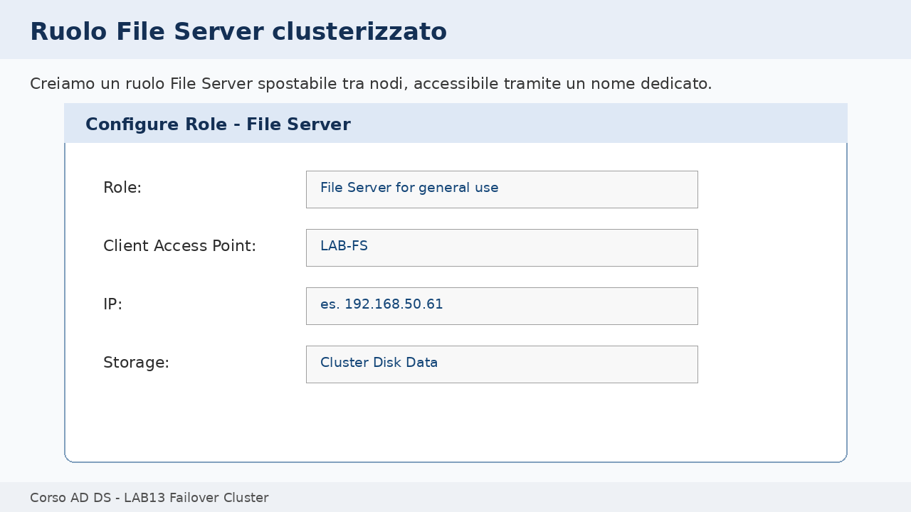

🛠️ **Task - Configure Role**

In **Failover Cluster Manager**:

1. apriamo **Roles**;
2. selezioniamo **Configure Role**;
3. scegliamo:

```text
File Server
```

4. selezioniamo:

```text
File Server for general use
```

5. assegniamo il nome:

```text
LAB-FS
```

6. assegniamo un IP libero sulla rete del laboratorio, per esempio:

```text
192.168.50.61
```

7. selezioniamo il disco dati condiviso;
8. completiamo il wizard.

🔎 **Verifica**

Il ruolo `LAB-FS` deve comparire sotto **Roles** e deve avere uno stato online.

🧾 **Evidenza**

Annotiamo:

```text
Nome ruolo:
IP ruolo:
Nodo proprietario attuale:
Disco usato:
```

---

## Creiamo una share sul ruolo clusterizzato

Una volta creato il ruolo File Server, possiamo creare una condivisione accessibile tramite il nome del ruolo clusterizzato.

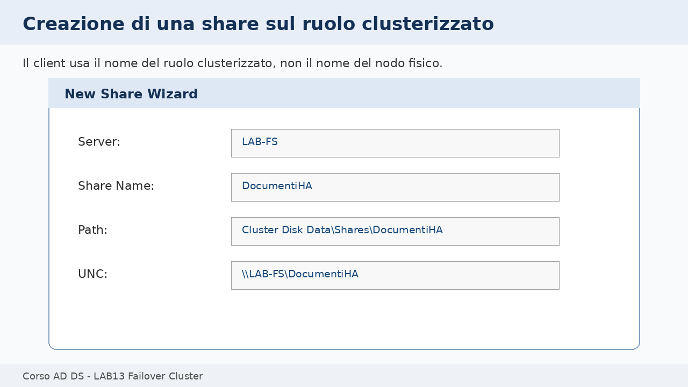

🛠️ **Task - New Share**

In **Failover Cluster Manager**:

1. selezioniamo il ruolo `LAB-FS`;
2. scegliamo **Add File Share** oppure l’azione equivalente;
3. creiamo una share SMB;
4. usiamo il nome:

```text
DocumentiHA
```

5. scegliamo un percorso sul disco dati del cluster;
6. assegniamo permessi coerenti con l’ambiente di laboratorio;
7. completiamo il wizard.

Il percorso UNC atteso è:

```text
\\LAB-FS\DocumentiHA
```

🔎 **Verifica**

Da un client o da uno dei nodi, verifichiamo l’accesso:

```text
\\LAB-FS\DocumentiHA
```

🧾 **Evidenza**

Nel report annotiamo:

```text
Percorso UNC:
Esito accesso:
File di test creato:
```

---

## Testiamo il failover controllato

Il test di failover serve a osservare il comportamento del ruolo quando viene spostato da un nodo all’altro.

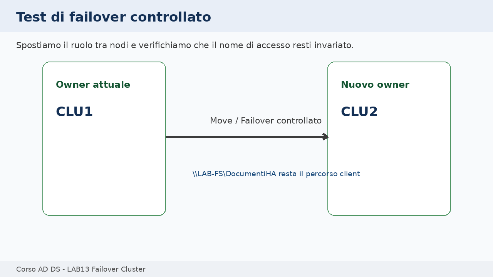

🛠️ **Task - Move del ruolo**

In **Failover Cluster Manager**:

1. apriamo **Roles**;
2. selezioniamo `LAB-FS`;
3. scegliamo **Move**;
4. selezioniamo **Select Node**;
5. spostiamo il ruolo sull’altro nodo;
6. attendiamo il completamento.

🔎 **Verifica**

Controlliamo:

```text
Owner Node prima:
Owner Node dopo:
Stato ruolo:
Accesso a \\LAB-FS\DocumentiHA:
```

📌 **Esempio**

Il nome `LAB-FS` rimane lo stesso. Cambia il nodo che ospita il ruolo. Questo è il punto centrale dell’alta disponibilità per il client: il servizio deve restare accessibile tramite il nome clusterizzato.

---

## Prova controllata: pausa o manutenzione di un nodo

Se l’ambiente è stabile e il docente lo consente, possiamo simulare una manutenzione controllata.

🧪 **Prova controllata - Drain Roles**

In **Failover Cluster Manager**:

1. selezioniamo il nodo che possiede il ruolo;
2. scegliamo l’azione di pausa o drain roles, secondo la versione del sistema;
3. osserviamo lo spostamento del ruolo;
4. verifichiamo che `LAB-FS` sia online sull’altro nodo.

🔎 **Verifica**

Il ruolo deve restare disponibile dopo lo spostamento.

🧹 **Ripristino**

Al termine:

1. riprendiamo il nodo se è stato messo in pausa;
2. verifichiamo che entrambi i nodi siano `Up`;
3. lasciamo il ruolo sul nodo indicato dal docente.

---

## Troubleshooting guidato

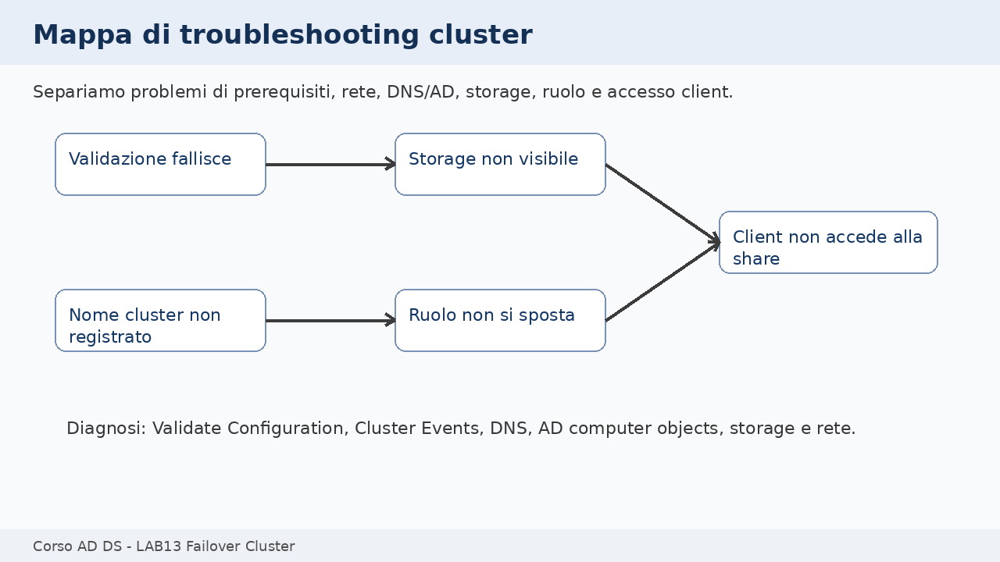

Quando il cluster non si comporta come previsto, separiamo il problema in livelli.

### La validazione fallisce

Controlliamo:

- dominio;
- DNS;
- connettività tra nodi;
- feature installata;
- storage visibile;
- permessi dell’account.

### Il nome cluster non viene creato o non risolve

Controlliamo:

- oggetto computer in Active Directory;
- registrazione DNS;
- IP scelto;
- permessi necessari alla creazione dell’oggetto cluster.

### Lo storage non compare

Controlliamo:

- visibilità del disco da entrambi i nodi;
- stato online/offline;
- configurazione Hyper-V;
- compatibilità con Failover Clustering;
- report di validazione.

### Il ruolo File Server non si sposta

Controlliamo:

- stato del ruolo;
- dipendenze;
- storage associato;
- eventi del cluster;
- stato dei nodi.

### Il client non accede alla share

Controlliamo:

- nome `LAB-FS`;
- DNS;
- permessi share;
- permessi NTFS;
- stato del ruolo;
- firewall.

---

## PowerShell e comandi finali di consolidamento

Questa sezione serve a verificare e raccogliere evidenze. Non sostituisce il percorso GUI.

Da un nodo del cluster:

```powershell
Get-Cluster
Get-ClusterNode
Get-ClusterGroup
Get-ClusterResource
Get-ClusterNetwork
```

Per verificare il ruolo File Server:

```powershell
Get-ClusterGroup | Where-Object Name -Like "*LAB-FS*"
```

Per raccogliere evidenze:

```powershell
Get-ClusterNode | Out-File C:\Temp\LAB13_cluster_nodes.txt
Get-ClusterGroup | Out-File C:\Temp\LAB13_cluster_groups.txt
Get-ClusterResource | Out-File C:\Temp\LAB13_cluster_resources.txt
```

Per generare un log cluster, se richiesto:

```powershell
Get-ClusterLog -Destination C:\Temp
```

---

## Evidenze finali

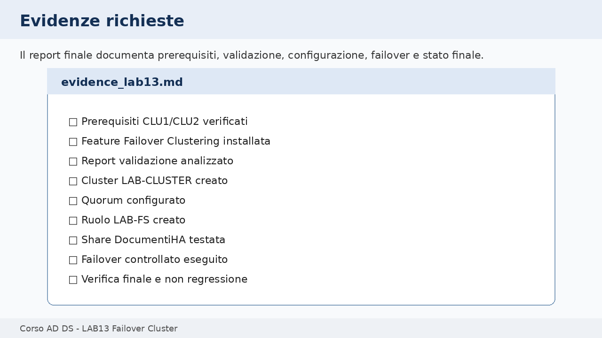

Creiamo un file:

```text
evidence_lab13.md
```

Il file deve contenere:

- VM usate;
- differenza sintetica tra Failover Cluster e Load Balancer;
- spiegazione sintetica del quorum e del witness usato;
- prerequisiti verificati;
- feature Failover Clustering installata;
- risultato della validazione;
- warning o errori rilevati;
- nome e IP del cluster;
- configurazione quorum;
- ruolo File Server creato;
- share `DocumentiHA`;
- test di accesso al percorso `\\LAB-FS\DocumentiHA`;
- test di failover;
- stato finale dei nodi;
- verifica di non regressione.

---

## Domande di consolidamento

1. Quale problema risolve un Failover Cluster?
2. Perché alta disponibilità e backup non sono la stessa cosa?
3. Qual è la differenza principale tra Failover Cluster e Load Balancer?
4. Perché un web front-end stateless è spesso adatto al load balancing?
5. Perché un File Server è un buon esempio di ruolo clusterizzato?
6. Che cos’è un nodo cluster?
7. Che cosa rappresenta il nome `LAB-CLUSTER`?
8. Che cosa rappresenta il nome `LAB-FS`?
9. Perché i client devono usare `\\LAB-FS\DocumentiHA` e non `\\CLU1\DocumentiHA`?
10. A cosa serve la validazione del cluster?
11. Che cos’è il quorum?
12. Quale problema evita il quorum?
13. Perché in un cluster a due nodi è importante un witness?
14. Il witness contiene i dati degli utenti? Spieghiamo la risposta.
15. Quale differenza c’è tra `Node Majority`, `Node and Disk Majority`, `Node and File Share Majority` e `No Majority: Disk Only`?
16. Perché nel nostro laboratorio scegliamo `Node and Disk Majority`, se il disco witness è disponibile?
17. Perché un RDBMS richiede considerazioni più attente rispetto a una semplice share?
18. Quali informazioni dobbiamo controllare se il ruolo non si sposta?
19. Quali verifiche facciamo se il client non accede alla share clusterizzata?
20. Quali oggetti non devono essere modificati durante questo laboratorio?

---

## Impatto sui laboratori successivi

### Oggetti modificati

Durante il laboratorio creiamo o modifichiamo:

- feature Failover Clustering su `CLU1` e `CLU2`;
- cluster `LAB-CLUSTER`;
- eventuale oggetto computer cluster in Active Directory;
- record DNS relativi a `LAB-CLUSTER` e `LAB-FS`;
- configurazione quorum;
- ruolo File Server clusterizzato `LAB-FS`;
- share `DocumentiHA`.

### Oggetti che non devono essere modificati

Non modifichiamo:

- configurazioni DNS di base del dominio, salvo verifica dei record;
- DHCP della UD10;
- WSUS della UD11;
- Sites sandbox della UD12;
- File Server non clusterizzato della UD09;
- Default Domain Policy.

### Come ripristinare lo stato iniziale

Se il docente richiede il ripristino:

1. rimuoviamo la share `DocumentiHA`;
2. rimuoviamo il ruolo `LAB-FS`;
3. rimuoviamo il cluster `LAB-CLUSTER`, solo se previsto;
4. puliamo eventuali record DNS o oggetti computer creati dal cluster;
5. lasciamo le VM `CLU1` e `CLU2` nello stato concordato.

### Verifica di non regressione

Verifichiamo:

```cmd
nltest /dsgetdc:lab.local
```

e controlliamo che i servizi delle UD precedenti non siano stati modificati.

---

## Criterio di completamento

Il laboratorio è completato quando:

- sappiamo distinguere Failover Cluster e Load Balancer con almeno un esempio per ciascuno;
- sappiamo spiegare quorum e witness nel contesto di un cluster a due nodi;
- i prerequisiti sono stati verificati;
- la feature Failover Clustering è installata sui nodi;
- la validazione è stata eseguita e commentata;
- il cluster `LAB-CLUSTER` è stato creato;
- il quorum è stato configurato o verificato;
- il ruolo `LAB-FS` è online;
- la share `DocumentiHA` è accessibile tramite nome clusterizzato;
- il ruolo è stato spostato almeno una volta tra i nodi;
- le evidenze sono state raccolte;
- la verifica di non regressione è stata eseguita.
